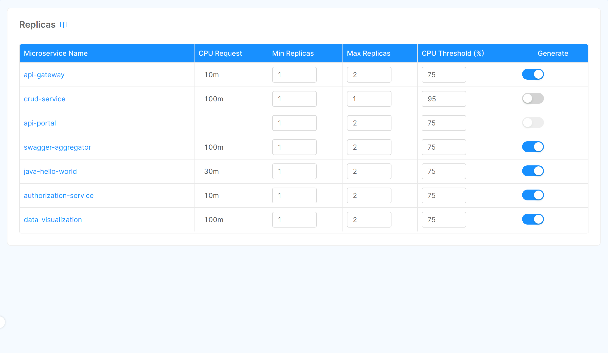

## What are Replicas for?

In this section you can define a range of desired replicas number for your services designed to automatically scale them based on **CPU usage**.  
The feature is thought to generate the replicas **only for the productions environments** where the [Environment Variable](/console/project-configuration/manage-environment-variables/index.md) `ENABLE_HPA` is set to `true`.

:::caution
Based on your release pipeline, the `ENABLE_HPA` environment variable could need the environment prefix (e.g. `PROD_`) or not.  
:::

:::danger
The replicas configured will not work properly if the [static replicas](/development_suite/api-console/api-design/services.md#microservice-configuration) is set to 0.

Setting both static replicas and HPA Replicas may lead to undefined behaviors
:::

## Configure Replicas



Upon accessing the Console Design area and selecting the *Replicas* section in the left menu, you'll see the list of your services for which you can set Replicas.

:::caution
For supporting Replicas a service must have both the [minimum and the maximum of CPU limit set](/development_suite/api-console/api-design/microservices-cpu-resources.md)
:::

In the table rows, for each service, you can directly change the following parameters:

* **Min Replica**: the minimum number of replicas that must be running.
* **Max Replica**: the maximum number of replicas that can be concurrent running.
* **CPU Threshold**: this number represents the **percentage** that kubernetes should consider to trigger a pod scale, for further details about the algorithm used by Kubernetes Pod Autoscaler check out the [Kubernetes documentation page](https://kubernetes.io/docs/tasks/run-application/horizontal-pod-autoscale/#algorithm-details)
* **Generate**: enable this flag to actually creating the replicas configuration when saving the configuration.

## How it works

:::info
This process is entrusted to the [Horizontal Pod Autoscaler](https://kubernetes.io/docs/tasks/run-application/horizontal-pod-autoscale/) Kubernetes resource  
:::

The [Kubernetes Horizontal Pod Autoscaler](https://kubernetes.io/docs/tasks/run-application/horizontal-pod-autoscale/) uses the metrics collected by Kubernetes itself to evaluate the need for instantiation of new pods to divide the work up to a maximum replication number.

When the total current CPU utilization by the replicas set exceeds the **CPU Threshold**, if the **Max Replica** number allows it, a new replica is scheduled for creation.  
If the total CPU usage drops below the **CPU Threshold**, after a period of time useless replicas are removed.

## How to scale services manually

You can also scale services manually writing yourself the configuration.

You have to enable the horizontal auto-scaling of the services managed by the Console, setting the environment variable `ENABLE_HPA` to `true` for the production environments. Then create the hpa files in configuration folder, inside the `configurations/{environment_name}` directory. The horizontal auto-scaling is entrusted to  [HPA Kubernetes resource](https://kubernetes.io/docs/tasks/run-application/horizontal-pod-autoscale/).

:::info
Check out [this page](/development_suite/api-console/advanced-section/dev-console-config/replicas.md) for manually set the number of replicas of a Platform Services  
:::

The resource that is taken into consideration is the use of CPU. If the value ​​exceeds the threshold expressed as a percentage, the system will create a new instance of the pod to divide the load. The instance will come deleted after a period of time when all available instances remain below the set threshold.

This percentage is calculated with this expression:

`desiredReplicas = ceil[currentReplicas * ( currentMetricValue / desiredMetricValue )]`

### Example

**Service name: *bff-service***  

**HPA file path**: `configurations/configuration/PROD/bff-service.hpa.yml`

**Content**:

```yaml
apiVersion: autoscaling/v1
kind: HorizontalPodAutoscaler
metadata:
  name: bff-service
  annotations:
    mia-platform.eu/deployment-date: '{{RELEASE_DATE}}'
    mia-platform.eu/commit-author: '{{AUTHOR_EMAIL}}'
    mia-platform.eu/commit-sha: '{{COMMIT_SHA}}'
    mia-platform.eu/version: 6.3.0
  labels:
    app: bff-service
    app.kubernetes.io/name: bff-service
    app.kubernetes.io/component: custom
    app.kubernetes.io/part-of: project
    app.kubernetes.io/managed-by: mia-platform

spec:
  scaleTargetRef:
    apiVersion: apps/v1
    kind: Deployment
    name: bff-service
  minReplicas: 2
  maxReplicas: 4
  targetCPUUtilizationPercentage: 85
```

:::info
For more information concerning the Kubernetes feature check out [the Kubernetes documentation page](https://kubernetes.io/docs/tasks/run-application/horizontal-pod-autoscale/)
:::
