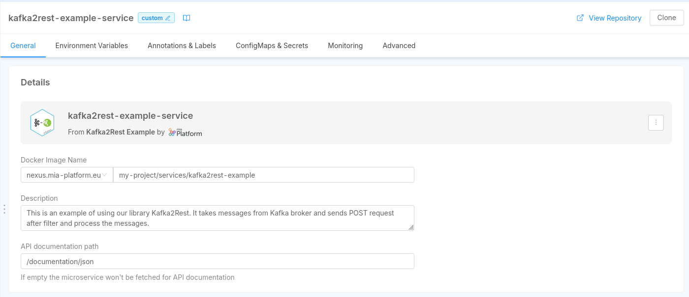

## Introduction

In this section you can learn how to create and manage Microservices on Mia-Platform DevOps Console.

You can create a Microservice from the Marketplace section of DevOps Console. To learn more about Marketplace, you can read [this page](./../../../marketplace/overview_marketplace.md) of Mia Platform Docs.

You can create a Microservice by:

* **using a Plugin**: a ready-to-use Microservice

* **using a Template**: a starting point to create a new Microservice

* **using an Example**: an existing and ready-to-use model

* **uploading a Docker Image Name**: an existing Docker image of a Microservice

You can search for Microservices, filtering by Plugins, Templates and/or Examples.

Otherwise, you can search for them by category. 

The results of your search will appear **organized by category**. 

## How to create a Microservice from an Example or from a Template

The Microservice can be created starting from existing and ready-to-use Examples or Templates.

In the [MarketPlace](./../../../marketplace/overview_marketplace.md) you can find a list of Examples or Templates powered and supported by Mia Platform that allows you to set-up microservices with a tested and pre-defined function.

Whether you select Example or Template, you can create your microservice by filling in the following information:

* **Name of the Microservice** (*required*): this is the internal hostname

* **Description** (*optional*): this is the description of your microservice

* **GitLab Repository owner** (*required*): you have to select, from a list of options, where you want to save your microservice

:::warning
If you are using GitLab and don't see any option in *Git repository owner*, it means that you have no access to the GitLab group where the project resides: please contact your console administrator to solve this issue.
:::

* **Git Repository Name** (*required*): name of the git repository of the service

* **Docker Image Name** (*required*): docker image of the service. It should not have the docker host (e.g. "tenant/service-name:tag"). It will be filled with the docker host during the service generation

Finally to create the Microservice push **create**.

:::warning
Once the service is created on your Git provider, you will not be able to delete it anymore from DevOps Console.
:::

At this [link](https://docs.mia-platform.eu/development_suite/api-console/api-design/custom_microservice_get_started/) you can find a more detailed guide and overview about how to create new service starting from Templates.

## How to create a Microservice from a Docker Image

The only requirement to import an external Microservice is that the Docker Image needs to be already built.
Once you select the card to upload a Docker image, you can see a new tab where you need to fill in the following information:

* **Name** (*required*): this is the internal hostname;  

* **Docker Image Name** (*required*): the complete docker image name of the service. The docker image repository must be accessible by the cluster k8s;

* **Description** (*optional*): this is the description of your microservice.

Finally to create the Microservice push **create**.

## Manage Microservices

For each microservice, DevOps Console allows to:

* **Delete** the microservice: with the 'Delete' button present at the bottom of each microservice detail, you can delete it.

:::warning
Deleting a microservice, you are also deleting each associated endpoint.
:::

:::warning
Deleting the microservice will not delete the files *deployment.yml*, *service.yml* and previously configurated *configmap.yml*.
:::

* **View Repository**: this button, present only in microservices created from Examples and Templates, allows you to go directly to your git repository from the DevOps Console.

* **Clone**: this button, present only in microservices created from Examples and Templates, enables to clone code repository directly from DevOps Console. The code repository can be copied with both ssh and https.

The detail of each microservice is divided in the following sections:

### Microservice

In this section, you can edit microservice's Docker Image Name (this field remains required) and description.
Moreover, with a flag, you can decide to show or not the microservice in the documentation.

### Microservice Configuration

In this section, you can manage the resources dedicated to your microservice:

* **Memory Resources**: You have to specify the minimum number of mebibytes (Mi) that the container needs and the maximum number of mebibytes (Mi) that it can use.

* **CPU Resources**: You have to specify the minimum number of 'thousandth of a core' (m) that the container needs and the maximum number of 'thousandth of a core' (m) that it can use.

* **Log Parser** (*required*): You can select which parser will handle your microservice logs. Currently, you can parse log in the following ways:
    * *mia-json*: it parses json logs based on the documented format
    * *mia-nginx*: it parses logs of nginx that were created using templates and services of Mia-platform (website and api-gateway)
    * *mia-plain*: it collects logs but it does not parse them
    * *not collected*: it is the default option, it does not collect logs and they are not sent to Elastic   

See more about the log parsers on the [guidelines](https://docs.mia-platform.eu/docs/development_suite/monitoring-dashboard/dev_ops_guide/log)  

* **Probes**: Here you can set your microservice probes, which are routes used by Kubernetes cluster to know if the microservice is working (liveness) and ready to receive requests (readiness). These fields are valorized by default. If you leave these fields empty, there will be a tcp socket on the selected microservice port.

 

### Environment Variable Configuration

In this section, you can manage, add and delete the environment variables associated to your microservice. For each variable, you have to define:

* **Key** (*required*)

* **Value** (*required*)

* **Description**

 

 You can find more information about environment variables at this [link](https://docs.mia-platform.eu/development_suite/set-up-infrastructure/env-var/) of Mia Platform Docs.

### Custom Configuration

In this section, you can add configmaps in order to add files to your microservice without going to the advanced configuration. This feature can be usefull if your microservice requires a particular configuration that reads from a certain type of file (e.g. file service).

In other words, if your microservice can not be managed in a usable way from environment variables, you can use Custom Configuration to add a configuration to your microservice.

:::info
You can use Custom Configuration if you want to write deployment files with a maximum of one container.
:::

 With the button 'Add a Configuration', you can add a custom configuration by defining:

* **Configuration Name** (*required*): This is the name of your configuration.

* **Runtime Mount Path** (*required*): Path inside the service where you want to mount the directory.

 

For each configuration created, a new card will be visible. You can push 'add file' to generate a .json or .yml file to write your custom configurations. With the button 'Delete File' you can cancel a file inside your custom configuration.

 

### Advanced Configuration

In this section, you can write your advanced configurations by filling the files:

* *File Deployment*: defines how the pod in Kubernetes is built (container, probes, ports).

* *File Service*: defines how to contact your deployment.

* *Configmaps*: configuration files that are mounted on the containers.

:::info
You have to use Advanced Configuration if you want to write deployment files with more than one container.
:::

 By switching from standard to advanced configuration (and vice versa), DevOps Console allows you to customize your Kubernetes files:

* **To switch from standard to advanced configuration**, you have to flag the option 'I want to write custom k8s files for this microservice'. Enabling advanced configuration, you can customize your kubernetes files.

    

    The advanced section allows you to configure service.yml and deployment.yml (*File Service* and *File Deployment*). You can also add configmaps by filling the *File path to create* and the *File name to create*.  By pushing the delete button, you can completely remove your advanced configurations.

:::warning
By switching from standard to advanced configuration, you will lose every standard configuration set before.
:::

* **To switch from advanced to standard configuration**, you have to de-flag the option 'I want to write custom k8s files for this microservice'. Coming back to standard configuration, you will no longer be able to customize your K8s files.

    

    If you configure your advanced service, deployment and configmaps files, when you come back to standard configuration, you can see your custom configuration files already filled with the environment variables. In other words, you can come back to standard configuration without loosing your advanced settings like your docker image, your variables and your configmaps.

:::info
We suggest you to convert in a standard mode all your microservices in order to achive a better governance of your microservices.
:::

:::warning
By switching from advanced to standard configuration, you are loosing all the containers, except for the first one that you have inserted. The docker image, all the environment variables and all the configmaps are preserved. Other advanced configurations will be lost.
:::
