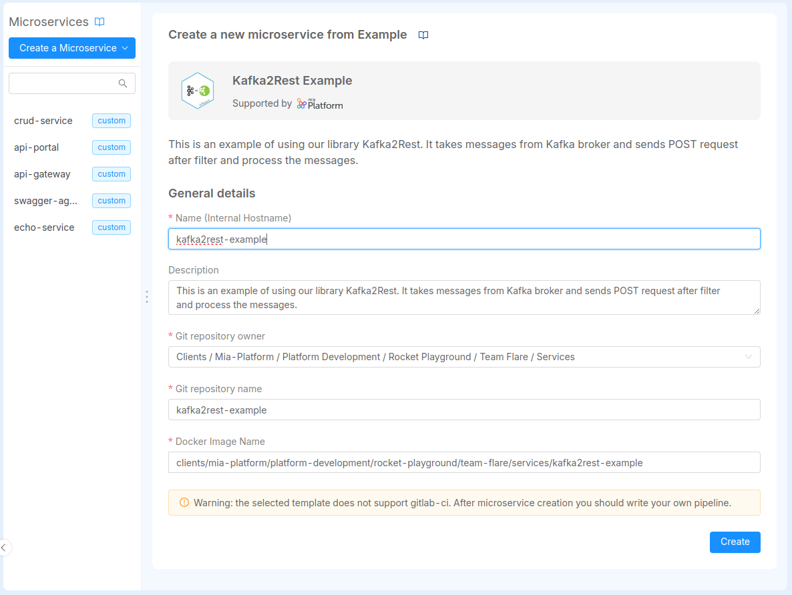
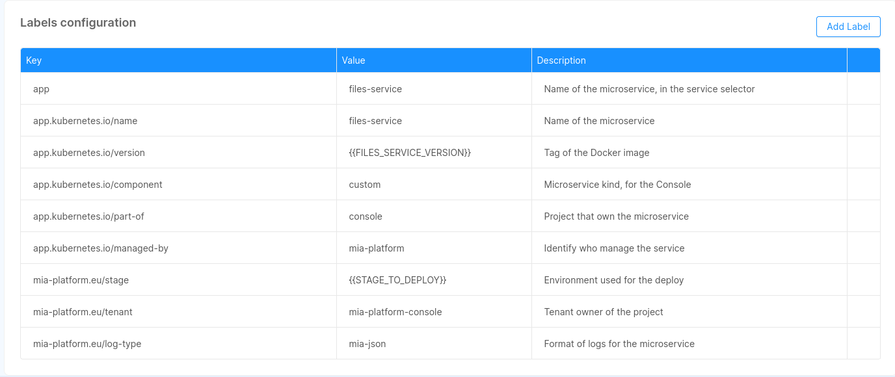

## Introduction

:::caution
All Microservices of the platform as a default are internally exposed on the **80 port** with **hostname equal to the service name**.  
So for example the [CRUD Service](/runtime_suite/crud-service/10_overview_and_usage.md) will be reachable at the url `http://crud-service`. This is applied to all microservices.
:::

In this section you can learn how to create and manage Microservices on Mia-Platform Console.

You can create a Microservice from the Marketplace section of Console. To learn more about Marketplace, you can read [this page](/marketplace/overview_marketplace.md) of Mia-Platform Docs.

You can create a Microservice by:

* **using a Plugin**: a ready-to-use Microservice

* **using a Template**: a starting point to create a new Microservice

* **using an Example**: an existing and ready-to-use model

* **uploading a Docker Image Name**: an existing Docker image of a Microservice


You can search for Microservices, filtering by Plugins, Templates and/or Examples.

Otherwise, you can search for them by category.

The results of your search will appear **organized by category**.

## How to create a Microservice from an Example or from a Template

The Microservice can be created starting from existing and ready-to-use Examples or Templates.

In the [Marketplace](/marketplace/overview_marketplace.md) you can find a list of Examples or Templates powered and supported by Mia-Platform that allows you to set-up microservices with a tested and pre-defined function.

Whether you select Example or Template, you can create your microservice by filling in the following information:

* **Name of the Microservice** (*required*): this is the internal hostname

* **Description** (*optional*): this is the description of your microservice

* **GitLab Repository owner** (*required*): you have to select, from a list of options, where you want to save your microservice

:::warning
If you are using GitLab and don't see any option in *Git repository owner*, it means that you have no access to the GitLab group where the project resides: please contact your console administrator to solve this issue.
:::

* **Git Repository Name** (*required*): name of the git repository of the service

* **Docker Image Name** (*required*): docker image of the service. It should not have the docker host (e.g. "company/service-name:tag"). It will be filled with the docker host during the service generation




Finally to create the Microservice push **create**.

:::warning
Once the service is created on your Git provider, you will not be able to delete it anymore from Console.
:::

:::info
When creating your microservice, the Console also generates a CI file (e.g. `.gitlab-ci.yml`) along side the service files.
This file is used to instruct your pipeline provider for continuous integration and continuous deployment.

You can set up the CI file by yourself or use instead Mia-Platform pipeline templates.
In order to use the templates provided by Mia-Platform you can contact your referent to configure the pipeline templates within your Console installation.
:::

:::info
At this [link](/development_suite/api-console/api-design/custom_microservice_get_started.md) you can find a more detailed guide and overview about how to create new service starting from Templates.
:::

## Manage Microservices

For each microservice, Console allows to:

* **Delete** the microservice: with the 'Delete' button present at the bottom of each microservice detail, you can delete it.

:::warning
Deleting a microservice, you are also deleting each associated endpoint.
:::

* **View Repository**: this button, present only in microservices created from Examples and Templates, allows you to go directly to your git repository from the Console.

* **Clone**: this button, present only in microservices created from Examples and Templates, enables to clone code repository directly from Console. The code repository can be copied with both ssh and https.

The detail of each microservice is divided in the following sections:

### Microservice

In this section, you can edit microservice's Docker Image Name (this field remains required) and description.
Moreover, with a flag, you can decide to show or not the microservice in the documentation.


### Microservice Configuration

In this section, you can manage the resources dedicated to your microservice:

* **Memory Resources**: You have to specify the minimum number of mebibytes (Mi) that the container needs and the maximum number of mebibytes (Mi) that it can use.

* **CPU Resources**: You have to specify the minimum number of 'thousandth of a core' (m) that the container needs and the maximum number of 'thousandth of a core' (m) that it can use.

* **Static replicas**: You have to specify the number of replicas of your microservice.  
  When a new microservice is created its default value is *1*.

  It is possible to have two different behaviors when a microservice has a [hpa](/development_suite/api-console/api-design/replicas.md) configured.
  * *static replicas greater than 0*: the *hpa replicas* has priority and so they will be used.
  * *static replicas equals 0*: the *static replicas* has priority and so no microservice will be deployed.

  :::note
  A static replicas value can not be interpolated by an environment variable
  :::

* **Log Parser** (*required*): You can select which parser will handle your microservice logs.  
  Currently, you can parse log in the following ways:
  * *mia-json*: it parses json logs based on the documented format
  * *mia-nginx*: it parses logs of nginx that were created using templates and services of Mia-Platform (website and api-gateway)
  * *mia-plain*: it collects logs but it does not parse them
  * *not collected*: it is the default option, it does not collect logs and they are not sent to Elastic

:::info
  See more about the log parsers on the [guidelines](/getting-started/guidelines/guidelines-for-logs.md)
:::

* **Args**: You can specify the arguments for the [command](https://kubernetes.io/docs/tasks/inject-data-application/_print/#define-a-command-and-arguments-when-you-create-a-pod) of your microservice container.  
Each argument should be on a new line and by default no arguments are specified.

 

:::info
 If you are searching for information about microservice's probes and other runtime options you should visit [this page](/development_suite/api-console/api-design/microservice-runtime-resources.md).
:::

### Container Ports Configuration

In this section you can manage the microservice container ports. Note that if no container port is set, the microservice will be unreachable by any other service in the Project.

For each container port, you have to define: 

* **Port name** (*required*)

* **Port** (*required, default value: 80*)

* **Target port** (*default value: 3000*)

* **Protocol** (*default: TCP*)


:::info
If you want more information about configuring the microservice container ports, visit [this page](/development_suite/api-console/api-design/microservice-container-ports.md).
:::

### Environment Variable Configuration

In this section, you can manage, add and delete the environment variables associated to your microservice.  

To add a new environment variable you will have to specify which type of value you are going to use.  
Currently, the following types exist:

* **Plain Text**: values belonging to this type are strings that define the value that we want to associate to that specific environment variable key. For this type it is necessary to specify the **Value** that we want to link to that specific environment variable. **Value** can also be an interpolated string, to do so the value to interpolate needs to be enclosed by two pairs of curly braces, for example `{{VALUE_TO_INTERPOLATE}}`.
* **From Secret**: this type represents a value that is obtained from a Kubernetes Secret. For this type, it is necessary to specify the **Secret Name** and the **Secret Key** from which this value can be retrieved.

:::info
If you want more information about adding Kubernetes secrets to a microservice visit the following [link](/development_suite/api-console/api-design/services.md#secrets).
:::

Therefore, for each variable, you have to define:

* **Key** (*required*)

* **Value Type** (*required*)

* **Value** (*not required, present only if **Value Type** is Plain Text*)

* **Secret Name** (*present and required only if **Value Type** is From Secret*)

* **Secret Key** (*present and required only if **Value Type** is From Secret*)

* **Description**

It is also possible to import multiple **Plain Text** variables from a `.env` file by using the dedicated button.  
A variable definition in the `.env` file has to be contained in a single line and must follow one of the formats below:

* Basic: `ENV_VAR_KEY=env_var_value`
* Single Quoted: `ENV_VAR_KEY='env_var_value'`
* Double Quoted: `ENV_VAR_KEY="env_var\nvalue"`, where the string `"\n"` is converted to a newline character

 

You can find more information about environment variables at this [link](/console/project-configuration/manage-environment-variables/index.md) of Mia-Platform Docs.

### Labels Configuration

In this section, you can manage, add and delete the labels associated to your microservice.

The labels are only of type *Plain Text*.

For each label, you have to define:

* **Key** (*required*)

* **Value** (*required*)

* **Description**

:::info
**Label keys** are composed by a prefix and a name, separated by a slash (/). The prefix part is optional and cannot be longer than 253 characters. The name segment is required and must be 63 characters or less.  
For more information regarding the syntax check out the official [Kubernetes documentation](https://kubernetes.io/docs/concepts/overview/working-with-objects/labels/#syntax-and-character-set).
:::


#### Default labels

By default, we set for you these labels for each service that you are going to save:


:::caution
These labels are inserted when you create a new microservice. For the existing one they will be inserted with the next save.  
If you try to overwrite these labels, its original value will be restored on the next save.
:::

:::note
The labels that starts with `mia-platform.eu` are reserved, you are not allowed to use them.
:::

### Annotations Configuration

In this section, you can manage, add and delete the annotations associated to your microservice.

The annotations are only of type *Plain Text*.

For each annotation, you have to define:

* **Key** (*required*)

* **Value** (*required*)

* **Description**

:::info
**Annotation keys** are composed by a prefix and a name, separated by a slash (/). The prefix part is optional and cannot be longer than 253 characters. The name segment is required and must be 63 characters or less.  
For more information regarding the syntax check out the official [Kubernetes documentation](https://kubernetes.io/docs/concepts/overview/working-with-objects/annotations/#syntax-and-character-set).
:::


#### Default annotations

By default, we set for you these annotations for each service that you are going to save, **only if you don't use MLP**:


**If you use MLP**, the default annotations are:


:::caution
These annotations are inserted when you create a new microservice. For the existing one they will be inserted with the next save.
If you try to overwrite these annotations, its original value will be restored on the next save.
:::

:::note
The annotations that starts with `mia-platform.eu` are reserved, you are not allowed to use them.
:::

### Custom Configuration

In this section, you can add custom configurations to your microservice without the need of using the advanced service configuration. This feature can be useful in different occasions, either when your microservice requires a specific functionality or to have access to particular kubernetes files.

In other words, if your microservice can not be managed in a usable way from environment variables, you can use Custom Configuration to add a configuration to your microservice.

:::info
You can use Custom Configuration if you want to write deployment files with a maximum of one container.
:::

There are two kinds of custom configurations: **ConfigMaps** and **Secrets**.

#### Add a Configuration

 With the button 'Add a Configuration', you can add a custom configuration by defining:

* **Type** (*required*): This is the type of your configuration: *configmap* or *secret*.

* **Configuration Name** (*required*): This is the name of your configuration.

* **Runtime Mount Path** (*required*): Path inside the service where you want to mount the directory.

Moreover, you can decide to preserve files and directories already existing in the Runtime Mount Path directory, by activating the related checkbox.


For each configuration created, a new card will be visible.

#### ConfigMaps

You can mount files to your microservice using *configmaps*. This feature can be useful if your microservice requires a particular configuration that can be read from a certain type of file (e.g. a complex configuration file that can't be provided via simple environment variables).

Check out the files service [example](/runtime_suite/files-service/configuration.mdx) to further understand the role of configmaps in microservices.

You can click _Add file_ to generate a new custom file (e.g. a JSON or YAML file, but could be anything you need) and start writing your custom configurations. With the _Delete File_ button you can remove the file from your custom configuration.

When a new file is added, if the preservation of already existing files and directories has been activated, into the deployment file it is possible to verify the existence of the `subPath` property, whose value has been attached at the end of the Mount Path.
In this way, all the files of the ConfigMap are loaded in the position defined as Runtime Mount Path, without however deleting any existing files (unless they have the same name as the files of the ConfigMap, in which case they are overwritten).

:::note
Custom services configuration now supports ConfigMaps larger than __1MB__ (this limit is imposed by Kubernetes). Large ConfigMaps will be automatically split into multiple parts and joined back together during deployment.
:::

 

#### Shared ConfigMaps

In the same project, different microservices could need to use the same ConfigMap (i.g. ER schema in a Fast Data project). Therefore, it is possible to use the ConfigMaps which already exist inside the project. To do that, you have to create a new ConfigMap for a microservice, selecting from the dropdown the name of the desired ConfigMap you want to use.
In this way, you link the microservice to a ConfigMap shared by other microservices. 


Digital projects are often in evolution, and for this reason, the user could need to modify his microservices, even the shared ConfigMaps. 
This process is easy because if a shared ConfigMaps is modified the changes will affect also the other microservices. With the same freedom, it is possible to delete a shared ConfigMaps from a microservice if you need to develop a new custom configuration. In this case, the elimination will not affect all the microservices but only the edited one.

#### Secrets

You can use this type of configuration in order to mount Kubernetes Secrets to your microservice.
Kubernetes secrets let you store and manage sensitive information (such as passwords, OAuth tokens, ssh keys, etc).

:::note
Check out the official [Kubernetes documentation](https://kubernetes.io/docs/concepts/configuration/secret/) for more information about secrets.
:::

:::warning
Secrets associated to microservices must exists on your Kubernetes namespace.

:::
If your projects uses `mlp`, the Mia-Platform cli deploy tool, you can configure the `mlp.yaml` file inside your project configuration repository to generate secrets for you on the namespace.

To release custom secrets with mlp, add these lines to the mlp.yaml file:

```yaml
secrets:
  - name: "client-credential-private-key"
    when: "always"
    data:
      - from: "file"
        file: "/tmp/private.key"
```

Once you have created a secret file on your kubernetes namespace, you can use this feature to associate it to your microservice.

When secrets are linked to a microservice, its deployment files are accordingly modified to automatically mount your secret files on kubernetes. This will allow you to use their private content directly from your microservice.

:::info
Once you'll add a secret to one of your microservices, the secret's name will be recorded and you'll be able to reuse it by easily adding the same secret to multiple microservices.
:::

:::warning
You need to give **additional permissions** to the console service account in order to be able to get the list of the secrets on the cluster.
:::

It is also possible to use Kubernetes secrets to setup specific environment variables, follow this [link](/development_suite/api-console/api-design/services.md#environment-variable-configuration) to understand how to do so.  

### Provide a CA Certificate to a custom service

In an enterprise environment, to encrypt SSL connections, there could be a set of custom certificates signed by one or more trusted certificates.
By following this guide you'll be able to provide one or more trusted certificates in PEM format in a single file for your **custom** services.

To configure a custom CA certificate for a custom service you should:

1. Verify if the service you want to provide an additional certificate with supports this feature by visiting its dedicated documentation page.
2. Have the CA certificate in `pem` format, and rename the file in `additional-ca.pem`.
3. Create a Kubernetes Secret in the namespace (replace `YOUR_NAMESPACE` with your namespace name) of the project that needs it using the command:

```sh
kubectl -n YOUR_NAMESPACE create secret generic additional-ca-certificates --from-file=additional-ca.pem
```

This command will create a secret like the following:

```yml
apiVersion: v1
kind: Secret
metadata:
  name: additional-ca-certificates
data:
  additional-ca.pem: "base64-content"
```

The `additional-ca.pem` content is created in base64.

In the Console, access to your project and enter in the design section, select the working branch and click on the custom service in the `Microservices` section.

Once here, you should add a [custom configuration](#add-a-configuration) to your microservice. In particular, to create the configuration necessary to add `additional-ca.pem`, you should fill the form with data that depends on the service for which you want to add this feature.

Lastly, you should add a new environment variable to your custom service. To do so, go to the [environment variables card](#environment-variable-configuration) of your service and click on the button to add a new one. In the form that will open you should add data that may vary based on the service for which you want to add this feature.

Next paragraph will give you the correct data that you need to create both the custom configuration and the environment variable necessary to add a CA certificate based on which service you are working on.

#### Custom configuration and environment variable data

In this section, we will list all the information necessary to correctly configure additional CA certs for services that support this feature.

##### Node Services

In order to correctly configure your Node service to handle additional CA certs, you should add a custom configuration with the following data:

* **Type**: `Secret`
* **Configuration Name**: `additional-ca-certificates` (which is the name of the previously generated secret)
* **Runtime Mount Path**: `/home/node/app/tls`

Then, click on the submit button to confirm your choices.

Finally, you should create a new environment variable passing the following data:

* **Key**: `NODE_EXTRA_CA_CERTS`
* **Value Type**: `Plain Text`
* **Value**: `/home/node/app/tls/additional-ca.pem` (which is the mountpath of your configuration file concatenated with your certificate file)
* **Description** (*optional*): any description that may help you.

Once saved all these changes, you should see the volume correctly mounted in the generated deployment file.

### Advanced Configuration

In this section, you can write your advanced configurations by filling the files:

* *File Deployment*: defines how the pod in Kubernetes is built (container, probes, ports).

* *File Service*: defines how to contact your deployment.

* *Configmaps*: configuration files that are mounted on the containers.

:::info
You have to use Advanced Configuration if you want to write deployment files with more than one container.
:::

 By switching from standard to advanced configuration (and vice versa), Console allows you to customize your Kubernetes files:

* **To switch from standard to advanced configuration**, you have to flag the option 'I want to write custom k8s files for this microservice'. Enabling advanced configuration, you can customize your kubernetes files.

    

    The advanced section allows you to configure service.yml and deployment.yml (*File Service* and *File Deployment*). You can also add configmaps by filling the *File path to create* and the *File name to create*.  By pushing the delete button, you can completely remove your advanced configurations.

:::warning
By switching from standard to advanced configuration, you will lose every standard configuration set before.
:::

* **To switch from advanced to standard configuration**, you have to de-flag the option 'I want to write custom k8s files for this microservice'. Coming back to standard configuration, you will no longer be able to customize your K8s files.

    

    If you configure your advanced service, deployment and configmaps files, when you come back to standard configuration, you can see your custom configuration files already filled with the environment variables. In other words, you can come back to standard configuration without loosing your advanced settings like your docker image, your variables and your configmaps.

:::info
We suggest you to convert in a standard mode all your microservices in order to achieve a better governance of your microservices.
:::

:::warning
By switching from advanced to standard configuration, you are loosing all the containers, except for the first one that you have inserted. The docker image, all the environment variables and all the configmaps are preserved. Other advanced configurations will be lost.
:::
