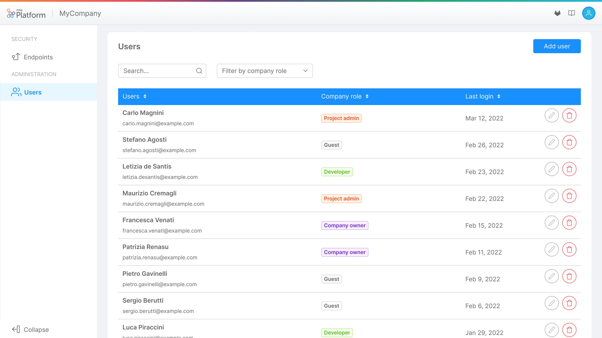
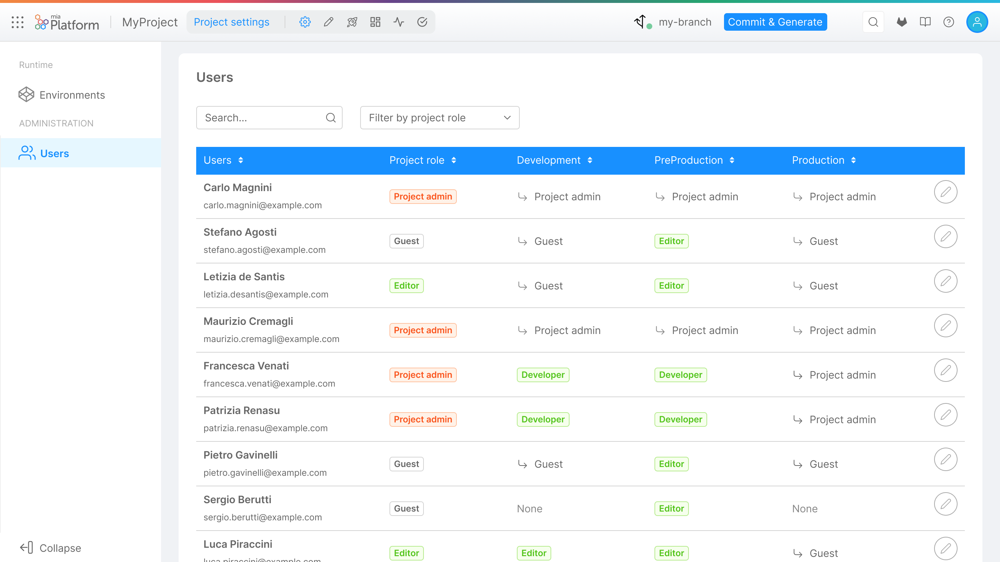

Mia-Platform Console allows users to manage other users accesses throughout their company. Letting them full ownership of deciding who has access to what resources and with what role.

:::note
To find out more about available Roles check out [this documentation page](../console-levels-and-permission-management).
:::

In particular a user can be assigned a Role on the following resources:

 * Company
 * Project
 * Runtime Environment

Only users with enough privileges will be granted the access to the users administration portal and will be able to change user roles.

## Manage Company users

A user with enough administrative permission on a specific Company will be able to view the existing users in the company, add new user to it and change the existing users role.

:::caution
Please note that some permissions defined by the Company role may be inherited on the Projects and Runtime Environment owned by the Company itself; always pay attention when assigning roles to the users in order to prevent providing undesired access to resources!
:::

### Adding a new user

The Company Owner can add a new user by pressing the _Add user_ button, the user invite process will require for an email and the desired role to be assigned the new user.

<!-- TODO: SCREENSHOT OF COMPANY ADD USER MODAL -->

The provided email will be searched throughout existing users and if a match is found the user will be invited to the Company with the defined Role.

:::info
If the user does not exist in the Platform, please open a Service Request for it to be created.
:::

### Editing a user role

A user role in the Company can be modified, to do so just open the editing dialog and select the proper role.

<!-- TODO: SCREENSHOT OF COMPANY EDIT USER MODAL -->

### Remove a user from the company

A user role can be removed from the Company, to do so click the delete icon on the table and confirm the action.

<!-- TODO: SCREENSHOT OF COMPANY DELETE USER MODAL -->

:::warning
Removing a user from the company will kick the user out of every Project and Runtime Environment, while the user may be invited back in 
the company, all their previously existing roles will be lost and cannot be recovered and must be reassigned from scratch.
:::

## Manage Project and Environment users

A user with enough administrative permission on a specific Project will be able to view all the existing users in the Company and assign them the desired role on the specific Project (and, optionally on each existing Runtime Environment).

:::note
As stated above each user existing in the Company will be shown for the Project users administration portal, this does not mean that all the user has access to the project since this depends on the role they are assigned on the Company and how the permission are inherited.

For further information about permissions and role inheritance check out this [documentation page](../console-levels-and-permission-management).
:::

### Editing a user role

A user role in the Project or any of the Project Runtime Environment can be modified, to do so just open the editing dialog and select the proper role for the Project itself or for each Runtime Environment.

<!-- TODO: SCREENSHOT OF COMPANY EDIT USER MODAL -->

