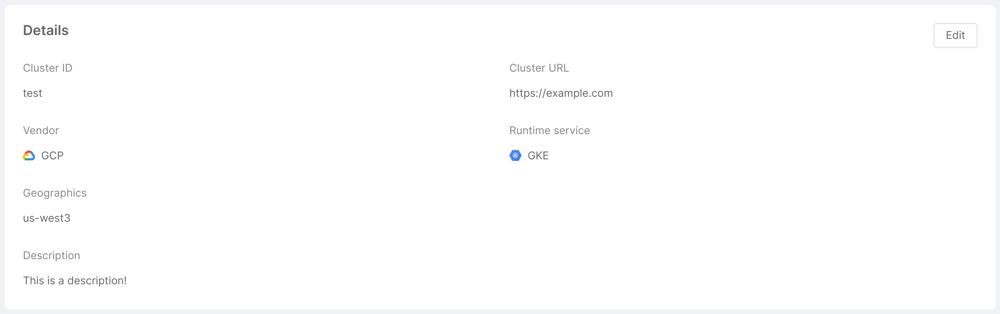
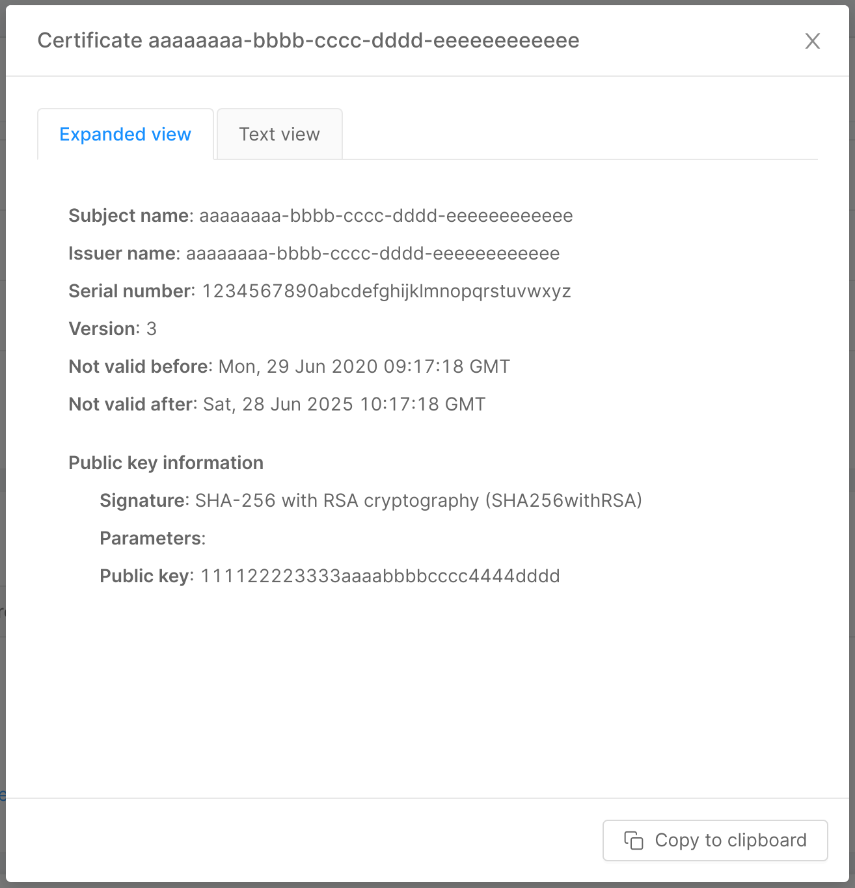
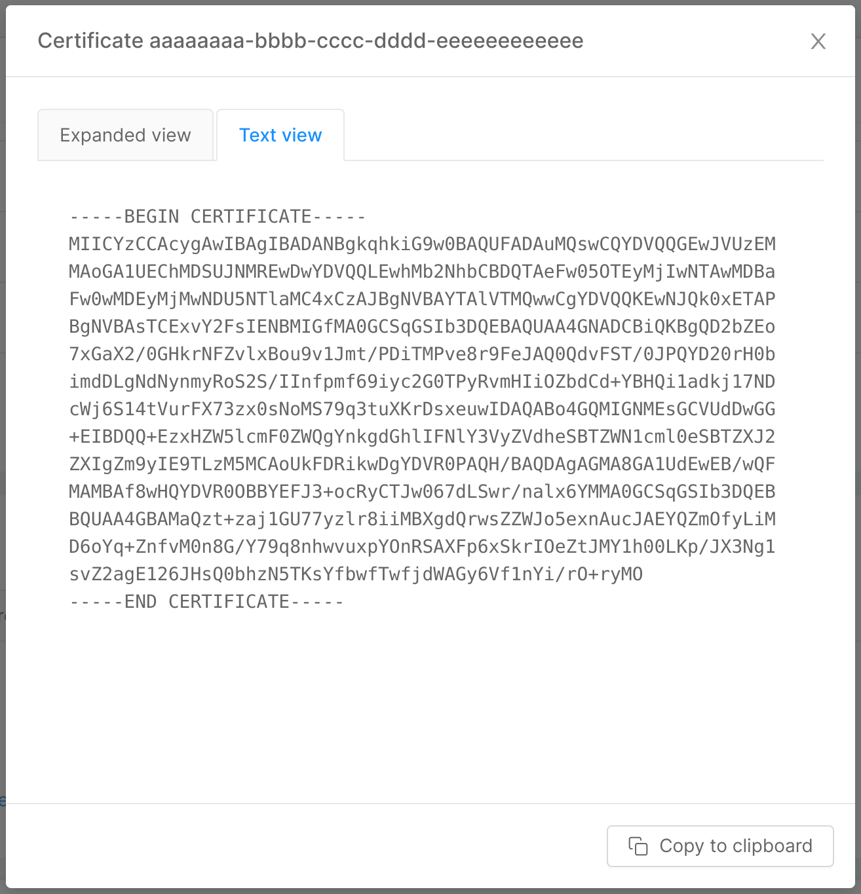
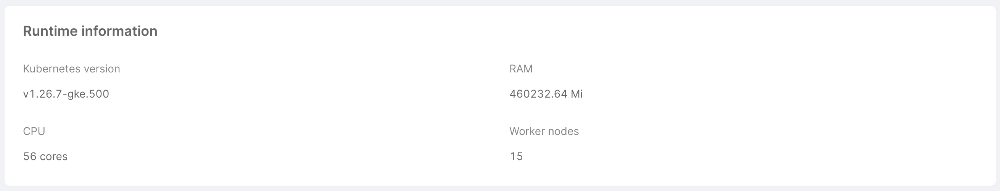
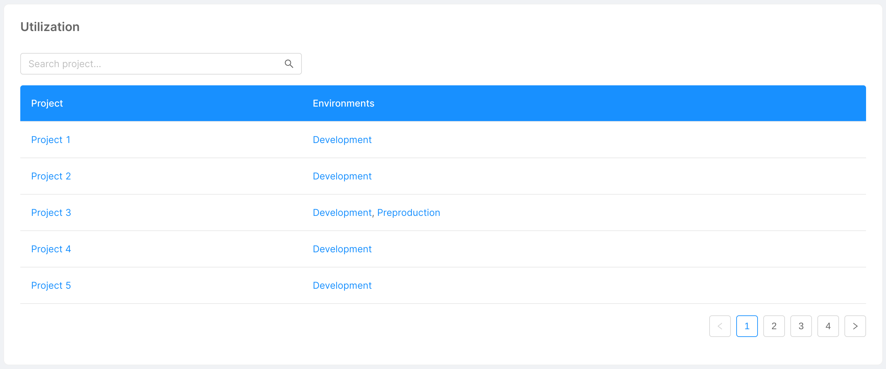

import Tabs from '@theme/Tabs';
import TabItem from '@theme/TabItem';

Mia-Platform Console allows authorized users to manage the Kubernetes clusters on which projects are deployed. More specifically, a user can:

* Add a new connection to an existing Kubernetes cluster, also including some cluster information such as vendor, distribution, or geographics;
* Edit the connection to an existing Kubernetes cluster, and eventually the cluster information;
* Delete the connection to an existing Kubernetes cluster.

:::note
It is essential to point out that these operations do not have an impact on the original Kubernetes cluster, but only on the connection to the cluster itself, as they are meant to provide the user with information about it. Therefore, as an example, adding a new cluster connection does not generate a new cluster, but simply links an existing one to the Console.
:::

To access these features, head to the Company Overview area of the Console by clicking the related button on the home page, next to your company name.


You will be automatically redirected to the Clusters section, in which you can see a table containing some information about the clusters connected to the Console:

* **ID**: friendly identifier of the cluster, assigned by the user while connecting the cluster to the Console;
* **Kubernetes version**: Git version of the Kubernetes master node associated with the cluster;
* **URL**: URL used to connect to the cluster, which indicates where the cluster is exposed;
* **Vendor**: a label used to describe the vendor of the cluster (e.g. Google, AWS...);
* **Kubernetes distribution**: a label used to describe the distribution of the cluster (e.g. WMWare Tanzu, GKE).


## Cluster preparation

In order to connect your cluster to the Console, there are some preparation steps that **must be done**.

You can choose between the automatic procedure and the manual one.

<Tabs>

<TabItem value="automatic" label="Automatic" default>

Contact us to receive the `Mia Platform Helm Chart` and `Template Console Helm Chart` that will automatically create the needed `ServiceAccount`, `ClusterRole` and `ClusterRoleBindings`.
    
</TabItem>
<TabItem value="manual" label="Manual" default>

### ServiceAccount

First, you must create a `ServiceAccount` on Kubernetes: this service account will be used by the Console to interact with the APIs exposed by Kubernetes on your cluster.

You can do this using the dedicated [kubectl command](https://jamesdefabia.github.io/docs/user-guide/kubectl/kubectl_create_serviceaccount/) or by creating a new Kubernetes object with the following template:

```yaml
apiVersion: v1
kind: ServiceAccount
metadata:
  name: {{SERVICE_ACCOUNT_NAME}}
  labels:
  annotations:
```

### ClusterRole

Next, we must define the roles needed by the previously created service account. These are the minimal roles required by the Console to work.

Here is the template to quickly define them:

```yaml
apiVersion: rbac.authorization.k8s.io/v1
kind: ClusterRole
metadata:
  name: {{CLUSTER_ROLE_NAME}}
  labels:
  annotations:
rules:
  - apiGroups:
      - ""
    resources:
      - "pods"
    verbs:
      - "delete"
      - "get"
      - "list"
  - apiGroups:
      - "batch"
    resources:
      - "cronjobs"
    verbs:
      - "get"
      - "list"
  - apiGroups:
      - ""
    resources:
      - "secrets"
    verbs:
      - "create"
      - "get"
      - "list"
  - apiGroups:
      - ""
    resources:
      - pods/log
      - nodes
      - events
    verbs:
      - "get"
      - "list"
  - apiGroups:
      - "metrics.k8s.io"
    resources:
      - "pods"
    verbs:
      - "list"
  - apiGroups:
      - "apps"
      - "extensions"
    resources:
      - "deployments"
      - "daemonsets"
    verbs:
      - "get"
      - "list"
  - apiGroups:
      - "autoscaling"
    resources:
      - "horizontalpodautoscalers"
    verbs:
      - "get"
      - "list"
  - apiGroups:
      - ""
    resources:
      - "namespaces"
    verbs:
      - "create"
  - apiGroups:
      - ""
    resources:
      - "limitranges"
      - "resourcequotas"
    verbs:
      - "create"
      - "get"
      - "list"
      - "patch"
      - "update"
  - apiGroups:
      - ""
    resources:
      - "namespaces"
    verbs:
      - "get"
  - apiGroups:
      - "rbac.authorization.k8s.io"
    resources:
      - "rolebindings"
    verbs:
      - "create"
  - apiGroups:
      - ""
    resources:
      - "serviceaccounts"
    verbs:
      - "create"
      - "get"
  - apiGroups:
      - "rbac.authorization.k8s.io"
    resources:
      - "clusterroles"
    verbs:
      - bind
    resourceNames:
      - {{NAME_OF_THE_SERVICE_ACCOUNT_USED_FOR_THE_DEPLOY}}
```

### ClusterRoleBindings

Finally, we **must** associate the roles with the service account using the `ClusterRoleBindings` that can be created using the following template:

```yaml
apiVersion: rbac.authorization.k8s.io/v1
kind: ClusterRoleBinding
metadata:
  name: 
  labels:
  annotations:
roleRef:
  kind: ClusterRole
  name: {{CLUSTER_ROLE_NAME}}
  apiGroup: rbac.authorization.k8s.io
subjects:
- kind: ServiceAccount
  name: {{SERVICE_ACCOUNT_NAME}}
  namespace:
```

</TabItem>

</Tabs>

### CA and Token

If everything has been made correctly, we can now extract the `Certificate Authority (CA)` and the `Token` that will be mandatory for the cluster connection.

To extract the `Token`, you can use the following command, that will also automatically decode it for you:

```sh
kubectl get secret `kubectl -n get sa $(SERVICE_ACCOUNT_NAME) -o jsonpath='{.secrets[0].name}'` -o jsonpath='{.data.token}' | base64 -d
```

To extract the `CA`, you can use the following command, that will also automatically decode it for you:

```sh
kubectl -n get secret `kubectl get sa $(SERVICE_ACCOUNT_NAME) -o jsonpath='{.secrets[0].name}'` -o jsonpath="{.data['ca\.crt']}" | base64 -d
```

:::caution
If you have created everything in a specific namespace, don't forget to specify it using the `-n` parameter of the `kubectl`.
:::

## Connect a Cluster

You can connect a cluster by clicking on the "Add cluster connection" button, located in the top right corner of the page. A modal will show up, and you will be asked to fill a form containing some information related to the cluster:

* **Cluster ID** (*required*): friendly identifier of the cluster, assigned by the user while connecting the cluster to the Console;
* **Cluster URL** (*required*): URL used to connect to the cluster, which indicates where the cluster is exposed;
* **Proxy URL**: URL of the proxy used to connect to the cluster, usually needed when the cluster is exposed on a private network;
* **Cluster Token** (*required*): base64 decoded JWT token needed by the service account to perform operations on the cluster.  
  To extract it, refer to [the previous paragraph](#ca-and-token);
* **Vendor**: a label used to describe the vendor of the cluster (e.g. Google, AWS...);
* **Kubernetes distribution**: a label used to describe the distribution of the cluster (e.g. WMWare Tanzu, GKE);
* **Geographics**: a label used to describe the location of the cluster;
* **Description**: a brief description of the cluster;
* **Certificate authority**: base64 decoded CA certificate for the TLS connection with the cluster.  
  To extract it, refer to [the previous paragraph](#ca-and-token).


By clicking on "Add cluster", the connection to the cluster will be set, and it will appear as a new entry in the table.

:::note
A syntactic check is performed at the moment of data entry, but the Console will verify their correctness on saving, contacting the cluster to establish the connection.  
Therefore, inserting a wrong URL, token, or certificate will result in a network error because the cluster will not be contacted successfully, and thus it will not be connected nor saved.
:::

## Configure and connect the service account to the cluster

:::danger
In case the service account is not configured on the specific cluster, upon creation of an environment associated with that cluster the Console will not be able to generate the token needed for deployment.
:::

There are 2 alternative ways to configure and associate the service account on Kubernetes with the cluster just created on the Console.

### 1. Via CMS

Using the Console CMS and editing the cluster on which you need to configure the service account via the appropriate section, and entering in the "Service Account" field the object that references the service account you want to configure and connect to.


A brief example of the Service Account object:

```json
{
  "name": <serviceAccountName>
  "clusterRoleName": <clusterRoleName>
}
```

### 2. Via service request

By opening a service request in which all the details of the cluster to be configured to the service account must be specified.


## View Cluster Information

By clicking on the arrow button located in the rightmost column of a cluster entry in the table, a new page will show up, displaying information about the specific cluster through 3 cards:

* **Details**: this card shows the information inserted by the user when connecting the cluster to the Console, and allows to modify this information through the "Edit" button in the top right corner, as further explained [below](#edit-a-cluster-connection).



It is also possible to quickly copy the cluster token through a specific copy icon, while clicking on the "View certificate" button allows to visualize the base64 CA certificate in both human-readable and plain version in a two-tabs modal. The "Expanded view" tab displays the human-readable version of the certificate, while the "Text view" tab shows its plain version, and a copy button in the modal footer allows the user to quickly copy the plain base64 CA certificate.




* **Runtime information**: this card shows the runtime information of the cluster, taken by aggregating data from the machines on which the cluster is hosted. More specifically:
  * **Kubernetes version**: Git version of the Kubernetes master node associated with the cluster;
  * **RAM**: total amount of RAM used by the machines (in MiB);
  * **CPU**: total amount of CPU used by the machines (in terms of number of cores);
  * **Nodes**: number of nodes associated with the cluster.



* **Utilization**: this card simply shows the environments installed on the cluster, and the projects associated with these environments. A search bar allows to quickly find the project you are looking for, filtering the data in the table.



## Edit a Cluster Connection

As mentioned in the previous section, through the "Edit" button in the top right corner of the Details card, it is possible to modify (most of) the information inserted by the user while connecting the cluster to the Console. A click on the button opens a modal very similar to the one seen when connecting the cluster, with the difference that the Cluster ID and Cluster URL information can no longer be changed. By clicking on "Edit cluster", the connection to the cluster will be updated.


## Remove a Cluster Connection

In the bottom part of the page, there is a footer which allows to remove the cluster connection from the Console. By clicking on the "Remove" button, a modal will be displayed, asking for confirmation of the removal.


After entering the name in the input field and clicking "Remove," a loading and finally a feedback of successful removal will be shown. Closing the modal will then redirect you to the clusters table. In case of errors, an informative feedback will be shown instead, and the "Close" button will not perform any redirection.

:::note
Removing a cluster connection is only possible if the cluster has no connected environment.
:::
