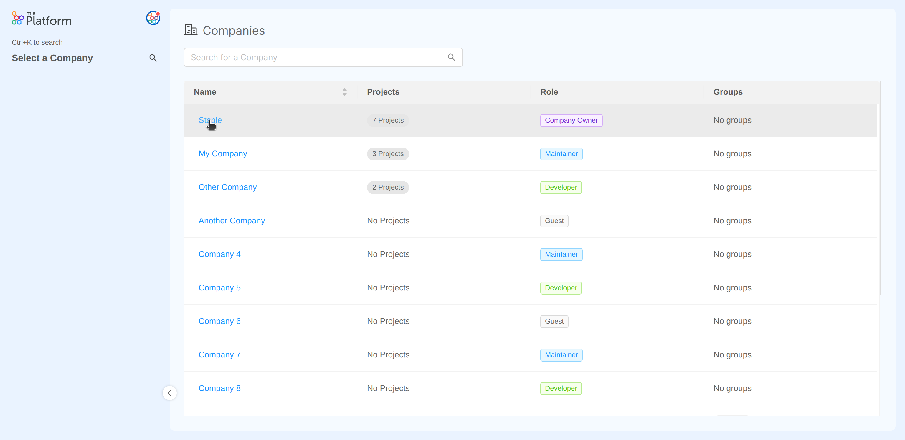

Once you [created a Company](/development_suite/company/create.md), you can configure:

- [clusters](#connect-a-cluster)
- [providers](#configure-providers) (Git Providers, Secret Managers, CI/CD Tools)
- [projects default configurations](#projects-default-configurations) (such as environments, logical layers, and accessible namespaces)
- [settings](#company-settings)

:::info
Each of these configurations will be applied as the default configuration to newly created projects within the Company.
:::

To configure the Company from UI, simply click on its name in the Companies table.

Let's now proceed with each step of the configuration:

### Connect a cluster

Clusters can be connected to a Company from the **Clusters** section of the Console, at the Company level.

To connect a cluster, you can follow the [clusters connection guide](/development_suite/clusters-management/connect-and-manage-cluster.mdx).

### Configure Providers

Git Providers, Secret Managers, and CI/CD tools can be configured from the **Providers** section of the Console, at the Company level.

For further details on how to create new providers, you can follow the [providers configuration guide](/console/company-configuration/providers/overview.md).

### Projects Default Configurations

By editing the Company data model, you will be able to set default configurations for all the projects that will be created within the Company.

For further details on how to configure new project defaults, you can follow the [project configuration guide](/console/company-configuration/project-default-configuration.mdx).

### Company settings

In the **Settings** section you can find Company-specific information and settings, such as an overview of the Company's basic information and configurations, and the possibility to handle feature activations or perform sensitive operations.

For further details on how to manage Company settings, you can refer to the [dedicated page](/console/company-configuration/settings.md).