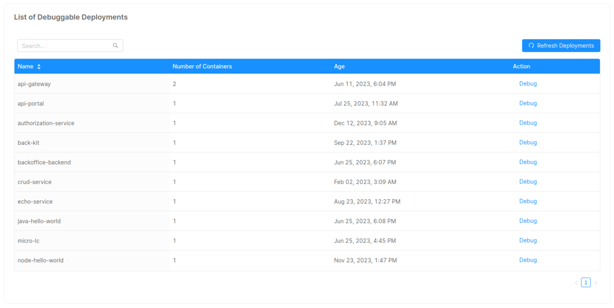
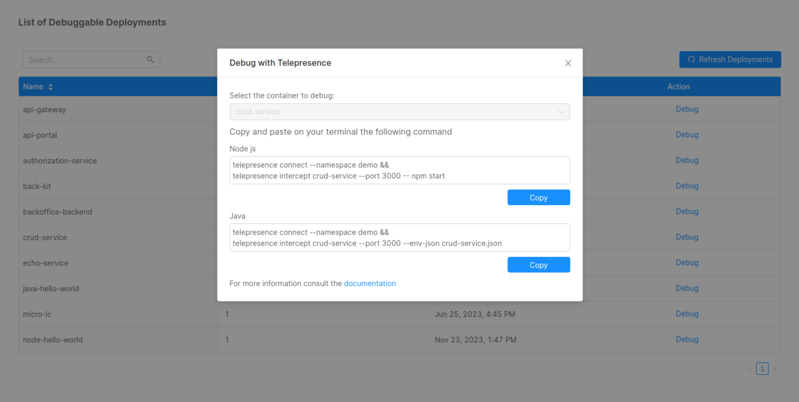
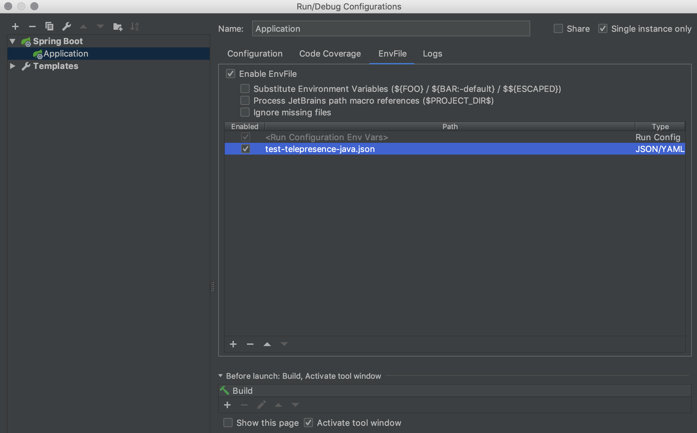

import Tabs from '@theme/Tabs'
import TabItem from '@theme/TabItem'

To debug a microservice, reach the "Debug" area inside one of your projects.

## Debug Area

In the Debug Area, you can see the list of all the microservices developed with Mia-Platform Console.



The real potential of this section lies in its connection with [Telepresence](https://www.telepresence.io/).

Pressing the **"Debug"** button will display a string to be pasted on your terminal that simulates the behavior of your microservice in a real context.



This will allow you to easily test and debug your microservice without compromising the replica running in the production environment.

## Introduction to Telepresence

Telepresence is an open-source tool that allows you to run a single service locally while connecting that service to a remote Kubernetes cluster. 

This lets developers working on multi-service applications to:

1. Do fast local development of a single service, even if that service depends on other services in your cluster. Make a change to your service, save the changes, and you can immediately see the new service in action.

2. Use any tool installed locally to test/debug/edit your service. For example, you can use a debugger or IDE!

3. Make your local development machine operate as if it's part of your Kubernetes cluster. If you've got an application on your machine that you want to run against a service in the cluster -- it's easy to do.

### Installing Telepresence

Telepresence works on both Mac OS X, Windows, and Linux, with OS-native packages.

Follow the [official guide](https://www.getambassador.io/docs/telepresence-oss/2.17/quick-start?os=gnu-linux) to install Telepresence on your machine, and, if necessary, in your cluster.

## Connect to a Kubernetes Cluster

You can learn how to connect to your cluster using **Kubectl** by following this [guide](https://cloud.google.com/kubernetes-engine/docs/how-to/cluster-access-for-kubectl).

If you are already familiar with the Kubectl tool, you will only need to [set the cluster context](https://cloud.google.com/kubernetes-engine/docs/how-to/cluster-access-for-kubectl#store_info) correctly.

#### For Example

Here is an example configuration on how to setup your cluster context:
```bash
gcloud container clusters get-credentials [CLUSTER_NAME] --zone [ZONE] --project [PROJECT_NAME]
```
:::info
If you don't have yet installed Google Cloud follow the steps at [**this link**](https://cloud.google.com/sdk/install).
:::


## Debug your microservice

### Access to your local source directory

Move to the local repository of the microservice you wish to debug.

```bash
cd [MICROSERVICE_REPOSITORY_NAME]
```

### Run Telepresence

Run the following command to connect to the cluster and intercept your microservice traffic using Telepresence.

<Tabs>
<TabItem value="node" label="Node" default>

  ```bash
  telepresence connect --namespace [NAMESPACE] &&
  telepresence intercept [MICROSERVICE_NAME] --port [PORT] -- [START_COMMAND]
  ```
</TabItem>
<TabItem value="java" label="Java">

  ```bash
  telepresence connect --namespace [NAMESPACE] && 
  telepresence intercept [MICROSERVICE_NAME] --port [PORT] --env-json [ENV_JSON_FILE]
  ```

<details>
<summary>
If you use IntelliJ IDE, the <b>EnvFile plugin</b> will be required to debug your microservice.
</summary>

First, install the [EnvFile plugin](https://plugins.jetbrains.com/plugin/7861-envfile).

Then, Configure Intellij debug configurations with your JSON file.

Finally, run IntelliJ "Debug" option.

Here is an example on how to configure the env file inside IntelliJ:


</details>
</TabItem>
</Tabs>


