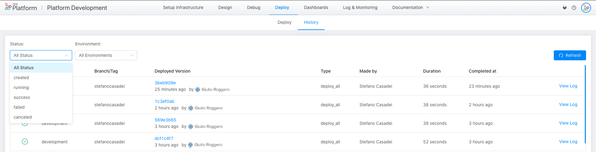

# Deploy

## Introduction  

Deploy is the sections that allows developers to directly deploy your configurations in the different environments and check the past history of all the releases on that project.

Thanks to this automation the **Continuous Deploy** is more simple and immediate.
Furthermore, the deployment automatically starts the tests to verify that the branch can be released without damaging the existing project.

The Deploy section is divided into two areas: **Deploy** and **History**.

When an user enters the Deploy section, he is automatically led to Deploy area.

## Deploy Area

In the deployment area you have to choose in which environment you want to release a branch.
The console will show you the impacts your release may have

Let's see in detail how it works

### Select environment  

The first card you have to choose the environment in which you want to release your configuration. Once you have selected your target environment, you will see what was the last release in that environment.

### Select branch  

In the second card you can choose the branch to be released.
Once the branch is selected the console will show two things:

* A link to gitlab with the compare between the branch you want to release and the one that is released in that environment.
* The last 10 commits made on selected branch to let you check if you are releasing the correct configuration.

### Compare Services  

Once you have chosen the environment and the branch, the last card of the deploy page will be loaded.
In this card you can see a comparison between the services you want to release and those that are currently running in that environment.

The information shown is:

* The complete list of micro-services
* The running version
* The version you would like to release  

  !!! info
      Be careful that if you use an environment variables to define the version we are unable to trace the version number

* Tags that tell you if your service is new or has been removed
* The status of the latest build of that service.

  !!! info
      Currently you will see the builds of the services of which the platform knows the link to the repo, that is all the services created with the console starting from an example or a template created after April 30th.  

  !!! warning
      the build information will only be available to customers running GitLab Ci as runners

* The link to the history of all builds
* The link to the change log of your service

At this point, once you have verified the information, you can deploy your configurations.

## History

The History Page is the second area in the Deploy section. In this tab it will be possible to visualize all the released deploy.

In the History table the user visualizes the following information:

* Status: if the deploy is successful or if the deploy is not successful;
* Environment of the deploy;
* Deployed version;
* Deploy type;
* Who made the deploy;
* How long was the deploy;
* How much time ago the deploy was released;
* Link to Git to visualize the logs of the past deploy.
