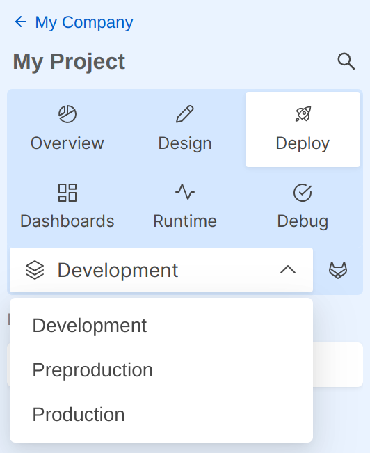
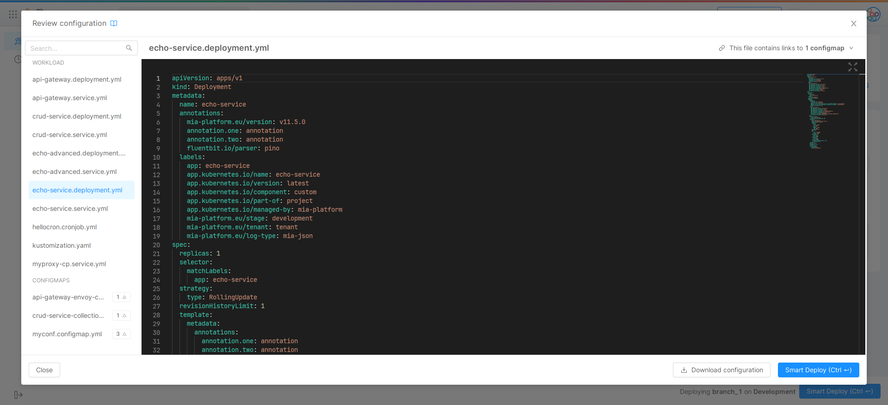

## Introduction  

Deploy is the Console Area that allows developers to deploy configurations of a specific project on different runtime environments. It can also be used to visualize the history of previous releases on that project.

This section allows you to follow in a simple and effective way a **Continuous Deployment** approach, integrating automated tests and releasing new code versions without damaging the existing project.

The Deploy Area is divided into two Sections: **Deploy** and **History**.
When a user enters the Deploy Area, they are automatically led to Deploy Section.

## Deploy Section

This section is tied to a specific environment, which can be changed using the dropdown menu on the right side of the topbar. Once you have selected in which runtime environment you want to release your project configurations and which branch to deploy, you will be able to start the deployment process.

With the relative dropdown menu in the top-right position of the topbar, it is possible to select the runtime environment in which you want to deploy your project.

### Latest deployed version

Once selected a runtime environment in the main topbar, you will be able to see all the details regarding the last release in that runtime environment.

The information you will see in this card are:

* **Runtime Environment**: the runtime environment of the displayed deployment (as a reminder of the selected runtime environment)
* **Branch**: the branch used for the latest deployment, together with a link to the last commit at deploy time
* **Completed at**: time of completion
* **Made by**: author of the deployment
* **Type**: `Smart Deploy` or `Deploy All`, based on the settings used in the last deployment
* **Duration**: how much time was needed for the last deployment to finish
* **Pipeline**: link to the deployment pipeline

### Select branch  

In the second card, you can choose the branch to be released.

Once the branch is selected the console will show:

* A link to the Gitlab page showing the code comparison between the branch you want to release and the one that has been previously released in that runtime environment.
* The last 10 commits on the selected branch (this information will help you check if you are releasing a correct configuration).

### Deploy details

Once you have selected the branch and the runtime environment, the deploy page will load a card containing additional deployment details.

In particular, this card will show a comparison between the services that are going to be released and those that are currently running in the selected runtime environment.
This card will let you decide the deployment strategy, **smart deploy** or **deploy all**, and the ability to always release services that do not follow semantic versioning.

In this section you will be able to access the following information:

* The complete list of micro-services to be released
* The deploy outcome
* The running version
* The version you are going to release

:::info
Please note that using an environment variable to define the version will cause the inability to trace the correct version number.
:::

* The tag that identifies whether the service is new or has been removed
* The status of the latest build of that service.

:::info
The card will show only the builds of the services whose link to the repo is known by the platform. This condition includes all the services created using the console either starting from an example or a template created after April 30th, 2020.  
:::

:::warning
The build information will only be available to customers running GitLab CI as runners
:::

* The link to the history of all builds
* The link to the changelog of your service

At this point, once you have verified the information, you can deploy your configurations.

### Smart Deploy

By toggling the appropriate switch you can activate/deactivate the **Smart Deploy** functionality.

This functionality will let you release your microservices in a smart way, since only the updated services will be deployed through the console.

**Smart Deploy** leverages Kubernetes deployment strategies to ensure that only necessary Pods are recreated. During each deploy updated pods get replicated to prevent disservice, however, on big projects, this might avoid huge resource consumption spikes or longer deployment times.

:::warning
This feature can be activated only in projects using **mlp**, the Mia-Platform official command line deployment tool.
:::

A service is considered to be eligible for a new deployment on certain circumstances: when you update the pod specification from the console, when you update the value of a pod dependency (such as a config map key) and so on.

:::warning
It is important to **save** the configuration at least one time after the feature smart deploy has been activated. This operation will help avoid inconsistent behaviors when deploying your services.
:::

:::info
In order to avoid unnecessary deployments, services created using an **advanced configuration** should be manually modified by **removing all the old interpolated annotations**.
:::

When deploying for the first time using this feature, some services might not be able to collect all the necessary information to show the effective deployment strategy adopted. However, service that do not show actual differences on the cluster will not be deployed.

:::warning
It is highly recommended not to do actions such as modifying a version, an env var, a configmap directly on the cluster, otherwise the checksum that is generated at the deployment does not work correctly and consequently the information reported in the Deploy details table will be misleading.
:::

#### Deploy All

By deselecting the Smart Deploy toggle, you will switch to **Deploy all** strategy.

:::info
Smart deploy is enabled by default, if you want to force a deploy of all the services you should disable the toggle.
:::

This strategy does not check if a microservice configuration has been updated and directly schedules the deployment of all the services. In big projects this might cause resource consumption spikes and longer deployment times. However, it can be useful to ensure a new and clean deployment environment.

#### Understanding Deploy Outcome Column

The column **Deploy outcome** will help you understand which services will be deployed or deleted by pressing the deploy button.

Rocket icons indicate services that are going to be considered by the smart deploy feature, while the sleeping symbol indicates services that are not going to be updated as their configuration haven't changed since the last deployment.

* A _Deploy_ near the icon indicates that the service configuration is changed, so it will update the microservice.
* A _Delete_ near the icon indicates that the service configuration is deleted, so it will delete the microservice.
* A _No Update_ near the icon indicates that the service configuration remains the same.
* A _No Info Available_ near the icon indicates the console could not collect enough information to display the outcome.

:::info
An incomplete deploy outcome column might indicate the configuration has not been properly saved.  

Please notice that this represents the impossibility to provide a complete preview, however, the smart deploy feature will still deploy the modified services.
:::

:::warning
If a microservice has interpolated environment variables and one of them is modified, the service will be deployed again even if the **Deploy outcome** column shows **No update**.
:::

#### Semantic Versioning

By checking the dedicated checkbox you can force the deployment of microservices that do not follow semantic versioning.

:::info
If you are not following sematic versioning, for example using `image:latest` or `image:branchName`, you can force the deployment by using the dedicated checkbox.
:::

:::warning
It is not recommended to activate the checkbox in a production runtime environment, because if some of your services by mistake have a pre-release or latest version tag they will be redeployed.
:::

### Export and review configuration files

When using **Enhanced Project Workflow**, Kubernetes files are generated on deployment. After selecting the desired revision (or version), you will have the possibility to export and download the files in `tag.gz` format, or to review them directly inside the browser.

While reviewing the files, you can select the one you view to open from the menu on the left. You can see the file content full-screen by clicking the top-right button with four outgoing arrows.

## History

The History Page is the second area of the Deploy section. In this tab it will be possible to visualize all the released deploy.

In the History table the user will be able to visualize the following information:

* Status: if the deploy is successful or if the deploy is not successful;
* Runtime environment of the deploy;
* Deployed version;
* Deploy type;
* Who made the deploy;
* How long was the deploy;
* How much time ago the deploy was released;
* Link to Git to visualize the logs of the past deploy.
