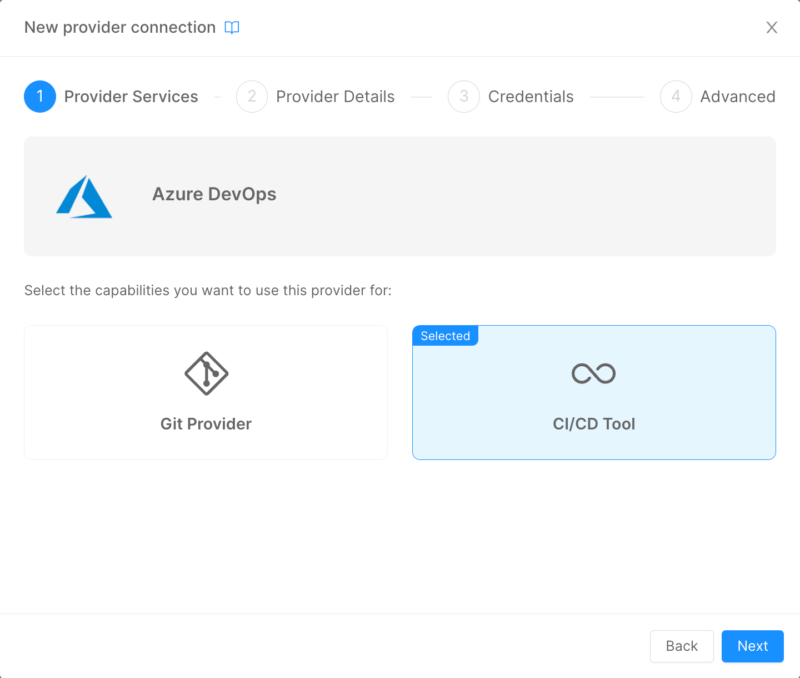

The Mia-Platform Console can be configured to deploy your project through Azure Pipelines.

In order to enable your projects to be deployed using Azure Pipelines, in the Company Overview page you must add the Provider Azure DevOps and select the option relative to CI/CD Tool, and then follow the [standard Provider configuration](/docs/console/company-configuration/providers/management#connect-a-provider).



This process will change the configuration of your Company in the CMS. In particular, the JSON configuration of the field `Pipelines` will change as follows:

```json
{
  "type": "azure-pipelines",
  "providerId": "{{PROVIDER_ID}}"
}
```

Where `PROVIDER_ID` will be equal to the ID of the Azure Pipelines CI/CD Tool Provider that has been setup prior.

For the Projects specific configuration, when you create a new one in a Company that has Azure Pipelines as CI/CD Tool Provider the Console will perform two important actions:
- based on the Project Template of choice, the Console will read its `azure-pipelines.yml` file and will request to Azure DevOps the creation of a new Pipeline object that will be based on this file;
- in the CMS the `Pipelines` JSON configuration will be automatically created as follows:

```json
{
  "type": "azure-pipelines",
  "providerId": "{{PROVIDER_ID}}",
  "azurePipelineId": {{PIPELINE_ID}}
}
```

Where `PIPELINE_ID` will be the unique identifier of the Azure Pipeline created at the first point and that will be used from the Console to trigger the proper one during Deploy operation.

When the user request a Deploy operation from the Console, the Pipeline with this specific ID will be triggered in Azure DevOps.

### Azure Pipelines Basic Configuration

An example of `azure-pipeline.yml` template can be found [here](/docs_files_to_download/azure-pipelines-template.yml).

Let's analyse each section of the above template:
- `trigger: "none"`
This field let's you decide when the pipeline should automatically starts. If you want the pipeline to start automatically upon a commit operation on certain branches, you have to update the field as follows:
```yaml
trigger:
  branches:
    include:
    - branch1
    - branch2
```
If you want to automatically starts the pipeline when creating a new tag:
```yaml
trigger:
  tags:
    include:
    - '*'  
```
In the example above, the pipeline will starts automatically upon the creation of a tag, no matter its name.
With this logic, you can provide custom logic to the pipeline based on the trigger source: you can check it with the instruction <br /> `${{ variables['Build.SourceBranchName'] }}`.

- the `resources` field:
```yaml
resources:
  repositories:
  - repository: pipelines
    type: git
    name: pipelines-templates
    ref: 'master'
```
The idea with this instruction is to let Azure Pipelines knows that you are importing other files from another Team Project in Azure DevOps. 
In the example above, we have placed some configuration files and the common logic of the pipeline (check [mlp Setup](configure-azure-pipelines.md#mlp-setup) for details) in a different Project, in order to have a centralize point where to manage the common logic of all the Deploy pipelines.
:::info
The DevOps Project that you are pointing must be inside the very same DevOps Organization of the one where the Pipeline is running.
:::

- the `jobs` section:
```yaml
jobs:
%#project.environments%
  - deployment: deploy_job_%envId%
    environment: %envId%
    pool:
      vmImage: 'ubuntu-latest'
...
    condition: eq(variables['STAGE_TO_DEPLOY'], '%envId%')
...
%/project.environments%
```
When creating a new Project, the Console use [mustache.js](https://github.com/janl/mustache.js) to perform some basic interpolations based on the configuration of the Company in which the Project will be craeted.
The idea is to have different `job` named after the environment configured in the Company. The field `condition` will make sure that only the specific job for the target environment will be executed.
This will assure you to perform different logic based on the Deploy environment.

- the `variables` section - let's you import variables from different sources. In our example, we are importing some variables from the DevOps Project's Variable Group and from the centralised Common Project:
```yaml
    variables:
      - group: mia
      - template: "common/jobs/deploy/variables.yaml@pipelines"
```
In order to store some variables that you want to keep secret, like the Tokens to connect to the K8s Cluster, we use the DevOps `Variable Group`, that can be useful to create secret variables that can be shared between every Pipeline of your DevOps Team Project.
With this instruction, you are saving those variables inside an object called `mia` that you can use in the Pipeline.

- the `strategy` section - this is the core of the Pipeline, where the Deploy operation are performed:
```yaml
    strategy:
      runOnce:
        deploy:
          steps:
            - checkout: self
            - bash: |
                ...
              env:
                ...
                ## Add here your custom %envId% variables

              name: PrepareEnvVariables

            - template: "common/jobs/deploy/deploy-job.yml@pipelines"
```
In this section, the user can change the content of the `bash` field to prepare the various variables and secrets to be used by `mlp` to perform the Deploy operation.
In the `template` field is specified a template file that contains the common logic performed by `mlp` to apply the Kubernetes manifest into the Runtime cluster.

:::caution
Under the commented line, the user must specify those secrets variables that he wants to use in his Project. This step is necessary if you don't have access to any Secret Manager Provider. 
:::

### mlp Setup


