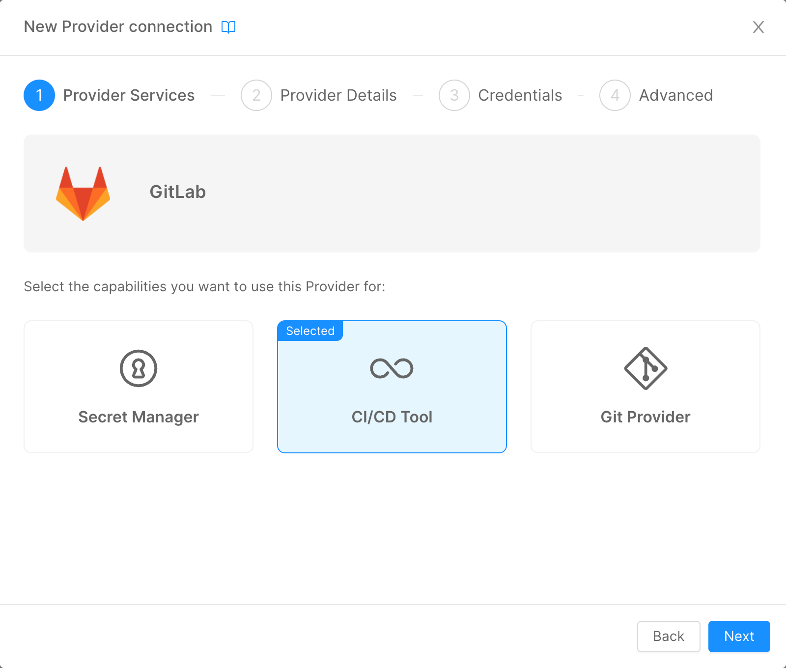

Mia-Platform Console can be configured to deploy your Project using GitLab Runners.

To deploy your projects using Azure Pipelines, you must add the Azure DevOps Provider on the Company Overview page, select the CI/CD Tool option, and then follow the [standard Provider configuration](/console/company-configuration/providers/configure-provider.mdx).



## Workflow

In your Git working directory, create a new file called `.gitlab-ci.yml`.

The file should be structured as follows:

- a section to setup the variables used by `mlp` to locate the various configuration files generated by the Console;
- a section to setup the secrets variables used by `mlp` to authenticate to the Cluster - this section should be replicated for every runtime environment;
- a section to launch `mlp` to apply the manifests into Kubernetes.

:::info
It is possible to add more sections to the pipeline to check optional stages, like security and compliancy checks.
:::

Let's dive into these sections.

### Repository Variables Setup

In order to make `mlp` aware of the configuration files generated by the Mia-Platform Console, the following variables should be declared in the `variables` field of the pipeline:

```yaml
variables:
  ENVIRONMENT_VARIABLES_PREFIX: MIA_
  BASE_PATH: "${CI_PROJECT_DIR}/configuration"
  OVERLAY_PATH: "${CI_PROJECT_DIR}/overlays/${ENVIRONMENT_TO_DEPLOY}"
  DESTINATION_PATH: "${CI_PROJECT_DIR}/interpolated-files"
  GENERATE_FILE: "${CI_PROJECT_DIR}/mlp.yaml"
  VARIABLES_FILE: "${CI_PROJECT_DIR}/overlays/${ENVIRONMENT_TO_DEPLOY}/variables.env"
```

Where:

- `ENVIRONMENT_VARIABLES_PREFIX: MIA_`: this variable is used as the **Global prefix** for the variables managed in the Project section of the Console, check [here](../../../console/project-configuration/manage-environment-variables/manage-environment-variables-with-gitlab.md#how-to-differentiate-your-variable-from-one-environment-to-another) for more details;
- `BASE_PATH: "${CI_PROJECT_DIR}/configuration`: this variables points to the folder in the repository where the Console is saving the worload's manifests;
- `OVERLAY_PATH: "${CI_PROJECT_DIR}/overlays/${ENVIRONMENT_TO_DEPLOY}"`: this variables points to the overlays folder relative to the selected deploy environment. This folder contains the Kustomize configuration files (check [here](../../../console/project-configuration/kustomize-your-configurations/manage-a-kustomize-project.md) for details);
- `DESTINATION_PATH: "${CI_PROJECT_DIR}/interpolated-files"`: this variable represents the folder where `mlp` will store the manifests after the [`interpolate`](../../../runtime_suite_tools/mlp/30_interpolate.md) process;
- `GENERATE_FILE: "${CI_PROJECT_DIR}/mlp.yaml"`: this variable points to the `mlp.yaml` file that contains the configuration of the Kubernetes secrets that will be [generated](../../../runtime_suite_tools/mlp/40_generate.md) by `mlp`;
- `VARIABLES_FILE: "${CI_PROJECT_DIR}/overlays/${ENVIRONMENT_TO_DEPLOY}/variables.env"`: this variable points to the `variables.env` file for the selected deploy environment. This file contains the configuration of the Public Variables created via Mia-Platform Console (check [here](../../api-console/api-design/public_variables.md) for more details);

:::info
The CI_PROJECT_DIR placeholder is automatically managed by GitLab - it will be replaced with the full path of the configuration repo when the pipeline will be triggered.
:::

### Infrastructure Secrets Setup
