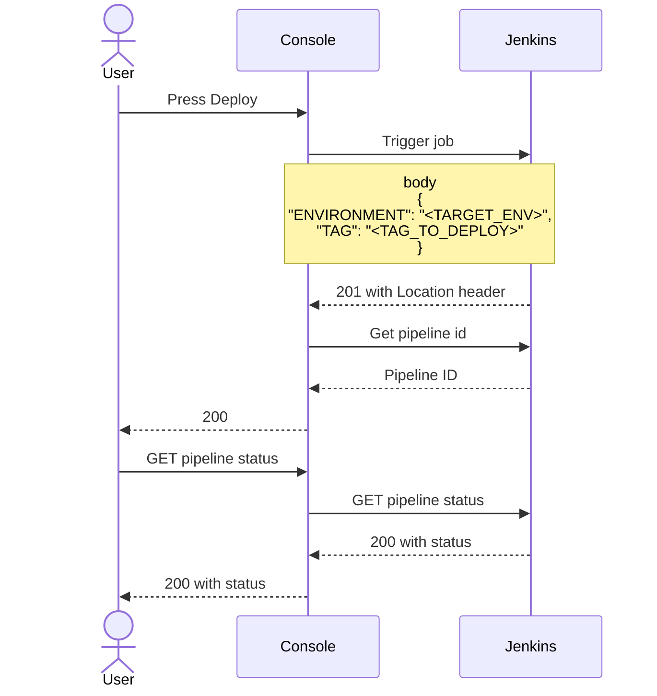

The Mia-Platform Console can be configured to deploy your project through Jenkins.

In order to enable your project to be deployed using Jenkins, you should edit configuration of the project through the Console CMS (if you do not have access to it, ask to your instance administrator).
In particular, the `environments.deploy` object of the configuration should contain the following information:  

* **type**: string, must be `jenkins` for deployment with Jenkins
* **providerId**: is the unique id of the provider that holds Jenkins credentials (it is set when you configure a Company)
* **jobId**: id of the Jenkins job to trigger. It is automatically interpolated from the backend of the console when a new project is created
* **paramsMap**: is a parameters mapping for the parameters needed in your Jenkins job (i.e.: if your pipeline needs `revision` parameters to be named as `tag`, this object should be: `{'revision': 'tag'}`)  

A working JSON example is the following:

```json
{
  "deploy": {
    "type": "jenkins",
    "providerId": "your-provider-id",
    "paramsMap": {
      "revision": "TAG",
      "environment": "ENVIRONMENT"
    },
    "jobId": "jobId"
  }
}  
```

### Workflow

All the logic behind the handling of deploy requests is contained by the control plane of the console.

With the above configuration, when a user presses the `Deploy` button inside the console, the following steps will be executed:



1. The console performs a POST to Jenkins in order to trigger `jobId`. The body is in this form:

    ```json
    {
      "revision": REVISION_TO_TRIGGER,
      "environment": envId,
      "deployType": "smart_deploy" or "deploy_all",
      "forceDeployWhenNoSemver": true or false
    }
    ```

    Where:

    - `REVISION_TO_TRIGGER`: is the revision to deploy (i.e. the tag or the branch name);
    - `envId`: is the environment id to deploy.

    :::warning
    This feature is deprecated and will be removed in the future, does not use that:

    Otherwise, it is possible to set inside the project environment configuration (only from the CMS) a `deploy.paramsMap` field which is a key value map used to change the key of this fields.
    For example, if you set `deploy.paramsMap` as:
    ```json
    {
      "revision": "TAG",
      "environment": "ENVIRONMENT"
    }
    ```
    The body will be:
    ```json
    {
      "TAG": REVISION_TO_TRIGGER,
      "ENVIRONMENT": envId,
      "deployType": "smart_deploy" or "deploy_all",
      "forceDeployWhenNoSemver": true or false
    }
    ```
    :::

1. The expected Jenkins response has a 201 status code and contains a `Location` header (i.e. `<JENKINS_URL>/queue/item/:pipelineId`). This is used from the backend of the console to retrieve the id of the triggered pipeline.
2. The console Service periodically performs GET requests to check the status of the triggered job

### How to automatically create Jenkins job on project creation

Mia-Platform Console also allows you to create the Jenkins job that will deploy your project automatically when the project is created.

You need to have a Gitlab repository with the following structure:  

    .
    ├── pipelines                     
        ├── jenkins-template.xml       # XML template of the deploy job
        ├── jenkins-view-template.xml  # XML template of the Jenkins view where the job will be created

An example of `jenkins-template.xml` file can be downloaded [here](/docs_files_to_download/jenkins-template.xml).

In particular, the console replaces the strings between curly braces as follows:

- `REPOSITORY_NAME` is the url of the repository of the project;
- `ENVIRONMENT` is the name of the environment in which you want to deploy the project (note that this in an array, so you need to replicate that line for each of your environments);
- `PIPELINES_REPOSITORY` is the url of the repo in which you hold all your pipelines
- `TOKEN` is the secret that Jenkins uses to authenticate with the Git provider.

An example of `jenkins-template.xml` file can be downloaded [here](/docs_files_to_download/jenkins-view-template.xml).

In particular, inside the `jenkins-view-template.xml`

- `ENVIRONMENT`
- `TAG`

which are the ones contained in the `paramsMap` object.
