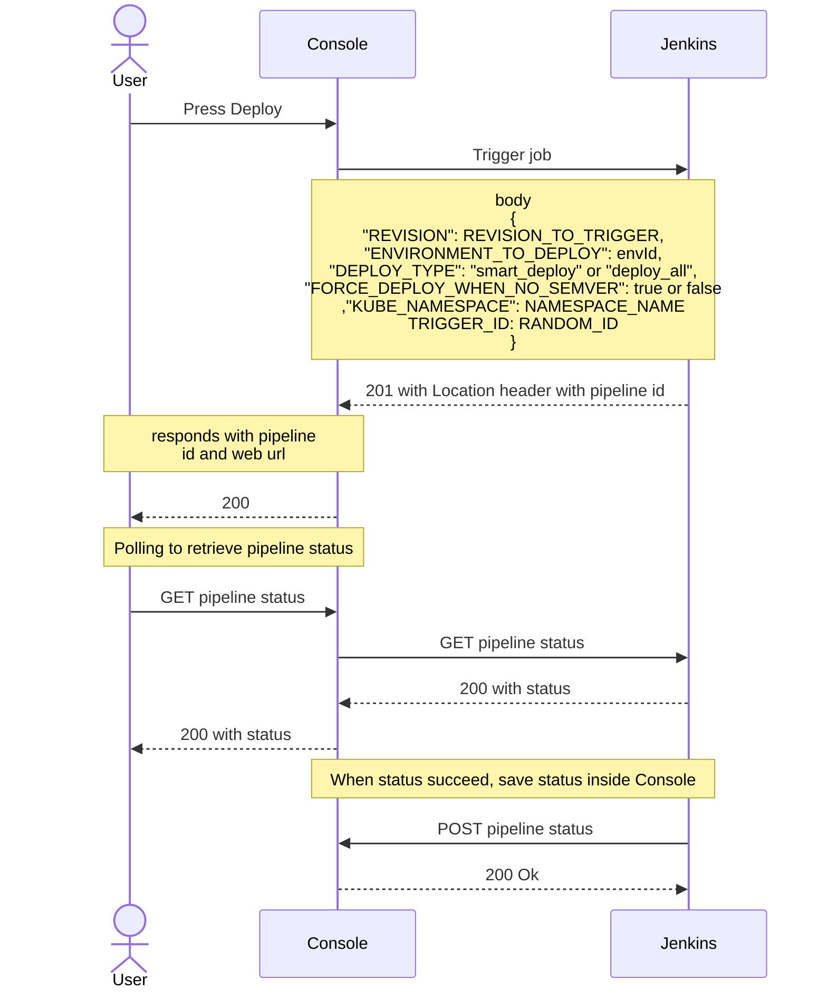

The Mia-Platform Console can be configured to deploy your Project using Jenkins.

To deploy your projects using Jenkins, you must add the Jenkins Provider on the Company Provider page, and [configure the provider](/console/company-configuration/providers/configure-provider.mdx).

When a project will use this provider, the Project configuration will be changed to be like this:

```json
{
  "type": "jenkins",
  "providerId": "{{PROVIDER_ID}}",
  "jobId": "{{JOB_ID}}"
}
```

Where `{{PROVIDER_ID}}` will be equal to the ID of the just configured Jenkins Provider and `{{JOB_ID}}` is the id of the job to trigger to deploy the configuration.

### Workflow

All the logic behind the handling of deploy requests is contained by the control plane of the console.

With the above configuration, when a user presses the `Deploy` button inside the console, the following steps will be executed:



1. The console performs a POST to Jenkins in order to trigger `jobId`. The body is in this form:

    ```json
    {
        "REVISION": REVISION_TO_TRIGGER,
        "ENVIRONMENT_TO_DEPLOY": envId,
        "DEPLOY_TYPE": "smart_deploy" or "deploy_all",
        "FORCE_DEPLOY_WHEN_NO_SEMVER": true or false,
        "KUBE_NAMESPACE": NAMESPACE_NAME,
        "TRIGGER_ID": RANDOM_ID,

        // Deprecated parameters
        "revision": REVISION_TO_TRIGGER,
        "environment": envId,
        "deployType": "smart_deploy" or "deploy_all",
        "forceDeployWhenNoSemver": true or false
    }
    ```

    Where:

    - `REVISION_TO_TRIGGER`: is the revision to deploy (i.e. the tag or the branch name);
    - `envId`: is the environment id to deploy;
    - `KUBE_NAMESPACE` is the namespace where the deployment should be performed;
    - `RANDOM_ID` is a random id to identify the trigger;

    :::warning
    The parameters `revision`, `environment`, `deployType`, `forceDeployWhenNoSemver` are deprecated and will be removed in the future. Use the other parameters instead.
    :::

2. The expected Jenkins response has a 201 status code and contains a `Location` header (i.e. `<JENKINS_URL>/queue/item/:pipelineId`). This is used from the backend of the console to retrieve the id of the triggered pipeline;
3. The console website periodically performs GET requests to check the status of the triggered job
4. Once the job is completed, Jenkins will send a POST request to the console saving the status of the pipeline. This is a really important step to perform in your pipeline
to enable the configuration review (and improve the deploy history). [Check here](#how-to-automatically-create-jenkins-job-on-project-creation) how to configure the Jenkins pipeline.

### Create a new project with Jenkins as CI/CD provider

When creating a new Project in a Company that has Jenkins Provider set, the Console will perform two important actions:

- based on the [Project Template](/console/company-configuration/project-blueprint.md) of choice, the Console will [create Jenkins job automatically](#how-to-automatically-create-jenkins-job-on-project-creation);
- The Project configuration `Pipelines` JSON will be defined as follows:

```json
{
  "type": "azure-pipelines",
  "providerId": "PROVIDER_ID",
  "jobId": "JOB_ID"
}
```

Where:

- `PROVIDER_ID` is the providerId of the CI/CD Jenkins provider;
- `JOB_ID` is the configured job id created from the Console. By default, Console will create a job with `{{projectId}}-configurations` id (where `{{projectId}}` is the human readable projectId),
but it is possible to configure the invoked `jobId` by environment
([follow this guide](#manual-configuration-using-cms)).

### How to automatically create Jenkins job on project creation

Mia-Platform Console allows you to automatically create the Jenkins job that will deploy your project during the project creation.

You need to have an project template repository with the following structure: 

    .
    ├── pipelines
        ├── jenkins-template.xml       # XML template of the deploy job
        ├── jenkins-view-template.xml  # XML template of the Jenkins view where the job will be created

#### Jenkins Pipeline template

This file will configure a Jenkins pipeline which will create a job to deploy the project.

An example of `jenkins-template.xml` file can be downloaded [here](/docs_files_to_download/jenkins-template.xml).

Where you should set:

The Console automatically interpolate the placeholder surrounded by %. The supported placeholders is `project`, which is the project configuration object.
In the linked file are used:

- `%project.configurationGitPath%`: the path of the project configuration repository.

In the file, there is also a parameters which must be replaced with the correct value when inserted in a project template (or directly in the Jenkins job configuration):

- `GIT_PROVIDER_BASE_URL`: the base URL of the git provider which has the project.
- `URL_TO_PIPELINE_REPOSITORY`: the URL where the pipeline repository is located. In this scenario, the deploy pipelines are stored in a different repository than the project configuration repository
so that it is possible to centralize them. It is also possible to insert a `Jenkinsfile` in all the project repositories, removing the `<scm class="hudson.plugins.git.GitSCM" plugin="git@5.2.2">`
tag (line 41-57 of the example);
- `CREDENTIALS_ID`: the git credentials id to access the project pipeline repository; credentials should be stored manually in Jenkins.

##### Update the status of the pipeline

Once the pipeline is completed, Jenkins should send a POST request to the Console to update the status of the pipeline. This is a really important step to perform in your pipeline to enable the configuration review (and improve the deploy history).

The API reference is the following:

- path: `/api/deploy/webhooks/projects/${PROJECT_ID}/pipelines/triggers/${TRIGGER_ID}/status/`
- method: `POST`
- request body: `{"status": "{STATUS}"}`
- response: `202` if all goes well, `400` if the request is malformed, `401` if the request is unauthorized

The example cURL command is the following:

```curl
curl -v -X POST \
    "{CONSOLE_BASE_URL}/api/deploy/webhooks/projects/${PROJECT_ID}/pipelines/triggers/${TRIGGER_ID}/status/" \
    -d "{"status":"{STATUS}"}" \
    -H "Authorization: Bearer ${AUTHENTICATION_TOKEN}" \
    -H "Content-Type: application/json"
```

where:

- `CONSOLE_BASE_URL`: is the base URL of the Console;
- `PROJECT_ID`: is the _id of the project;
- `TRIGGER_ID`: is the trigger id of the pipeline;
- `STATUS`: is the status of the pipeline. It can be `success`, `failed`, `canceled`, `skipped`;
- `AUTHENTICATION_TOKEN`: is the token to authenticate the request. The token is associated to a Console service account as explained [here](/development_suite/identity-and-access-management/manage-service-accounts.md#service-account-authentication).

It is available a command in `miactl`, `miactl deploy add status`, to add the status of the pipeline. [Click here](https://FIXME/cli/miactl/commands.md#deploy) to see more details.
In the below example, there is an example of the update of the status using `miactl`.

##### Jenkinsfile example

:::info
This is only a simple example to understand the various required steps in the pipeline. The `Jenkinsfile` strongly depends on how Jenkins is configured and what types of plugins are installed.
:::

The pipeline repository should contain the `Jenkinsfile` with the deploy scripts. It is also possible to use a `Jenkinsfile` for each created project.

An example of `Jenkinsfile` which performs a deploy, using the `Kubernetes` and the `Git` plugins is the following:

```groovy
pipeline {
    agent any

    // This step chechout the project configuration repository.
    // You should substitute the 'GIT_PROVIDER_CREDENTIAL_ID' with the correct one.
    // The script to set the environment variables is used to get the author name, email, commit sha, commit date and commit url on Console history.
    stages {
        stage('Checkout') {
            steps {
                git branch: "${params.REVISION}",
                    url: "${params.PROJECT_URL}",
                    credentialsId: "GIT_PROVIDER_CREDENTIAL_ID"
                script {
                    env.AUTHOR_NAME = sh(script: 'git log -1 --pretty=format:"%an"', returnStdout: true).trim()
                    env.AUTHOR_EMAIL = sh(script: 'git log -1 --pretty=format:"%ae"', returnStdout: true).trim()
                    env.COMMIT_SHA = sh(script: 'git rev-parse HEAD', returnStdout: true).trim()
                    env.COMMIT_DATE = sh(script: 'git log -1 --pretty=format:"%cd" --date=iso', returnStdout: true).trim()
                    env.COMMIT_URL = "${params.PROJECT_URL}/commit/${env.COMMIT_SHA}"
                }
            }
        }

        // This stage performs the deploy of the project inside the cluster.
        // The deploy is performed using the MLP CLI, installed in the `mlp` container.
        // In this pipeline are used some credentialIds. These credentials should be stored manually in Jenkins.
        stage('Script') {
            steps {
                container('mlp') {
                    withCredentials([
                        string(credentialsId: 'KUBE_URL', variable: 'KUBE_URL'),
                        string(credentialsId: 'KUBE_TOKEN', variable: 'KUBE_TOKEN'),
                        file(credentialsId: 'KUBE_CA_PEM', variable: 'KUBE_CA_PEM'),
                        string(credentialsId: 'REGISTRY_URL', variable: 'REGISTRY_URL'),
                        string(credentialsId: 'REGISTRY_USER', variable: 'REGISTRY_USER'),
                        string(credentialsId: 'REGISTRY_TOKEN', variable: 'REGISTRY_TOKEN'),
                    ]) {
                        sh 'mlp version'
                        sh """
                            export RELEASE_DATE="\$(date -I'seconds' -u)"
                            export DESTINATION_PATH="interpolated-files"
                            export GENERATE_FILE="mlp.yaml"
                            export ENVIRONMENT_PREFIX="${params.ENVIRONMENT_TO_DEPLOY}_"
                            export ENVIRONMENT_VARIABLES_PREFIX="MIA_"
                            export OVERLAY_PATH="overlays/${params.ENVIRONMENT_TO_DEPLOY}"
                            export BASE_PATH=configuration
                            mkdir "\${DESTINATION_PATH}"
                            test -f "\${GENERATE_FILE}" && mlp generate -c "\${GENERATE_FILE}" -e "\${ENVIRONMENT_PREFIX}" -e "\${ENVIRONMENT_VARIABLES_PREFIX}" -o "\${OVERLAY_PATH}"
                            mlp hydrate "\${BASE_PATH}" "\${OVERLAY_PATH}"
                            mlp kustomize "\${OVERLAY_PATH}" -o "\${DESTINATION_PATH}/kustomize-output.yaml"
                            mlp deploy --ensure-namespace=false --server "\${KUBE_URL}" --certificate-authority "\${KUBE_CA_PEM}" --token "\${KUBE_TOKEN}" --deploy-type "${params.DEPLOY_TYPE}" --force-deploy-when-no-semver="${params.FORCE_DEPLOY_WHEN_NO_SEMVER}" -f "\${DESTINATION_PATH}/kustomize-output.yaml" -n "${params.KUBE_NAMESPACE}"
                        """
                    }
                }
            }
        }
    }
    
    // This stage performs post other stages, and it will save the status of the pipeline inside the Console.
    // It uses the `miactl` CLI to perform the operation, installed in a `miactl` container.
    post {
        always {
            script {
                container('miactl') {
                    withCredentials([
                        file(credentialsId: 'CONSOLE_JWT_JSON', variable: 'CONSOLE_JWT_JSON'),
                        string(credentialsId: 'CONSOLE_URL', variable: 'CONSOLE_URL'),
                    ]) {
                        def validStatuses = [
                            'SUCCESS': 'success',
                            'FAILURE': 'failed',
                            'ABORTED': 'canceled',
                            'NOT_BUILT': 'skipped',
                        ]
                        def status = validStatuses[currentBuild.result] ?: 'failed'
                        sh"""
                            miactl version
                            miactl context auth jenkins-webhook-integration --jwt-json \${CONSOLE_JWT_JSON}
                            miactl context set console --endpoint \${CONSOLE_URL} --company-id ${params.TENANT_ID} --project-id ${params.PROJECT_ID} --auth-name jenkins-webhook-integration
                            miactl context use console
                            miactl deploy add status "${status}" --trigger-id "${params.TRIGGER_ID}"
                        """
                    }
                }
            }
        }
    }
}
```

Above the various stages is explained what the steps do. Keep attention, there are some placeholders that should be replaced with the correct values.

- `params.PROJECT_URL`: the URL of the project configuration repository, defined in the pipeline;
- `params.TENANT_ID`: the tenant id of the project, set on pipeline creation;
- `params.PROJECT_ID`: the project _id of the project, set on pipeline creation.

Those credentials should be stored manually in Jenkins:

- `GIT_PROVIDER_CREDENTIAL_ID`: the git credentials id to access the project configuration repository;
- `KUBE_URL`: the Kubernetes URL to access the cluster;
- `KUBE_TOKEN`: the Kubernetes token to access the cluster;
- `KUBE_CA_PEM`: the Kubernetes certificate authority to access the cluster;
- `REGISTRY_URL`: the registry URL to access the artifacts;
- `REGISTRY_USER`: the registry user to access the artifacts;
- `REGISTRY_TOKEN`: the registry token to access the artifacts;
- `CONSOLE_URL`: the base URL of the Console;
- `CONSOLE_JWT_JSON`: the JSON of the JWT of the service account which will perform the update operation; the created service account should have the permission to deploy in the selected environment;

:::warning
The post stage is the part where the Jenkins job will send the status of the pipeline to the Console. This is a really important step to perform in your pipeline to correctly connect
Jenkins with the Console and use all the Console features at best.
:::

#### Jenkins View template

This file will configure a Jenkins view where it is possible to see all the jobs related to the project.

An example of `jenkins-view-template.xml` file can be downloaded [here](/docs_files_to_download/jenkins-view-template.xml).

The Console automatically interpolate the placeholder surrounded by %. The supported placeholders is `project`, which is the project configuration object.
In the linked file are used:

- `%project.configurationGitPath%`: the path of the project configuration repository.

### Manual configuration using CMS

In order to enable an environment in your project to be deployed using Jenkins, you should edit the project configuration through the Console CMS
(if you do not have access to it, ask to your instance administrator).

It is possible to add this configuration also in the environments template inside the tenant configuration, always from the Console CMS.

In particular, the `environments[].deploy` object of the configuration should contain the following information:  

- **type**: string, must be `jenkins` for deployment with Jenkins
- **providerId**: is the unique id of the provider that holds Jenkins credentials (it is set when you configure a Company)
- **jobId**: id of the Jenkins job to trigger. It is automatically interpolated from the backend of the console when a new project is created.
- **paramsMap**: is a parameters mapping for the parameters needed in your Jenkins job (i.e.: if your pipeline needs `revision` parameters to be named as `tag`, this object should be: `{'revision': 'tag'}`)

A working JSON example is the following:

```json
{
  "deploy": {
    "type": "jenkins",
    "providerId": "your-provider-id",
    "paramsMap": {
      "revision": "TAG",
      "environment": "ENVIRONMENT"
    },
    "jobId": "jobId"
  }
}  
```
