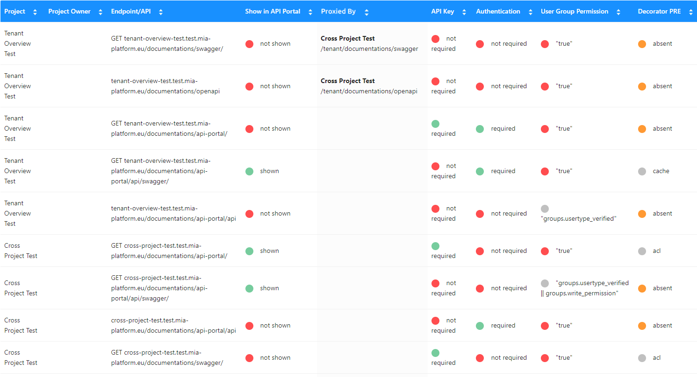
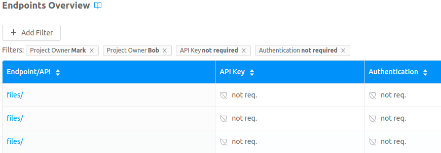

## What is the Endpoint Overview

The Endpoint Overview is a visualization tool accessible from the Company Section through the button next to company name and the utility is provided under the url `$HOSTNAME_CONSOLE/tenants/:tenantId/overview/endpoints`.  
:::caution
In the url, the terms tenants and tenantId refer to the actual companies and companyId new terms. The tenant term is deprecated and will be removed soon
:::

  

The Endpoint Overview provides the user with a graphical cross-project overview of the configuration of all the selected Company projects. The graphical overview has a particular focus on the security configuration of the Projects endpoints.  

Endpoint Overview collects data on the project configuration and creates a table presenting information on all the endpoints, where each row shows:
* *Endpoint/API*: Endpoint name.
* *Method*: Endpoint verb.
* *Project*: Project name.
* *Project owner*: Project owner name.
* *Type*: Represent the type of the endpoint.
* *Sensitivities*: If the endpoint is of type crud, shows a badge with the number of fields exposed by the crud for each sensitivity level.
* *Show in API Portal*: A label that shows if the endpoint appears in the API portal.
* *Proxied By*: A label that shows if the endpoint is proxied by another endpoint.
* *API Key*: A label that shows if the endpoint is protected by an API-key.
* *Authentication*: A label that shows if the API requires that the user is logged in to be accessed.
* *User Group Permission*: A label that shows if the endpoint is protected by a group expression and the concerning expressions.
* *Decorator PRE*: A label that shows if a PRE decorator is configured for the endpoint and the concerning decorators.
* *Description*: The endpoint description provided in the configuration section.  

An example is in the following picture.

  

Through this tool, the governing entity of the company can have a graphical overview of the global configuration and the security of all the projects and endpoints.

## Main functionalities

### Graphical features

* The **BasePath** column displays the endpoint base path and by clicking on it redirect to the endpoint configuration section.

* The **Sensitivities** column displays information about the sensitivity levels of the fields exposed by the CRUD endpoint. This cell is composed of 5 badges, each one representing a sensitivity level: 
    - Unclassified (Grey badge)
    - Public (Green badge)
    - Confidential (Blue badge)
    - Secret (Purple badge)
    - Top Secret (Red badge)

  The number on each badge represent the number of field of the corresponding level in the exposed CRUD. For example, an endpoint with the following sensitivities exposes: 11 Unclassified fields, 2 Public fields, 17 Confidential fields, 3 Secret fields and 44 Top Secret fields  
  

* The **User Group Permission** column displays the group expressions as labels, each label represents the expression string provided in the endpoint     configuration. In this case the label *"true"* means that there is any security control over the group expression and therefore the endpoint is not protected, conversely the label *"false"* means that it is not possible to access the endpoint.

    If the group expression has this icon:  it means that the rule doesn't match the `API-Key` or `Authentication` configuration specified in the security configuration of the endpoint. In particular, if we apply logic in the *User Group Permission* over the `client-type` but the API-Key is not required this symbol alerts us there might be some configuration missing, the same happens if we apply logic over the profiled user (eg user.groups) but the Authentication is not required.

* The **Decorator PRE** column specifies the type of decorators as labels.

### Sorting

If a column has the sort symbol  means that the Endpoint Overview output can be sorted corresponding features by clicking on the table header.

### Filtering

The Endpoint Overview result can be filtered by the endpoint feature using the specific `Add Filter` button. By applying filters only the Endpoints Overview's rows satisfying the chosen filters will be shown.

  

When the filters are applied they are shown as chips giving the information on the filtered data and the possibility to remove the filter through the specific `X`. In the following example, we are filtering for the endpoints that have *Mark* or *Bob* as the owner but do not require Authentication nor the API-Key. 
:::info
The filters applied over the same column follow an OR logic, which means that the filter shows all the rows that match at least one of the filters, instead the filters applied over different columns follow an AND logic which means that an endpoint must satisfy all the columns filters in order to be shown. In the following example the filter can be read like this:   
`(Owner == 'Mark' || Owner == 'Bob') && Authentication == 'not req.' && API-Key == 'not req.'`
:::

  

### Visualization

The Endpoint Overview table visualization can be modified through the specific section:

  

Here it is possible to choose the columns to hide or show in the table in order to show only the information that the user is looking for.   

