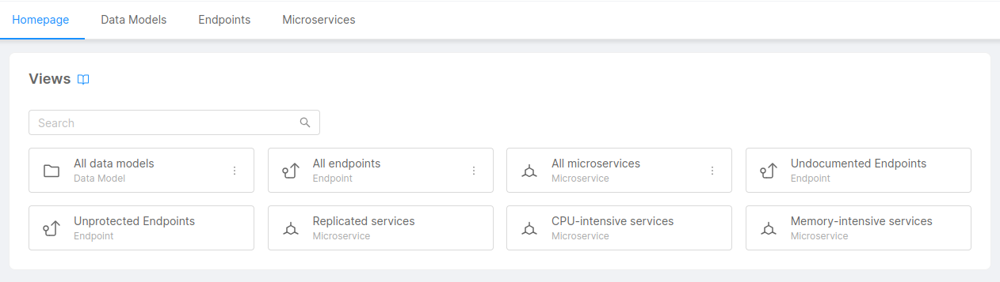
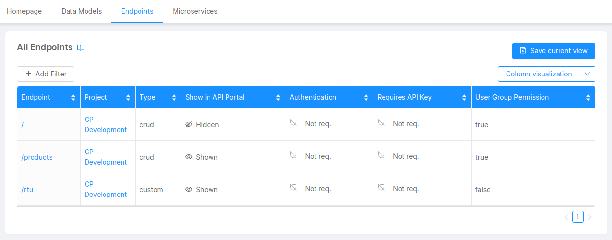
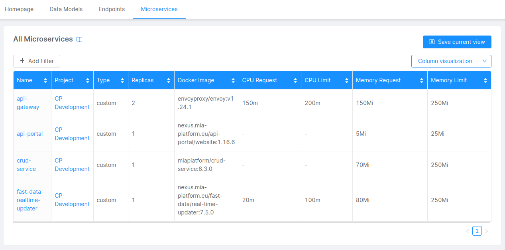
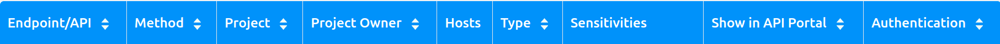
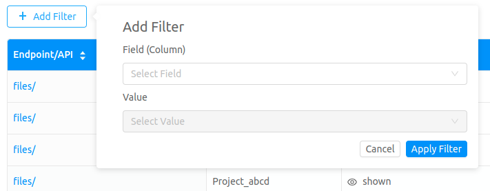
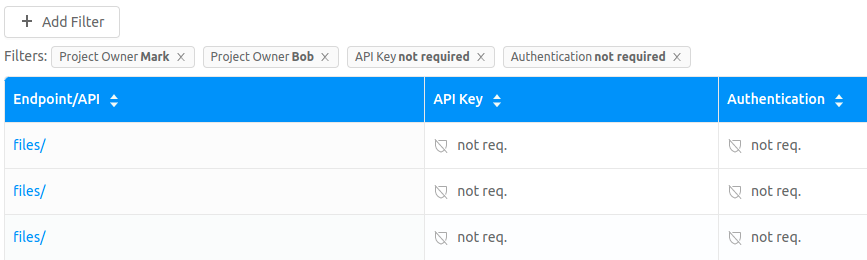
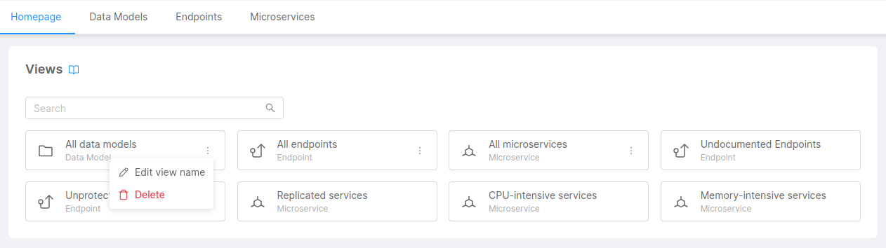
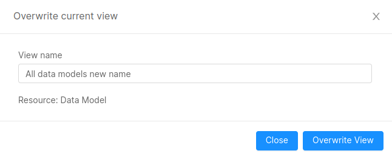

## What is the Design Overview

The Design Overview is a rich set of visualization tools accessible from the Company Overview section and whose utility is provided under the URL `$HOSTNAME_CONSOLE/tenants/:tenantId/governance/design-overview`.  
:::caution
In the URL, the terms tenants and tenantId refer to the actual companies and companyId new terms. The tenant term is deprecated and will be removed soon
:::

In the Design Overview you can aggregate Resources from all Projects across the Company into a single table, providing users with filtering and sorting capabilities. Users can easily search, sort, and filter Endpoints, Microservices, and Data Models, and save custom views for easy access and sharing.

### Homepage

The Homepage tab contains the list of resource views. They can be of two types:
* *Default Views* - A predefined set of read-only views configured at Company level. All Company users can access these views, modifications (edit/delete) are not allowed, default filters and thresholds are configured into the Design Overview backend service;
* *Public Views* - A set of user-defined editable views configured at Company level. All Company users can access these views, modifications (edit/delete) are allowed only for Project Administrator and/or Company Owner roles.

An example is in the following picture.

#### Default Views

The Design Overview provides the following Default Views out-of-the-box:
* *Undocumented Endpoints* - shows the endpoints from all Projects of a Company without any documentation; 
* *Unprotected Endpoints* - shows the public-facing endpoints from all Projects of a Company without authentication;
* *Replicated services* - shows the microservices from all Projects of a Company having more than one replica;
* *CPU-intensive services* - shows the microservices from all Projects of a Company having CPU requests greater than 250 millicores;
* *Memory-intensive services* - shows the microservices from all Projects of a Company having Memory requests greater than 250 Mi.

An example is in the following picture.

### Data Models

The Data Models Overview provides the user with a graphical cross-project overview of all the Data Models, including:
* CRUD collections;
* MongoDB Views;
* Projections;
* Single Views;

Data Models Overview collects data on the project configuration and creates a table presenting information on all the collections, where each row shows:
* *Name*: Name of the collection.
* *Project*: Project of the collection.
* *Type*: Type of the collection.
* *System of Record*: System of record of the collection (populated only for Projections).
* *Description*: Description of the collection.

An example is in the following picture.

### Endpoints

The Endpoint Overview provides the user with a graphical cross-project overview of the configuration of all the selected Company projects. The graphical overview has a particular focus on the security configuration of the Projects endpoints.  

The Endpoint Overview collects data on the project configuration and creates a table presenting information on all the endpoints, where each row shows:
* *Endpoint/API*: Endpoint name.
* *Project*: Project name.
* *Path rewrite*: Rewrite path for the endpoint.
* *Type*: Represent the type of the endpoint.
* *Show in API Portal*: A label that shows if the endpoint appears in the API portal.
* *Authentication*: A label that shows if the API requires that the user is logged in to be accessed.
* *Requires API Key*: A label that shows if the endpoint is protected by an API-key.
* *User Group Permission*: A label that shows if the endpoint is protected by a group expression and the concerning expressions.
* *Description*: The endpoint description provided in the configuration section.  

An example is in the following picture.

### Microservices

The Microservices Overview provides the user with a graphical cross-project overview of all the Microservices.

The Microservices Overview collects data on the project configuration and creates a table presenting information on all the Microservices, where each row shows:
* *Name*: Name of the Microservice.
* *Project*: Project of the Microservice.
* *Type*: Type of the Microservice.
* *Replicas*: Number of replicas of the Microservice.
* *Docker Image*: Docker image of the Microservice.
* *CPU Request*: CPU Request of the Microservice.
* *CPU Limit*: CPU Limit of the Microservice.
* *Memory Request*: Memory Request of the Microservice.
* *Memory Limit*: Memory Limit of the Microservice.
* *Log Parser*: Log Parser implementation of the Microservice.
* *Advanced Configuration*: Advanced Configuration flag of the Microservice.

An example is in the following picture.

## Main functionalities

### Security

Resources displayed in both the Default and Public Views are protected by user permissions: the user only sees Resources of the Projects he has access to.

### Sorting

If a column has the sort symbol  it means that the output can be sorted for the corresponding features by clicking on the table header.

### Filtering

All the Resources can be filtered by the filtering feature using the specific `Add Filter` button. By applying filters only the Resource's rows satisfying the chosen filters will be shown.

  

When the filters are applied, they are shown as chips giving the information on the filtered data and the possibility to remove the filter through the specific `X`. In the following example, we are filtering for the endpoints that have *Mark* or *Bob* as the owner but do not require Authentication nor the API-Key. 
:::info
The filters applied over the same column follow an OR logic, which means that the filter shows all the rows that match at least one of the filters. Instead, the filters applied over different columns follow an AND logic, which means that an endpoint must satisfy all the columns' filters in order to be shown. In the following example, the filter can be read like this:   
`(Owner == 'Mark' || Owner == 'Bob') && Authentication == 'not req.' && API-Key == 'not req.'`
:::

  

### Visualization

The Design Overview table visualization can be modified through the specific section:

  

Here it is possible to choose the columns to hide or show in the table in order to show only the information that the user is looking for.   

### Public Views

Public Views can be created/edited/deleted for all the Resource views available in the Design Overview for all the Project Administrators and/or Company Owners.

#### Saving

Public Views can be saved together with active filters and visible columns through the specific section:

Here it is possible to choose the view name that will be displayed in the Homepage section for all the users belonging to the Company.

#### Editing

Public Views can be edited from Homepage section through the specific section:

The View name can be overridden by inserting new 'View name' through the specific popup:

:::info
Editing feature is currently limited only to view name.
:::

#### Deleting

Public Views can be deleted from Homepage section through the specific section:

