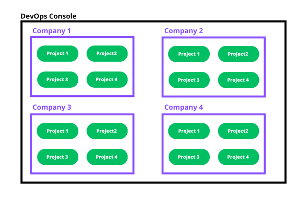

Having the ability to assign specific permissions and roles to each [Identity](/development_suite/identity-and-access-management/index.md#identity-and-access-management) that has access to the system in a detailed way is a key point in defining responsibilities within your platform ecosystem. 
The Mia-Platform Console allows for assigning specific levels of access to various system resources through a configuration system based on hierarchical levels.  
Let's see how the different levels are organized.

## Configuration Levels

Console resources are organized in a hierarchical structure on three levels:

1. **Console Level** is the root level regarding the general configuration of your entire Console. At this level you can configure resources such as Companies, Project Templates and Marketplace.

1. **Company Level** is the second hierarchical level. A Company can contain several underlying Projects, which can inherit different kinds of information from the Company without needing further configuration. At this level, License, Clusters, Providers, Users and Service Accounts can be managed. To know more about Company configuration, check out the dedicated [documentation section](/development_suite/company/create.md).

1. **Project Level** is the third level of the Console. Projects are the heart of the Console: in fact, it is at this level that developers engage in creating new features and building their own Platform.

:::info
The permissions assigned to a user at a higher hierarchical level are inherited by lower levels. For instance, a user with the `Maintainer` role at the console level will have the same role across all the companies they are assigned to and all the projects within those companies. At the individual company and project level, the permissions for that user can be expanded in a detailed manner without affecting the authorization levels at the console level. However, authorizations that exist at the console level cannot be removed at the individual company or project level.
:::

## Identity Capabilities inside Console

Identities can perform a set of predetermined actions along Console levels, in accordance with a set of permissions grouped for each specific role. A brief presentation of the default roles that can be assigned to each identity is provided here below:

- `Company Owner`: A Company Owner has the ability to manage Company users and service accounts, and has full administrative capabilities on all the Projects (and Runtime Environments) within the Company
- `Project Administrator`: A Project Administrator is able to manage identities and all other aspects of a Project, thus being able to perform any actions on all the Runtime Environments of the Project as well
- `Maintainer`: A Maintainer can edit both Project configuration and Runtime Environments
- `Developer`: A Developer can edit Project configuration and view Runtime Environments
- `Reporter`: A Reporter can view Project configuration and Runtime Environments
- `Guest`: A Guest has restricted access to data and can only view basic information for a selected subset of resources

Roles can be assigned at three levels regarding the following Console resources:

- Company
- Project
- Runtime Environments

Roles can be assigned at Company level from the IAM portal of the Company Overview section.

The following table describes the capabilities and how they are mapped on the default roles.

| Capabilities                                                           | Permissions key                                         | Guest | Reporter | Developer | Maintainer | Project Administrator | Company Owner |
| ---------------------------------------------------------------------- | ------------------------------------------------------- | ----- | -------- | --------- | ---------- | --------------------- | ------------- |
| View Company basic information                                         | `console.company.view`                                  | ✅    | ✅       | ✅        | ✅         | ✅                    | ✅            |
| Edit Company information                                               | `console.company.details.update`                        |       |          |           |            |                       | ✅            |
| Create Projects inside this Company                                    | `console.company.project.create`                        |       |          |           |            |                       | ✅            |
| View all Projects of this Company                                      | `console.company.project.view`                          |       | ✅       | ✅        | ✅         | ✅                    | ✅            |
| View all Environments in all Projects of this Company                  | `console.company.project.environment.view`              |       | ✅       | ✅        | ✅         | ✅                    | ✅            |
| Create a service repository in all Projects of this Company            | `console.company.project.service.repository.create`     |       |          | ✅        | ✅         | ✅                    | ✅            |
| Commit changes on all Project configurations of this Company           | `console.company.project.configuration.update`          |       |          | ✅        | ✅         | ✅                    | ✅            |
| Manage secreted environment variables for all Projects of this Company | `console.company.project.secreted_variables.manage`     |       |          |           |            | ✅                    | ✅            |
| Trigger deploy on all Environments of all Projects of this Company     |  `console.company.project.environment.deploy.trigger`   |       |          |           | ✅         | ✅                    | ✅            |
| Restart Pods on all Environments of all Projects of this Company       | `console.company.project.environment.k8s.pod.delete`    |       |          |           | ✅         | ✅                    | ✅            |
| Delete Jobs on all Environments of all Projects of this Company        | `console.company.project.environment.k8s.job.delete`    |       |          |           | ✅         | ✅                    | ✅            |
| Create Jobs on all Environments of all Projects of this Company        | `console.company.project.environment.k8s.job.create`    |       |          |           | ✅         | ✅                    | ✅            |
| Manage dashboards on all Projects of this Company                      |  `console.company.project.environment.dashboard.manage` |       |          |           |            | ✅                    | ✅            |
| Manage Identities of this Company                                      | `console.company.users.manage`                          |       |          |           |            |                       | ✅            |
| Edit Project information of all Projects of this Company               | `console.company.project.details.update`                |       |          |           |            | ✅                    | ✅            |
| Manage Identities of all Projects of this Company                      | `console.company.project.users.manage`                  |       |          |           |            | ✅                    |               |
| Delete this Company                                                    | `console.company.delete`                                |       |          |           |            |                       | ✅            |
| Delete all Projects of this Company                                    | `console.company.project.delete`                        |       |          |           |            | ✅                    | ✅            |
| Manage Providers of this Company                                       | `console.company.providers.manage`                      |       |          |           |            |                       | ✅            |
| View Company Providers information                                     | `console.company.providers.view`                        | ✅    | ✅       | ✅        | ✅         | ✅                    | ✅            |
| Manage Clusters for this Company                                       | `console.company.cluster.manage`                        |       |          |           |            |                       | ✅            |
| View Company Clusters information                                      | `console.company.cluster.view`                          | ✅    | ✅       | ✅        | ✅         | ✅                    | ✅            |
| Manage Company Project Templates                                       | `console.company.templates.manage`                      |       |          |           |            |                       | ✅            |
| Manage Company Views in Design Overview                                | `console.company.configuration.views.manage`            |       |          |           |            | ✅                    | ✅            |
| View Marketplace resources owned exclusively by the Company            | `marketplace.company.resources.view`                   | ✅     | ✅       | ✅        | ✅         | ✅                    | ✅            |
| Manage Marketplace resources owned exclusively by the Company          | `marketplace.company.resources.manage`                 |        |          |           |            | ✅                    | ✅            |
| Delete the configuration versions of all the Projects of this Company          | `console.company.project.configuration.version.delete`                 |        |          |           |            | ✅                    | ✅            |

User roles are manageable from CMS by **Console Super Users**, which are particular Console Administrators having access to the Console CMS and thus being able to manage the entire Console, including Companies, Projects and the Marketplace.

:::info
Please note that, inside Project IAM portal, only those identities on which a Company role has previously been assigned are shown.  
For each of them, therefore, the permissions inherited from the Company role assignment at the Company level will be visible. In this way, it will be possible to identify which additional permissions among those mentioned in the following table can be assigned at Project and Runtime Environments levels.
:::

| Capabilities                                      | Permissions key                                | Guest | Reporter | Developer | Maintainer | Project Administrator | Company Owner |
| ------------------------------------------------- | ---------------------------------------------- | ----- | -------- | --------- | ---------- | --------------------- | ------------- |
| View Project basic information                    | `console.project.view`                         | ✅    | ✅       | ✅        | ✅         | ✅                    |               |
| View all Environments of this Project             | `console.project.environment.view`             |       | ✅       | ✅        | ✅         | ✅                    |               |
| View this Environment of the Project              | `console.environment.view`                     |       | ✅       |           | ✅         |                       |               |
| Create a service repository for this Project      | `console.project.service.repository.create`    |       |          | ✅        | ✅         | ✅                    |               |
| Commit changes on Project configuration           | `console.project.configuration.update`         |       |          | ✅        | ✅         | ✅                    |               |
| Edit Project information                          | `console.project.details.update`               |       |          |           |            | ✅                    |               |
| Delete the configuration versions of a Project    | `console.project.configuration.version.delete` |       |          |           |            | ✅                    |               |
| Manage secreted environment variables             | `console.project.secreted_variables.manage`    |       |          |           |            | ✅                    |               |
| Trigger deploy on any Environment of this Project | `console.project.environment.deploy.trigger`   |       |          |           | ✅         | ✅                    |               |
| Trigger deploy on this specific Environment       | `console.environment.deploy.trigger`           |       |          |           | ✅         |                       |               |
| Restart pods on any Project Environment           | `console.project.environment.k8s.pod.delete`   |       |          |           | ✅         | ✅                    |               |
| Delete Jobs on any Project Environment            | `console.project.environment.k8s.job.delete`   |       |          |           | ✅         | ✅                    |               |
| Create Jobs on any Project Environment            | `console.project.environment.k8s.job.create`   |       |          |           | ✅         | ✅                    |               |
| Delete Jobs on this specific Environment          | `console.environment.k8s.job.delete`           |       |          |           | ✅         |                       |               |
| Create Jobs on this specific Environment          | `console.environment.k8s.job.create`           |       |          |           | ✅         |                       |               |
| Restart pods on this specific Environment         | `console.environment.k8s.pod.delete`           |       |          |           | ✅         |                       |               |
| Manage dashboards on any Project Environment      | `console.project.environment.dashboard.manage` |       |          |           |            | ✅                    |               |
| Manage dashboards on this specific Environment    | `console.environment.dashboard.manage`         |       |          |           |            |                       |               |
| Manage identities for this Project                | `console.project.users.manage`                 |       |          |           |            | ✅                    |               |
| Delete a single Project                           | `console.project.delete`                       |       |          |           |            |                       |               |

### Console Root level permissions

User roles and permissions are manageable from CMS by **Console Super Users**, which are particular Console Administrators having access to the Console CMS and thus being able to perform actions at Console root level.

:::info
Note that Console Super User is NOT included as a default role. Consequently, it can not be assigned from the IAM portal, as it performs actions exclusively at Console root level.
:::

The following table describes the manageable privileges at Console root level that are granted to Console Administrators:

| Capabilities                                    | Permissions key                       |
| ----------------------------------------------- | ------------------------------------- |
| Create a new Company                            | `console.root.company.create`         |
| Delete any Company                              | `console.root.company.delete`         |
| Create a new Project                            | `console.root.project.create`         |
| Edit any Project                                | `console.root.project.details.update` |
| Delete any Project                              | `console.root.project delete`         |
| View all Console resources                      | `console.root.view`                   |
| Manage identity roles, Groups and Bindings      | `console.root.user.bind`              |
| Create and delete any user                      | `console.root.user.manage`            |
| Create and delete root service account          | `console.root.serviceaccount.manage`  |
| Manage all private and public Project Templates | `console.root.templates.manage`       |
| Manage available features                       | `console.root.features.manage`        |
| Manage all Marketplace resources                | `marketplace.root.manage`             |

### Role binding example

Suppose you have a feature team composed by: 1 _Project Manager_ and 1 _Technical Leader_, 1 _Senior Developer_ and 2 _Junior Developers_ and 2 _Designers_.
This team works on a single Project with two environments:

1.  Production, on which only the _Project Manager_, the _Technical Leader_ and _Senior Developer_ can perform actions, and
1.  Development on which the 2 _Junior Developers_ can perform actions, too.

What you might want could be a similar role Binding organization:

- The _Project Manager_ and the _Technical Leader_ may want to have full access to the Project so they can be assigned the _Project Administrator_ role on the Project resource
- The _Designers_ should be able to access the Project but they cannot perform any editing action on it, so they can be assigned the _Reporter_ role on the Project resource
- The _Senior Developers_ can be assigned the _Maintainer_ role on the Project
- The _Junior Developers_ can be assigned the _Developer_ role on the Project resource and then can be assigned the _Maintainer_ role only on the Development environment

#### Assigning roles on resources

When you wish to assign a role on a specific resource what you have to do is create a binding with a properly configured resource object.

:::info
For more information regarding how a binding is defined and how to configure the resources check out the [following documentation page](/development_suite/api-console/api-design/authorization.md#rbac-storage).
:::
