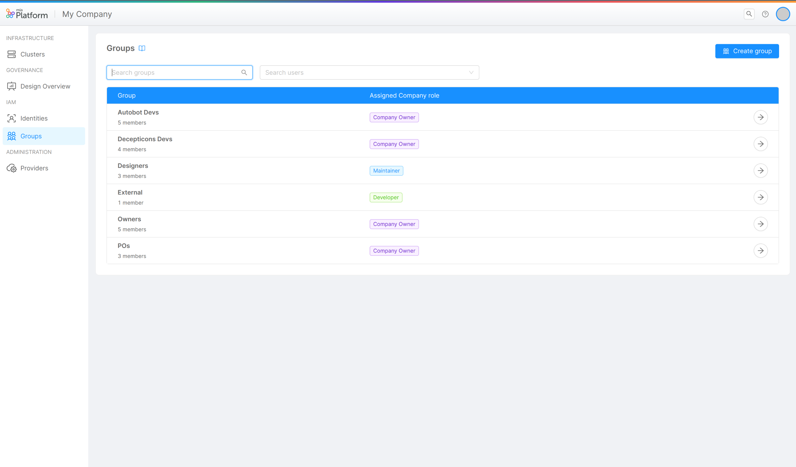
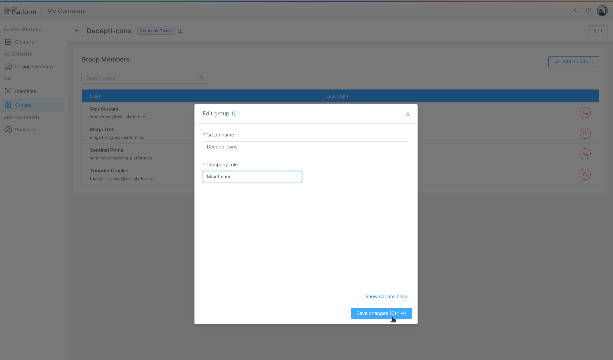
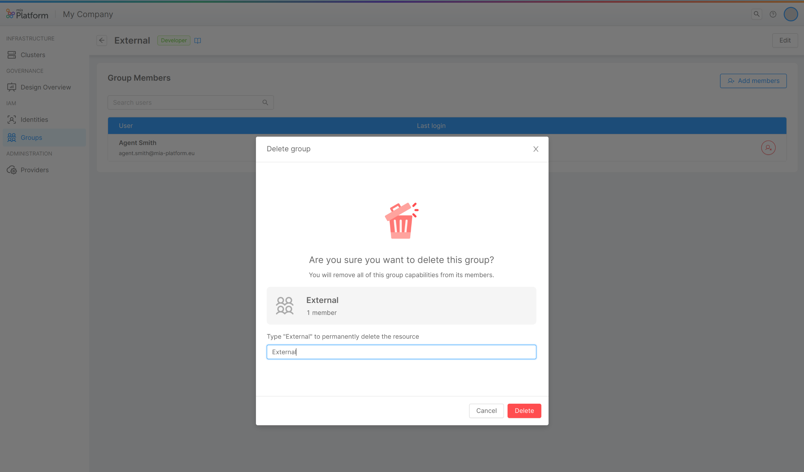

Mia-Platform Console permette di assegnare e gestire privilegi di autorizzazione a gruppi di utenti presenti o meno a livello di Company. In questo modo risulta più agevole gestire un grande numero di utenti a cui assegnare gli stessi privilegi (es. work team).

<!-- 
Mia-Platform Console enables certain Users to control other identities ability to access resources. This grants them ownership over the decision-making process regarding which resources are accessible and at what level of authorization. -->

I gruppi, cosi come le Identities, possono avere dei ruoli sulle seguenti risorse: 

* Company
* Project
* Runtime Environment

:::note
To find out more about Roles check out the available [Capabilities](/development_suite/identity-and-access-management/console-levels-and-permission-management.md#users-capabilities-inside-console) that can be assigned to an identity.
:::

<!-- In particular, a User can be assigned a Role on the following resources:

* Company
* Project
* Runtime Environment -->

<!-- Only Users with enough privileges will be granted access to the Identities administration portal and will be able to change identity Roles. -->

:::caution Important: Git provider vs Console permissions
The management of Roles and permissions aims at regulating access on resources solely at Console level.  
Roles and permissions of Users on the same resources at the Git provider level are not managed in this Console area; thus, Roles at Git-level must be verified in order to prevent possible discrepancies that may appear between permissions the User has at the Console-level and those the User has at the Git repository level.

For example, it could happen that a User who does not even have permissions to access a Company from the Console is, however, in a Git group with an assigned Role that gives them Git-level permissions on these Company resources!

Therefore, by giving permissions on resources to Users, it is strongly suggested a double check on both Console-level and Git-level permissions.
:::

## Managing Company Groups
<!-- A User with enough administrative permission on a specific Company will be able to view the existing identities in the Company, add new ones and change the existing identities' Roles. -->

Ogni Company ha i propri gruppi, che possono essere creati e gestiti dal menu Groups solo da un Company Owner che sarà anche il solo ad assegnare o modificare il suo ruolo sulla Company. I ruoli sulle altre risorse invece possono essere gestite nel menu delle Identities cosi come se fosse una semplice identità. 

<!-- TODO:  -->

:::caution
Please note that some permissions defined by the Company Role may be inherited on the Projects and Runtime Environment owned by the Company itself.  
Always pay attention when assigning Roles in order to avoid providing undesired access to resources!
:::

### Adding a new group

<!-- The Company Owner can add a new User by pressing the *Add user* button. The User invitation process will require the invited User email to be provided. -->

Si può creare un gruppo utilizzando il bottone *Add User* e nel processo di creazione si possono definire il suo nome, il suo ruolo sulla Company e tutti i suoi membri. I membri aggiunti al gruppo possono anche non appartenere alla Company (cioè non hanno mai avuto un ruolo come Identities sulla Company in questione) e in tal caso viene richiesta la loro email.

<!-- 

  

TODO: 

  

 -->

The provided email will be searched throughout existing users on the Platform and if a match is found the user will be invited to the Company with the defined Role.

:::info
If the user does not exist in the Platform, please open a Service Request for it to be created.
:::

### Editing a group

Per modificare un gruppo, si può entrare nel suo dettaglio dalla tabella gruppi e utilizzare il bottone di *Edit*. Dal modale sarà possibile scegliere un nuovo nome del gruppo e si può modificare il suo ruolo sulla company.

<!-- A User Role in the Company can be modified: to do so, simply click on the edit button for the desired User row and select the new Role. -->

<!-- 

  

TODO: 

  

 -->

### Removing a group

Un gruppo può essere eliminato nella sua pagina di dettaglio cliccando sul bottone di *Delete* in fondo alla pagina e confermando l'azione.

<!-- A User can be removed from the Company by clicking the trash icon on the table and confirming the action. -->

<!-- 

  

TODO: 

  

 -->

<!-- :::warning
Removing a User from the Company will kick the User out of every Project and Runtime Environment. While the User may be invited back in the Company, all their previously existing Roles will be lost and cannot be recovered, meaning they must be reassigned from scratch.
::: -->
