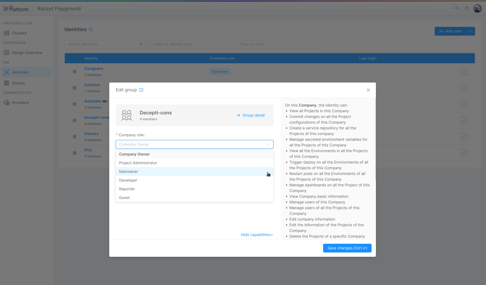

Mia-Platform Console allows you to assign and manage authorization privileges to groups of users at Company level. Groups aim to simplify the management of a large number of users who have to be assigned the same privileges (e.g. a work team).

Groups are considered a type of [identity](/development_suite/identity-and-access-management/overview.md#identity-and-access-management) whereby users with enough permissions can assign and manage roles on the following resources:

* Company
* Project
* Runtime Environment

:::note
To find out more about roles management, check out the available [capabilities](/development_suite/identity-and-access-management/console-levels-and-permission-management.md#users-capabilities-inside-console) that can be assigned to an identity.
:::

## Managing Company Groups

Each Company can have its own groups. These types of identities are configurable and manageable exclusively by a Company Owner from the dedicated Groups section within the Company Overview. 

At Company level, for each group, it is possible to manage:

* Name: the name assigned to the group
* Role: the group Company role
* Members: adding and/or removing users from the group

Existing groups can also be found within the Identities portal at both Company and Project level, where it is possible to manage roles assigned to them as well as for the other identity types. 

<!-- TODO:  -->

:::caution
Please note that some permissions granted by the assigned Company role may be inherited on the Projects and Runtime Environments of the Company itself.  
Always pay attention when assigning roles in order to avoid providing undesired access to resources!
You can check which capabilities are granted according to the chosen role by visiting the [Console Levels and Permission Management](/development_suite/identity-and-access-management/console-levels-and-permission-management.md#users-capabilities-inside-console) documentation page.
:::

### Creating a Group

The Company Owner can start the group creation process by pressing the *Create group* button inside the Groups section. In the creation process it is required to define both the name and Company role of the group. It is also possible to optionally add members to the group.

:::info
During the creation process, the group can be also created without members added to it. This action can be performed even after the group creation.
:::

<!-- 

  

TODO: 

  

 -->

It is possible to add to a group both users who already have access to the Company and new users who do not have access to the Company (but which already exist on the Platform). For the latter, once inserted their email address, they will receive an invitation to join that group of the Company.  As long as they are part of at least one group of a Company, they can have access to the resources of that Company.

The provided emails will be searched throughout existing users on the Platform and, if a match is found, the user will be invited to the group with the defined tole of that specific group.

:::info
If the user does not exist in the Platform, please open a Service Request to invite it to register in the Platform.
:::

### Editing a Group

After the creation of a group, it is possible to enter its detail page.
Once entered, a Company Owner can perform the following actions:

* Change group name
* Edit group Company role
* Add new members to the group
* Remove members from the group

:::info
In the case that a user has access to the Company solely from its membership of that group, the removal from that group will result in loss of access to the Company for that user.  

In the case that a user has access to more Company Groups, or has a specific individual Company role assigned, the removal from that Group will NOT result in the loss of access to the Company for that user; for this reason, it is necessary to pay close attention to what privileges are still left to that user on the Company resources. 
:::

<!-- 

  

TODO: 

  

 -->

### Managing group Company role

Groups are shown into the [Identities portal](/development_suite/identity-and-access-management/overview.md#identities-portal) inside the Company Overview.
As a result, the Company role of a group can be modified not only from the Groups section, but also from the Identities portal: to do so, simply click on the edit button for the desired group row and select the new role.

<!-- 

  

TODO: 

  

 -->

### Managing group role at Project level

Groups which have access to a Company are shown into the [Identities portal](/development_suite/identity-and-access-management/overview.md#identities-portal) inside the Project Settings Area of a Project belonging to that specific Company.
Group role in the Project or any of the Project Runtime Environments can be modified. To do so, just open the editing dialog and select the proper role for the Project itself or for each Runtime Environment.

<!-- 

  

  

 -->

:::note
Even though the Project Identities administration portal shows all the Company identities, this does not mean that all the identities have access to the Project, as this depends on their assigned role in the Company and how the permissions are inherited.

For further information about permissions and role inheritance, check out the [Console Levels and Permission Management](/development_suite/identity-and-access-management/console-levels-and-permission-management.md) page.
:::

### Deleting a Group

A group can be deleted by accessing its detail page and clicking on the *Delete* button at the end of the page and then confirming the action.

:::caution
Group deletion may result in loss of access to the Company for those group members who are not members of at least one other Company group or who do not have a specific individual Company role assigned.   

In the case that a group member has access to the Company solely from its membership of the deleted group, the removal from that group will result in the loss of access to the Company for that user.  

In the case that a user has access to more Company groups, or has a specific individual Company role assigned, the deletion of the group will NOT result in loss of access to the Company for that user; for this reason, it is necessary to pay attention to what privileges are still left to that user on the Company resources.
:::

<!-- 

  

TODO: 

  

 -->
