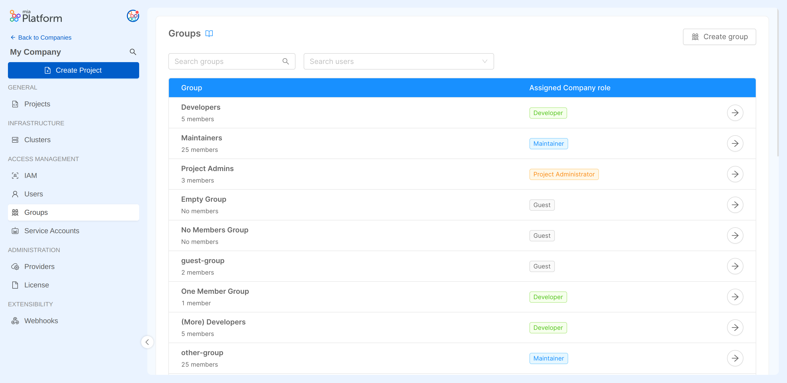
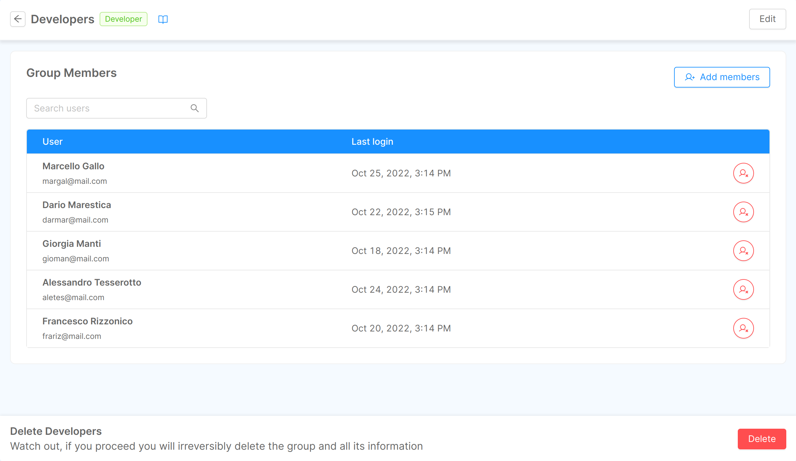

Mia-Platform Console allows you to assign and manage authorization privileges to groups of users at Company level. Groups aim to simplify the management of a large number of users who have to be assigned the same privileges (e.g. a work team).

Groups are considered a type of [identity](/development_suite/identity-and-access-management/index.md#identity-and-access-management) whereby users with enough permissions can assign and manage roles on the following resources:

* Company
* Project
* Runtime Environment

:::note
To find out more about roles management, check out the available [capabilities](/development_suite/identity-and-access-management/console-levels-and-permission-management.md#users-capabilities-inside-console) that can be assigned to an identity.
:::

## Managing Company Groups

:::info 
Each company has the flexibility to establish its own groups, allowing for distinct identities. Company Owners can configure and manage this feature specifically through the designated **Groups** section within the **Company Overview**, providing clear control over group settings.

While groups offer an efficient way to manage user access, they're not the only way to handle permissions within a company. In fact, you still have the option to individually manage user privileges, or even use a combination of both approaches. For a deeper understanding of user management, you can refer to the dedicated [documentation page](/development_suite/identity-and-access-management/manage-users.md#how-to-best-manage-your-users).
:::

At Company level, for each group, it is possible to manage:

* Name: the name assigned to the group
* Role: the group Company role
* Members: adding and/or removing users from the group

You can also locate existing groups in the IAM section, both at the Company and Project levels. In these sections, you have the ability to handle the roles assigned to these groups, similar to how you manage roles for other types of identities.

:::caution
Please be aware that certain permissions granted through the assigned Company role might be inherited on the Projects and Runtime Environments within that Company. It's important to be cautious while assigning roles to prevent unintended access to resources. You can verify the specific capabilities granted based on the chosen role by referring to the documentation page on  [Console Levels and Permission Management](/development_suite/identity-and-access-management/console-levels-and-permission-management.md#users-capabilities-inside-console).
:::

### Creating a Group

The Company Owner can initiate the group creation process by clicking the `Create group` button within the Groups section in the IAM section. During the creation process, it's necessary to specify both the name and the Company role for the group. There's also an option to optionally include members in the group.

:::info
During the creation process, the group can be also created without adding members. This action can still be performed later on, after the group has already been created, from the [group detail page](/development_suite/identity-and-access-management/manage-groups.md#editing-a-group).
:::

  

  

Both existing users within the Company and new users who haven't been granted access yet can be included in a group. For new users, they must be registered on the Platform beforehand. When a new user is added to a group, they will receive an invitation email to join the Company. Once a user belongs to at least one group within a Company, they will be able to access that Company's resources. 

:::info
If the user isn't already registered on the Platform, kindly initiate a [Service Request](https://makeitapp.atlassian.net/servicedesk/customer/portal/21/group/79/create/340) to invite them to sign up on the Platform.
:::

### Editing a Group

After a group has been created, it is possible to view its detail page.

From this page, a Company Owner can perform the following actions:

* Change group name
* Edit group Company role
* Add new members to the group
* Remove members from the group

When clicking on the *Edit* button in the section header, the edit group modal will show up, where you can change the group name and Company role:

  

  

To add new members to the group, simply click the *Add members* button to open this dialog:

  

  

To remove a member from the group, click on the delete button on the corresponding row and confirm your action:

  

  

:::caution
If a user's access to a Company is solely tied to their membership in a specific group, removing them from that group will lead to a loss of access to the Company for that user.

However, if a user has access through multiple Company Groups or holds an individual Company role, removing them from one group will NOT result in a loss of Company access. It's important to carefully consider the remaining privileges the user might still have on Company resources.
:::

:::info 
To completely revoke user access to a Company, you can take a single action from the [Users section](/development_suite/identity-and-access-management/manage-users.md#removing-a-user).
:::

### Deleting a Group

A group can be deleted by accessing its detail page, clicking on the `Delete` button at the end of the page and then confirming the action.

:::caution
Deleting a group could potentially lead to the loss of Company access for members of that group who aren't part of any other Company group or don't hold a specific individual Company role.

If a user's access to the Company is solely dependent on their membership in a group, removing them from that group or deleting the group altogether will result in them losing access to the Company.

However, if a user has access through multiple Company groups or holds a specific individual Company role, deleting a group will NOT lead to loss of Company access for that user. It's crucial to be mindful of the remaining privileges the user might have on Company resources.
:::

  

  

## Managing Group roles

All identity roles are managed from the [IAM section](/development_suite/identity-and-access-management/manage-identities.md), which is specifically dedicated to the governance of roles and accesses to the resources of the Company.  

As a result, the Company role of a group can be modified not only from the Groups section, but also from the IAM section.

### Managing Group role at Company level

To edit a group's role from the IAM section, simply click on the edit button for the desired group row and select the new role.

  

  

### Managing Group role at Project level

Groups which have access to a Company are shown in the IAM section inside the Project Overview area of a Project belonging to that specific Company.
You can change the role of the group in the Project or in any Project Runtime Environment. To do so, just open the editing dialog and select the new role of the group for the Project itself and/or for Project Runtime Environments.

  

  

:::note
While the Project IAM section displays all the identities from the Company, it's important to note that not all these identities necessarily have access to the Projects. Access depends on the roles assigned to them within the Company and how permissions are inherited.

For further information about permissions and role inheritance, check out the [Console Levels and Permission Management](/development_suite/identity-and-access-management/console-levels-and-permission-management.md) page.
:::
