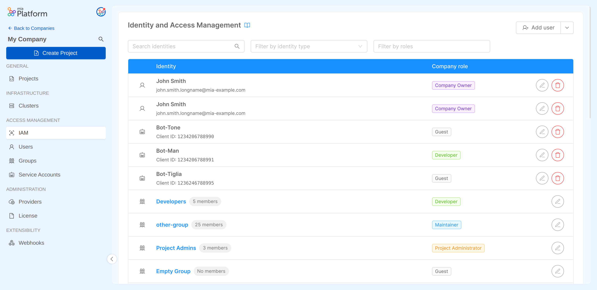
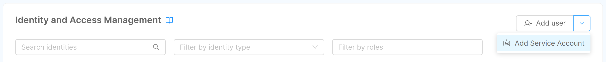
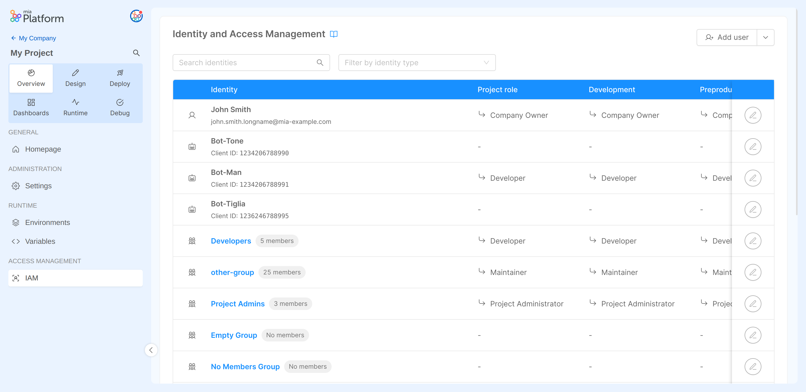

Mia-Platform Console enables certain users to manage the privileges of other identities, which can be other users, but also groups and service accounts.  
Granting accesses and permissions to Company resources can be performed through the **IAM (Identity and Access Management) section**, which allows role assignment on the following Console resources:

* Company
* Project
* Runtime Environment

Users with enough administrative permission can manage roles and permissions given to users, service accounts and groups and perform actions on them at both Company and Project levels. This grants them ownership over the decision-making process regarding which resources are accessible and at what level of authorization.

:::info
To find out more about roles check out the available [capabilities](/development_suite/identity-and-access-management/console-levels-and-permission-management.md#users-capabilities-inside-console) that can be assigned to an [identity](/development_suite/identity-and-access-management/index.md#identity-and-access-management).
:::

## Managing Company Identities

At Company level, inside the Company Overview, a Company Owner has visibility of the Access Management section. In particular, from the **IAM portal**, a Company Owner can manage all identity permissions and regulate their access to the resources of the Company.

:::caution
Please note that some permissions defined by the Company role may be inherited on the Projects and Runtime Environment owned by the Company itself.  
Always pay attention when assigning roles in order to avoid providing undesired access to resources!
:::

### Editing Identity roles at Company level

In the following paragraphs, we will describe how to manage identity roles that grant access privileges to Company resources.

#### User role management

The IAM section allows user account management through individual role assignment. This means that the users with an assigned Company role have been directly granted access to the Company.

A user role in the Company can be modified: to do so, simply click on the edit button for the desired user row and select the new role.

  

  

If you want to discover more about users, [go to the users documentation](/development_suite/identity-and-access-management/manage-users.md#managing-company-users).  

#### Group role management

Alternatively, you may consider to manage user permissions through groups. Groups facilitate the governance of a large number of users who need to be granted the same set of privileges (e.g. a work team).

A group role in the Company can be modified: to do so, simply click on the edit button for the desired group row and select the new role.

  

  

If you want to discover more about groups, [go to the groups documentation](/development_suite/identity-and-access-management/manage-groups.md#managing-company-groups).  

:::info  
If you want to find out how to best manage your users according to your business needs, you can have a look at these [use cases](/development_suite/identity-and-access-management/manage-users.md#how-to-best-manage-your-users) where we discuss both individual and group access management scenarios.  
:::

#### Service account role management

The IAM section is also designed to manage service account roles at Company level. In order to update the role of an existing service account, click on the edit button on the corresponding row and select the new role.

  

  

### Adding a new Identity at Company level

From the IAM portal, both user accounts and service accounts can be added to the Company.  

:::note
Even though this portal is intended to manage identity roles, this is a useful shortcut for Company Owners to quickly add new users or service accounts to their Company without having to navigate to the respective portals.
:::

#### Adding a user

A Company Owner can add a new user by pressing the *Add user* button. The user invitation process will require the invited user email to be provided.

  

  

The provided email will be searched throughout existing users and, if a match is found, the user will be invited to the Company with the specified role.

:::info
If the user does not exist in the Platform, please open a Service Request for it to be created.
:::

#### Adding a service account

It is also possible to add new service accounts by selecting the *Add Service Account* option in the *Add user* dropdown. The creation process will require the name, role and desired authentication method of the service account.

To learn more details about how to add a service account to your Company, visit the [Service accounts management](/development_suite/identity-and-access-management/manage-service-accounts.md#adding-a-service-account) page.

### Removing access to the Company

The IAM section can also be used to remove user and service account access from a Company.

#### Removing a user

Removing a user from the IAM table results in removing the role assigned to that user.
Without permissions granted, the user loses access to the Company, **with the exception** of when that user also belongs to at least one [Company group](/development_suite/identity-and-access-management/manage-groups.md).  
In that specific case, the user does not lose access to the Company, and their permissions on it are defined solely by the privileges given to the group/groups to which the user belongs.

  

  

:::warning
Removing a user from the IAM portal will remove permissions specifically assigned to that user on every Project and Runtime Environment of the Company.  
While the user may be invited back in the Company, all their previously existing roles - on the contrary - will be lost and cannot be recovered, meaning they must be reassigned from scratch.
:::

#### Removing a service account

From the IAM portal it is also possible to remove service accounts from the Company. In this case, the service account is permanently deleted from the Company, so you will need to create a brand new one if you need it again.

  

  

## Managing Identity roles at Project and Environment levels

A user with enough administrative permission on a specific Project will be able to view all the existing identities in the Company and assign them the desired role on the specific Project (and, optionally, on each existing Runtime Environment).

:::note
Even though the Project IAM portal shows all the Company identities, this does not mean that all the identities have access to the Project, as this depends on their assigned role in the Company and how the permissions are inherited.

For further information about permissions and role inheritance, check out the [Console Levels and Permission Management](/development_suite/identity-and-access-management/console-levels-and-permission-management.md) page.
:::

### Editing Identity roles at Project level

An identity role in the Project or any of the Project Runtime Environments can be modified. To do so, just open the editing dialog and select the proper role for the Project itself or for each Runtime Environment.

For users:  

  

  

For service accounts:

  

  

For groups:  

  

  

### Adding a new Identity at Project level

Users and service accounts can be added to a Company with specific Project and Environment roles from the Project Overview area.

:::note
This is a useful shortcut for Company Owners that want to directly add users and service accounts to their Company with specific permissions on a particular Project, without having to navigate to the respective portals.
:::

#### Adding a user

The Company Owner can add a new user to a Company by pressing the *Add user* button in the IAM portal inside the Project Overview area. Here, the user can be assigned a Company role and additional roles on the specific Project and its Runtime Environments. The user invitation process will also require the invited user email to be provided.

  

  

The provided email will be searched throughout existing users and, if a match is found, the user will be invited to the Company with the defined roles.

:::info
If the user does not exist in the Platform, please open a Service Request.
:::

#### Adding a service account

The Company Owner can add a new service account by clicking on the *Add Service Account* option inside the *Add User* dropdown, on the top-right corner of the IAM portal inside the Project Overview area. Here, the service account can be assigned a Company Role and additional Roles on the specific Project and its Runtime Environments. 

The service account invitation process will also require an authentication method, as specified in the [Adding a new Service Account](/development_suite/identity-and-access-management/manage-service-accounts.md#adding-a-new-service-account) paragraph.

:::note
New service accounts are always instantiated at Company level: you can create a service account from the Project Overview area, but it will still be shared with the whole Company.
:::

With the Client Secret Basic method: 

  

  

With the Private Key JWT method: 

  

  

