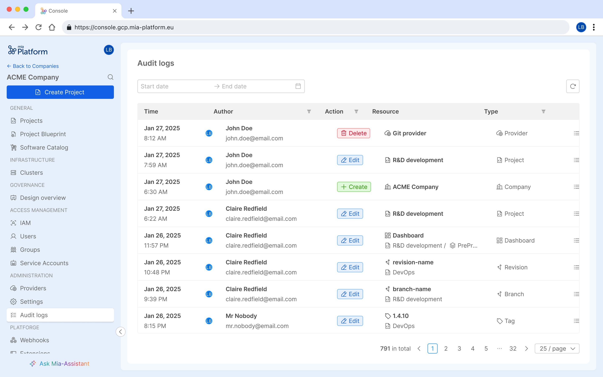
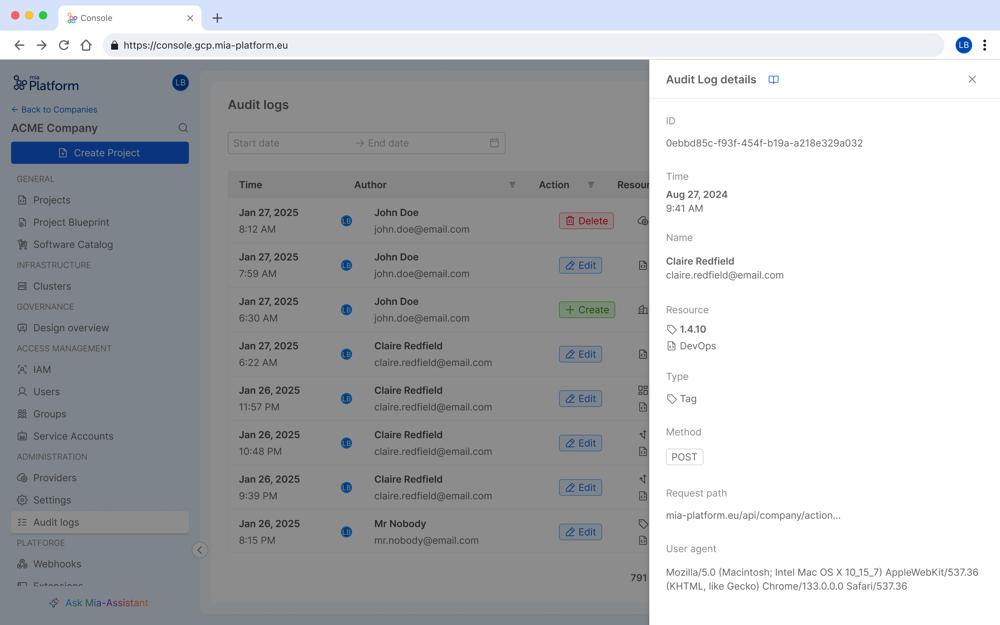

The **Mia-Platform Console** features a dedicated **Audit Log** section, enabling users with the necessary administrative permissions to track actions performed on resources within the company.  

This feature is designed to ensure **transparency** and **accountability** in the use of the Mia-Platform Console.

## How Audit Logs work

The actions are tracked using **Rönd** that intercepts all the API calls, extracts the useful informations and stores them in log records.
For this reason, the Audit Log system needs that Rond is enabled to work (see
[Enable Rönd](../../console/tutorials/protect-your-endpoints-with-policies.mdx#enable-rönd) for more details)

## Audit Logs section

The **Audit Logs** feature is available at the **Company** level within the **Administration** section of the Console.
It is accessible only to users with the **Company Owner** role and provides a comprehensive overview of recorded identity-related actions for easy monitoring.  

Audit logs are displayed in a structured table format, offering the following details for each entry:  

- **Date and time** of the action  
- **Author** of the action (*User* or *Service Account* that initiated the action)  
- **Operation performed** (*Creation*, *Edit*, or *Deletion*)  
- **Target resource** and its **Scope**  
- **Type** of the target resource  

Additionally, you can view the details of a specific log by clicking the button at the end of each table row. This allows you to access more in-depth information about the logs that interest you most.

### Filtering audit logs

The **Audit Logs** section offers advanced filtering capabilities to streamline data analysis. Users can filter logs by:  

- **Date and time** – Set a start date, end date, or a custom date range.  
- **Author** – Filter by a specific *Identity* or *Identity type*.  
- **Target resource type** – Narrow results based on the type of resource affected.  

## Security Concerns

The logs include information about the identity that performed the action, a time reference of when the action occurred, the type of action, and the resources involved. Access to audit logs data within the Console is restricted to users with the "Company Owner" role, who can view an aggregated overview of logged events. The raw log data is stored in a dedicated MongoDB database and is only accessible to administrators managing the Console installation. This ensures that log information is protected from unauthorized access while still enabling Companies to maintain oversight of key activities.

## Data Retention Period

## Audit Logs for On-Premise Installations
