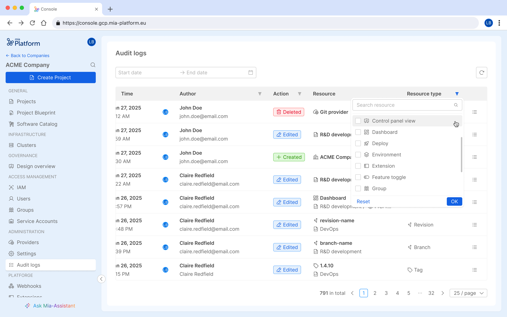

The **Mia-Platform Console** features a dedicated **Audit Log** section, enabling users with the necessary administrative permissions to monitor actions that are made within the Company.  

This feature is designed to ensure **transparency** and **accountability** in the use of the Mia-Platform Console.

## Audit Logs section

The **Audit Logs** feature is available at the **Company level** within the **Administration** section of the Console.
Accessible exclusively to users with the **Company Owner** role, it provides a comprehensive overview of the actions performed by the *Identities* (*Users* and *Service Accounts*) on the Company's resources.

Audit logs are displayed in a structured table format, offering the following details for each entry:  

- **Date and time** of the action  
- **Author** of the action (*Identity* that initiated the action)  
- **Operation performed** (*Creation*, *Edit*, or *Deletion*)  
- **Target resource** and its **Scope**  
- **Target Resource type**

Additionally, you can view the **details of a specific log** by clicking the button at the end of each table row. This allows you to access more in-depth information about the logs that interest you most.

### Filtering audit logs

The **Audit Logs** section provides advanced filtering options for more precise log analysis. Users can filter logs by:

- **Date and time** – Set a start date, end date, or a custom date range.  
- **Author** – Filter by a specific *Identity* or *Identity type*.
- **Operation performed** - Search for logs based on *Creation*, *Edit*, or *Deletion* actions.
- **Target resource type** – Narrow results based on the type of resource affected.  

:::info
If you are using Mia-Platform PaaS, the log retention period is set to six months.
:::
