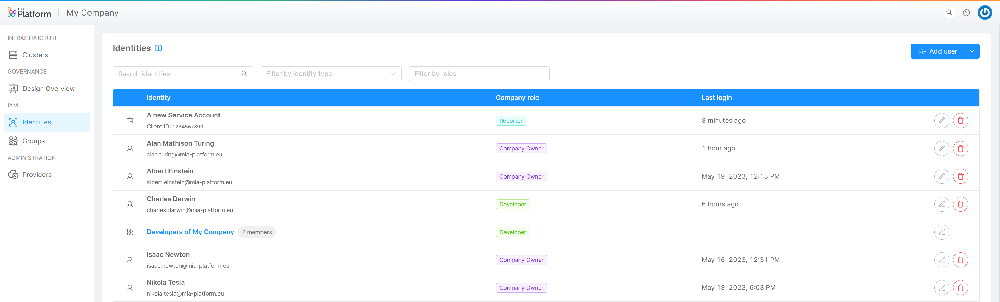
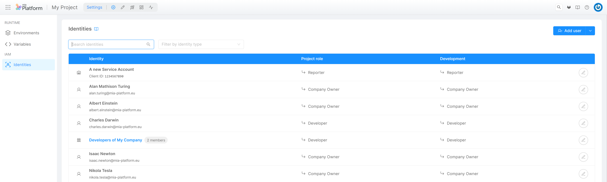

# Identity and Access Management

The Console allows access to Company resources with specific authorization levels to three types of identities:
- User: an actual individual whose account is configured for human-to-machine communication. Find out how to manage users in the [User Management](/development_suite/identity-and-access-management/user-management.md) page. 
- Service Account: a non-human client which is used for automated processes and machine-to-machine communication. Learn all about service accounts in the [Service Account Management](/development_suite/identity-and-access-management/service-account-management.md) page. 
- Group: a group of users who are assigned the same privileges on a set of resources. Learn all about groups in the [Groups Management](/development_suite/identity-and-access-management/group-management.md) page. 

The Console is based on hierarchical resources: assigning specific roles and permissions to the above mentioned identity types is important for defining responsibilities and privileges within your Companies and Projects. Discover more about it in the [Console Levels and Permission Management](/development_suite/identity-and-access-management/console-levels-and-permission-management.md) documentation.

## Identities Portal

Users with enough administrative permission can manage roles and permissions given to users, service accounts and groups and perform actions on them at both Company and Project levels. This grants them ownership over the decision-making process regarding which resources are accessible and at what level of authorization.

Here is an example of the Identities portal of a Company, which can be found in the IAM (Identity and Access Management) section from the Company Overview, wherein it is possible to manage the role assigned at Company level:  

In order to manage privileges at Project level, the Identities table is shown even into Project Settings Area, wherein it is possible to manage roles assigned to the specific Project and its Environments.

:::caution Important: Git provider vs Console permissions
The management of roles and permissions aims at regulating access to resources exclusively at the Console level.  
Roles and permissions on the same resources at the Git provider level are not managed in this Console Area; thus, roles at Git-level must be verified in order to prevent possible discrepancies that may appear between user permissions at the Consolelevel and those the user has at the Git-level.

For example, it could happen that a user who does not even have permissions to access a Company from the Console is, however, in a Git group with an assigned role that gives them Git-level permissions on those Company resources!

Therefore, by giving permissions on resources to users, it is strongly suggested a double check on both Console-level and Git-level permissions.
:::