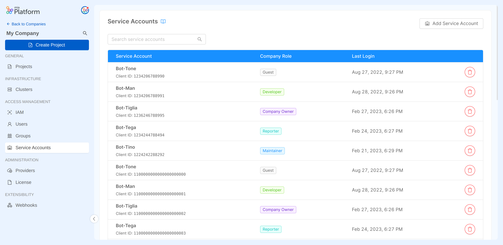

# Identity and Access Management

The Console allows access to Company resources with specific authorization levels to three types of identities:
- **User**: an actual individual whose account is configured for human-to-machine communication. Find out how to manage users in the [User Management](/development_suite/identity-and-access-management/manage-users.md) page. 
- **Service Account**: a non-human client which is used for automated processes and machine-to-machine communication. Learn all about service accounts in the [Service Account Management](/development_suite/identity-and-access-management/manage-service-accounts.md) page. 
- **Group**: a group of users who are assigned the same privileges on a set of resources. Learn all about groups in the [Groups Management](/development_suite/identity-and-access-management/manage-groups.md) page. 

The Console is based on hierarchical resources: assigning specific roles and permissions to the above mentioned identity types is important for defining responsibilities and privileges within your Companies and Projects. Discover more about it in the [Console Levels and Permission Management](/development_suite/identity-and-access-management/console-levels-and-permission-management.md) documentation.

:::caution Important: Git provider vs Console permissions
The management of roles and permissions aims at regulating access to resources exclusively at the Console level.  
Roles and permissions on the same resources at the Git provider level are not managed in the IAM Console Area; thus, roles at Git-level must be verified in order to prevent possible discrepancies that may appear between user permissions at the Console level and those the user has at the Git-level.

For example, it could happen that a user who does not even have permissions to access a Company from the Console is, however, in a Git group with an assigned role that gives them Git-level permissions on those Company resources!

Therefore, by giving permissions on resources to users, it is strongly suggested a double check on both Console-level and Git-level permissions.
:::

## Identities Portal

The **Identities** page in the IAM section is designed to help you manage all kinds of identities inside your Company. The purpose of this page is to provide a **centralized role management system**: here, you will be able to view all users, groups and service accounts inside your Company and edit their permissions. 

This page also provides a useful shortcut for Company Owners to quickly add new users and service accounts to the Company.

Find out more about managing your Company identities in the [Identities Management](/development_suite/identity-and-access-management/manage-identities.md) page. 

## Managing Users, Groups and Service Accounts

Besides the Identities section, there are three other specific management portals, one for each identity type: these pages provide specific governance tools based on the nature of the identity, be it a user, a group or a service account. From each portal you will be able to add and delete those identities, and to perform different actions based on the characteristics of each type of identity.

The **Users** section is designed to view all user accounts of the Company, providing a way to add new ones or to completely remove access to the Company for existing ones.

The **Groups** section displays all the groups of the Company with the assigned role and number of members, and allows you to create new groups. Each existing group is associated with a detail page where:
- members can be viewed, added and removed
- the group title and role can be modified
- the group can be deleted

The **Service Accounts** section shows all the service accounts of the Company, allowing the user to create new ones or permanently delete existing ones

