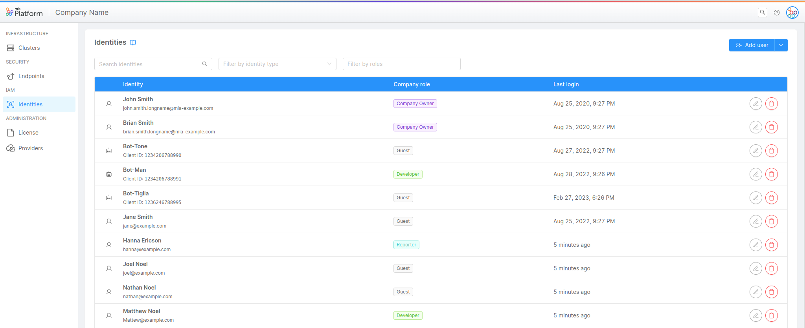
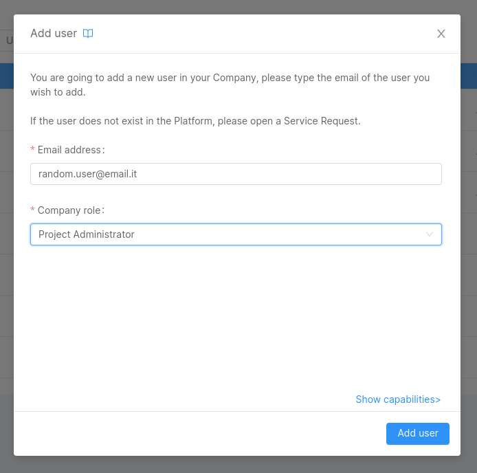
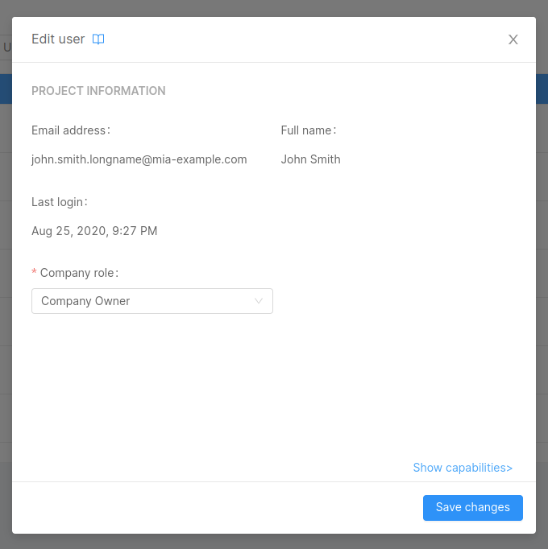
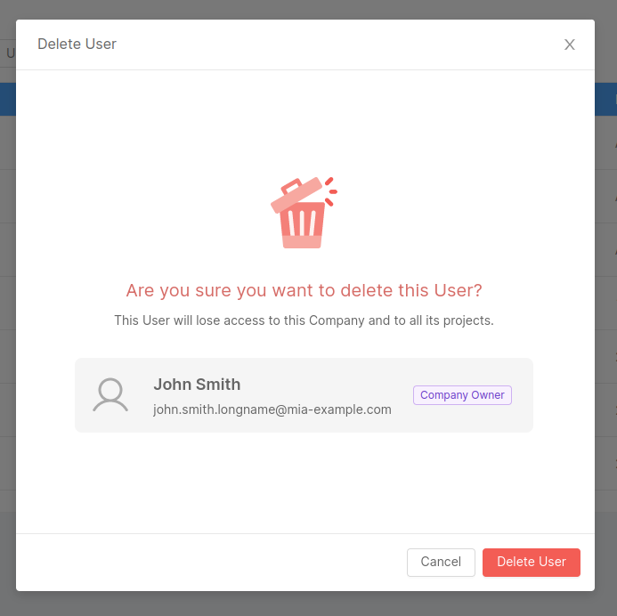
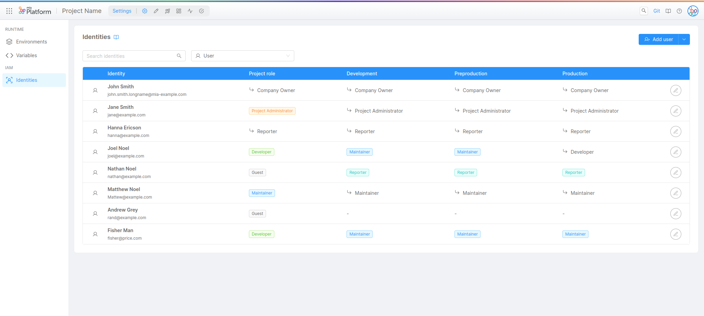
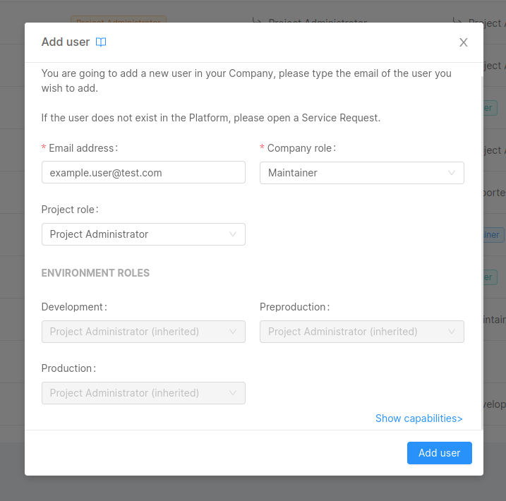
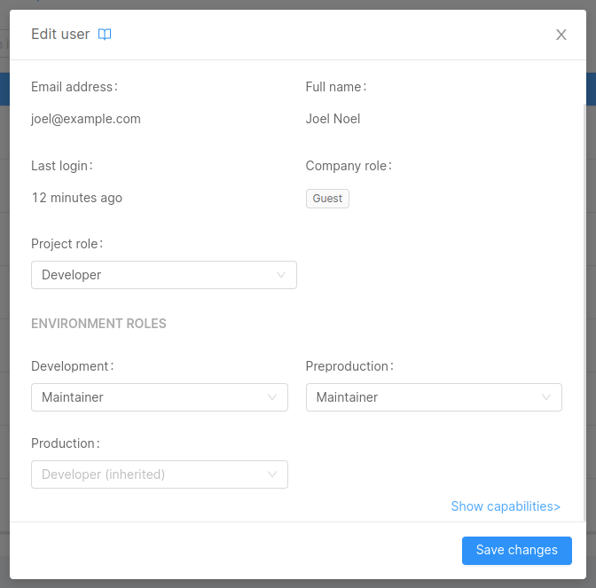

Mia-Platform Console enables certain Users to control other [Identity](/development_suite/identity-and-access-management/overview.md#identity-and-access-management) privileges to access resources. This grants them ownership over the decision-making process regarding which resources are accessible and at what level of authorization.

:::note
To find out more about Roles check out the available [Capabilities](/development_suite/identity-and-access-management/console-levels-and-permission-management.md#users-capabilities-inside-console) that can be assigned to an Identity.
:::

In particular, a User can be assigned a Role on the following resources:

* Company
* Project
* Runtime Environment

Only Users with enough privileges will be granted access to the Identities administration portal and will be able to change Identity Roles.

:::caution Important: Git provider vs Console permissions
The management of Roles and permissions aims at regulating access on resources solely at Console level.  
Roles and permissions of Users on the same resources at the Git provider level are not managed in this Console area; thus, Roles at Git-level must be verified in order to prevent possible discrepancies that may appear between permissions the User has at the Console-level and those the User has at the Git repository level.

For example, it could happen that a User who does not even have permissions to access a Company from the Console is, however, in a Git group with an assigned Role that gives them Git-level permissions on these Company resources!

Therefore, by giving permissions on resources to Users, it is strongly suggested a double check on both Console-level and Git-level permissions.
:::

## Managing Company Users

A User with enough administrative permission on a specific Company will be able to view the existing identities in the Company, add new ones and change the existing Identities' Roles.

:::caution
Please note that some permissions defined by the Company Role may be inherited on the Projects and Runtime Environment owned by the Company itself.  
Always pay attention when assigning Roles in order to avoid providing undesired access to resources!
:::

### Adding a new User

The Company Owner can add a new User by pressing the *Add user* button. The User invitation process will require the invited User email to be provided.

  

  

The provided email will be searched throughout existing Users and if a match is found the User will be invited to the Company with the defined Role.

:::info
If the User does not exist in the Platform, please open a Service Request for it to be created.
:::

### Editing a User Role

A User Role in the Company can be modified: to do so, simply click on the edit button for the desired User row and select the new Role.

  

  

### Removing a User from the Company

A User can be removed from the Company by clicking the trash icon on the table and confirming the action.

  

  

:::warning
Removing a User from the Company will kick the User out of every Project and Runtime Environment. While the User may be invited back in the Company, all their previously existing Roles will be lost and cannot be recovered, meaning they must be reassigned from scratch.
:::

## Managing Project and Environment Users

A User with enough administrative permission on a specific Project will be able to view all the existing Identities in the Company and assign them the desired Role on the specific Project (and, optionally, on each existing Runtime Environment).

:::note
Even though the Project Identities administration portal shows all the Company Identities, this does not mean that all the Identities have access to the Project, since this depends on the Role they are assigned in the Company and how the permissions are inherited.

For further information about permissions and Role inheritance, check out the [Console Levels and Permission Management](/development_suite/identity-and-access-management/console-levels-and-permission-management.md) page.
:::

### Adding a new User at Project level

The Company Owner can add a new User to a Company by pressing the *Add user* button in the Identities section of the Project settings area. Here, the User can be assigned a Company Role and additional Roles on the specific Project and its Runtime Environments. The User invitation process will also require the invited User email to be provided.

  

  

The provided email will be searched throughout existing Users and, if a match is found, the User will be invited to the Company with the defined Roles.

:::info
If the User does not exist in the Platform, please open a Service Request.
:::

### Editing a User Role at Project level

A User Role in the Project or any of the Project Runtime Environments can be modified. To do so, just open the editing dialog and select the proper Role for the Project itself or for each Runtime Environment.

  

  

