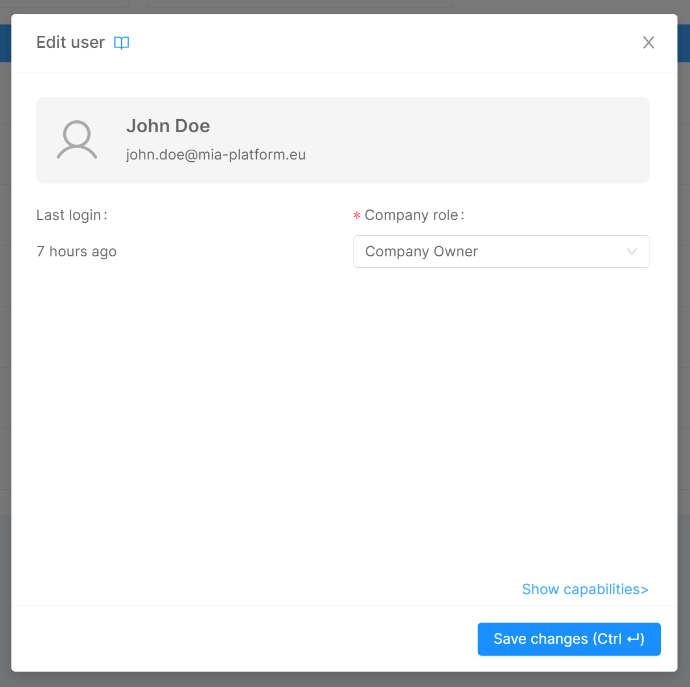

Mia-Platform Console enables certain Users to control privileges of other Users to access Company resources. 
Granting accesses and permissions to Company resources can be managed thanks to the [Identities portal](/development_suite/identity-and-access-management/overview.md#identities-portal), that allows Roles assignment on the following Console resources:

* Company
* Project
* Runtime Environment

:::note
To find out more about Roles check out the available [Capabilities](/development_suite/identity-and-access-management/console-levels-and-permission-management.md#users-capabilities-inside-console) that can be assigned to an [Identity](/development_suite/identity-and-access-management/overview.md#identity-and-access-management).
:::

## Managing Company Users

At Company level, inside the Company Overview, a Company Owner has visibility of the Identity and Access Management section. In particular, from the Identities portal, a Company Owner can add new Users to the Company, manage their accesses or remove their access to it.

:::caution
Please note that some permissions defined by the Company Role may be inherited on the Projects and Runtime Environment owned by the Company itself.  
Always pay attention when assigning Roles in order to avoid providing undesired access to resources!
:::

### Adding a new User at Company Level

From the Identities portal, a Company Owner can add a new User by pressing the *Add user* button. The User invitation process will require the invited User email to be provided.

  

  

The provided email will be searched throughout existing Users and if a match is found the User will be invited to the Company with the specified Role.

:::info
If the User does not exist in the Platform, please open a Service Request for it to be created.
:::

### Editing User Company Role

A User Role in the Company can be modified: to do so, simply click on the edit button for the desired User row and select the new Role.

  

  

### Removing access to the Company

Removing a User from the Identity table results in removing the Role assignment to that User.
Without permission granted, User access to the Company is always removed **with the exception** if that User also belongs to some [Company Group](/development_suite/identity-and-access-management/group-management.md).
In this case, the User does not lose access to the Company, and its permissions on it are defined solely by the privileges given to the Group/Groups to which the User belongs.

  

  

:::warning
Removing a User from the Identities portal will remove permissions specifically assigned to that User on every Project and Runtime Environment of the Company.  
While the User may be invited back in the Company, all their previously existing Roles will be lost and cannot be recovered, meaning they must be reassigned from scratch.
:::

## Managing User Roles at Project and Environment levels

A User with enough administrative permission on a specific Project will be able to view all the existing Identities in the Company and assign them the desired Role on the specific Project (and, optionally, on each existing Runtime Environment).

:::note
Even though the Project Identities administration portal shows all the Company Identities, this does not mean that all the Identities have access to the Project, since this depends on the Role they are assigned in the Company and how the permissions are inherited.

For further information about permissions and Role inheritance, check out the [Console Levels and Permission Management](/development_suite/identity-and-access-management/console-levels-and-permission-management.md) page.
:::

### Adding a new User at Project level

The Company Owner can add a new User to a Company by pressing the *Add user* button in the Identities section of the Project settings area. Here, the User can be assigned a Company Role and additional Roles on the specific Project and its Runtime Environments. The User invitation process will also require the invited User email to be provided.

  

  

The provided email will be searched throughout existing Users and, if a match is found, the User will be invited to the Company with the defined Roles.

:::info
If the User does not exist in the Platform, please open a Service Request.
:::

### Editing a User Role at Project level

A User Role in the Project or any of the Project Runtime Environments can be modified. To do so, just open the editing dialog and select the proper Role for the Project itself or for each Runtime Environment.

  

  

