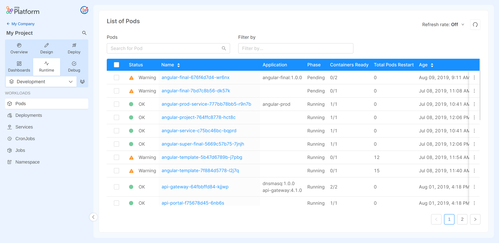
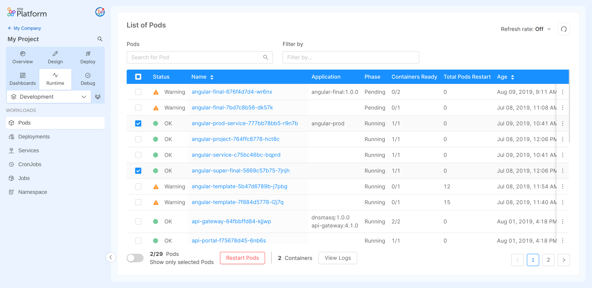

## Monitoring Infrastructure

The Monitoring Infrastructure section is the Developer Console area dedicated to the control and monitoring of its infrastructure.

The area is divided by the number of environments existing in the specific project. In the top menu, it is possible to change the environment to be monitored.

Within each environment, you can view all the available pods and their current properties.
The labels of the columns in the table are:
* **Status** : Status representing a general overview of the pod state. Can be:
  * **OK**: the pod has phase completed or running, has all containers ready and has never restarted
  * **Warning**: the pod has phase pending or error, has some container not ready or has restarted
* **Name**: the name that identifies the pod
* **Component**: the name of the service with the tag version
* **Phase**: the current status of the pod. Can be:
    * **running**: it is deployed and working.
    * **completed**: it is correctly deployed and has completed its work.
    * **pending**: the pod is scheduled but could have some configuration error, or the containers are still not ready.
    * **error**: the pod has failed.
* **Containers Ready**: the number of ready pods / the total.
:::note
In case the Containers ready field has the value `0/1` could be because the pod has Status `completed`, so everything is ok, or `pending` and is possible the presence of configuration errors.
:::

* **Total Pods Restart**: the number of times the pod has restarted.
* **Age**: the date since the pod was deployed.

:::info
For more details, hovering the status icon, and the phase label the user will see a tooltip with more information 
:::

Within the table there are a series of action that can be performed:
- It is possible to refresh the table manually or setting an auto-refresh timer with the specific button in the top-right corner to check changes in the pods status or phase.
- With the `search` input field, and the `Filter by` selection it is possible to filter the list of pods by their name or setting specific values for some columns such as: Status, Phase and TotalPodsRestart.

  
- The burger icon on the right of each pod row let you decide to go to the specific microservice page inside the console or to restart the individual pod.

:::caution
Restarting a pod may cause a downtime of the service if not correctly replicated.
:::

- The user may select one or more pods and choose to **restart** all the selected ones. 
  :::caution
    Restarting a pod may cause a downtime of the service if not correctly replicated. 
  :::
  
  
Clicking on a pod name you can view its specific logs. The logs can be filtered, downloaded or deleted. It is possible to update the showed logs by clicking "Refresh Logs".

The user can also choose to **restart** their pod. Clicking "Restart Pod" the POD will be deleted and restarted. To view the new logs, the user will have to wait for the page to reload or to reload the page.

:::caution
Restarting a pod may cause a downtime of the service if not correctly replicated.
:::

:::info
Check out the [Guidelines for logs](../../getting_started/monitoring-dashboard/dev_ops_guide/log) to know how to guarantee uniformity in the logs generated by your services, in order to ensure easy and effective usage.
:::
