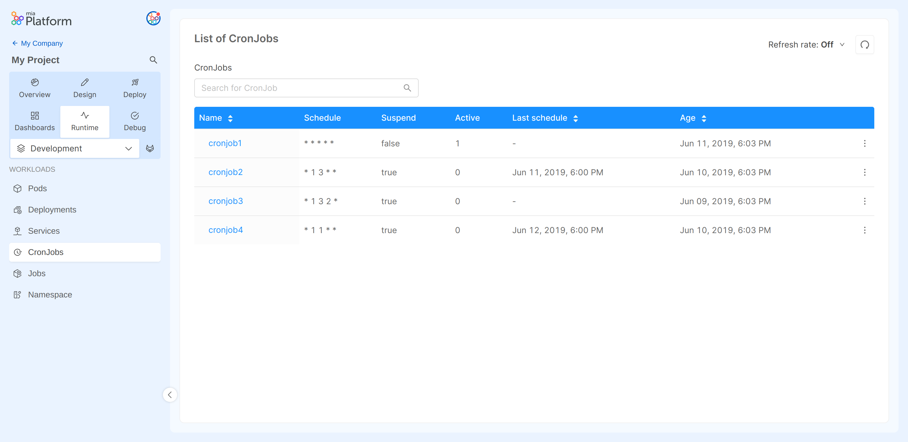

In Kubernetes, a [CronJob](https://kubernetes.io/docs/concepts/workloads/controllers/cron-jobs/) creates Jobs on a predefined time schedule.  
CronJob is meant for performing regular scheduled actions such as backups, report generation, and so on. One CronJob object is like one line of a crontab (cron table) file on a Unix system. It runs a job periodically on a given schedule, written in Cron format.

## CronJobs Table
The table presented here shows the following information:

* **Name**: the name of the CronJob.
* **Schedule**: the schedule in Cron format.
* **Suspend**: wether or not to suspend subsequent executions.
* **Active**: the number of currently running Jobs.
* **Last Schedule**: information of when was the last time the Job was successfully scheduled.
* **Age**: the date when the CronJob was lastly deployed.

## Inspecting a CronJob

Selecting the CronJob name you can inspect more detail about that CronJob.
  
### CronJob Describe

In the `Describe` view you can find information about the selected CronJob in JSON format.
These details are the ones exposed by the [Kubernetes APIs](https://kubernetes.io/docs/reference/kubernetes-api/workload-resources/cron-job-v1/).

