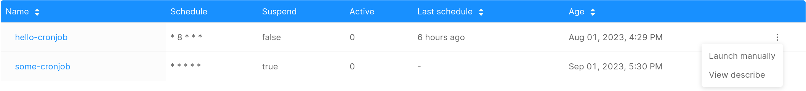
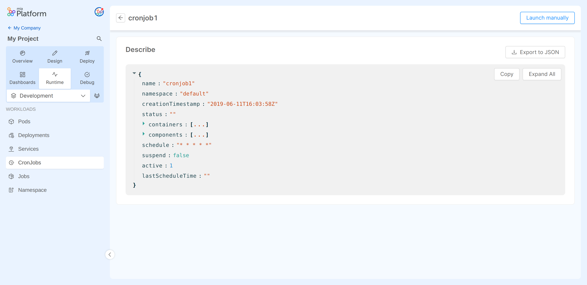

In Kubernetes, a [CronJob](https://kubernetes.io/docs/concepts/workloads/controllers/cron-jobs/) creates Jobs on a predefined time schedule.  
CronJob is meant for performing regular scheduled actions such as backups, report generation, and so on. One CronJob object is like one line of a crontab (cron table) file on a Unix system.
It runs a Job periodically on a given schedule, written in Cron format.

## CronJobs Table

The table presented here shows the following information:

- **Name**: the name of the CronJob.
- **Schedule**: the schedule in Cron format.
- **Suspend**: the value of the [suspend](https://kubernetes.io/docs/concepts/workloads/controllers/cron-jobs/) CronJob spec. When `true` the scheduled execution is suspended.
- **Active**: the number of currently running Jobs.
- **Last Schedule**: information of when was the last time the Job was successfully scheduled. [Manually launched](#manually-launching-a-cronjob) CronJobs won't update this field.
- **Age**: the date when the CronJob was lastly deployed.

### CronJob options menu

The _Hamburger Menu_, located on the last column of the table, allows to perform some actions on a CronJob.
The available options are:

- [Launch manually](#manually-launching-a-cronjob)
- [View describe](#cronjob-describe)

## Inspecting a CronJob

By clicking on a CronJob name you can see some of the details about the CronJob.

### CronJob Describe

In the `Describe` view you can find information about the selected CronJob in JSON format.
These details are the ones exposed by the [Kubernetes APIs](https://kubernetes.io/docs/reference/kubernetes-api/workload-resources/cron-job-v1/).

By clicking on the _Launch manually_ button on the upper right side of the page you can trigger an immediate manual execution of the CronJob, as described in the next section here below.

## Manually launching a CronJob

:::info

This feature is only available to users with sufficient permissions. For more information, consult the [Console Levels and Permission Management](/development_suite/identity-and-access-management/console-levels-and-permission-management.md) section of the docs.

:::

The _Launch manually_ functionality triggers an immediate execution of the CronJob, regardless of its _Schedule_ and _Suspend_ values.

You can launch a CronJob either from the options menu in the [CronJobs Table](#cronjob-options-menu), or by clicking the button in the [CronJob Describe](#cronjob-describe) page.

A modal will ask for confirmation for the action to be performed.

:::info

When manually scheduling a new Job from a CronJob, the Console will create a [Kubernetes Job](https://kubernetes.io/docs/concepts/workloads/controllers/job/) with the same `specs` of the CronJob. 
It also adds to the Job the following `annotations`:

- `cronjob.kubernetes.io/instantiate:"manual"`
- `mia-platform.eu/created-by:"console"`

When [inspecting a Job](/development_suite/monitoring/resources/jobs.md#inspecting-a-job), the presence of both the annotations suggests that the Job has been manually launched from a CronJob with the Console functionality.

:::

The created Job name contains a random generated string and the timestamp of the execution, to avoid name conflicts.

:::tip

To view the Job execution logs, you need to head to the Pods section, and inspect the logs of the Pod related to the launched Job. 
Search for the Pod with the name of the Job as prefix.

:::

### Resource Cleaning

To avoid excessive resource consumption, a Job launched from a CronJob is assigned a Time To Live (TTL) of **one week**.
This means that the Job and the related Pod are marked for deletion after a week.

:::caution

The deletion of the resources is permanent. Therefore, make sure to save elsewhere any important information that you may want to keep, such as Pod logs.

:::
