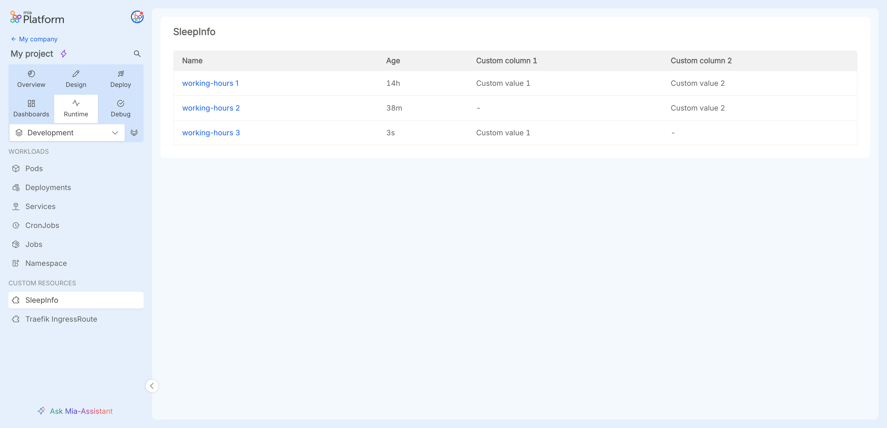
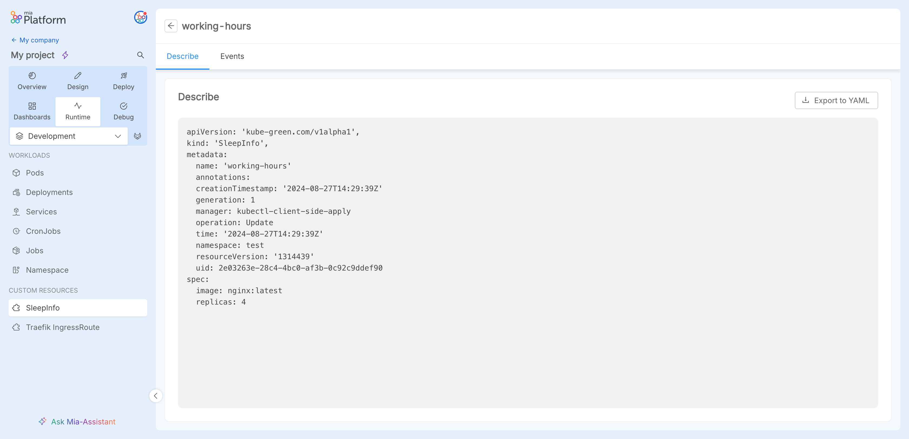
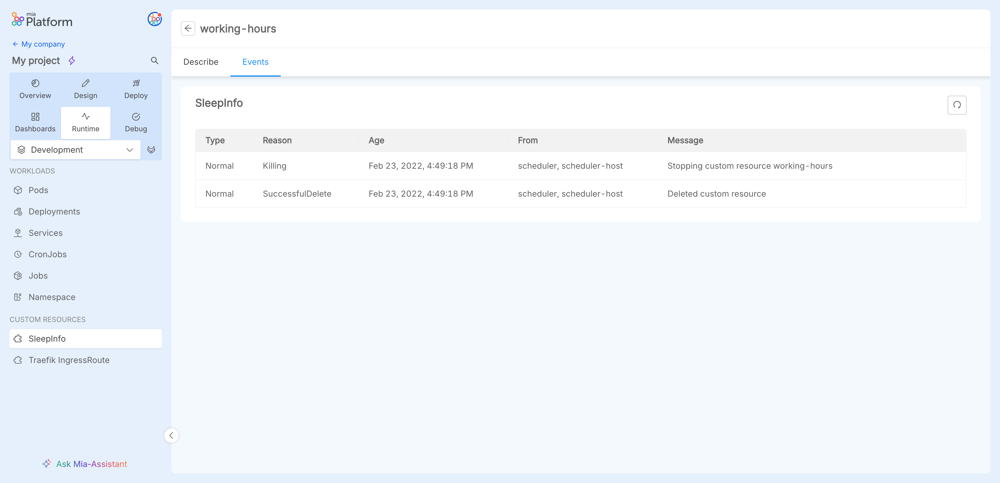

If deployed, the information on the [Custom Resources](/console/design-your-projects/custom-resources/custom-resources.md) for the project can be accessed in the section `Custom Resources` of the sidebar in the `Runtime`section.

:::caution
If you created one or more Custom Kubernetes Resource from a marketplace template **prior** to Console release v13.3.0, the resources **will not be visible by default**. 

Please ensure to [update your resource](/software-catalog/manage-items/mia-ctl/create/create-item-by-type/create_infrastructure_resource.mdx#update-a-custom-resource-to-the-console-v1330) version via [miactl](/cli/miactl/10_overview.md) to one that has the properties `resourceId` and `type` correctly set in the `runtime` object field of its definition, otherwise the Custom Kubernetes Resources won't be visible in the section even if the resource is active.

:::

### Custom Kubernetes Resource instances

By selecting a particular Custom Resource type listed from the sidebar, it is possible to view the list of all the active instances in the cluster.

by clicking on a row from the table, is possible to see the description the events of the resource instance.

#### Custom Kubernetes Resource describe

In the `Custom Resources` section, under the `Describe` tab, you can find the describe of the current Custom resource in YAML format.

Using the dedicated buttons `Export to YAML`, the describe of the resource can be downloaded as YAML file. 

#### Namespace events

In the `Custom Resources` section, under the `Events` tab, you can find the events of the current Custom Kubernetes Resource instance sorted in a table.

Using the dedicated button, the events can be refreshed.
