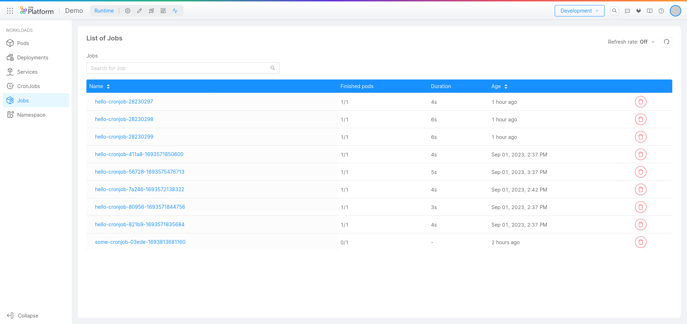
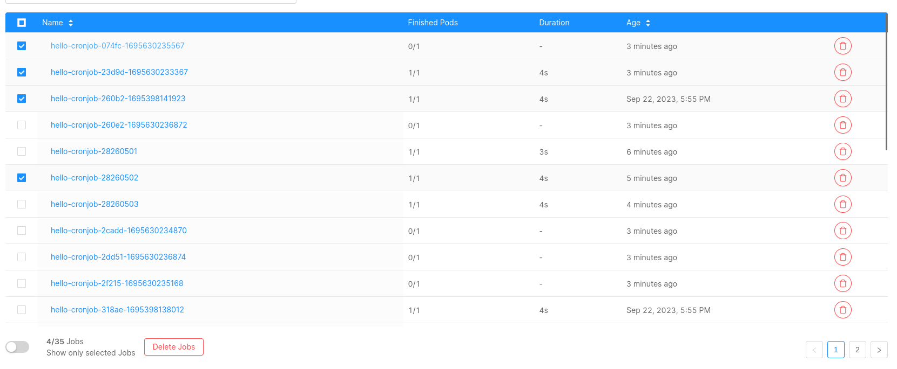
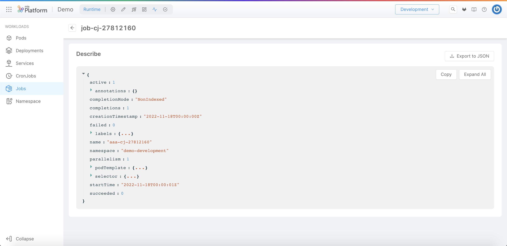

In Kubernetes, a [Job](https://kubernetes.io/docs/concepts/workloads/controllers/job/) is the resource that creates one or more Pods and will continue to retry execution of the Pods until a specified number of them successfully terminate.

On this section you can monitor all your Jobs and the relative properties.

## Jobs Table

The table presented here shows the following information:

- **Name**: the name of the Job.
- **Finished Pods**: the number of succeeded Pods out of all the Pods that have been created. For more info check the [kubernetes documentation](https://kubernetes.io/docs/reference/kubernetes-api/workload-resources/job-v1/#JobStatus).
- **Duration**: the time when the Job was completed.
- **Age**: the date when the Job was lastly deployed.

## Deleting Jobs

:::info

This feature is only available to users with sufficient permissions. For more information, consult the [Console Levels and Permission Management](/development_suite/identity-and-access-management/console-levels-and-permission-management.md) section of the docs.

:::

:::warning

The deletion is permanent, therefore make sure to save elsewhere any important information before deleting a Job.
Please note that also the related Pod(s) are marked for deletion, along with their information such as logs.

:::

You can delete a single Job by clicking on the **Delete button** on the last column of the Job table.

You can also delete multiple Jobs at the same time, by selecting the checkbox on the left of the Jobs you want to delete and clicking on the **Delete Jobs** button that appears at the bottom of the table.

A modal will ask for confirmation for the action to be performed, and inform you on the operation outcome.

The related Pods will be eventually deleted by Kubernetes: the [background cascading deletion policy](https://kubernetes.io/docs/concepts/architecture/garbage-collection/#background-deletion) is used.

## Inspecting a Job

By clicking on the Job name you can inspect some details about the Job.

### Job Describe

In the `Describe` view you can find information about the selected Job in JSON format.
These details are the ones exposed by the [Kubernetes APIs](https://kubernetes.io/docs/reference/kubernetes-api/workload-resources/job-v1).

