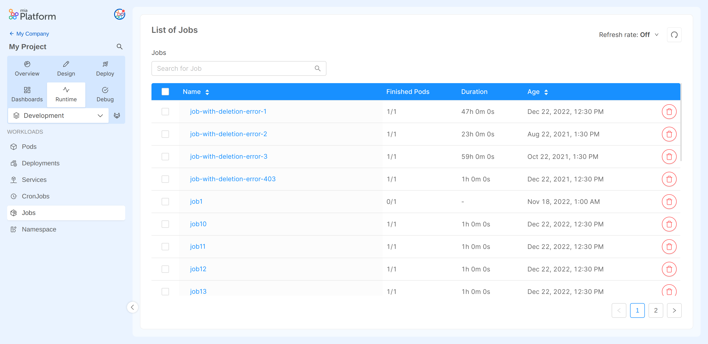
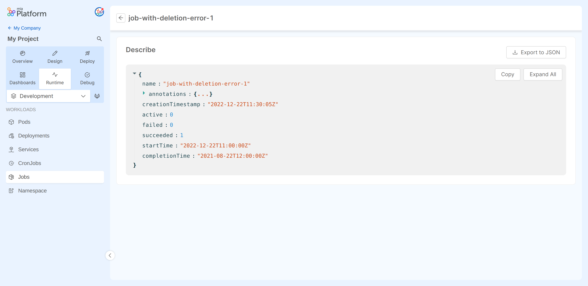

In Kubernetes, a [Job](https://kubernetes.io/docs/concepts/workloads/controllers/job/) is the resource that creates one or more Pods and will continue to retry execution of the Pods until a specified number of them successfully terminate.  

On this section you can monitor all your Jobs and the relative properties.

## Jobs Table
The table presented here shows the following information:

* **Name**: the name of the Job.
* **Finished Pods**: the number of succeeded Pods out of all the Pods that have been created. For more info check the [kubernetes documentation](https://kubernetes.io/docs/reference/kubernetes-api/workload-resources/job-v1/#JobStatus).
* **Duration**: the time when the Job was completed.
* **Age**: the date when the Job was lastly deployed.

## Inspecting a Job

Selecting the Job name you can inspect more detail about that Job.
  
### Job Describe

In the `Describe` view you can find information about the selected Job in JSON format.
These details are the ones exposed by the [Kubernetes APIs](https://kubernetes.io/docs/reference/kubernetes-api/workload-resources/job-v1).

