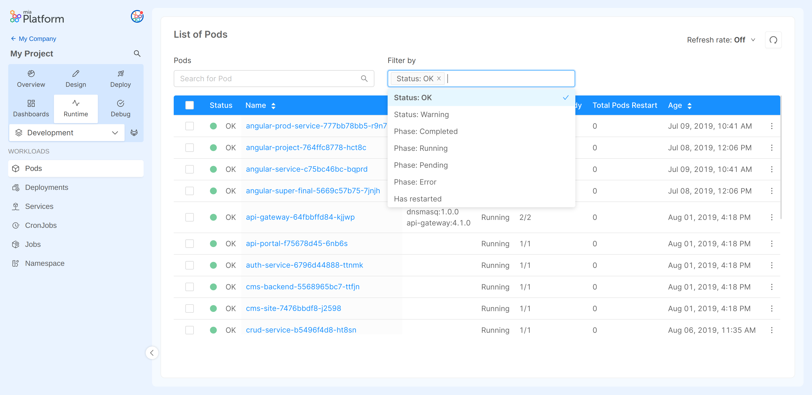
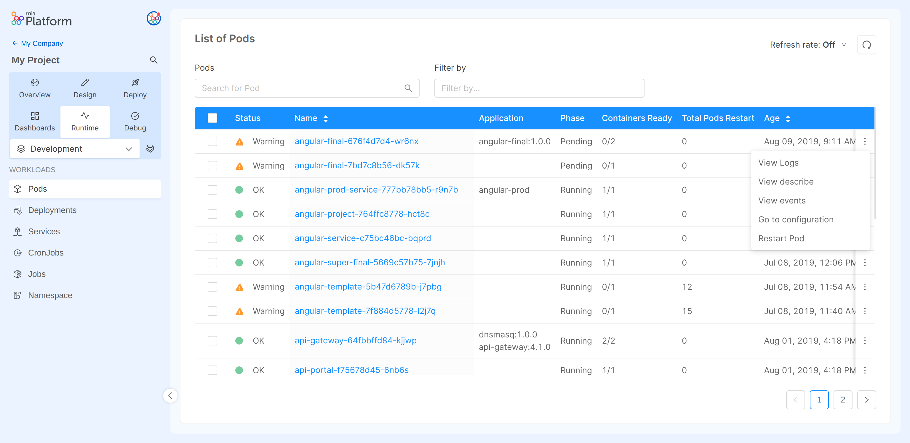
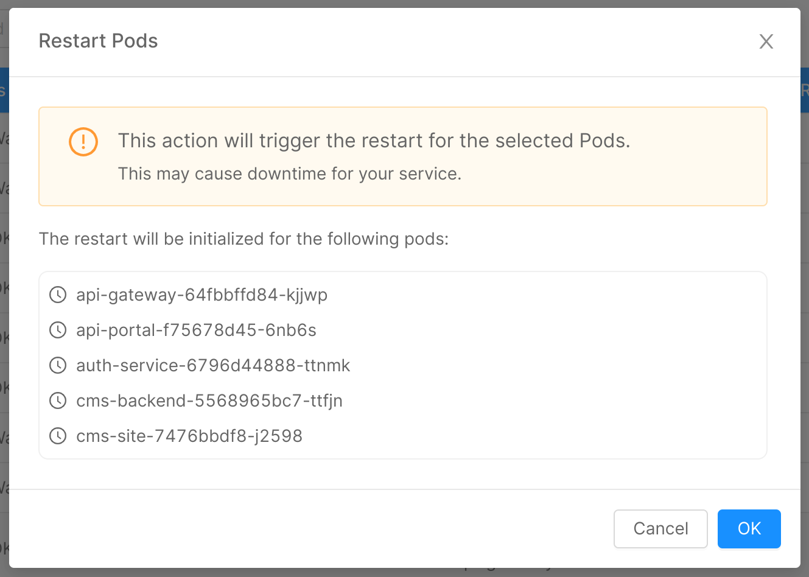
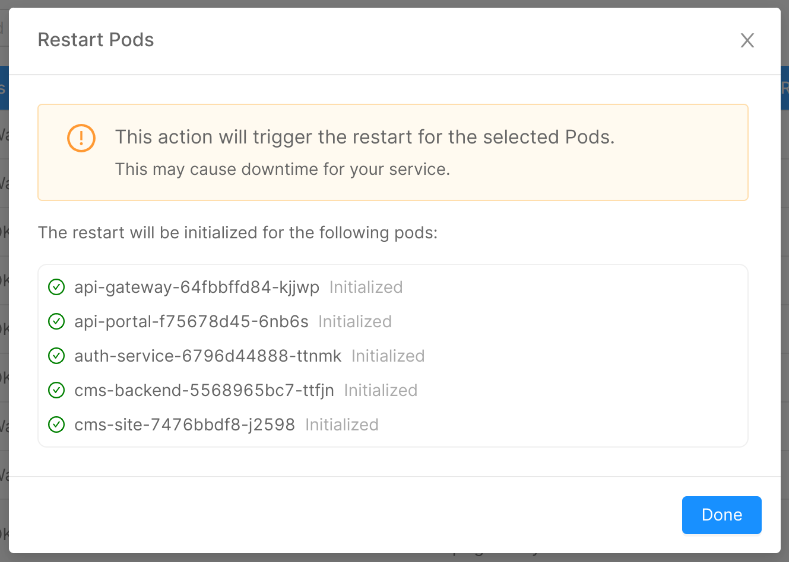
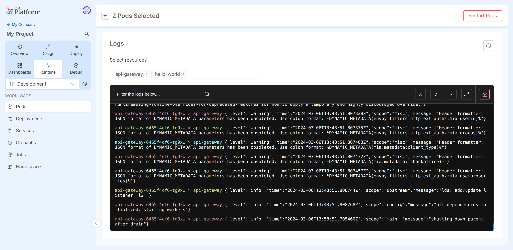
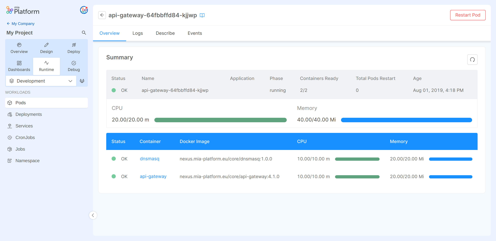
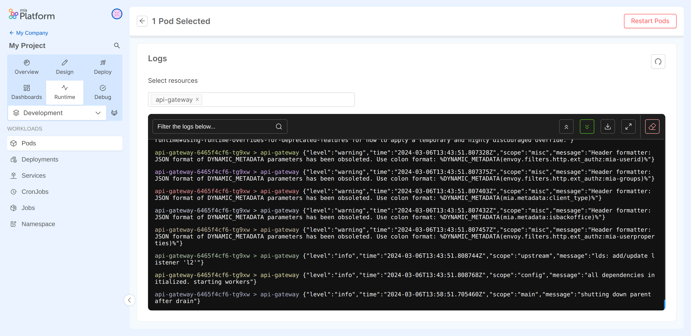
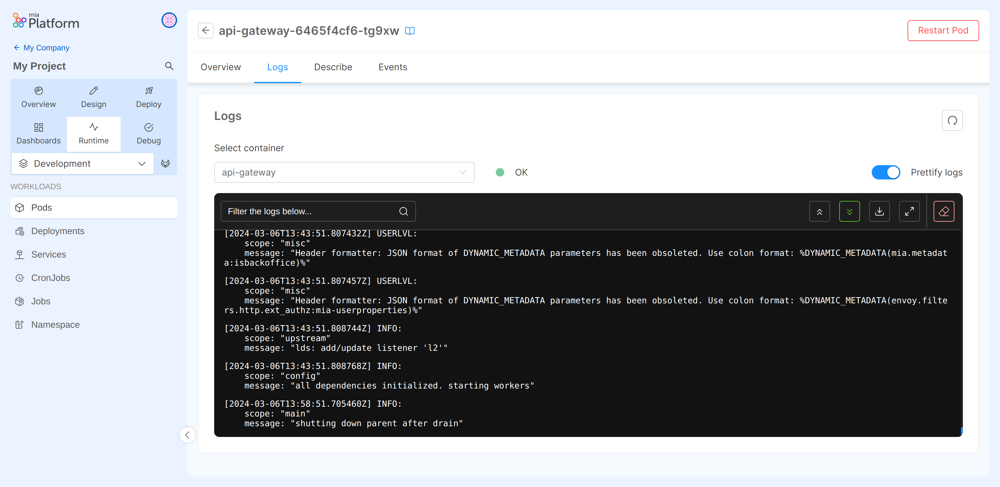
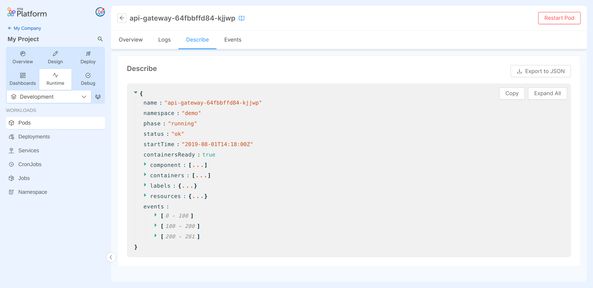
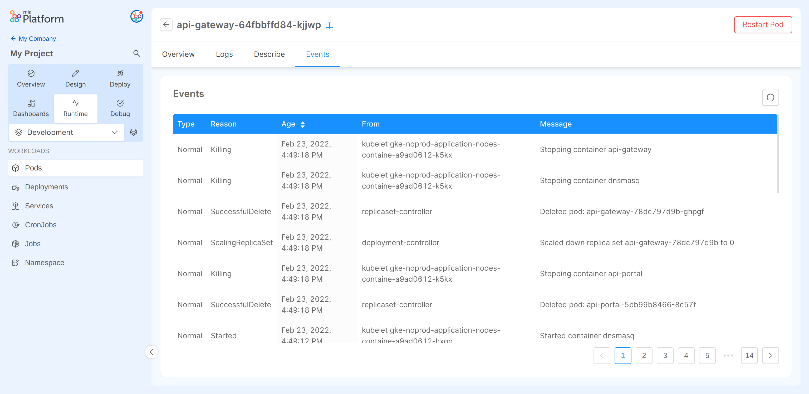

## Monitoring Infrastructure

The Monitoring Infrastructure section is the Developer Console area dedicated to the control and monitoring of its infrastructure.

The area is divided by the number of environments existing in the specific project. In the top right dropdown, it is possible to change the environment to be monitored.

Within each environment you can view, using the sidebar on the left, all the workloads that you can monitor, as pods.

All the available pods and their current properties.
The labels of the columns in the table are:
* **Status** : Status representing a general overview of the Pod state. Can be:
  * **OK**: the Pod has phase completed or running, has all containers ready and has never restarted
  * **Warning**: the Pod has phase pending or error, has some container not ready or has restarted
* **Name**: the name that identifies the Pod
* **Component**: the name of the service with the tag version
* **Phase**: the current status of the Pod. Can be:
    * **running**: it is deployed and working.
    * **completed**: it is correctly deployed and has completed its work.
    * **pending**: the Pod is scheduled but could have some configuration error, or the containers are still not ready.
    * **error**: the Pod has failed.
* **Containers Ready**: the number of ready pods / the total.
:::note
In case the Containers ready field has the value `0/1` could be because the Pod has Status `completed`, so everything is ok, or `pending` and is possible the presence of configuration errors.
:::

* **Total Pods Restart**: the number of times the Pod has restarted.
* **Age**: the date since the Pod was deployed.

:::info
For more details, hovering the status icon, and the phase label the user will see a tooltip with more information 
:::

Within the table there are a series of action that can be performed:
- It is possible to refresh the table manually or setting an auto-refresh timer with the specific button in the top-right corner to check changes in the pods status or phase.
- With the `search` input field, and the `Filter by` selection it is possible to filter the list of pods by their name or setting specific values for some columns such as: Status, Phase and TotalPodsRestart.

  
- The option icon on the right of each Pod row allows you to:
  - go to the specific configuration page in the design area of the console, if the Pod type is `custom` or `cronjob`;
    
  - go to the logs of a container, always visible;
  - go to the previous logs of a container, visible **only if the Pod has ever restarted**;
- to restart the individual Pod, always visible.
    
:::info
When restarting a Pod a modal like the one in figure will be shown to the user giving a feedback of which pods are going to be restarted and the result of the restart itself.
:::

:::caution
Restarting a Pod may cause a downtime of the service if not correctly replicated.
:::

- The user may select one or more pods and choose to **restart**, **inspect Pods logs**, or view inside the table all the selected ones. 
  :::caution
    Restarting a Pod may cause a downtime of the service if not correctly replicated. 
  :::
  
  
  
Clicking on a Pod name you can examine its overview and its specific logs.

Clicking on the `View logs` button you can examine the logs of the selected pods.

:::note

You can select at most five containers.

:::

### Pod overview

In the overview section you can see generic information regaring the desired Pod and a recap of the containers that are part of the Pod itself.

The user can also choose to **restart** their Pod. Clicking "Restart Pod" the POD will be deleted and restarted. To view the new logs, the user will have to wait for the page to reload or to reload the page.

:::caution
Restarting a Pod may cause a downtime of the service if not correctly replicated.
:::

### Pod logs

In the tab `Logs`, are rendered the logs of a container that is running in the Pod.

The logs can be filtered, downloaded, deleted or prettified.

It is possible to update the showed logs by clicking "Refresh Logs".

### Pod previous logs

In the tab `Previous logs`, are rendered the logs of the container that has previously crashed.

The logs can be filtered, downloaded or prettified.

:::info
Check out the [Guidelines for logs](/development_suite/api-console/api-design/guidelines-for-logs.md) to know how to guarantee uniformity in the logs generated by your services, in order to ensure easy and effective usage.
:::

### Pod describe

In the tab `Describe`, you can find the describe of the selected Pod in JSON format.

Using the dedicated buttons, the Pod describe can be:
-  copied to clipboard;
-  expanded in the viewer;
-  downloaded as JSON file

### Pod events
In the tab `Events`, you can find the events of the selected Pod sorted in a table.

Using the dedicated button, the events can be refreshed.
