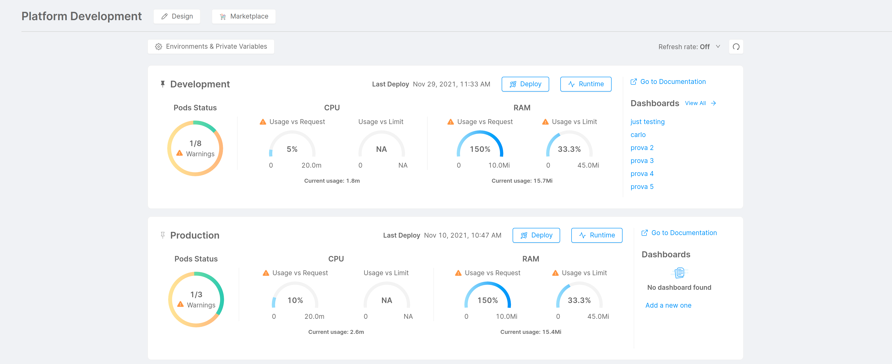
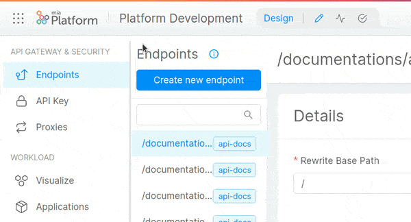

Welcome to the Console Overview page!

Find out more about how to design and manage the full lifecycle of your DevOps Value Stream.

## Homepage

The Homepage allows users to quickly access the relevant information of each project developed on Mia-Platform. Moreover, the user can easily be redirected to the most used Areas in the console, such as:
* [Design](./api-console/api-design/overview.md)
* [Deploy](./deploy/deploy.md)
* [Runtime](./monitoring/monitoring.md)
* [Dashboards](./monitoring/dashboard.md)
* [Marketplace](../marketplace/overview_marketplace.md)
* [Environments & Private Variables](../development_suite/set-up-infrastructure/runtime-environments.md)

The Homepage is structured in different cards which represent the different environments of your project. One card at a time can be pinned to top using the button at the left of the environment name. For each card, the user can see: 
* the time of the last deployment
* the Pods Status
* the Usage vs Requests and the Usage vs Limits of both CPU and RAM resources.
By clicking on the refresh button, in the upper right part of the page, the user can setup a time interval to fetch updated statistics for the project pods or trigger a manual update using the button to the right.
The purpose of the Homepage is to give an easy overview of the availability of the infrastructure and a “one click” experience to navigate through project sections.  
In the following paragraphs we will describe in detail the information provided by every environment card in the Homepage of your project.

### Pods status

Pods status shows how many pods related to the project environment are ready. A warning notification will appear if there is at least one pod not ready or restarted. This warning notification links to the list of warning pods in the Runtime Area.  

### CPU and RAM

CPU and RAM show infographics about two main KPIs: Usage vs Requests and Usage vs Limits, measured in millicores in the case of CPU and mebibytes in the case of RAM.  
Usage vs Requests shows the percentage of used CPU compared to the requested one. The percentage value can be above 100%, meaning that you are currently using more of the requested CPU.  
Usage vs Limits, shows the actual usage of CPU and RAM compared to the limits set for your microservices. The graph color will become yellow to warn you that the usage has exceeded the 75% of the limits you have set, meaning that you have almost reached the maximum amount that you want to be allocated for that resource. If no threshold has been set for all your microservices, the graphs will display NA (Not Available).  
At the bottom of the graphs, it is possible to see the current usage, which represents the usage of CPU or RAM when you loaded the homepage.

:::info
Limit and Request are calculated as the sum of all the containers limits and requests of each pod respectively. For this reason, [HPA](./api-console/api-design/replicas#what-needs-the-replicas-for) changes are taken into account.
:::

### Project links and Dashboards

On the right side of the card you can find useful links that can be configured to redirect you to your project Documentation, CMS and Application.

:::info
To learn how to configure your project links, visit [this page](./set-up-infrastructure/runtime-environments#links-configuration).
:::

In the Dashboards section you can find the names of the first dashboards created in your project, by clicking on one of them you will be redirected to the corresponding dashboard in the Dashboards Area or click on "View all" to see all of them. 

## Console Sections

Mia-Platform Console is divided in many different sections that help you manage the full lifecycle of your digital projects, from the set up of your K8s clusters to APIs and microservices design. Run your CI/CD pipelines, deploy on every kind of environment and monitor the performances of your runtime applications.

### Environments

Get started with your project in a few clicks: configure Kubernetes clusters, set up your [runtime environments](./set-up-infrastructure/runtime-environments) and manage all their [environment variables](./set-up-infrastructure/env-var).

### Design

Develop containerized services in any language with [Templates](../marketplace/templates/mia_templates), [Examples](../marketplace/examples/mia_examples) or [Plugins](../runtime_suite/mia-platform-plugins). Configure your [CRUDs](./api-console/api-design/crud_advanced), [Endpoints](./api-console/api-design/endpoints), [Fast Data flow](../fast_data/overview) and much more.

### Deploy

Design and build your [CI/CD pipelines](../development_suite/deploy/deploy.md): choose your preferred DevOps tools, put them in the right order and let the Console do the work for you.
[Release](./deploy/deploy#select-branch) across different environments with rolling, blue/green, and canary releases. Make rollback easy with your GIT files history.

### Dashboards

Create your dashboards collecting data across the entire DevOps lifecycle to gain a complete overview of your application delivery value stream.

### Runtime

[Monitor](../development_suite/monitoring/monitoring/) your pods, health of clusters, storage consumption and communication among services to anticipate problems and bottlenecks.

### Debug

Automate your tests suite to deliver quality software at a sustainable pace. [Debug](./debugging/telepresence) your kubernetes pods locally with your preferred debugging tool.

### Sections Navigation

All the aforementioned sections can be reached using Mia-Platform Console homepage or by using the pop-up menu in the left side of the topbar.

If you wish, you can add up to 6 sections to your Favorites sections, you just need to click con the associated star. That will make them always accessible from the top navbar. You can remove a section from the favorites ones by clicking again on its star.

## Platform Governance

Guarantee security, quality, and consistency across projects and teams, both internal and external, with clear policies enforced through code.

One Platform to rule them all: design and manage the full lifecycle of your DevOps Value Stream.
Git, Jenkins, Docker, Nexus, Kubernetes, Terraform, Prometheus, Kibana and many others: control all your preferred tools from the same Console, define pipelines and common standards, and get a clear and simplified governance of your IT assets for your teams.

