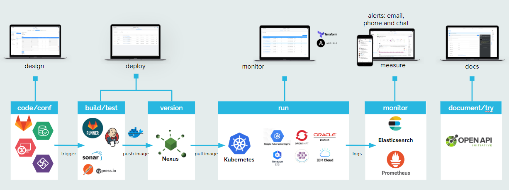

#DevOps Console Overview

Welcome to the DevOps Console Overview page!

Find out more about how to design and manage the full lifecycle of your DevOps Value Stream.

Work on a single platform to manage the full lifecycle of your digital projects, from the set up of your K8s clusters to APIs and
microservices design. Run your CI/CD pipelines, deploy on every kind of environment and monitor the performances of your
runtime applications.

###Infrastructure set-up

Get started with your project in a few clicks: configure Kubernetes clusters, set up your environments and manage all the [environment variables](https://docs.mia-platform.eu/development_suite/overview-dev-suite/).

###CD/CI Pipelines

Design and build your CI/CD pipelines: choose your preferred DevOps tools, put them in the right order and let the Console do the work for you.

###Microservices and API Design

Develop containerized services in any language with Templates. Design your CRUD and GraphQL APIs and expose information to all channels.

###Test Automation & Debug

Automate your tests suite to deliver quality software at a sustainable pace. Debug your kubernetes services locally with your preferred debugging tool.

###Deployment

Release across different environments with rolling, blue/green, and canary releases. Make rollback easy with your GIT files history.

###Log & Monitoring

Monitor your pods, health of clusters, storage consumption and communication among services to anticipate problems and bottlenecks.

###Metrics

Create your dashboards collecting data across the entire DevOps lifecycle to gain a complete overview of your application delivery value stream.

###Platform Governance

Guarantee security, quality, and consistency across projects and teams, both internal and external, with clear policies enforced through code.

One Platform to rule them all: design and manage the full lifecycle of your DevOps Value Stream.
Git, Jenkins, Docker, Nexus, Kubernetes, Terraform, Prometheus, Kibana and many others: control all your preferred tools from the same Console, define pipelines and common standards, and get a clear and simplified governance of your IT assets for your teams.

