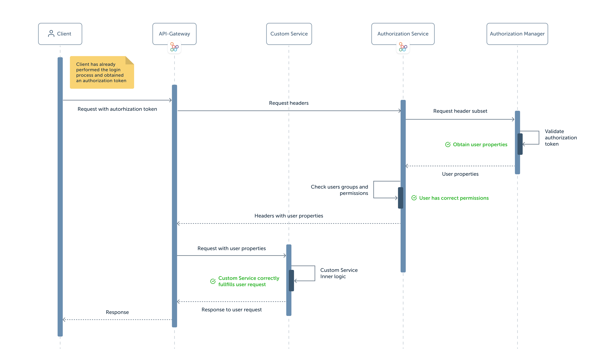

Security is a matter of great importance for all companies. In order to protect your digital assets it is important to have a secure infrastructure.
Mia-Platform can help you to set up your infrastructure by providing you strong and reliable **authentication** and **authorization** mechanisms.  
In this page, you can find out how Mia-Platform authorization flow works.

## Authentication and Authorization

These two terms are often seen together, but they actually have a very different meaning: granting Authentication does not mean providing Authorization or vice-versa. In this section we will explain both of them and show their importance in current digital systems.

### Authentication

Authentication is the process of verifying that your identity is the one that you declared by providing some credentials that only you know or possess.
These credentials will be validated and, if the validation is successful, the system will identify you and give you access to different resources based on your authorization level, which will be described in the next section.  
Authentication is important in order to give access to your assets only to entities that proved their identity.

### Authorization

Authorization means verifying your permissions to access to a specific resource or location. This step is generally consequential to authentication.
Different users may have different authorization levels, which means that they will have right to access to different resources.  

Combining Authentication and Authorization together, it is possible to associate a user to an identity and link to it a specific set of permissions. In this way, only authorized users, that proved their identity and that possess the right permissions, can access to your system resources.

## Mia-Platform Authorization Flow

Mia-Platform built a secure infrastructure that provides both authentication and authorization mechanisms in order to guarantee a controlled access to your system.
For each request to any resource, the user identity is verified and its permissions checked. This way, only authorized users will be given access to the requested resource.
Below you can see an image that shows Mia-Platform authentication and authorization flow:

As you can see, different components are involved and each of them has a specific role in this flow.  
We will now proceed in describing them and explaining how they interact with each other.

### Client

Client component represents a user that wants to access a specific resource. In order to do so, it performs a request to a specific service  and awaits a response from it.  
It should have previously performed a login process, thus obtaining a token that will be sent inside the request. We suppose that our client is already logged in and in possess of the correct token. This token will be validated and the access to the requested resource may be granted to the client. In our use case, the obtained token will be used to set the `Authorization` header with the **Bearer** Authentication scheme, but any other authentication scheme or a different header can be used.

### API Gateway

[API Gateway](../../runtime_suite/api-gateway/overview.md) is responsible for receiving all client requests and routing them to the correct service.
For every received request, it will redirect its headers to the Authorization service. If the user is authorized to access the requested resource, the API Gateway will proxy both the client request and the service response to the corresponding recipient.

### Authorization Service

[Authorization Service](../../runtime_suite/authorization-service/how_to_use) is in charge of verifying whether user groups and permissions are enough for each specific request. This service receives all the request headers received by the API Gateway and will proxy a subset of them to the Authentication Manager.
The Authentication Manager should then return a response body containing user id (it is required, the field of the id is configurable), other user properties, groups and/or permissions. The Authorization Service will examine this information and it will proxy the result of this check to the API Gateway through a specific set of headers.

:::info
For more information about how you can configure the Authorization Service to call a custom Authorization Manager and how to choose the headers that should be proxied to it, visit this [link](../../runtime_suite/authorization-service/how_to_use)
:::

### Authentication Manager

Since every authentication process differs from the others for certain aspects it is advisable that you create your own service that will handle authentication and that will contact an Identity Provider (IDP), if you intend to use one.
In any case, Mia-Platform has a set of services that can handle the authentication process:

* [Client Credentials](../../runtime_suite/client-credentials/configuration)
* [Auth0 Client](../../runtime_suite/auth0-client/configuration)
* Authentication Service

This component is expected to receive a subset of the request headers from the Authorization Service. One of these headers should contain the token that the user obtained during the login process.
This token will be verified by the Authentication Manager (either internally or by sending them to an IDP). In case the received token is valid, this custom Authentication Manager should then send the retrieved user properties back as response body to the Authorization service.

#### What is an Identity Provider (IDP)?

It is a trusted entity that creates, stores and manages user's digital identity information while providing authentication services. It is expected to receive user credentials, to check the validity of these credentials and to return a token that identifies the user back to the service that requested it.

### Custom Service

This can be any service (either created from Mia-Platform [Marketplace](../../marketplace/overview_marketplace) templates or by your own) that will handle the user requests received by the API Gateway.
Once a request reaches the custom service, the user performing the request has already been authenticated and authorized successfully.
Its purpose is to receive the request, perform some custom application logic and produce a response that will be sent back to the client through the API Gateway.
