import Tabs from '@theme/Tabs';
import TabItem from '@theme/TabItem';

Providers can be generically defined as a means of storing information about external services.

The Mia-Platform Console supports providers with 3 different capabilities:

* **Git Providers**: allow users to manage repositories within their workspace;
* **Secret Managers**: allow users to securely store API keys, passwords, certificates, and other sensitive data;
* **CI/CD (Continuous Integration and Continuous Delivery) Tools**: allow users to automate one or more stages of the so-called CI/CD pipelines (which usually consist of commit, build, test, and deploy).

The following table shows the providers currently supported by the Console, grouped by capability:

| Capability     | Providers                                                           | `type` in data model                                |
|----------------|---------------------------------------------------------------------|-----------------------------------------------------|
| Git Provider   | GitLab, GitHub, Bitbucket, Azure DevOps                             | gitlab, github, bitbucket, azure-devops             |
| Secret Manager | GitLab, Vault, Azure Key Vault                                      | gitlab, vault, azure-key-vault                      |
| CI/CD Tool     | GitLab (Git Runner), GitHub (GitHub Actions), Jenkins, Azure DevOps | gitlab-ci, github-actions, jenkins, azure-pipelines |

## Providers Overview

Mia-Platform Console allows authorized users to manage providers. 

More specifically, authorized users can:

* Add a new connection to a Provider;
* Edit the connection to a Provider;
* Set a default provider for a Company.

To access these features, head to the Company Overview Area of the Console by clicking the related button on the homepage, next to your Company name.

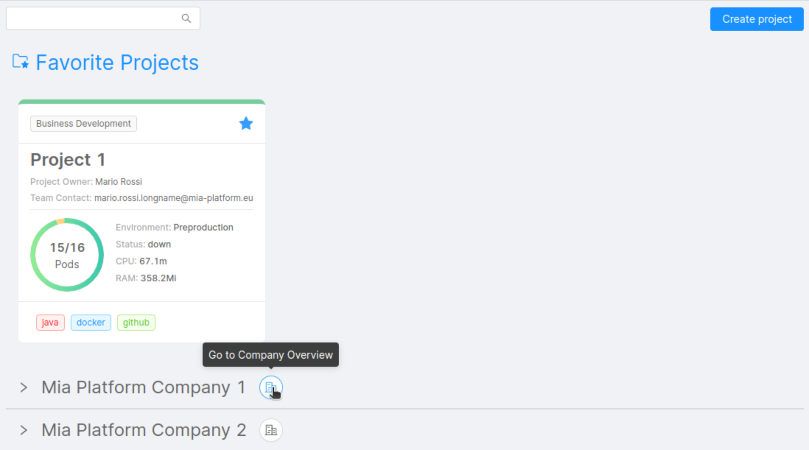

By clicking on "Providers" you will be redirected to the related section, in which (assuming you already have some providers connected) you can see a table containing some information about the providers connected to the Console:

* **Name**: provider name, assigned by the user while connecting the provider to the Console;
* **Capabilities**: provider capabilities (Git Provider, Secret Manager, CI/CD Tool);
* **Service**: external reference service on which the provider relies to provide its capabilities (e.g. Azure, GitHub, Jenkins).

You can filter data based on provider name or service through the search bar at the top of the table, while the bar next to it allows you to filter by one or more capabilities.

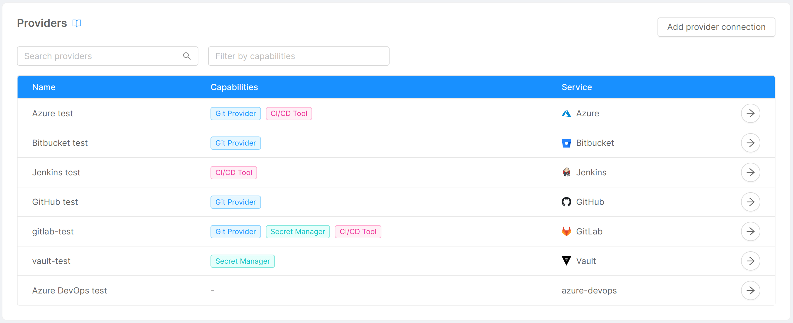


## Connect a Provider

You can connect a Provider by clicking on the "**Add Provider connection**" or "**Add Marketplace Provider connection**" button, located in the page's top right corner. 

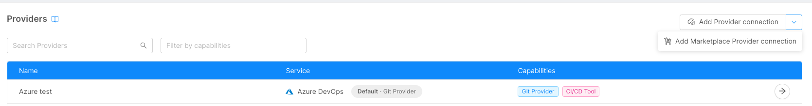

:::info

For more specific details on how to connect a Provider for Marketplace, please refer to the [dedicated paragraph](#connect-a-provider-for-marketplace) later on this page.

:::

After clicking the button a modal will show up, and, through a few steps, you will be asked to enter some information related to the Provider.


### Step 1: Provider Services

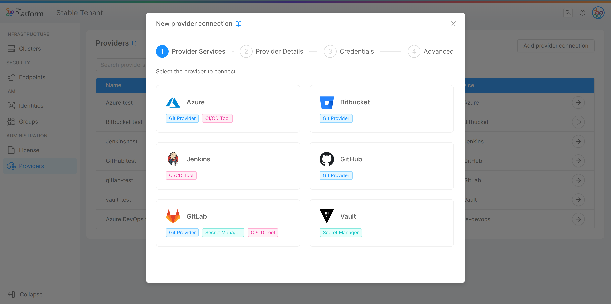
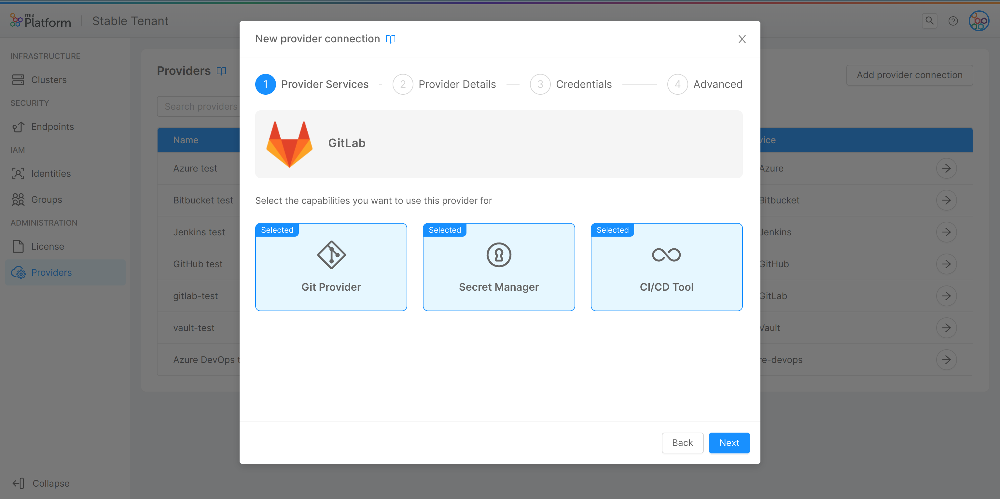

In this step, you are required to choose the specific provider you want to use among the ones supported by the Console and, for the chosen provider, the capabilities you want to use it for ("Git Provider", "Secret Manager", "CI/CD Tool").  

:::info
If the provider offers only one capability, clicking on it will lead directly to step 2 and the capability will be selected by default.
:::

### Step 2: Provider Details

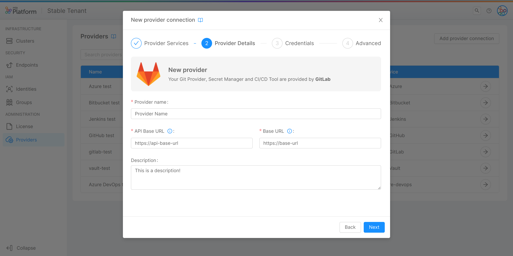

In this step, you can insert some general details about your provider:

* **Provider name** (*required*): a human-readable name for the provider;
* **API Base URL** (*required*): the reference endpoint URL for calls to the provider APIs;
* **Base URL** (*required*): the reference endpoint URL for the provider;
* **Description**: a brief description of the provider.

#### Provider Details of a Provider for Marketplace

If you are connecting a new Provider for Marketplace, you will also see an additional toggle, which allows you to manage the accessibility to the Provider by other Companies.
For further details, please refer to the [dedicated paragraph](#connect-a-provider-for-marketplace) later on this page.

### Step 3: Credentials

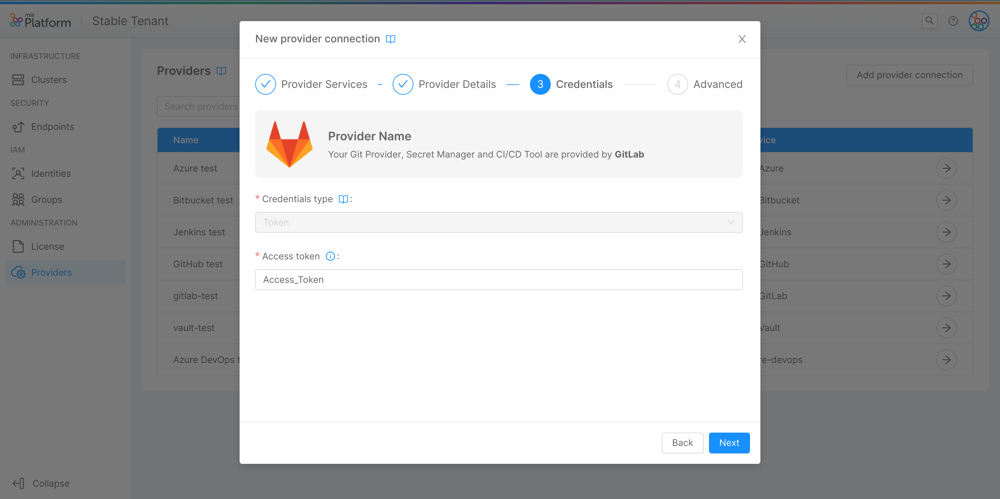

In this step, you are required to insert information about the authentication method to the provider, so that the Console has the necessary permissions to perform all read/write operations on it:

* **Credentials type** (*required*): the type of credentials used to authenticate requests to the provider. It can be one of "Token," "M2M," and "OAuth2".

Depending on the credentials type, the other information to be entered will be:

* For credentials of type "Token":
  - **Access token** (*required*): the token that allows the Console to authenticate against the APIs of the provider (temporary credentials).
* For credentials of type "M2M":
  - **Token** (*required*): the token that allows the Console to authenticate against the APIs of the provider (long-lived credentials);
  - **Access token URL** (*required*): the reference authorization endpoint URL that, to requests that include the authentication token, responds by generating temporary credentials.
* For credentials of type "OAuth2":
  - **Access token URL** (*required*): the reference OAuth2 authorization endpoint URL that, to requests that include client ID and client secret, responds by generating temporary credentials;
  - **Client ID** (*required*): OAuth2 public client identifier;
  - **Client secret** (*required*): OAuth2 secret, known only to the client and the authorization server.
* For credentials of type "Client credentials":
  - **Access token URL** (*required*): the reference authorization endpoint URL that, to requests that include client ID and client secret, responds by generating temporary credentials;
  - **Client ID** (*required*): public client identifier;
  - **Client secret** (*required*): the shared secret, known only to the client and the authorization server.
  - **Scope**: an optional scope to restrict the generated token permissions
* For credentials of type "Client credentials certificate":
  - **Access token URL** (*required*): the reference authorization endpoint URL that, to requests that include client ID and client secret, responds by generating temporary credentials;
  - **Client ID** (*required*): public client identifier;
  - **Private key** (*required*): the PEM-encoded private key whose certificate has been registered against the authorization service;
  - **Scope**: an optional scope to restrict the generated token permissions

:::info
All credentials data are stored in an encrypted MongoDB collection.
For more information about MongoDB encryption, take a look at the dedicated [documentation page](/runtime_suite/crud-service/30_encryption_configuration.md).
:::

:::caution
Credentials entered at this stage, for security reasons, will never again be shown to the user, who will be able to replace them with new ones but not visualize them again.
:::

#### Supported credential types

Depending on the provider selected in step 1, the types of credentials supported will change. The following table shows the credential types supported by each provider:

| Credentials Type               | Providers                                                                |
| ------------------------------ |:------------------------------------------------------------------------:|
| Token                          | GitLab, GitHub, Bitbucket, Azure DevOps, Vault, Jenkins, Azure Key Vault |
| M2M                            | Vault                                                                    |
| OAuth2                         | Jenkins                                                                  |
| Client Credentials             | Azure Key Vault                                                          |
| Client Credentials Certificate | Azure Key Vault                                                          |

:::caution Assign the right scope to your credentials
Make sure, when generating credentials on the respective provider sites, to assign them a scope so that they have the necessary permissions for all read and write operations performed through the Console.

For example, for the "Token" credentials type, the access token should have scope "api" in the case of GitLab, admin scopes for GitHub, "Project admin" and "Repository admin" in the case of Bitbucket, "Full access" for Azure DevOps.
:::

### Step 4: Advanced

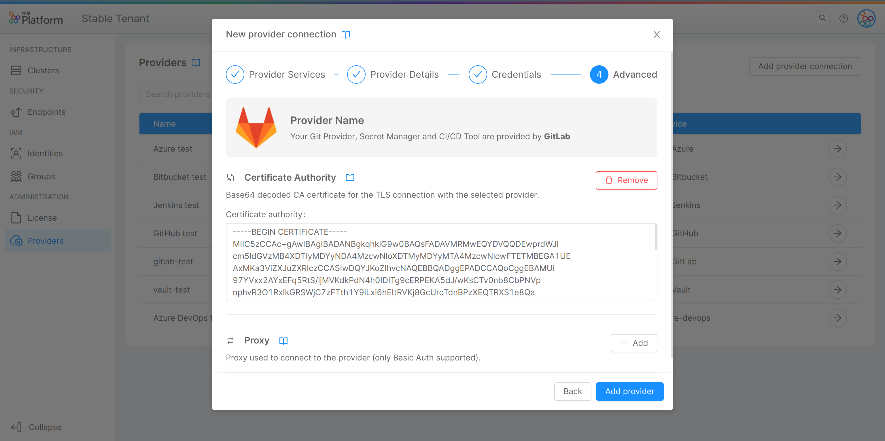
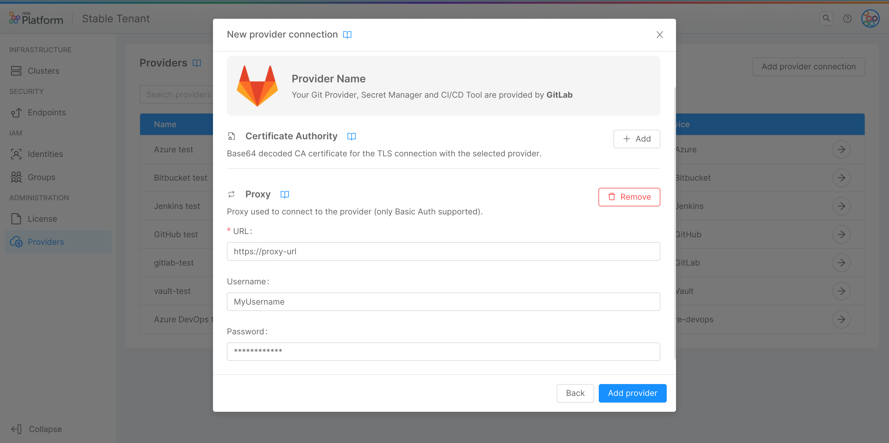

In this step, you can enter some optional advanced information through two expandable forms:

#### Certificate Authority

If you have set up verification of a CA for the connection to your provider, here you can enter it through the homonymous field:

* **Certificate authority**: base64 decoded CA certificate for the TLS connection with the provider.

#### Proxy

If the Console needs to use a proxy to forward calls to the provider, here you can enter the information needed for the connection:

* **URL**: the URL used to connect to the proxy, which indicates where the proxy is exposed;
* **Username**: the username used in connection requests to the proxy for basic authentication;
* **Password**: the password used in connection requests to the proxy for basic authentication. This property will be safely encrypted.

By clicking on "Add provider", the connection to the provider will be set, and it will appear as a new entry in the table.

## View Provider Information

By clicking on the arrow button located in the rightmost column of a provider entry in the table, a new page will show up, displaying information about the specific provider through 3 cards:

* **Details**: this card shows the information inserted by the user in step 2 of connecting the provider to the Console (and, in addition, the specific provider and selected capabilities), and allows to modify this information through the "Edit" button in the top right corner, as further explained [below](#edit-a-provider).

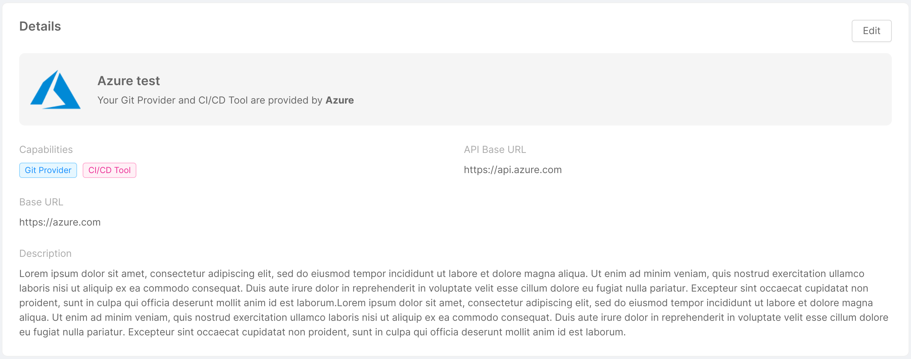

* **Credentials**: this card shows the credentials type chosen by the user in step 3 of connecting the provider to the Console, and allows to replace the credentials information through the "Change credentials" button in the top right corner, as further explained [below](#edit-a-provider).

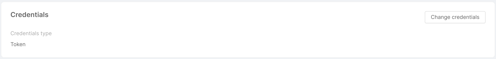

* **Advanced**: this card shows the optional information inserted by the user in step 4 of connecting the provider to the Console through 2 tabs - "Certificate Authority" and "Proxy" - and allows to modify (or eventually add) this information through the "Edit" button in the top right corner, as further explained [below](#edit-a-provider).

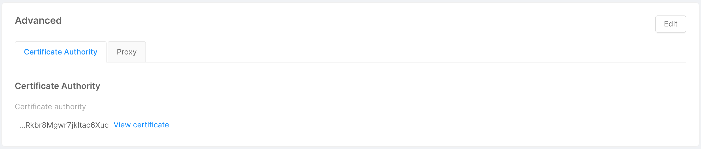
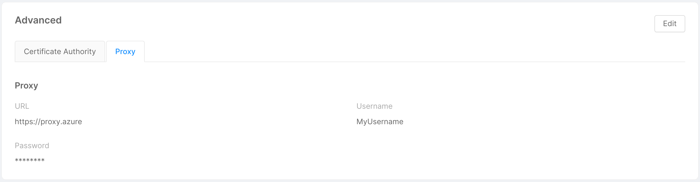

In case a base64 CA certificate has been entered, clicking on the "View certificate" button allows the user to visualize the certificate in both human-readable and plain versions in a two-tabs modal.

The "Expanded view" tab displays the human-readable version of the certificate, while the "Text view" tab shows its plain version and a copy button in the modal footer allows the user to quickly copy the plain base64 CA certificate.

## Edit a Provider

As mentioned in the previous section, through the button in the top right corner of the Details, Credentials, and Advanced cards, it is possible to modify the information inserted by the user while connecting the provider to the Console.

A click on the button will open a modal very similar to the one seen when connecting the provider, but only specific to the information you wish to edit. 

:::info
In the Details card, the modal will allow you also to change the capabilities used by the provider, selected in step 1.
:::

In the image below for example, the user clicked the "Edit" button on the "Details" card, opening a modal for editing the information entered during steps 1 and 2 of provider creation.
By clicking on "Edit provider", the information about the provider will be updated.

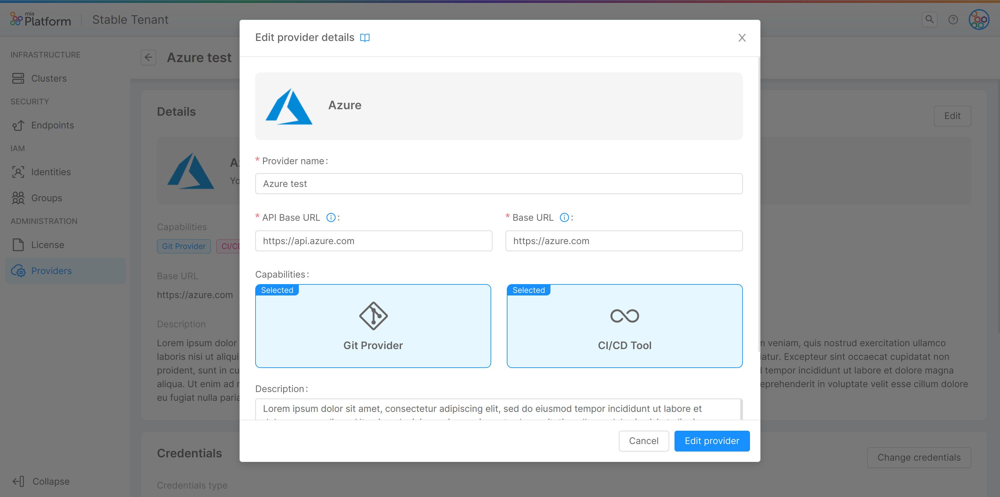

## Remove a Provider Connection

In the bottom part of a provider detail page, you will find a footer that allows you to remove the provider connection from the Console. 

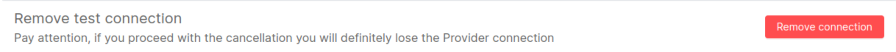

By clicking on the "Remove" button, a modal will be displayed, asking for confirmation of the removal.

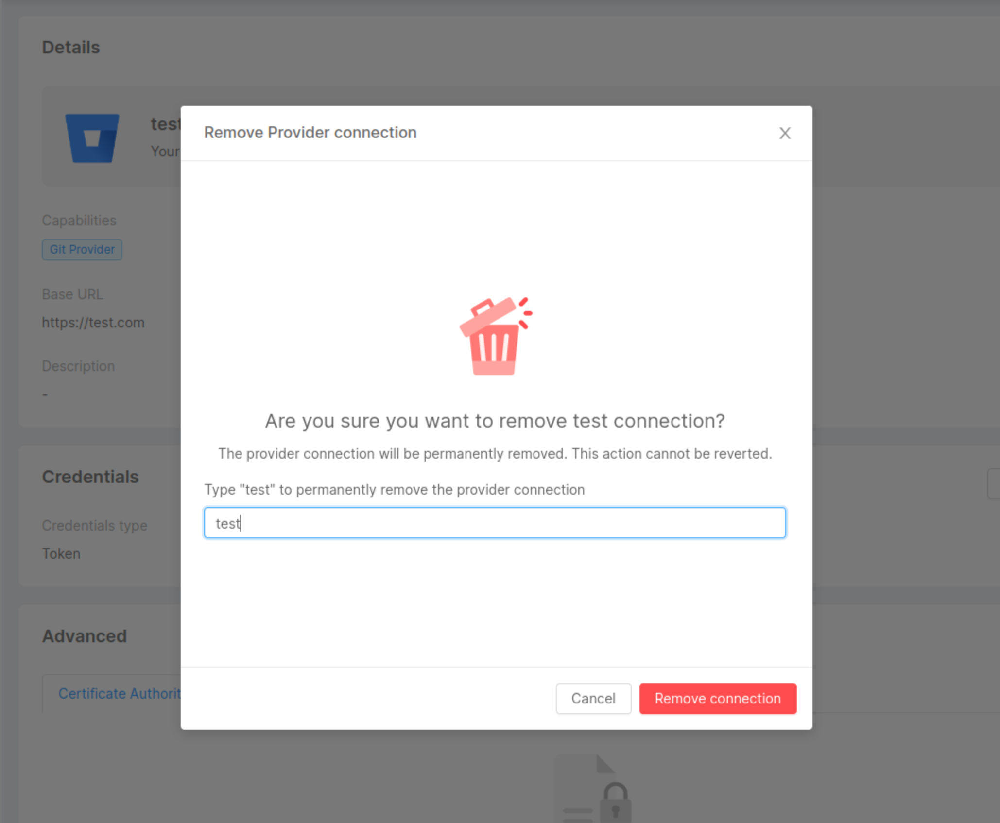

By entering the name in the input field and clicking `Remove`, a loading will appear. 

After the request has been completed, a feedback of successful removal will be shown, and closing the modal will then redirect you to the providers' table. In case of errors, an informative feedback will be shown instead, and the `Close` button will not perform a redirection.

:::caution
Removing a provider connection is only possible if the provider meets these two conditions:
- it has no usage in any of the Company Projects.
- it is not a default provider.
:::

Please make sure the provider connection you are trying to remove meets these requirements.

In case you need to remove your provider from a Project, you can have a closer look at the [dedicated paragraph](#associate-a-provider-to-a-project) later on this page.

You can also find further details on how to set a different default provider in the [following section](#set-a-default-provider).

## Set a Default Provider

Once you create a provider connection, you will be able to set it as the default provider for a specific capability of that company. 

By using the dedicated cards at the top of the providers' section, you will be able to select one of the providers implementing that specific capability. 

As soon as the default provider has been set for a certain capability, the card will show the corresponding chosen provider.
If no provider has been set, a "Set default capability" button will appear instead.

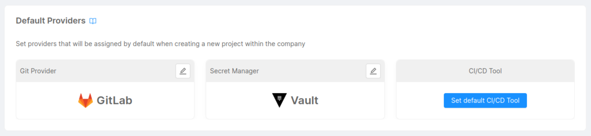

Setting a default provider for a company allows you to make that provider handle a specific capability for any Project that will be created within the company.

In this way, you will not need to manually specify a provider for your Projects.

:::info
Default Providers are automatically associated with newly created Projects inside the company.
:::

:::caution
Please make sure to have the right permissions to set or modify the default providers of a company. 

**Only Company Owners will be able to access this feature.**
:::

#### Edit a Default Provider

You can change the default provider connection for a specific capability by clicking the edit button located in the upper right corner of the default providers' cards.

A modal will appear allowing you to select one of the providers implementing that specific capability:
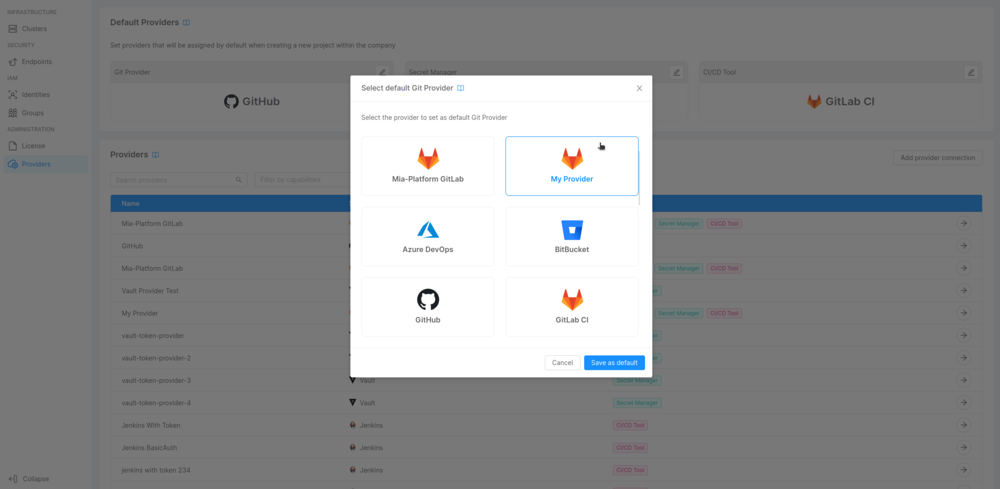

Once you edit the default provider, you will be able to see the card with the new provider set.

## Associate Providers to Projects

If you haven't specified a default provider on a certain capability, or you wish to overwrite the default provider configurations on a specific Project within the company, you will need to manually associate the provider with the Project you want to use it for.

To do this, you can use the CMS: navigate through the `Projects` section, select the desired Project, and edit the document by following the guidelines below, which specify what information to include depending on the provider type and capability.

### Edit a Git Provider

:::warning
Data migration from the old to the new provider is not managed. If you want to replace the Git Provider you will have to manually migrate your repository.
:::

To change the Git Provider of a Project, simply edit the `providerId` field within the `Repository` object by entering the `providerId` you want to use instead of the previous one (obtainable by moving to the `Providers` section of the CMS and taking the `providerId` of the referenced document).

In this case there is no difference in configuration depending on the provider type, so for each of the supported providers an example configuration of the `Repository` object could be as follows.

##### Example Configuration

  ```json
  {
    "providerId": "my-provider"
  }
  ```

#### Edit a Provider for Marketplace accessibility

If you have selected a Provider for Marketplace, you are going to make available to the other Companies all the resources connected to that specific Git Provider.  
This action is reversible: you can manage the accessibility to that Provider at any time, by simply switching off the accessibility toggle. 

:::caution
By removing the accessibility of a Git Provider for Marketplace (by switching off the accessibility toggle), all the resources associated with that Git Provider will cease to function for other Companies.
:::

### Edit Secret Manager

:::warning
Data migration from the old to the new provider is not managed. If you want to replace the Secret Manager you will have to manually migrate your secret variables.
:::

To change the Secret Manager of a Project, you need to edit the `Environments variables` object by replacing the values of the following fields:

* **providerId**: the unique identifier of the provider (obtainable by moving to the `Providers` section of the CMS and taking the `providerId` of the referenced document);
* **type** (*required*): one of the supported provider types. Refer to the table at the top of this page for the complete list of [supported providers](/development_suite/set-up-infrastructure/configure-provider.mdx).

In addition, you may need to include the following information, depending on the provider type:

<Tabs>
<TabItem value="gitlab" label="GitLab">

  - **baseUrl**: the base path from which the variables will be read. 

    If not specified, variables will be read from the first parent group of the Configurations Project in GitLab.

    As an example, if your GitLab Project is saved in **`https://git.tools.mia-platform.eu/mia-platform/Test/configurations`**, the environment variables will be written in the **`mia-platform/Test`** group.

  - **storage**: additional settings related to the storage of environment variables within the GitLab installation.

    It is composed of the following properties:

    - **path**: specifies the exact location for reading variables, starting from the _baseUrl_.

    - **type**: the level of granularity with which variables are managed within the GitLab installation.

      It determines the scope within which variables will be available to the pipelines.

      Either one of the following:

      - `groups`: variables will be managed at the group level;
      - `projects`: variables will be managed at the Project level.

</TabItem>
</Tabs>

##### Example Configurations

<Tabs>
  <TabItem value="gitlab" label="GitLab">

  ```json
  {
    "providerId": "my-gitlab",
    "type": "gitlab",
    "baseUrl": "https://my-gitlab-host",
    "storage": {
      "type": "projects",
      "path": "clients/mia-platform/configurations"
    }
  }
  ```

  </TabItem>
  <TabItem value="vault" label="Vault">

  ```json
  {
    "providerId": "my-vault",
    "type": "vault"
  }
  ```

  </TabItem>
</Tabs>

In addition, it is also possible to change the Secret Manager of a specific environment within the Project.
To do this, you need to modify the `environmentsVariables` object within the referenced environment in the `Environments` object
(from the CMS: `Environments` > *environment object* > `environmentsVariables`). The fields to be edited are the same as described above.

:::caution
You can change the Secret Manager within individual environments, but the provider type used must be the same
(for example, if you use Vault as a Secret Manager on all environments, you can go and replace the Secret Manager of one of them with another instance of Vault, but not with an instance of GitLab).
:::

### Edit CI/CD Tool

To change the CI/CD Tool of a Project, you need to edit the `Pipelines` object by replacing the values of the following fields:

* **providerId**: the unique identifier of the provider (obtainable by moving to the `Providers` section of the CMS and taking the `providerId` of the referenced document);
* **type** (*required*): one of the supported provider types. Refer to the table at the top of this page for the complete list of [supported providers](/development_suite/set-up-infrastructure/configure-provider.mdx).

In addition, you may need to include the following information, depending on the provider type:

<Tabs>
<TabItem value="azure-devops" label="Azure DevOps">

- **azurePipelineId**: a unique identifier that can be used to reference and identify a pipeline.

Learn more on how to retrieve the ID of a pipeline on the Azure DevOps [pipelines documentation](https://learn.microsoft.com/en-us/azure/devops/pipelines).

</TabItem>
<TabItem value="jenkins" label="Jenkins">

- **options**: an object containing the `view` property.

  In Jenkins, pipeline views allow you to visualize and monitor your pipelines and their status in a more organized and user-friendly way, making it easier to track their progress and health.

  The `view` configuration includes the following fields: 

  - **name**: the name of the visualization step where Jenkins pipelines are shown.

</TabItem>
</Tabs>

##### Example Configurations

<Tabs>
<TabItem value="gitlab" label="GitLab">

```json
{
  "providerId": "my-gitlab",
  "type": "gitlab-ci"
}
```
</TabItem>
<TabItem value="github" label="GitHub">

```json
{
  "providerId": "my-github",
  "type": "github-actions"
}
```
</TabItem>
<TabItem value="azure-devops" label="Azure DevOps">

```json
{
  "providerId": "my-azure",
  "type": "azure-pipelines",
  "azurePipelineId": "{PIPELINE_ID}"
}
```
</TabItem>
  <TabItem value="jenkins" label="Jenkins">

```json
{
  "providerId": "my-jenkins",
  "type": "jenkins",
  "options": {
    "view": { "name": "my-view" }
  }
}
```
</TabItem>
</Tabs>

In addition, it is also possible to change the CI/CD Tool of a specific environment within the Project.
To do this, you need to modify the `deploy` object within the referenced environment in the `environments` object
(from the CMS: `Environments` > *environment object* > `deploy`). The fields to be edited are the same as described above.

## Connect a Provider for Marketplace

When adding a new Provider connection, you can choose to define it as a "**Marketplace**" Provider.  
By doing so, you can decide to make any resources related to that specific **Provider** available to other Companies.  
For more information about how to share a Marketplace Resource, please refer to the [dedicated documentation page](/marketplace/add_to_marketplace/marketplace_items_accessibility.md).


:::info

Marketplace related Providers are distinguished by the label "**for Marketplace**" in the Capabilities column.

:::


The process of connecting a Provider for Marketplace is similar to the one described in the [Connect a Provider](#connect-a-provider) section, with only small differences in the first and second steps.
Here below you can find the description of the differences between the two processes.

### Step 1: Provider Services

First step is the same as the one described in the [Connect a Provider](#step-1-provider-services) section with only one difference:
you will be able to select only among Providers that allow to be used with the purpose of Marketplace connection.

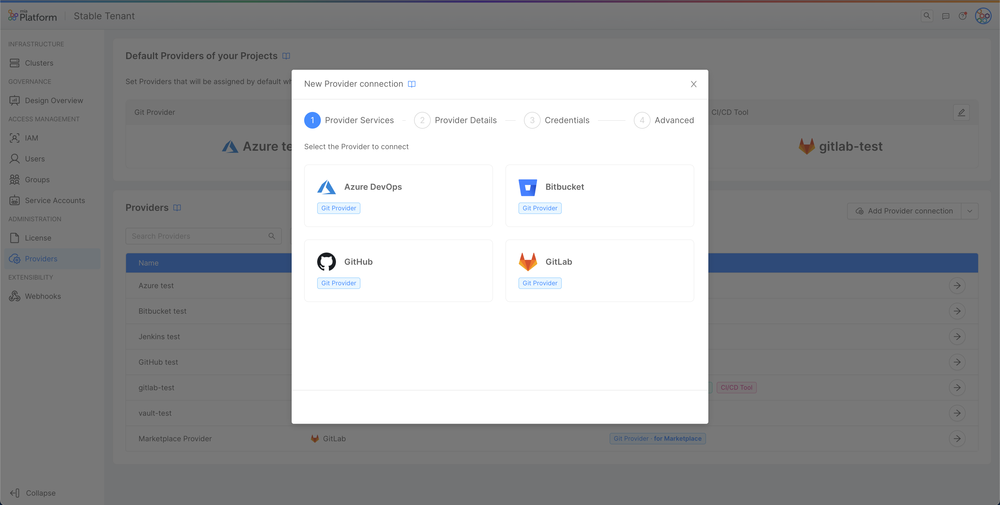

:::info
Only Providers with Git-Provider capability allow the Marketplace Provider connection.
:::

### Step 2: Provider Details

Step 2 is the same as the one described in the [Connect a Provider](#step-2-provider-details) section with a **very important difference**:  

A toggle "**Allow access to all the Companies**" will be displayed in the Provider Details page, allowing you to manage the accessibility to the Provider.
By enabling or disabling this toggle you will be able to manage the accessibility to the Provider. 
**When enabled, this toggle allows other Companies to access this Provider related resources**.


:::info

Even when the "**Allow access to all the Companies**" is enabled, the Provider itself can be viewed and edited only in the Company where it is created.

Additionally, Provider credentials won't be shared with other Companies at any time.

:::

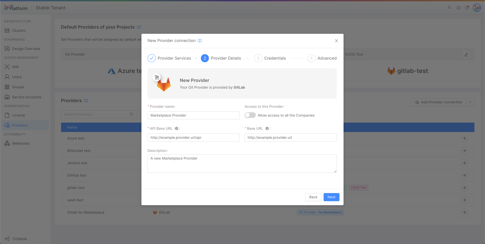

:::info
You can manage the accessibility to the Provider at any time, by simply switching off the accessibility toggle in Provider Edit page.
:::

### Step 3: Credentials

This step has no differences with the [Connect a provider Step 3](#step-3-credentials)

### Step 4: Advanced

This step has no differences with the [Connect a provider Step 4](#step-4-advanced)

## Provider APIs
For versions prior to 10.8, the above information is not valid, as providers were managed directly through APIs. Therefore, for the sake of backward compatibility, we report in this section the APIs used to create and modify providers, along with examples of request bodies:

- POST - `/api/backend/tenants/{tenantId}/providers`: used to create a new provider;
- PATCH - `/api/backend/tenants/{tenantId}/providers/{providerId}`: used to edit an existing provider.

:::info
These APIs are protected and can be used only if you belong to the group `access_token_manager`.
:::

### POST
To create a new provider, you need to call the respective API as follows:

```sh
curl --location --request POST 'https://console-url/api/backend/tenants/my-example-company/providers' \
--header 'Cookie: sid={{CHANGE_ME_WITH_YOUR_SID}}' \
--header 'Content-Type: application/json' \
--data-raw '{"credentials":{"type":"token","content":{"accessToken":"my-super-super-super-secret-token"}},"id":"gitlab-id","label":"My GitLab Label","type":"gitlab","urls":{"apiBase":"https://gitlab-test.com/api","base":"https://gitlab-test.com"}}'
```

The body schema of the request should adhere to the following data model:

```json
"body": {
  "type": "object",
  "additionalProperties": false,
  "properties": {
    "providerId": { "type": "string" },
    "label": { "type": "string" },
    "description": { "type": "string" },
    "type": { "type": "string" },
    "capabilities": {
      "description": "Field introduced in v10.8 of the Console",
      "type": "array",
      "items": {
        "type": "string",
        "enum": ["git-provider", "secret-manager", "ci-cd-tool"],
      }
    },
    "urls": {
      "type": "object",
      "properties": {
        "base": { "type": "string" },
        "apiBase": { "type": "string" }
      },
      "required": ["base", "apiBase"]
    },
    "base64CA": { "type": "string" },
    "proxy": {
      "type": "object",
      "properties": {
        "url": { "type": "string" },
        "username": { "type": "string" },
        "password": { "type": "string" }
      },
      "required": ["url"]
    },
    "credentials": {
      "oneOf": [
        {
          "type": "object",
          "additionalProperties": false,
          "properties": {
            "type": {
              "type": "string",
              "const": "token"
            },
            "expirationDate": {
              "description": "Field introduced in v10.8 of the Console",
              "type": "string",
              "format": "date-time"
            },
            "content": {
              "type": "object",
              "additionalProperties": false,
              "properties": {
                "accessToken": { "type": "string" }
              },
              "required": ["accessToken"]
            }
          },
          "required": ["type", "content"]
        },
        {
          "type": "object",
          "additionalProperties": false,
          "properties": {
            "type": {
              "type": "string",
              "const": "userPass"
            },
            "expirationDate": {
              "description": "Field introduced in v10.8 of the Console",
              "type": "string",
              "format": "date-time"
            },
            "content": {
              "type": "object",
              "additionalProperties": false,
              "properties": {
                "userName": { "type": "string" },
                "password": { "type": "string" }  
              },
              "required": ["userName", "password"]
            }
          },
          "required": ["type", "content"]
        },
        {
          "type": "object",
          "additionalProperties": false,
          "properties": {
            "type": {
              "type": "string",
              "const": "m2m"
            },
            "expirationDate": {
              "description": "Field introduced in v10.8 of the Console",
              "type": "string",
              "format": "date-time"
            },
            "content": {
              "type": "object",
              "additionalProperties": false,
              "properties": {
                "accessTokenURL": { "type": "string" },
                "token": { "type": "string" }
              },
              "required": ["accessTokenURL", "token"]
            }
          },
          "required": ["type", "content"]
        },
        {
          "type": "object",
          "additionalProperties": false,
          "properties": {
            "type": {
              "type": "string",
              "const": "client_credentials"
            },
            "expirationDate": {
              "description": "Field introduced in v10.8 of the Console",
              "type": "string",
              "format": "date-time"
            },
            "content": {
              "type": "object",
              "additionalProperties": false,
              "properties": {
                "accessTokenURL": { "type": "string" },
                "clientId": { "type": "string" },
                "clientSecret": { "type": "string" }
              },
              "required": ["accessTokenURL", "clientId", "clientSecret"]
            }
          },
          "required": ["type", "content"]
        }
      ]
    },
    "required": ["providerId", "type", "urls"]
  }
}
```

:::info Supported credential types
As discussed [here](#step-3-credentials), different types of providers support different types of credentials. The following table shows the credential types supported by each provider, referring to the data model shown above:

| Credentials Type   | Providers                                                             |
| ------------------ |:---------------------------------------------------------------------:|
| token              | gitlab, github, bitbucket, azure-devops, vault, jenkins               |
| m2m                | vault                                                                 |
| client_credentials | jenkins                                                               |
:::
:::caution Data model update
The fields `capabilities` and `expirationDate` (within `credentials`) have been introduced starting from version 10.8 of the Console.
:::

Examples of request bodies specific to each provider type are shown below. In the examples, the `capabilities` and `expirationDate` fields are omitted, since it is assumed that calls to this API are made by users with a Console version lower than 10.8.

<Tabs>
  <TabItem value="github" label="GitHub" default>

```json
{
  "id": "my-github-provider",
  "label": "Mia-Platform GitHub",
  "type": "github",
  "urls": {
    "apiBase": "https://api.github.com",
    "base": "https://github.com"
  },
  "credentials": {
    "type": "token",
    "content": {
      "accessToken": "my-super-super-super-secret-token"
    }
  }
}
```

  </TabItem>
  <TabItem value="gitlab" label="GitLab">

```json
{
  "id": "gitlab-id",
  "label": "My GitLab Label",
  "type": "gitlab",
  "urls": {
    "apiBase": "https://gitlab-test.com/api",
    "base": "https://gitlab-test.com"
  },
  "credentials": {
    "type": "token",
    "content": {
      "accessToken": "my-super-super-super-secret-token"
    }
  }
}
```

  </TabItem>
  <TabItem value="bitbucket-server" label="BitBucket Server">

```json
{
  "id": "bitbucket-id",
  "label": "My BitBucket Server Label",
  "type": "bitbucket",
  "urls": {
    "apiBase": "https://bitbucket-test.com",
    "base": "https://gitlab-test.com"
  },
  "credentials": {
    "type": "token",
    "content": {
      "accessToken": "my-super-super-super-secret-token"
    }
  }
}
```

  </TabItem>
  <TabItem value="azure-devops" label="Azure DevOps">

```json
{
  "id": "azure-devops-id",
  "label": "Azure DevOps",
  "type": "azure-devops",
  "urls": {
    "apiBase": "https://dev.azure.com",
    "base": "https://dev.azure.com"
  },
  "credentials": {
    "type": "token",
    "content": {
      "accessToken": "my-super-super-super-secret-token"
    }
  }
}
```

  </TabItem>
  <TabItem value="vault" label="Hashicorp Vault">

```json
{
  "type": "vault",
  "urls": {
    "baseUrl": "https://vault.example.com/",
    "apiBaseUrl": "https://vault.example.com/"
  },
  "credentials": {
    "type": "m2m",
    "content": {
      "token": "vault-jwt-token",
      "accessTokenURL": "https://vault.example.com/v1/auth/kubenetes/login"
    }
  }
}
```

  </TabItem>
  <TabItem value="jenkins" label="Jenkins OAuth 2.0">

```json
{
  "type": "jenkins",
  "urls": {
    "baseUrl": "https://jenkins.example.com/",
    "apiBaseUrl": "https://jenkins.example.com/"
  },
  "credentials": {
    "type": "client_credentials",
    "content": {
      "clientId": "id",
      "clientSecret": "secret",
      "accessTokenURL": "https://jenkins.example.com/oauth2/login"
    }
  }
}
```

  </TabItem>
</Tabs>

### PATCH
To edit an existing provider, you need to call the respective API as follows:

```sh
curl --location --request PATCH 'https://console-url/api/backend/tenants/my-example-company/providers/gitlab-id' \
--header 'Cookie: sid={{CHANGE_ME_WITH_YOUR_SID}}' \
--header 'Content-Type: application/json' \
--data-raw '{"credentials":{"type":"token","content":{"accessToken":"my-new-super-super-super-secret-token"}}'
```

The request of this endpoint is identical to the [previous one](#post), except that the `providerId` must be entered inside the endpoint params and not in the request body.
