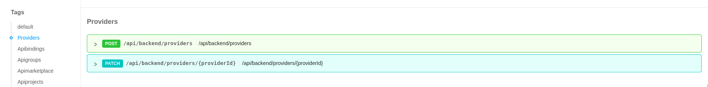
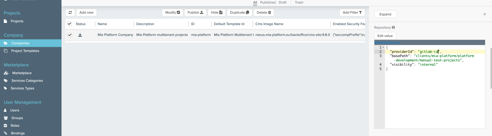
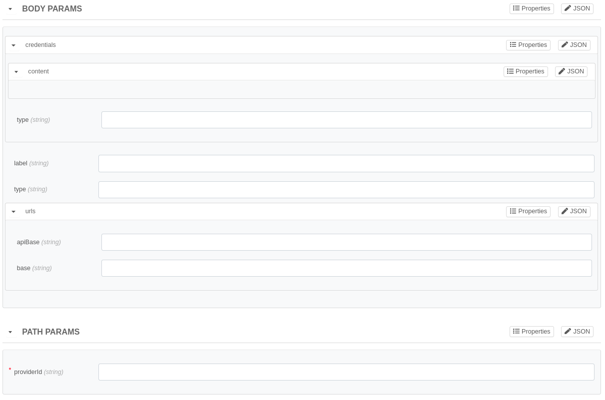

import Tabs from '@theme/Tabs';
import TabItem from '@theme/TabItem';

Console's providers are a mean for storing access information about external services.

In order to configure a new provider on console you need to call a specific API as documented in the following paragraphs.

## Git providers

The Mia-Platform console allows you to interface with the most used git providers on the market (see [here](../../self_hosted/self_hosted_requirements#software-and-hardware-prerequisites) the supported git providers).  

As an on-premise customer you have the ability to configure and use an authentication provider that differs from the git provider (i.e. [Okta](https://www.okta.com/) as authentication provider and [GitLab](https://gitlab.com/) as git provider).

:::info
You **must** create and configure a service account, which will be used to interact with the chosen Git provider.  
As the service account is the only one to interact with the git provider, you will see it as author of some operations like pipelines trigger.
:::

In the following sections, you will see how to use the relative APIs to create a new provider and associate the respective service account's token, which will be appropriately encrypted to ensure a high standard of security.

## Providers APIs

In order to create a new provider you must call the respective API using the Console API Portal, under the "Providers" tag.  



Two main APIs are exposed:

- POST - `/api/backend/tenants/{tenantId}/providers`: used to create a new provider;
- PATCH - `/api/backend/tenants/{tenantId}/providers/{providerId}`: used to edit an existing provider.

:::note
The `tenantId` refers to the identifier of the company you need to associate the provider with.
:::

:::info
These APIs are protected and can be used only if you belong to the group `access_token_manager`.
:::

### Provider creation

To create a new provider, you must invoke the API `/api/backend/tenants/{tenantId}/providers`.

Here is the request body form visible in the API Portal:


We can divide the body in two categories: provider data and credentials data.

The provider data fields are:

- **id (string)**: it will be used to identify the provider;
- **label (string)**: an human-readable name for the provider;
- **type (string)**: the type of provider you are going to insert. Can be `gitlab`, `github`, `bitbucket`, `azure-devops` or `vault`;
- **urls (object)**: an object that contains:
  - **apiBase (string)**: the API base url of the provider (without trailing slash);
  - **base (string)**: the base url of the provider (without trailing slash).


The credentials data fields are:

- **type (string)**: the type of credentials that you are going to insert. accepted values are `token`, `userPass` or `m2m`;
- **content (object)**: a dynamic object that contains the credentials of the service account.
  - For type `userPass`: **must** include `userName` and `password` fields;
  - For type `token`: **must** include only `accessToken` field;
  - For type `m2m`: **must** include `accessTokenURL` and `token` fields.

#### Examples

Below you can find a complete example of the request, divided by provider type:

<Tabs>
  <TabItem value="github" label="GitHub" default>

```json
{
  "id": "my-github-provider",
  "label": "Mia-Platform GitHub",
  "type": "github",
  "urls": {
    "apiBase": "https://api.github.com",
    "base": "https://github.com"
  },
  "credentials": {
    "type": "token",
    "content": {
      "accessToken": "my-super-super-super-secret-token"
    }
  }
}
```

  </TabItem>
  <TabItem value="gitlab" label="GitLab">

```json
{
  "id": "gitlab-id",
  "label": "My GitLab Label",
  "type": "gitlab",
  "urls": {
    "apiBase": "https://gitlab-test.com/api",
    "base": "https://gitlab-test.com"
  },
  "credentials": {
    "type": "token",
    "content": {
      "accessToken": "my-super-super-super-secret-token"
    }
  }
}
```

  </TabItem>
  <TabItem value="bitbucket-server" label="BitBucket Server">

```json
{
  "id": "bitbucket-id",
  "label": "My BitBucket Server Label",
  "type": "bitbucket",
  "urls": {
    "apiBase": "https://bitbucket-test.com",
    "base": "https://gitlab-test.com"
  },
  "credentials": {
    "type": "token",
    "content": {
      "accessToken": "my-super-super-super-secret-token"
    }
  }
}
```

  </TabItem>

  <TabItem value="azure-devops" label="Azure DevOps">

```json
{
  "id": "azure-devops-id",
  "label": "Azure DevOps",
  "type": "azure-devops",
  "urls": {
    "apiBase": "https://dev.azure.com",
    "base": "https://dev.azure.com"
  },
  "credentials": {
    "type": "token",
    "content": {
      "accessToken": "my-super-super-super-secret-token"
    }
  }
}
```

  </TabItem>
  <TabItem value="vault" label="Hashicorp Vault">

```json
{
  "type": "vault",
  "urls": {
    "baseUrl": "https://vault.example.com/",
    "apiBaseUrl": "https://vault.example.com/"
  },
  "credentials": {
    "type": "m2m",
    "content": {
      "token": "vault-jwt-token",
      "accessTokenURL": "https://vault.example.com/v1/auth/kubenetes/login"
    }
}
```

  </TabItem>
</Tabs>

:::info
The credentials are stored encrypted in MongoDB.  
For more information, take a look at the dedicated [documentation section](../../runtime_suite/crud-service/encryption_configuration).
:::

#### Associate provider to a Project

To associate the created provider to your project, you can use the CMS.

Navigate through the `Projects` section, select the desired project and change the `providerId` in the `Repository` section.


#### Associate provider to a Company

To associate the created provider to your company, you can use the CMS.

Navigate through the `Companies` section, select the desired project and change the `providerId` in the `Repository` section.



### Provider editing

To edit an existing provider, you must invoke the API `/api/backend/tenants/{tenantId}/providers/{providerId}`.

The request of this endpoint is identical to the [previous one](#associate-provider), except that here you have to insert the `providerId` in the endpoint params instead of the request body.

Here is the form visible in the API Portal:



### Example code

#### Insert a provider

Now, we insert a provider of type `gitlab`, with id `gitlab-id`:

```sh
curl --location --request POST 'https://console-url/api/backend/tenants/my-example-company/providers' \
--header 'Cookie: sid={{CHANGE_ME_WITH_YOUR_SID}}' \
--header 'Content-Type: application/json' \
--data-raw '{"credentials":{"type":"token","content":{"accessToken":"my-super-super-super-secret-token"}},"id":"gitlab-id","label":"My GitLab Label","type":"gitlab","urls":{"apiBase":"https://gitlab-test.com/api","base":"https://gitlab-test.com"}}'
```

#### Edit a provider

To change the credentials for the provider previously added, with the id `gitlab-id`:

```sh
curl --location --request POST 'https://console-url/api/backend/tenants/my-example-company/providers/gitlab-id' \
--header 'Cookie: sid={{CHANGE_ME_WITH_YOUR_SID}}' \
--header 'Content-Type: application/json' \
--data-raw '{"credentials":{"type":"token","content":{"accessToken":"my-new-super-super-super-secret-token"}}'
```
