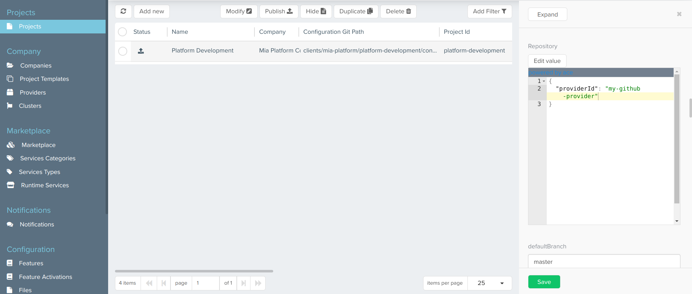

Providers can be generically defined as a means of storing information about external services. The Mia-Platform Console supports providers with 3 different capabilities:

* **Git Providers**: allow users to manage repositories within their workspace;
* **Secret Managers**: allow users to securely store API keys, passwords, certificates, and other sensitive data;
* **CI/CD (Continuous Integration and Continuous Delivery) Tools**: allow users to automate one or more stages of the so-called CI/CD pipelines (which usually consist of: commit, build, test, and deploy).

The following table shows the providers currently supported by the Console, grouped by capability:

| Capability        | Providers                                                             |
| ----------------- |:---------------------------------------------------------------------:|
| Git Provider      | GitLab, GitHub, Bitbucket, Azure DevOps                               |
| Secret Manager    | GitLab, Vault                                                         |
| CI/CD Tool        | GitLab (Git Runner), GitHub (GitHub Actions), Jenkins, Azure DevOps   |

## Providers Overview

Mia-Platform Console allows authorized users to manage providers. More specifically, a user can:

* Add a new connection to a provider;
* Edit the connection to a provider.

To access these features, head to the Company Overview area of the Console by clicking the related button on the home page, next to your company name.

By clicking on "Providers" you will be redirected to the related section, in which (assuming you already have some providers connected) you can see a table containing some information about the providers connected to the Console:

* **Name**: provider name, assigned by the user while connecting the provider to the Console;
* **Capabilities**: provider capabilities (Git Provider, Secret Manager, CI/CD Tool);
* **Service**: external reference service on which the provider relies to provide its capabilities (e.g. Azure, GitHub, Jenkins).

Through the search bar at the top of the table you will be able to filter data based on provider name or service, while the bar next to it allows you to filter by one or more capabilities.

## Connect a Provider

You can connect a provider by clicking on the "Add provider connection" button, located in the page's top right corner. A modal will show up, and, through a few steps, you will be asked to enter some information related to the provider.

### Step 1: Provider Services

In this step, you are required to choose the specific provider you want to use among the ones supported by the Console and, for the chosen provider, the capabilities you want to use it for ("Git Provider", "Secret Manager", "CI/CD Tool").

### Step 2: Provider Details

In this step, you can insert some general details about your provider:

* **Provider name** (*required*): a human-readable name for the provider;
* **API Base URL** (*required*): the reference endpoint URL for calls to the provider APIs;
* **Base URL** (*required*): the reference endpoint URL for the provider;
* **Description**: a brief description of the provider.

### Step 3: Credentials

In this step, you are required to insert information about the authentication method to the provider:

* **Credentials type** (*required*): the type of credentials used to authenticate requests to the provider. It can be one of "Token," "M2M," and "OAuth2".

Depending on the credentials type, the other information to be entered will be:

* For credentials of the type "Token":
  - **Access token** (*required*): token that allows the Console to authenticate against the APIs of the provider (temporary credentials).
* For credentials of the type "M2M":
  - **Token** (*required*): token that allows the Console to authenticate against the APIs of the provider (long-lived credentials);
  - **Access token URL** (*required*): the reference authorization endpoint URL that, to requests that include the authentication token, responds by generating temporary credentials.
* For credentials of the type "OAuth2":
  - **Access token URL** (*required*): the reference OAuth2 authorization endpoint URL that, to requests that include client ID and client secret, responds by generating temporary credentials;
  - **Client ID** (*required*): OAuth2 public client identifier;
  - **Client secret** (*required*): OAuth2 secret, known only to the client and the authorization server.

:::info
Depending on the provider selected in step 1, the types of credentials supported will change. Specifically:
* GitLab, GitHub, Bitbucket, Azure DevOps support the "Token" credentials type;
* Vault supports both "Token" and "M2M" credentials types;
* Jenkins supports both "Token" and "OAuth2" credentials types.
:::
:::caution
Make sure, when generating credentials on the respective provider sites, to scope them so that they have the necessary permissions for all read and write operations performed through the Console.
For example, for the "Token" credentials type, the access token should have scope "api" in the case of GitLab, admin scopes for GitHub, "Project admin" and "Repository admin" in the case of Bitbucket, "Full access" for Azure DevOps.
:::
:::info
All credentials data are stored in an encrypted MongoDB collection.
For more information about MongoDB encryption, take a look at the dedicated [documentation page](/runtime_suite/crud-service/encryption_configuration.md).
:::
:::caution
Credentials entered at this stage, for security reasons, will never again be shown to the user, who will be able to replace them with new ones but not visualize them again.
:::

### Step 4: Advanced

In this step, you can enter some optional advanced information regarding certificate authority and proxy used for calls to the provider:

* **Certificate authority**: base64 decoded CA certificate for the TLS connection with the provider;
* **URL**: the URL used to connect to the proxy, which indicates where the proxy is exposed;
* **Username**: the username used in connection requests to the proxy for basic authentication;
* **Password**: the password used in connection requests to the proxy for basic authentication. This property will be safely encrypted.

By clicking on "Add provider", the connection to the provider will be set, and it will appear as a new entry in the table.

## View Provider Information

By clicking on the arrow button located in the rightmost column of a provider entry in the table, a new page will show up, displaying information about the specific provider through 3 cards:

* **Details**: this card shows the information inserted by the user in step 2 of connecting the provider to the Console (and, in addition, the specific provider and selected capabilities), and allows to modify this information through the "Edit" button in the top right corner, as further explained [below](#edit-a-provider).

* **Credentials**: this card shows the credentials type chosen by the user in step 3 of connecting the provider to the Console, and allows to replace the credentials information through the "Change credentials" button in the top right corner, as further explained [below](#edit-a-provider).

* **Advanced**: this card shows the optional information inserted by the user in step 4 of connecting the provider to the Console through 2 tabs - "Certificate Authority" and "Proxy" - and allows to modify (or eventually add) this information through the "Edit" button in the top right corner, as further explained [below](#edit-a-provider).

In case a base64 CA certificate has been entered, clicking on the "View certificate" button allows the user to visualize the certificate in both human-readable and plain versions in a two-tabs modal.
The "Expanded view" tab displays the human-readable version of the certificate, while the "Text view" tab shows its plain version, and a copy button in the modal footer allows the user to quickly copy the plain base64 CA certificate.

## Edit a Provider

As mentioned in the previous section, through the "Edit" (or "Change credentials") button in the top right corner of the Details, Credentials, and Advanced cards, it is possible to modify the information inserted by the user while connecting the provider to the Console.
A click on the button opens a modal very similar to the one seen when connecting the provider, specific to the step of entering the information you wish to edit (in the case of Details, in the modal it will be also possible to change the capabilities used by the provider, selected in step 1).
In the image below for example, the user clicked the "Edit" button on the "Details" card, opening a modal for editing the information entered during steps 1 and 2 of provider creation.
By clicking on "Edit provider", the information about the provider will be updated.

## Associate a Provider to a Project

Once you have created the provider at the company level, you will need to manually associate it with the projects you want to use it for within that company.
To do this, you can use CMS: navigate through the `Projects` section, select the desired project and change the `providerId` field value in the `Repository` object.

