import Tabs from '@theme/Tabs';
import TabItem from '@theme/TabItem';

Providers are a means of storing crucial information about external services. In the context of the Mia-Platform Console, providers offer three distinct capabilities: Git Providers, Secret Managers, and CI/CD (Continuous Integration and Continuous Delivery) Tools. These capabilities empower you to efficiently manage repositories, securely store sensitive data, and automate CI/CD pipelines. Explore how harnessing these capabilities can elevate your development workflow.

- **Git Providers**: Manage repositories within your workspace.
- **Secret Managers**: Securely store API keys, passwords, certificates, and sensitive data.
- **CI/CD Tools**: Automate stages of CI/CD pipelines.

## Supported Providers

The following table lists the providers grouped by capability:

| Capability     | Providers                                      | `type` in data model                        |
|----------------|------------------------------------------------|---------------------------------------------|
| Git Provider   | GitLab, GitHub, Bitbucket, Azure DevOps        | gitlab, github, bitbucket, azure-devops     |
| Secret Manager | GitLab, Vault                                  | gitlab, vault                               |
| CI/CD Tool     | GitLab (Git Runner), GitHub (GitHub Actions), Jenkins, Azure DevOps | gitlab-ci, github-actions, jenkins, azure-pipelines |

Providers Overview
-------------------

Authorized users can manage providers in the Mia-Platform Console. You can:

* Add a new provider connection.
* Edit an existing provider connection.
* Set a default provider for a company.

To access these features, navigate to the Company Overview area by clicking the relevant button on the home page.

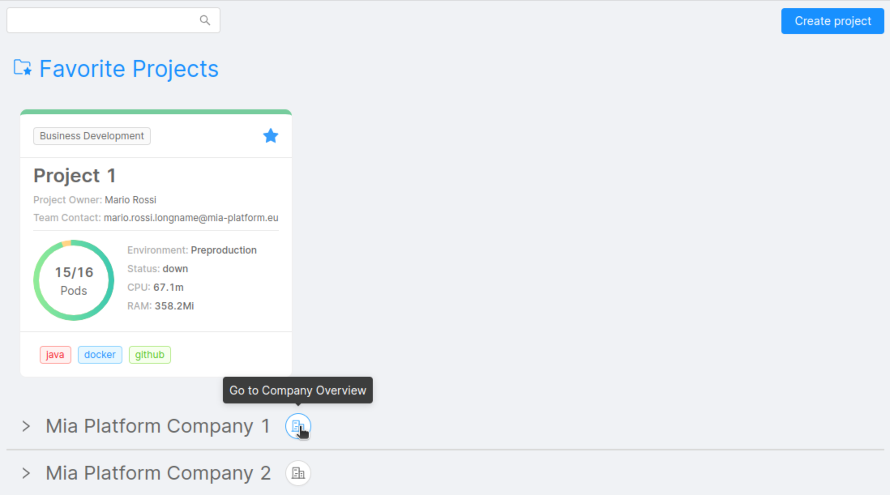

Clicking on "Providers" will take you to the section where you can see information about connected providers:

* **Name**: User-defined provider name.
* **Capabilities**: Provider capabilities.
* **Service**: External service the provider relies on.

Filter providers by name, service, or capability using the search bar and filters.

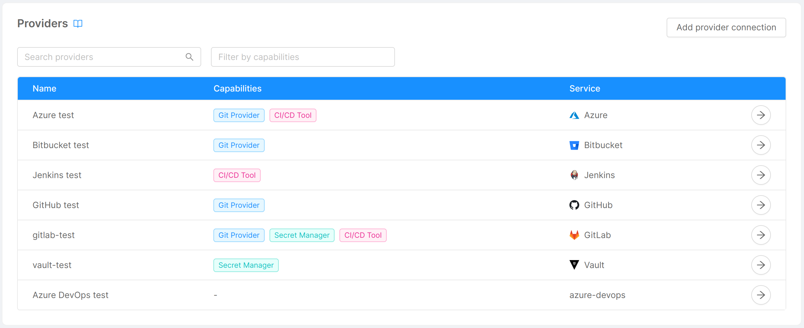

Connect a Provider
------------------

To connect a provider:

1. Click "Add provider connection" in the top right corner.
2. Follow the steps to provide necessary information.

### Step 1: Provider Services

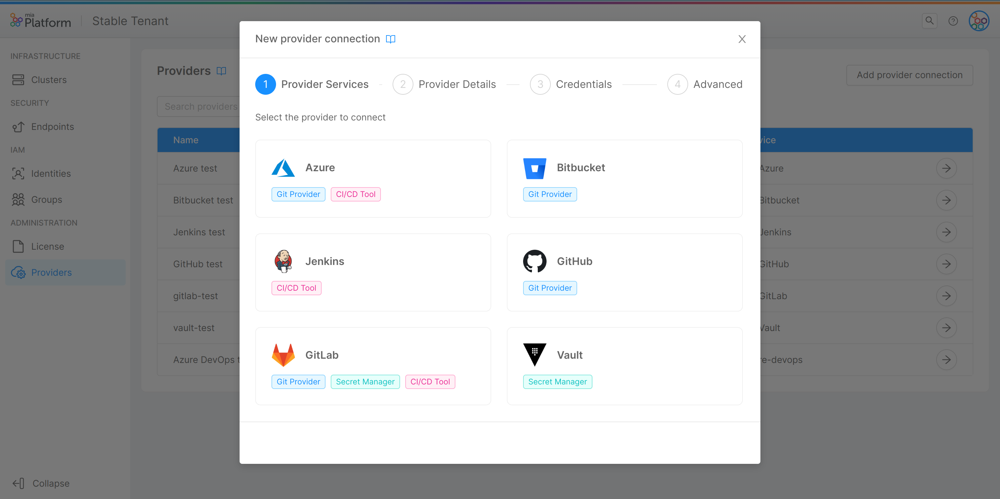
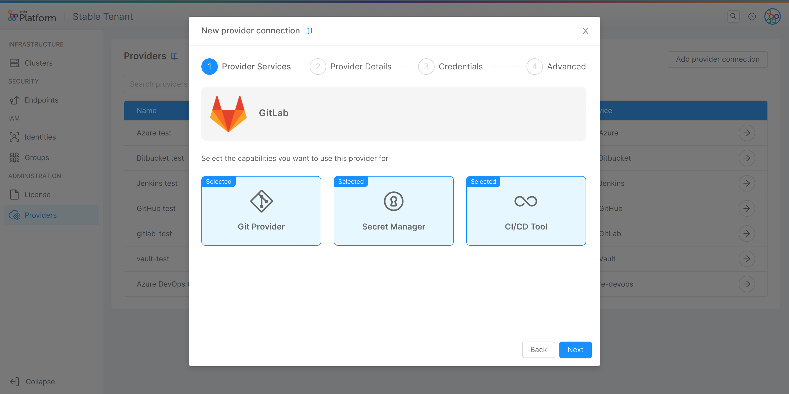

During this step, you'll need to select a specific provider from those supported by the Console. For the chosen provider, you can then indicate the capabilities you intend to utilize, which may include "Git Provider," "Secret Manager," or "CI/CD Tool."

:::info
If a provider offers only one capability, clicking on it will lead directly to step 2 with that capability already pre-selected.
:::

### Step 2: Provider Details

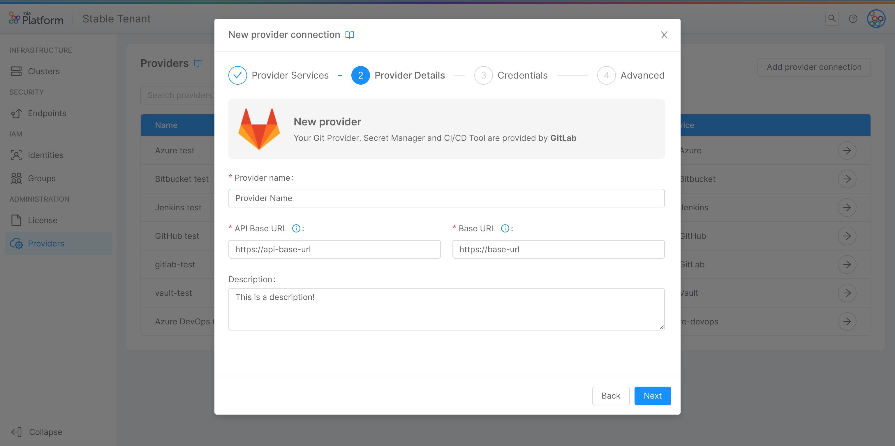

Enter general provider details:

* **Provider name** (*required*): a human-readable name for the provider;
* **API Base URL** (*required*): the reference endpoint URL for calls to the provider APIs;
* **Base URL** (*required*): the reference endpoint URL for the provider;
* **Description**: a brief description of the provider.

### Step 3: Credentials

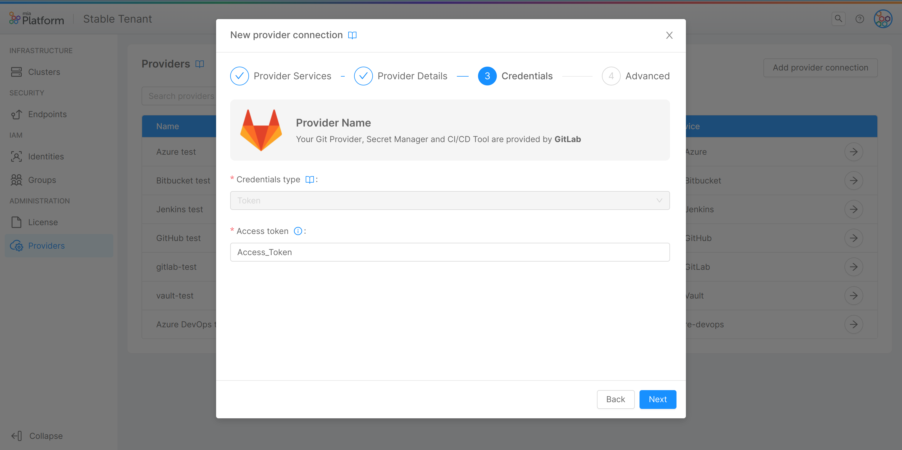

In this step, you'll input authentication information for the chosen provider.

:::info
All credentials are encrypted and stored in a MongoDB collection. Learn more about MongoDB encryption in the [documentation](/runtime_suite/crud-service/30_encryption_configuration.md).
:::

This allows the Console to have the necessary permissions for read/write operations:

- **Credentials type** (*required*): Choose the authentication method, like "Token," "M2M," or "OAuth2."

Depending on the credentials type, you'll need to provide:

- For "Token" credentials:
- **Access token** (*required*): A token for Console's API authentication (temporary credentials).
- For "M2M" credentials:
- **Token** (*required*): A token for Console's API authentication (long-lived credentials);
- **Access token URL** (*required*): URL to get temporary credentials using the provided token.
- For "OAuth2" credentials:
- **Access token URL** (*required*): URL to obtain temporary credentials with client ID and client secret;
- **Client ID** (*required*): Public client identifier for OAuth2;
- **Client secret** (*required*): Secret known only to the client and the authorization server.

:::caution
Entered credentials are stored securely and won't be shown again. You can replace them with new credentials if needed.
:::

#### Supported Credential Types

The supported credential types depend on the provider chosen in step 1. The following table illustrates the credential types supported by each provider:

| Credential Type | Supported Providers                                                |
| --------------- |:-------------------------------------------------------------------:|
| Token           | GitLab, GitHub, Bitbucket, Azure DevOps, Vault, Jenkins            |
| M2M             | Vault                                                              |
| OAuth2          | Jenkins                                                            |

:::caution Ensure Correct Credential Scopes

When generating credentials on the respective provider platforms, ensure to assign appropriate scopes. This ensures that the credentials possess necessary permissions for read and write operations carried out through the Console.

For instance, when using the "Token" credentials type, the access token should be granted the scope "api" for GitLab, admin scopes for GitHub, "Project admin" and "Repository admin" privileges for Bitbucket, and "Full access" rights for Azure DevOps.
:::

### Step 4: Advanced

In the fourth step, you have the option to provide advanced information through two expandable forms:

**Certificate Authority**

If you have set up a Certificate Authority (CA) verification for the connection to your provider, you can enter the necessary data through the "Certificate Authority" section:

- **Certificate Authority**: Enter the base64-decoded CA certificate for TLS connection with the provider.

**Proxy**

Additionally, if the Console requires a proxy to facilitate calls to the provider, you can provide connection details through the "Proxy" section:

- **URL**: Specify the URL for connecting to the proxy, indicating its exposed location.
- **Username**: Enter the username used for basic authentication in connection requests to the proxy.
- **Password**: Enter the password for basic authentication in connection requests to the proxy; this property will be securely encrypted.

Once you click "Add Provider," the connection will be established, and the new entry will appear in the table.

## View Provider Information

When you click the arrow button located in the rightmost column of a provider entry in the table, a new page will open, revealing information about the specific provider presented through three distinct cards:

**Details**: This card presents the data entered by the user during step 2 of connecting the provider to the Console. It also displays the chosen provider, its capabilities, and offers the option to modify this information using the "Edit" button in the upper right corner, as explained further [below](#edit-a-provider).

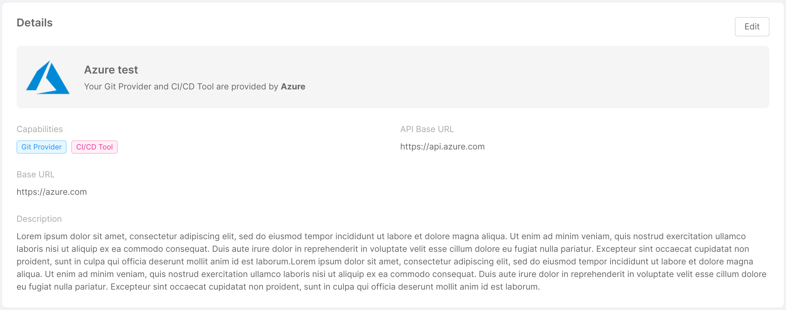

**Credentials**: This card showcases the type of credentials selected by the user in step 3 of connecting the provider to the Console. It provides the ability to update the credential information through the "Change credentials" button in the upper right corner, as elaborated [below](#edit-a-provider).

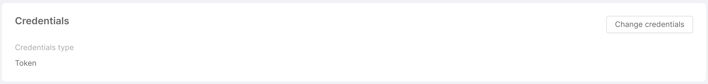

**Advanced**: This card presents the optional details provided by the user in step 4 of connecting the provider to the Console. It encompasses two tabs, "Certificate Authority" and "Proxy." You can modify or add this information through the "Edit" button in the upper right corner, as further clarified [below](#edit-a-provider).

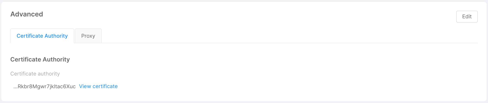
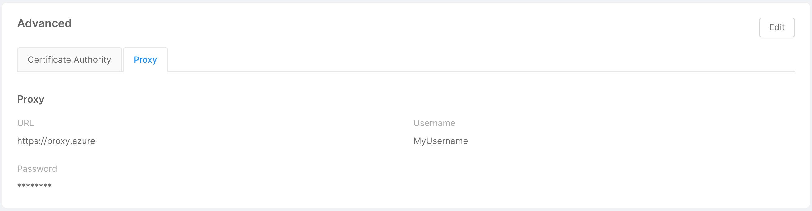

In the event that a base64-encoded CA certificate has been entered, clicking the "View certificate" button allows you to view the certificate in both human-readable and plain formats within a two-tab modal.

The "Expanded view" tab presents the human-readable version of the certificate, while the "Text view" tab displays the plain version. A copy button in the modal footer enables you to quickly copy the plain base64-encoded CA certificate.

## Edit a Provider

As mentioned in the preceding section, you can modify the information entered by you while connecting the provider to the Console by using the button located in the top right corner of the Details, Credentials, and Advanced cards.

Clicking the button will trigger the opening of a modal that closely resembles the one encountered during the provider connection process. However, it will only pertain to the specific information you intend to edit.

:::info
In the Details card, the modal will also enable you to alter the capabilities associated with the provider, which were selected in step 1.
:::

For instance, in the image below, the user has clicked the "Edit" button on the "Details" card. This action has led to the modal displaying, allowing the user to edit the information provided during steps 1 and 2 of provider creation.
Upon clicking "Edit provider," the provider's information will be updated.

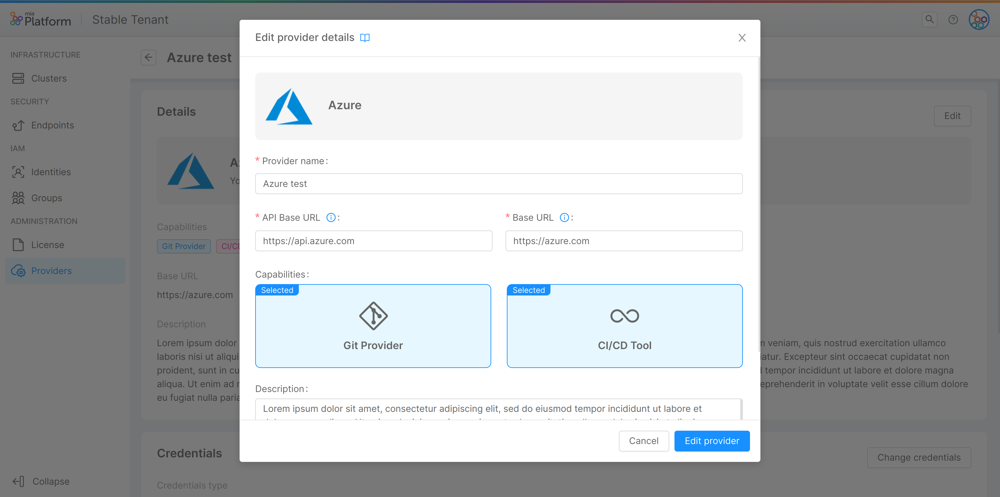

## Remove a Provider Connection

At the bottom section of a provider's detail page, there's a footer that offers the option to disconnect the provider from the Console.

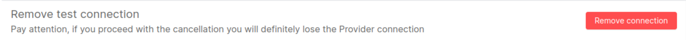

Upon clicking the "Remove" button, a modal will appear, requesting confirmation for the removal.

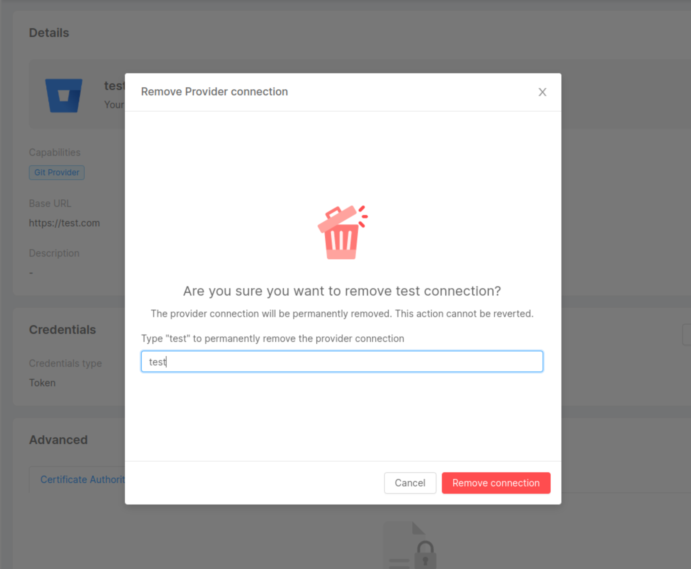

After typing the name into the input field and clicking `Remove`, a loading indicator will be displayed.

Upon completion of the request, you'll receive feedback indicating the successful removal. Closing the modal will redirect you to the providers' table. In cases of errors, an informative message will be displayed, and the `Close` button will not trigger a redirection.

:::caution
Removal of a provider connection is only possible under these two conditions:
- The provider is not in use by any company projects.
- The provider is not set as the default provider.
:::

Please ensure that the provider connection you wish to remove fulfills these requirements.

If you need to disconnect a provider from a project, you can refer to the [dedicated section](#associate-a-provider-to-a-project) later on this page.

Additional information on how to designate a different default provider can be found in the [upcoming section](#set-a-default-provider).

## Remove a Provider Connection

At the bottom section of a provider's detail page, there's a footer that offers the option to disconnect the provider from the Console.


Upon clicking the "Remove" button, a modal will appear, requesting confirmation for the removal.


After typing the name into the input field and clicking `Remove`, a loading indicator will be displayed.

Upon completion of the request, you'll receive feedback indicating the successful removal. Closing the modal will redirect you to the providers' table. In cases of errors, an informative message will be displayed, and the `Close` button will not trigger a redirection.

:::caution
Removal of a provider connection is only possible under these two conditions:
- The provider is not in use by any company projects.
- The provider is not set as the default provider.
:::

Please ensure that the provider connection you wish to remove fulfills these requirements.

If you need to disconnect a provider from a project, you can refer to the [dedicated section](#associate-a-provider-to-a-project) later on this page.

Additional information on how to designate a different default provider can be found in the [upcoming section](#set-a-default-provider).

## Set a Default Provider

After creating a provider connection, you can designate it as the default provider for a specific capability within your company.

Using the dedicated cards at the top of the providers' section, you can choose one of the providers that offers that specific capability.

Once the default provider has been set for a certain capability, the card will display the corresponding chosen provider. If no provider has been set, a "Set default capability" button will appear instead.

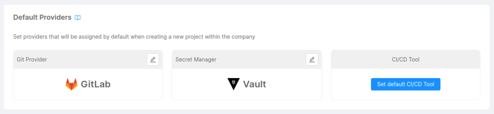

Setting a default provider for a company enables that provider to manage a specific capability for any project created within the company. This eliminates the need to manually specify a provider for your projects.

:::info
Default Providers are automatically associated with newly created projects within the company.
:::

:::caution
Make sure you have the necessary permissions to set or modify the default providers of a company.

**Only Company Owners will have access to this feature.**
:::

#### Edit a Default Provider

You can change the default provider connection for a specific capability by clicking the edit button located in the upper right corner of the default providers' cards.

A modal will appear, allowing you to select a provider that offers the specific capability:
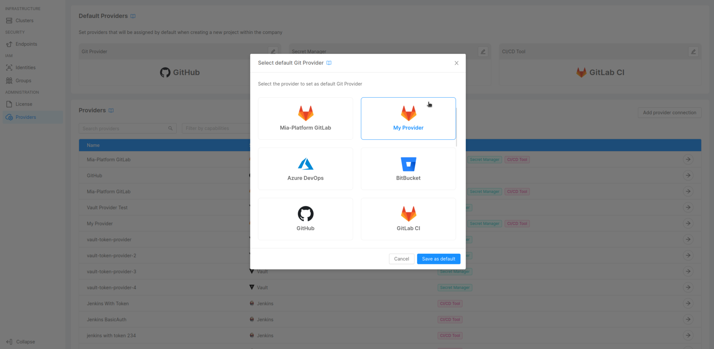

Once you edit the default provider, you will be able to see the card with the new provider set.

## Associate Providers with Projects

If you haven't specified a default provider for a particular capability or you wish to override the default provider configurations for a specific project within the company, you need to manually associate the provider with the project you want to use it for.

To accomplish this, you can utilize the CMS: navigate to the `Projects` section, select the desired project, and edit the document following the provided guidelines. These guidelines specify the information to include based on the provider type and capability.

### Edit Git Provider

:::warning
Data migration from the old to the new provider is not managed. If you want to replace the Git Provider, you will need to manually migrate your repository.
:::

To change the Git Provider of a project, simply edit the `providerId` field within the `Repository` object. Enter the `providerId` you want to use instead of the previous one (you can obtain this ID by moving to the `Providers` section of the CMS and finding the `providerId` of the referenced document).

Configuration remains the same for each supported provider type. Below is an example configuration of the `Repository` object for each supported provider.


Example Configuration:

  ```json
  {
    "providerId": "my-provider"
  }
  ```

### Edit Secret Manager

:::warning
Data migration from the old to the new provider is not managed. If you want to replace the Secret Manager, you will need to manually migrate your secret variables.
:::

To change the Secret Manager of a project, you need to modify the `Environment variables` object by updating the values of the following fields:

* **providerId**: the unique identifier of the provider (obtainable by navigating to the `Providers` section of the CMS and obtaining the `providerId` from the referenced document);
* **type** (*required*): one of the supported provider types. Refer to the table at the top of this page for the complete list of [supported providers](/development_suite/set-up-infrastructure/configure-provider.mdx).

Additionally, you might need to include the following information, depending on the provider type:


<Tabs>
    <TabItem value="gitlab" label="GitLab">

        - **baseUrl**: the base path from which the variables will be read.

        If not specified, variables will be read from the first parent group of the Configurations project in GitLab.

        As an example, if your GitLab project is saved in **`https://git.tools.mia-platform.eu/mia-platform/Test/configurations`**, the environment variables will be written in the **`mia-platform/Test`** group.

        - **storage**: additional settings related to the storage of environment variables within the GitLab installation.

        It is composed of the following properties:

        - **path**: specifies the exact location for reading variables, starting from the _baseUrl_.

        - **type**: the level of granularity with which variables are managed within the GitLab installation.

        It determines the scope within which variables will be available to the pipelines.

        Either one of the following:

        - `groups`: variables will be managed at the group level;
        - `projects`: variables will be managed at the project level.

    </TabItem>
</Tabs>


**Example Configurations**

<Tabs>
    <TabItem value="gitlab" label="GitLab">

        ```json
        {
            "providerId": "my-gitlab",
            "type": "gitlab",
            "baseUrl": "https://my-gitlab-host",
            "storage": {
            "type": "projects",
            "path": "clients/mia-platform/configurations"
        }
        }
        ```

    </TabItem>
    <TabItem value="vault" label="Vault">

        ```json
        {
            "providerId": "my-vault",
            "type": "vault"
        }
        ```

    </TabItem>
</Tabs>

**Changing the Secret Manager for a specific environment within the project is also an option. To achieve this, follow these steps:**

Modify the `environmentsVariables` object within the targeted environment in the `Environments` section. You can access this by navigating to `Environments` > *environment object* > `environmentsVariables` in the CMS. The fields you need to edit are the same as described earlier.

:::caution
Please note that you can switch the Secret Manager for individual environments, but the provider type used must remain consistent. For instance, if you're utilizing Vault as the Secret Manager for all environments, you can replace the Secret Manager for one of them with another instance of Vault. However, you cannot replace it with an instance of GitLab.
:::

### Edit CI/CD Tool

To modify the CI/CD Tool for a project, follow these steps:

1. Edit the `Pipelines` object by replacing the values of the following fields:
- **providerId**: The unique identifier of the provider (accessible by navigating to the `Providers` section of the CMS and finding the `providerId` of the relevant document).
- **type** (*required*): Choose from the supported provider types. Refer to the table at the top of this page for a comprehensive list of [supported providers](/development_suite/set-up-infrastructure/configure-provider.mdx).

2. Depending on the provider type, additional information may be required:

<Tabs>
    <TabItem value="azure-devops" label="Azure DevOps">

        - **azurePipelineId**: a unique identifier that can be used to reference and identify a pipeline.

        Learn more on how to retrieve the ID of a pipeline on the Azure DevOps [pipelines documentation](https://learn.microsoft.com/en-us/azure/devops/pipelines).

    </TabItem>
    <TabItem value="jenkins" label="Jenkins">

        - **options**: an object containing the `view` property.

        In Jenkins, pipeline views allow you to visualize and monitor your pipelines and their status in a more organized and user-friendly way, making it easier to track their progress and health.

        The `view` configuration includes the following fields:

        - **name**: the name of the visualization step where Jenkins pipelines are shown.

    </TabItem>
</Tabs>

**Example Configurations**

<Tabs>
    <TabItem value="gitlab" label="GitLab">

        ```json
        {
            "providerId": "my-gitlab",
            "type": "gitlab-ci"
        }
        ```
    </TabItem>
    <TabItem value="github" label="GitHub">

        ```json
        {
            "providerId": "my-github",
            "type": "github-actions"
        }
        ```
    </TabItem>
    <TabItem value="azure-devops" label="Azure DevOps">

        ```json
        {
            "providerId": "my-azure",
            "type": "azure-pipelines",
            "azurePipelineId": "{PIPELINE_ID}"
        }
        ```
    </TabItem>
    <TabItem value="jenkins" label="Jenkins">

        ```json
        {
            "providerId": "my-jenkins",
            "type": "jenkins",
            "options": {
            "view": { "name": "my-view" }
        }
        }
        ```
    </TabItem>
</Tabs>

### Change CI/CD Tool for a Specific Environment

You can also change the CI/CD Tool for a specific environment within the project by modifying the `deploy` object within the referenced environment in the `Environments` object. To do this, follow these steps:

1. From the CMS, navigate to `Environments` > *environment object* > `deploy`.
2. Modify the fields within the `deploy` object, which are the same as described above.

## Provider APIs

For versions prior to 10.8, the information provided above might not be applicable, as providers were managed directly through APIs. Here, we detail the APIs used to create and modify providers for backward compatibility:

- **POST** - `/api/backend/tenants/{tenantId}/providers`: Used to create a new provider.
- **PATCH** - `/api/backend/tenants/{tenantId}/providers/{providerId}`: Used to edit an existing provider.

:::info
These APIs are protected and accessible only if you belong to the `access_token_manager` group.
:::

### POST Request

To create a new provider, make a POST request to the respective API with the following format:

```sh
curl --location --request POST 'https://console-url/api/backend/tenants/my-example-company/providers' \
--header 'Cookie: sid={{CHANGE_ME_WITH_YOUR_SID}}' \
--header 'Content-Type: application/json' \
--data-raw '{"credentials":{"type":"token","content":{"accessToken":"my-super-super-super-secret-token"}},"id":"gitlab-id","label":"My GitLab Label","type":"gitlab","urls":{"apiBase":"https://gitlab-test.com/api","base":"https://gitlab-test.com"}}'
```

The body schema of the request should adhere to the following data model:

```json
"body": {
  "type": "object",
  "additionalProperties": false,
  "properties": {
    "providerId": { "type": "string" },
    "label": { "type": "string" },
    "description": { "type": "string" },
    "type": { "type": "string" },
    "capabilities": {
      "description": "Field introduced in v10.8 of the Console",
      "type": "array",
      "items": {
        "type": "string",
        "enum": ["git-provider", "secret-manager", "ci-cd-tool"],
      }
    },
    "urls": {
      "type": "object",
      "properties": {
        "base": { "type": "string" },
        "apiBase": { "type": "string" }
      },
      "required": ["base", "apiBase"]
    },
    "base64CA": { "type": "string" },
    "proxy": {
      "type": "object",
      "properties": {
        "url": { "type": "string" },
        "username": { "type": "string" },
        "password": { "type": "string" }
      },
      "required": ["url"]
    },
    "credentials": {
      "oneOf": [
        {
          "type": "object",
          "additionalProperties": false,
          "properties": {
            "type": {
              "type": "string",
              "const": "token"
            },
            "expirationDate": {
              "description": "Field introduced in v10.8 of the Console",
              "type": "string",
              "format": "date-time"
            },
            "content": {
              "type": "object",
              "additionalProperties": false,
              "properties": {
                "accessToken": { "type": "string" }
              },
              "required": ["accessToken"]
            }
          },
          "required": ["type", "content"]
        },
        {
          "type": "object",
          "additionalProperties": false,
          "properties": {
            "type": {
              "type": "string",
              "const": "userPass"
            },
            "expirationDate": {
              "description": "Field introduced in v10.8 of the Console",
              "type": "string",
              "format": "date-time"
            },
            "content": {
              "type": "object",
              "additionalProperties": false,
              "properties": {
                "userName": { "type": "string" },
                "password": { "type": "string" }
              },
              "required": ["userName", "password"]
            }
          },
          "required": ["type", "content"]
        },
        {
          "type": "object",
          "additionalProperties": false,
          "properties": {
            "type": {
              "type": "string",
              "const": "m2m"
            },
            "expirationDate": {
              "description": "Field introduced in v10.8 of the Console",
              "type": "string",
              "format": "date-time"
            },
            "content": {
              "type": "object",
              "additionalProperties": false,
              "properties": {
                "accessTokenURL": { "type": "string" },
                "token": { "type": "string" }
              },
              "required": ["accessTokenURL", "token"]
            }
          },
          "required": ["type", "content"]
        },
        {
          "type": "object",
          "additionalProperties": false,
          "properties": {
            "type": {
              "type": "string",
              "const": "client_credentials"
            },
            "expirationDate": {
              "description": "Field introduced in v10.8 of the Console",
              "type": "string",
              "format": "date-time"
            },
            "content": {
              "type": "object",
              "additionalProperties": false,
              "properties": {
                "accessTokenURL": { "type": "string" },
                "clientId": { "type": "string" },
                "clientSecret": { "type": "string" }
              },
              "required": ["accessTokenURL", "clientId", "clientSecret"]
            }
          },
          "required": ["type", "content"]
        }
      ]
    },
    "required": ["providerId", "type", "urls"]
  }
}
```

:::info Supported Credential Types

As discussed in the [previous section](#step-3-credentials), different types of providers support various types of credentials. The following table shows the credential types supported by each provider, referring to the data model shown above:

| Credential Type      | Providers                                                   |
| -------------------- |:-----------------------------------------------------------:|
| token                | gitlab, github, bitbucket-server, azure-devops, vault, jenkins |
| m2m                  | vault                                                       |
| client_credentials   | jenkins                                                     |
:::

:::caution Data Model Update

Starting from version 10.8 of the Console, the `capabilities` and `expirationDate` fields (within `credentials`) have been introduced. Keep this in mind when working with the examples below, as they assume that calls to this API are made by users with a Console version lower than 10.8.
:::

Examples of request bodies specific to each provider type are shown below.


<Tabs>
    <TabItem value="github" label="GitHub" default>

        ```json
        {
            "id": "my-github-provider",
            "label": "Mia-Platform GitHub",
            "type": "github",
            "urls": {
            "apiBase": "https://api.github.com",
            "base": "https://github.com"
        },
            "credentials": {
            "type": "token",
            "content": {
            "accessToken": "my-super-super-super-secret-token"
        }
        }
        }
        ```

    </TabItem>
    <TabItem value="gitlab" label="GitLab">

        ```json
        {
            "id": "gitlab-id",
            "label": "My GitLab Label",
            "type": "gitlab",
            "urls": {
            "apiBase": "https://gitlab-test.com/api",
            "base": "https://gitlab-test.com"
        },
            "credentials": {
            "type": "token",
            "content": {
            "accessToken": "my-super-super-super-secret-token"
        }
        }
        }
        ```

    </TabItem>
    <TabItem value="bitbucket-server" label="BitBucket Server">

        ```json
        {
            "id": "bitbucket-id",
            "label": "My BitBucket Server Label",
            "type": "bitbucket",
            "urls": {
            "apiBase": "https://bitbucket-test.com",
            "base": "https://gitlab-test.com"
        },
            "credentials": {
            "type": "token",
            "content": {
            "accessToken": "my-super-super-super-secret-token"
        }
        }
        }
        ```

    </TabItem>
    <TabItem value="azure-devops" label="Azure DevOps">

        ```json
        {
            "id": "azure-devops-id",
            "label": "Azure DevOps",
            "type": "azure-devops",
            "urls": {
            "apiBase": "https://dev.azure.com",
            "base": "https://dev.azure.com"
        },
            "credentials": {
            "type": "token",
            "content": {
            "accessToken": "my-super-super-super-secret-token"
        }
        }
        }
        ```

    </TabItem>
    <TabItem value="vault" label="Hashicorp Vault">

        ```json
        {
            "type": "vault",
            "urls": {
            "baseUrl": "https://vault.example.com/",
            "apiBaseUrl": "https://vault.example.com/"
        },
            "credentials": {
            "type": "m2m",
            "content": {
            "token": "vault-jwt-token",
            "accessTokenURL": "https://vault.example.com/v1/auth/kubenetes/login"
        }
        }
        }
        ```

    </TabItem>
    <TabItem value="jenkins" label="Jenkins OAuth 2.0">

        ```json
        {
            "type": "jenkins",
            "urls": {
            "baseUrl": "https://jenkins.example.com/",
            "apiBaseUrl": "https://jenkins.example.com/"
        },
            "credentials": {
            "type": "client_credentials",
            "content": {
            "clientId": "id",
            "clientSecret": "secret",
            "accessTokenURL": "https://jenkins.example.com/oauth2/login"
        }
        }
        }
        ```

    </TabItem>
</Tabs>

### PATCH Request

To edit an existing provider, you need to call the respective API as follows:

```sh
curl --location --request PATCH 'https://console-url/api/backend/tenants/my-example-company/providers/gitlab-id' \
--header 'Cookie: sid={{CHANGE_ME_WITH_YOUR_SID}}' \
--header 'Content-Type: application/json' \
--data-raw '{"credentials":{"type":"token","content":{"accessToken":"my-new-super-super-super-secret-token"}}}'
```

The request for this endpoint is identical to the previous one, except that the providerId must be included inside the endpoint parameters, not in the request body.
