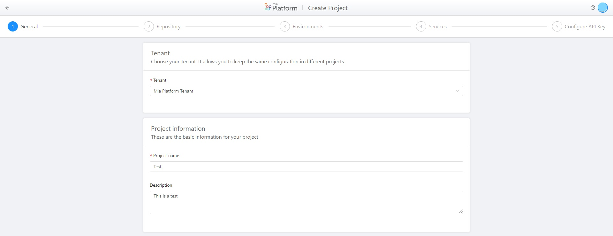
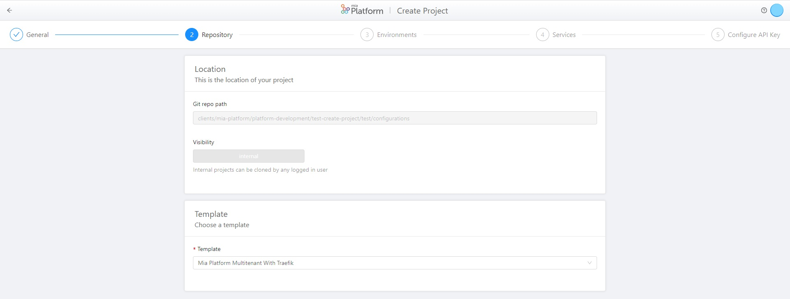
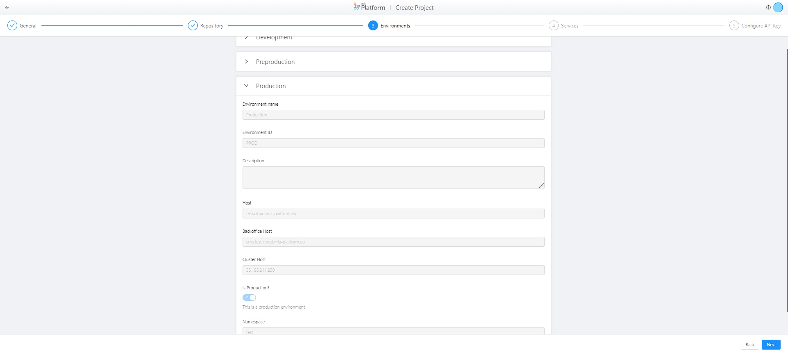
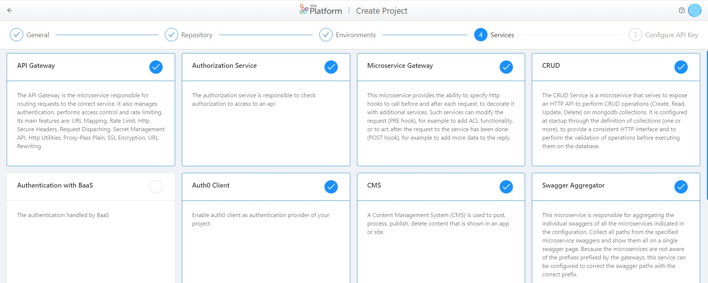
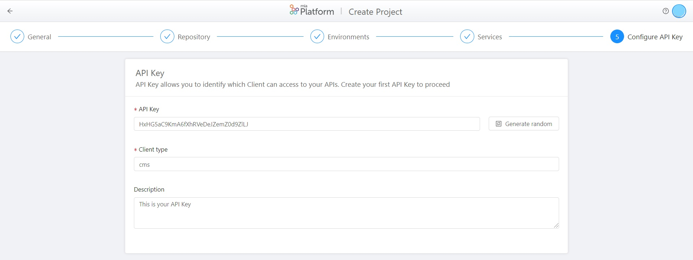

# Create a Project

In this page, you can find the guidelines about project creation.

The project creation allows you to have a project, which lifecycle could be completely managed and developed through DevOps Console areas.

The first three sections of this guide allows you to have the prerequisites to create a project, the last section explains in details how to create a project. In particular, to create a project, you need these features:

 * **Tenant**: This is the upper level of the projects. Each created project shares the same information (environments, CI/CD integration and cluster information) of its Tenant.

 * **Template**: Repository with libraries and pre-filled configurations. Each tenant could have one or more Template. With the template, you could pre-fill active services in you project and start the project from an existent template, starting with the same configuration for all the similar projects.

 * **DevOps Console**: This is the platform that allows you to manage the complete lifecycle of the project.

 If you already have these three features, you can directly skip to the last section.

 The power of project creation is based on the easiness and quickness of use: indeed, once Tenant and Template are configured, you can create a project with a minimum number of actions.

# Create a Tenant

If you already have a tenant, you could [skip this section](#create-a-template).

The tenant is useful to create a project configured inside an already existent infrastructure.
In an existent infrastructure some information are repeated for all the projects: *environments*, *cluster informations*, *CI/CD integration*.

!!! info
    The fields in the tenant cannot be changed during project creation steps (if not specified otherwise)

More in detail, to compile the tenant, you have to use the following guide:

* `name` (*required*): the name of the tenant to display in selection list;
* `tenantId` (*required*): the human readable id of the tenant (e.g. mia-platform). It must adhere to this regex: `(^[a-z]+[a-z0-9-]*$)`;
* `description`: the description of the tenant;
* `defaultTemplateId`: the default template to be used in project creation. This could be changed during the project creation wizard steps;
* `cmsImageName`: cms docker image to interpolate in template archive. It should contains also the cms tag to use (if `cms-site` service is disabled in project creation, it will not be used).
* `coreLegacyImageName`: baas core docker image to interpolate in template archive. It should contains also the cms tag to use (if `baas-legacy` service is disabled in project creation, it will not be used).
* `environments` (*required*): an array of objects containing the environments definition for the tenant. The content of this arrays will be interpolated to replate `%projectId%` with inserted `projectId` field in project creation. Any object should contains, for example:

    ```js
      {
        "label": "Development",
        "envId": "development",
        "envPrefix": "development",
        "hosts": [
          {
            "host": "%projectId%.test.mia-platform.eu"
          },
          {
            "host": "cms.%projectId%.test.mia-platform.eu",
            "isBackoffice": true
          }
        ],
        "cluster": {
          "clusterId": "human-readable-id-of-the-cluster",
          "hostname": "127.0.0.1", // hostname of the cluster
          "namespace": "%projectId%-development",
          "kubeContextVariables": {
            "KUBE_URL": "KUBE_DEV_URL",
            "KUBE_TOKEN": "KUBE_DEV_TOKEN"
          }
        }
      }
    ```
    !!! warning
        Do not set in cluster.kubeContextVariables object the plain values to access to the cluster. Write the variable key name for the specified environment (as in the example)! The values saved here are not encrypted.

* `environmentVariables`: an object describing the configuration to enable the setup infrastructure environment variables section. The only supported type is `gitlab`.

  There are three way to configure a project:

  1. **empty**: it is not set as a default in project creation, but should be configured manually.

  1. **only type configuration**, for example:
      ```json
        {
          "type": "gitlab"
        }
      ```
      The project read the variables from the first parent group of Configurations project in Gitlab.

      So, for example, with a gitlab project to be saved in
      `/clients/mia-platform/configurations`, the environment variables are written in `clients/mia-platform` group

  1. **complete configuration**, for example:
      ```json
        {
          "type": "gitlab",
          "baseUrl": "https://my-gitlab-host",
          "storage": {
            "type": "projects",
            "path": "clients/mia-platform/configurations"
          }
        }
      ```
      this configuration is saved only in tenant, and should be retrieved at runtime in project fetching from tenant info. So if your tenant has all the env variables of the projects set in one group, this could be changed for all the projects at the same time

* `pipelines` (*required*): the CI/CD pipelines used by the tenant. It is an object, for example:
    ```json
      {
        "type": "gitlab-ci"
      }
    ```

* `availableNamespaces`: namespaces accessible internally from your project, using `cross-projects` endpoint. It is useful when your tenant is made up of several projects that communicate with each other. The content of this array will be interpolated to replace `%projectId%` with `projectId` field in project creation.


# Create a template

If you already have a template, you could [skip this section](#create-a-template).

Once you choose a tenant, you could choose a template. A template contains some project specific information, it is a base on which to create your project.

!!! info
    The fields set by the template can be changed during project creation.

How to compile the tenant:

  * `name` (*required*): name of the template to display;
  * `templateId` (*required*): the human readable id of the tenant (e.g. mia-platform-multitenant-template). It must adhere to this regex: (^[a-z]+[a-z0-9-]*$);
  * `description`: the description of the template;
  * `archiveUrl`: url to a gzip of the base project configuration folder. All the contents of this folder will be copied into the target configuration, correctly interpolated. If you have to create a custom template, click [here](#how-to-create-a-project-archive) to see how.
  * `staticSecret`: some project could use the same static secret for a set of projects (especially used with an architecture with multiple `api-gateway` entrypoint). This is an object, for example:
      ```json
        {
          "secret": "ugAsOGB0crjx8hAxrvwiomHiGbUCNzvH",
          "active": true,
          "clientType":"cms"
        }
      ```
  * `enabledServices`: an object containing as key the service handled by the Console and as value a boolean. If the value is true, the service is enabled and the DevOps Console will generate the configuration for that service, otherwise it will be skipped by the Console. For example:
    ```json
      {
        "api-gateway": true,
        "microservice-gateway": true,
        "crud-service": true,
        "session-manager": false,
        "auth-service": false,
        "baas-legacy": false,
        "cms-site": true,
        "cms-backend": true,
        "v1-adapter": true,
        "export-service": true,
        "swagger-aggregator": true,
        "login-site": false,
        "api-portal": true,
        "auth0-client": true,
        "authorization-service": true,
        "oauth-login-site": true
      }
    ```

## How to create a project archive

The project archive is interpolated using [mustache](https://github.com/janl/mustache.js) as template system, using `%` as tags instead of default `{{` or `}}`.

You could create project template to avoid copy/paste in every new project the same base configuration.

At Mia, for example, we create a template to configure a project to use the platform configured to use auth0, headless cms, api portal and traefik configuration. So for a tenant using this template, create this type of project will be a very simple process.

The view, or the data you can interpolate, are some project data. With mustache, we could iterate through an array, so we could have some configuration iterated for all the environments.
The values you could use during template interpolation are:

For the project (you could access using `project.${field}`)
* projectId
* name
* configurationGitPath
* environments

Inside environments, you could access to:
* envId
* envPrefix
* cluster (an object containing `namespace` and `clusterId` string, `kubeContextVariables` object). Here you find the variables names for the specified environment where you set the cluster variable
* hosts (an array of object, with `host` and `isBackoffice` fields)

!!! warning
    Do not set in tenant in cluster.kubeContextVariables object the value to access to the cluster, but only the variable key name for the specified environment (as in example)! The values saved here are not encrypted.

An example of template for the `.gitlab-ci.yml` file:
```yml
include:
  # job template
  - project: 'platform/pipelines-templates'
    file: '/deploy/deploy-job.yml'
    ref: 'master'

%#tenant.cmsImageName%
variables:
  MIA_CMS_IMAGE_NAME: "%tenant.cmsImageName%"
%/tenant.cmsImageName%
%#project.environments%

%envId%:
  stage: release
  extends: .deploy_job

  variables:
    KUBE_URL: "\${cluster.kubeContextVariables.KUBE_URL}"
    KUBE_TOKEN: "\${cluster.kubeContextVariables.KUBE_TOKEN}"
    KUBE_CA_PEM: "\${cluster.kubeContextVariables.KUBE_CA_PEM}"
    ENVIRONMENT_PREFIX: "%envPrefix%_"

  only:
    variables:
      - $ENVIRONMENT_TO_DEPLOY == "%envId%"
%/project.environments%
```
In this example, we write the variables `MIA_CMS_IMAGE_NAME` only if cmsImageName is set in the tenant.

All the section between `%#project.environments%` and `%/project.environments%` will be written for `n` times, with `n` the number of environments. So, inside the environment, you could use the environment specific fields.
For other possibilities, please check [mustache](https://github.com/janl/mustache.js) documentation.

You may want to write a file or a folder for every environment. To enable this, you could write the file name (or folder) in template as `%envId%`. This will be interpolated for every environment.
The interpolation data in those files is the `environments` at the first level (as in `mustache` sections), but you have the project as a key for every environment.

# How to create a project on DevOps Console

If you have each pre-requisite mentioned in the first section of this page, you are able to create a new project with the button 'create project' in the Home area of DevOps Console.

The project creation is divided in 5 different sections:

## Section 1. **General**: 

In this section, you are required to insert the general information about your new project:

   * **Tenant** (*mandatory*): You have to select, from a list of pre-configured Tenants, your Tenant, which enables you to keep the same configuration for different projects.

   * **Project Name** (*mandatory*): This is the label of your project.

   * **Description** (*optional*): Allows you to keep trace of the project created.



## Section 2 **Repository**: 

In this section, it is indicated the location of your new project and you have to choose its Template:

   * **Git repo path** (*mandatory*, not editable): This is the path, gathered from Project Name and Tenant, that specifies the location of your project on GitLab.

   * **Visibility** (*mandatory*, copy not editable): The "Internal" visibility states that your project can be cloned by any logged-in user. 

   * **Template** (*mandatory*): You have to select,from a list of pre-configured Templates, your Template, which enables you to use pre-filled configurations for your project.

   

## Section 3. **Environments**: 

In this section, you are visualizing the configuration of your project's Development, Preproduction and Production environments. The following information are gathered from the selected Tenant and, so, are already configured and are not editable:

   * **Environemnt name** (*mandatory*, copy not editable): Name given to your environment.

   * **Environemnt ID** (*mandatory*, copy not editable): This is the label given to your environment.

   * **Description** (*mandatory*, copy not editable): Allows you to keep trace of the environment.
   
   * **Host** (*mandatory*, copy not editable): The host under which the documentation will be provided and the APIs will be available.

   * **Backoffice Host** (*mandatory*, copy not editable): The host under which CMS will be available.

   * **Cluster Host** (*mandatory*, copy not editable): This is the IP of the Host.

   * **Is production?** (*mandatory*, copy not editable): Defines if the environment is a production environment or not.

   * **Namespace** (*mandatory*, copy not editable): Name used as the namespace of kubernetes.



## Section 4. **Services**: 

In this section, you are selecting which services are going to be provided to your new project. The list of the services available is conformed with the Mia Platform license that you have purchased.



## Section 5. **Configure API Key**:

In this section, you are required to set up Client's accesses to your APIs:

   * **API Key** (*mandatory*): This is the secret, that can be created randomly.

   * **Client Type** (*mandatory*): Typology of the Client that wants to access to your APIs.

   * **Description** (*optional*): Allows you to keep trace of the API Key.



At the end of the process, your project will be created on GitLab, inside the selected repository, and will be visible on your Console.

Once your project has been created, you will land on the Set-up Infrastructure area of your new project, where you can see your environments and a list of environemnt variables:

* Some variables, like *CMS_IMAGE_NAME*, are mandatory and pre-filled, since they are gathered from Tenant.

* Some variables, like *CRUD_LIMIT_CONSTRAINT_ENABLED* and *LOG_LEVEL*, are ..... and have default values.

* Some variables, like .... *NOTIFICATIONS_COLLECTION_ROUTES* and *NOTIFICATIONS_SERVICE_PATH*, are mandatory, but not pre-filled: you have to edit these variables.

* Some variables, like *MONGODB_SHORT_URL*, *MONGODB_URL* and *REDIS_HOSTS*, are not pre-filled and are not mandatory.

These environment variables are saved on GitLab.

At the end of project creation, you have to commit and deploy your new project,

!!!Warning     
    In order to activate the CRUD for your project, you have to create a connection with Mongo.
