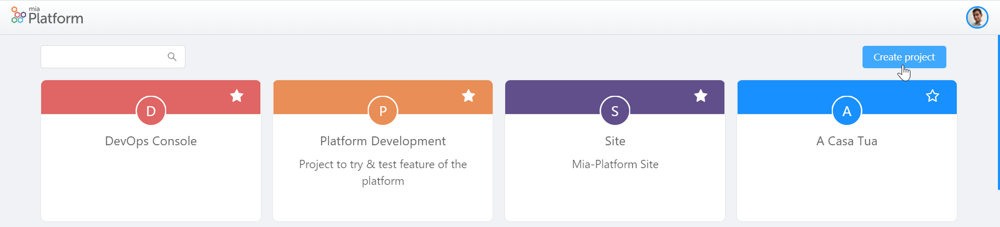
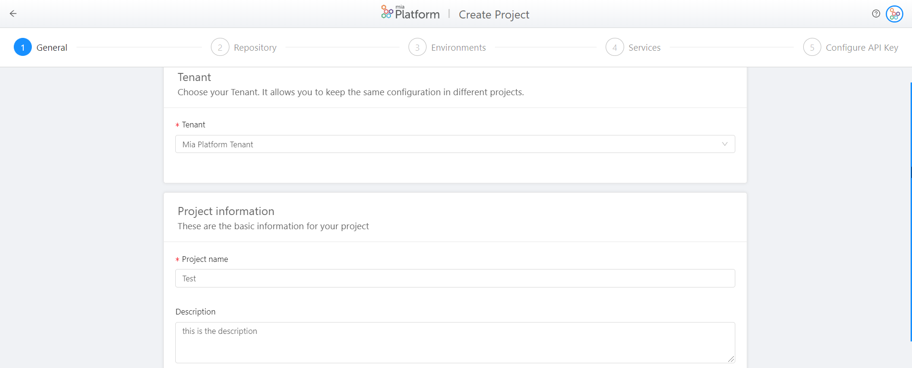
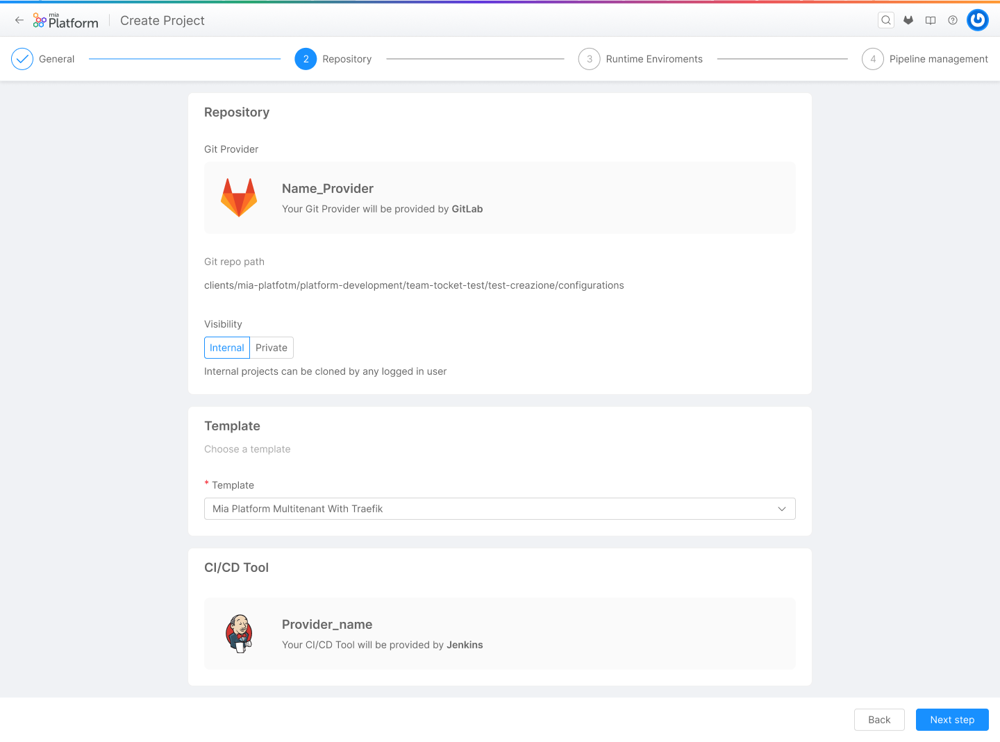
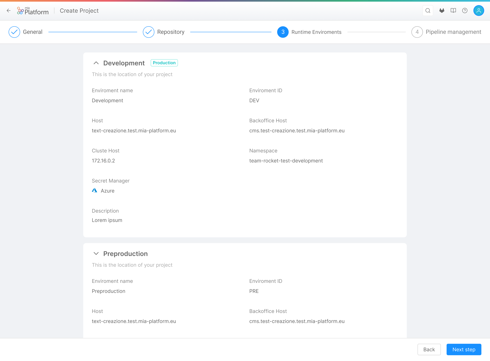
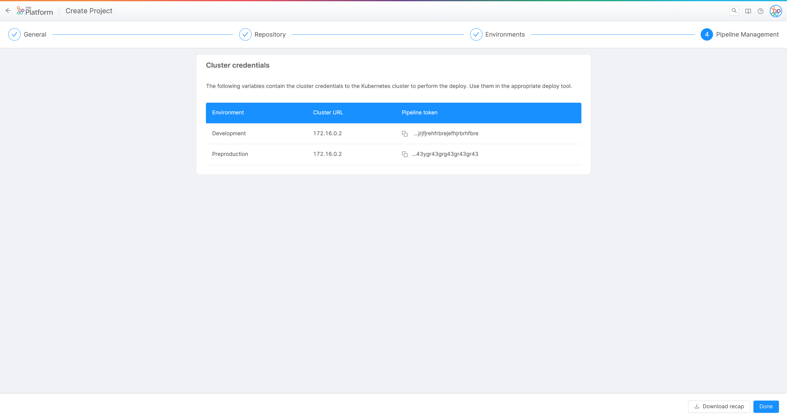
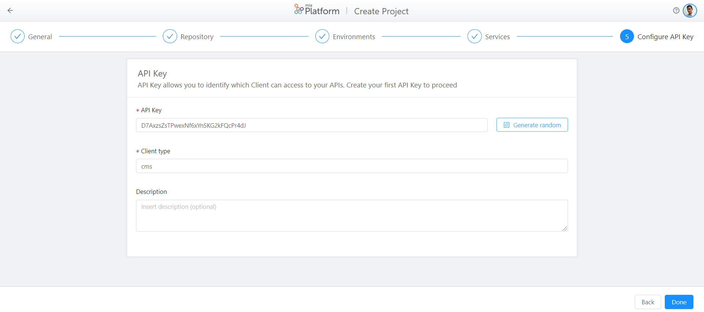

# Create a Project

In this page, you can find the guidelines about project creation.

The project creation allows you to configure a project, which lifecycle could be wholly managed and developed through DevOps Console areas.

The first three sections of this guide allow you to have the prerequisites to create a project. The last section explains in detail how to create a project. In particular, to create a project, you need to have already set up your DevOps Console and have already configured these two features:

 * **Tenant**: This is the upper level of the projects. Each created project shares the same information (environments, CI/CD integration and cluster information) of its tenant.

 * **Template**: Repository with libraries and pre-filled configurations. Each tenant could have one or more template. Starting the project from an existent template, you can pre-fill active services in your project and start all the similar projects with the same configuration. For example, the template can define the pipelines and the usage (or not usage) of CMS in your project.

 If you have already configured these two features, you can directly [skip to the last section](#how-to-create-a-project-on-devops-console).

 The power of project creation is based on the easiness and quickness of use: indeed, once Tenant and Template are configured, you can create a project in your DevOps Console with a minimum number of actions.

# Create a Tenant

If you already have a tenant, you can [skip this section](#create-a-template).

The tenant is the upper level of the projects. It allows to create a project configured inside an already existent infrastructure, which information are repeated for all the projects: *environments*, *cluster information*, *CI/CD integration*.

!!! info

    The fields in the tenant cannot be changed during project creation steps (if not specified otherwise).

More in detail, to compile the tenant, you have to use the following guide:

* `name` (*required*): the name of the tenant to display in selection list;
* `tenantId` (*required*): the human-readable id of the tenant (e.g. mia-platform). It must adhere to this regex: `(^[a-z]+[a-z0-9-]*$)`;
* `description`: the description of the tenant;
* `defaultTemplateId`: the default template to be used in project creation. This could be changed during the project creation wizard steps;
* `cmsImageName`: cms docker image to interpolate in template archive. It should also contain the cms tag to use (if `cms-site` service is disabled in project creation, it will not be used).
* `coreLegacyImageName`: baas core docker image to interpolate in template archive. It should also contain the cms tag to use (if `baas-legacy` service is disabled in project creation, it will not be used).
* `environments` (*required*): an array of objects containing the definition of the environments for the tenant. The content of these arrays will be interpolated to replace `%projectId%` by inserting `projectId` field in project creation. Each object should contain, for example:

    ```js
      {
        "label": "Development",
        "envId": "development",
        "envPrefix": "development",
        "hosts": [
          {
            "host": "%projectId%.test.mia-platform.eu"
          },
          {
            "host": "cms.%projectId%.test.mia-platform.eu",
            "isBackoffice": true
          }
        ],
        "cluster": {
          "clusterId": "human-readable-id-of-the-cluster",
          "hostname": "127.0.0.1", // hostname of the cluster
          "namespace": "%projectId%-development",
          "kubeContextVariables": {
            "KUBE_URL": "KUBE_DEV_URL",
            "KUBE_TOKEN": "KUBE_DEV_TOKEN"
          }
        }
      }
    ```
    !!! warning

        Do not set in cluster.kubeContextVariables object the plain values to access to the cluster. Write the variable key name for the specified environment (as in the example)! The values saved here are not encrypted.

* `environmentVariables`: an object that describes the configuration to enable the setup infrastructure environment variables section. The only supported type is `gitlab`.

  There are three ways to configure a project:

  1. **empty**: it is not set as a default in project creation, but should be configured manually after the project creation.

  1. **only type configuration**, for example:
      ```json
        {
          "type": "gitlab"
        }
      ```
      The project reads the variables from the first parent group of Configurations project in Gitlab.

      So, for example, with a gitlab project to be saved in
      `/clients/mia-platform/configurations`, the environment variables are written in `clients/mia-platform` group.

  1. **complete configuration**, for example:
      ```json
        {
          "type": "gitlab",
          "baseUrl": "https://my-gitlab-host",
          "storage": {
            "type": "projects",
            "path": "clients/mia-platform/configurations"
          }
        }
      ```
      this configuration is saved only in tenant, and should be retrieved at runtime in project fetching from tenant info. So if your tenant has all the environment variables of the projects set in the parent group, this setting could be changed for all the projects at the same time.

* `pipelines` (*required*): the CI/CD pipelines used by the tenant. It is an object, for example:
    ```json
      {
        "type": "gitlab-ci"
      }
    ```

* `availableNamespaces`: namespaces accessible internally from your project, using `cross-projects` endpoint. It is useful when your tenant is made up of several projects that communicate with each other. The content of this array will be interpolated to replace `%projectId%` with `projectId` field in project creation.


# Create a template

If you already have a template, you can [skip this section](#how-to-create-a-project-archive).

The template is a repository which contains some project's specific information. Once you choose a tenant, you could choose a template. The template allows you to pre-fill active services in your project and starts all the similar projects with the same configuration. So, it is a base on which to create your project.

!!! info

    The fields set by the template can be changed during project creation.

How to compile the template:

  * `name` (*required*): name of the template to display;
  * `templateId` (*required*): the human-readable id of the template (e.g. mia-platform-multitenant-template). It must adhere to this regex: (^[a-z]+[a-z0-9-]*$);
  * `description`: the description of the template;
  * `archiveUrl`: URL to a gzip of the base project configuration folder. All the contents of this folder will be copied into the target configuration, correctly interpolated. If you have to create a custom template, click [here](#how-to-create-a-project-archive) to see how.
  * `staticSecret`: some project could use the same static secret for a set of projects (especially used with architecture with multiple `api-gateway` entrypoints). Keys are optional. This is an object, for example:
      ```json
        {
          "secret": "ugAsOGB0crjx8hAxrvwiomHiGbUCNzvH",
          "clientType":"cms"
        }
      ```
  * `enabledServices`: an object that contains as key the service handled by the Console and as value a boolean. If the value is true, the service is enabled and the DevOps Console will generate the configuration for that service, otherwise it will be skipped by the Console. For example:
    ```json
      {
        "api-gateway": true,
        "microservice-gateway": true,
        "crud-service": true,
        "session-manager": false,
        "auth-service": false,
        "baas-legacy": false,
        "cms-site": true,
        "cms-backend": true,
        "v1-adapter": true,
        "export-service": true,
        "swagger-aggregator": true,
        "login-site": false,
        "api-portal": true,
        "auth0-client": true,
        "authorization-service": true,
        "oauth-login-site": true
      }
    ```

## How to create a project archive

The project archive is interpolated using [mustache.js](https://github.com/janl/mustache.js) as template system, using `%` as tags instead of default `{{` or `}}`.

*mustache.js* is a web template system, which allows you to generate custom templates by replacing all the general information, present in the web template, with your product or organization information.

You could create project template to avoid copy/paste in every new project the same base configuration.

At Mia Platform, for example, we create a template to configure a project to use Auth0, headless CMS, API portal and Traefik configuration. So for a tenant that uses this template, create this type of project will be a very simple process.

You can interpolate the template with some project data. With *mustache.js*, we could iterate through an array, so we can have some configuration iterated for all the environments.
The values you could use during template interpolation are:

For the project (you could access using `project.${field}`)
* projectId
* name
* configurationGitPath
* environments

Inside environments, you could access to:
* envId
* envPrefix
* cluster (an object containing `namespace` and `clusterId` string, `kubeContextVariables` object). Here you find the variables names for the specified environment where you set the cluster variable
* hosts (an array of object, with `host` and `isBackoffice` fields)

!!! warning

    Do not set in tenant in cluster.kubeContextVariables object the value to access to the cluster, but only the variable key name for the specified environment (as in the example)! The values saved here are not encrypted.

An example of template for the `.gitlab-ci.yml` file:
```yml
include:
  # job template
  - project: 'platform/pipelines-templates'
    file: '/deploy/deploy-job.yml'
    ref: 'master'

%#tenant.cmsImageName%
variables:
  MIA_CMS_IMAGE_NAME: "%tenant.cmsImageName%"
%/tenant.cmsImageName%
%#project.environments%

%envId%:
  stage: release
  extends: .deploy_job

  variables:
    KUBE_URL: "\${cluster.kubeContextVariables.KUBE_URL}"
    KUBE_TOKEN: "\${cluster.kubeContextVariables.KUBE_TOKEN}"
    KUBE_CA_PEM: "\${cluster.kubeContextVariables.KUBE_CA_PEM}"
    ENVIRONMENT_PREFIX: "%envPrefix%_"

  only:
    variables:
      - $ENVIRONMENT_TO_DEPLOY == "%envId%"
%/project.environments%
```
In this example, we write the variables `MIA_CMS_IMAGE_NAME` only if cmsImageName is set in the tenant.

All the section between `%#project.environments%` and `%/project.environments%` will be written for `n` times, where `n` is the number of environments. So, inside the environment, you could use the environment specific fields.
For other possibilities, please check [mustache.js](https://github.com/janl/mustache.js) documentation.

You may want to write a file or a folder for every environment. To enable this, you could write the file name (or folder) in template as `%envId%`. This will be interpolated for every environment.
The interpolation data in those files are the environments fields at the first level (as in `mustache.js` sections), with the project as a key for every environment.

# How to create a project on DevOps Console

Once you have the tenant and the template correctly configured, you are able to create a new project with the button 'Create project' in the Home area of DevOps Console.



The project creation is divided in 5 different steps:

## Step 1. **General**: 

In this step, you are required to insert the general information about your new project:

   * **Tenant** (*required*): you have to select, from a list of pre-configured Tenants, your Tenant, which enables you to keep the same configuration for different projects.

   * **Project Name** (*required*): the name of your project, which will be shown in the project card in the Home section of DevOps Console.

   * **Description** (*optional*): this is the description of your new project, which will be shown in the project card in the Home section of DevOps Console.



## Step 2 **Repository**: 

In this step, it is indicated the location of your new project and you have to choose its Template:

   * **Git repo path** (*required*, field not editable): this is the path, calculated from project name and tenant, where the configuration will be saved on GitLab. It specifies the location of your project on GitLab.

   * **Visibility** (*required*, field not editable): the visibility states the status of your project once it will be saved in Gitlab. If it is `internal`, all the internal users of the Gitlab instance could see the project. If it is `private`, only who has access to the repository can see the project.

   * **Template** (*required*): you have to select, from a list of pre-configured Templates, your Template, which enables you to use pre-filled configurations for your project.

   

## Step 3. **Environments**: 

In this step, an overview of the configuration of your project environments is presented. The following information are retrieved from the selected Tenant and, so, are already configured and not editable:

   * **Environemnt name** (*required*, field not editable): the name given to your environment.

   * **Environemnt ID** (*required*, field not editable): the human-readable ID set to your environment.

   * **Description** (*required*, field not editable): this is the description of the environment.
   
   * **Host** (*required*, field not editable): the host which exposes the documentation and the APIs.

   * **Backoffice Host** (*required*, field not editable): the host which exposes CMS and backoffice APIs.

   * **Cluster Host** (*required*, field not editable): this is the IP of the Kubernetes cluster where the project will be deployed.

   * **Is production?** (*required*, field not editable): defines if the environment is a production environment or not.

   * **Namespace** (*required*, field not editable): this is the namespace of kubernetes.



## Step 4. **Services**: 

In this step, you are selecting which services are going to be provided to your new project. The list of the services available is conformed with the Mia Platform license that you have purchased.



## Step 5. **Configure API Key**:

In this step, you are required to set up Client's accesses to your APIs:

   * **API Key** (*required*): this is the API Key. It can be generated randomly.

   * **Client Type** (*required*): ID of the client that wants to access to your APIs.

   * **Description** (*optional*): this is the description of the API Key.



At the end of the process, your project will be created on GitLab, inside the selected repository, and will be visible in the Home section of your DevOps Console.

Once your project has been created, you will be redirected on the Setup Infrastructure area of your new project, where you can see your environments and a list of environment variables:

* Some variables are pre-filled from project or tenant information (like *CMS_IMAGE_NAME*, *CRUD_LIMIT_CONSTRAINT_ENABLED* and *LOG_LEVEL*). Other variables are not pre-filled (like *NOTIFICATIONS_COLLECTION_ROUTES* and *NOTIFICATIONS_SERVICE_PATH*).

* All the variables are mandatory, except  CRUD_LIMIT_CONSTRAINT_ENABLED, NOTIFICATIONS_SERVICE_PATH and NOTIFICATIONS_COLLECTION_ROUTES: you have to configure all the variables that are mandatory and not pre-filled like *MONGODB_SHORT_URL*, *MONGODB_URL* and *REDIS_HOSTS*.

These environment variables are saved on GitLab.

At the end of project creation, you have to commit and deploy your new project to finish the process effectively.

## Final Step. **Activate CRUD**: 

To activate the CRUD for your project, you can contact your Mia Platform's responsible for creating a connection with MongoDB.