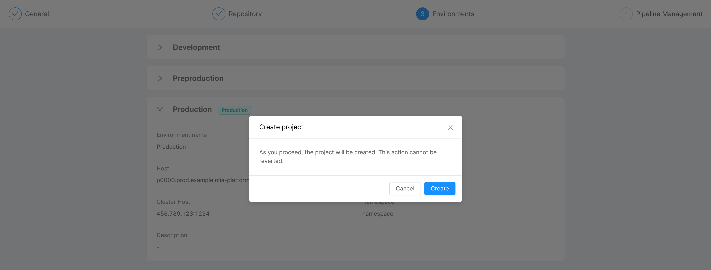

import Tabs from '@theme/Tabs';
import TabItem from '@theme/TabItem';

The project creation process allows you to configure a project,
which lifecycle can then be entirely managed and developed through Console areas.

## Prerequisites

The first section of this guide allows you to gain the prerequisites needed to create a project.
In particular, to create a project, you need to have already set up your Console and configured these three resources:

* **Company**: A company is the resource which has the governance of all the projects inside it.
Each created project starts with the default information (providers, environments, CI/CD integration and cluster information) of its company.
To create a company, refers to the [create company guide](/development_suite/company/create.md);
* **Provider**: This will be used by the Console to correctly retrieve the third party service providers needed by your projects.
You can create a Git provider by setting up a specific document following the procedure described [here](/development_suite/set-up-infrastructure/configure-provider.mdx).
This document will be used by services to correctly retrieve the information about the provider that you use for your projects.
* **Template**: Repository with pre-filled configurations. Each company could have one or more template.
The template allows you to pre-fill resources in your project and start all the similar projects with the same configuration.
In short, it constitutes a base on which to create your project. [This link to a guide on how to handle project template](/development_suite/company/project-templates.md).

Once you have provider, company, and template correctly configured, you are able to create a new project.

To create a new project, you must have the permission `console.company.project.create`.

## Project creation

To create the project, use the `Create project` button in the Home area of the Console.


The project creation is divided in three different steps.

### Step 1: **General**

In this step, you are required to insert the general information about your new project:

* **Company** (*required*): you are required to select, from a list of pre-configured companies, your company, which enables you to keep the same configuration for different projects;
* **Project name** (*required*): the name of your project, which will be shown in the project card in the Home section of the Console;
* **Description**: the description of your project, which will be shown in the project card in the Home section of the Console.
  


### Step 2: **Repository**

In this step, it is indicated the location of your new project and you have to choose its template:

* **Git Provider**: this field represents the provider ID used by your chosen company (e.g. *gitlab*, *github*, *azure-devops*, *bitbucket*);
* **Git repo path**: this is the path, calculated from project name and company, where the configuration will be saved on the Git provider. It specifies the location of your project on the Git provider website;
* **Visibility**: the visibility states the status of your project once it will be saved on the Git provider. If it is `internal`, all the internal users of the Git provider instance can see the project. If it is `private`, only who has access to the repository can see the project;
* **Template** (*required*): you have to select, from a list of pre-configured templates, your template, which enables you to use pre-filled configurations for your project.

:::tip
If you are using the PaaS Mia-Platform Console, two main templates are available: one with all the core services, and the other which is similar, but without CMS. More information about how to use them at [the bottom of this page](#setup-paas-templates).
:::


### Step 3: **Environments**

In this step, an overview of the configuration of your project environments is presented. This section is entirely read-only, since the information displayed are retrieved from the selected company and, therefore, they are already configured and not editable:

* **Environment name**: the name given to your environment;
* **Environment ID**: the human-readable ID set to your environment;
* **Host**: the host which exposes documentation and APIs;
* **Backoffice Host**: the host which exposes CMS and backoffice APIs;
* **Cluster Host**: the IP of the Kubernetes cluster where the project will be deployed;
* **Namespace**: the namespace taken from Kubernetes;
* **Description**: the description of your environment.

Moreover, a label **Production** is displayed next to the title of the dropdown card in case the corresponding environment is labeled as a production environment.


For security reasons, and since after this step the project will be effectively created, when trying to proceed further a confirmation modal is displayed. By clicking on *Create*, the project will be irreversibly generated.



At the end of the process, your project will be visible in the Home section of your Console.

Once your project has been created, you will be redirected on the Project Settings area of your new project, where you can see your environments and a list of environment variables:

* Some variables are pre-filled from project or company information (like *CMS_IMAGE_NAME*, *CRUD_LIMIT_CONSTRAINT_ENABLED*, and *LOG_LEVEL*). Other variables are not pre-filled (such as *NOTIFICATIONS_COLLECTION_ROUTES* and *NOTIFICATIONS_SERVICE_PATH*);
* All variables are mandatory, except  *CRUD_LIMIT_CONSTRAINT_ENABLED*, *NOTIFICATIONS_SERVICE_PATH*, and *NOTIFICATIONS_COLLECTION_ROUTES*: you have to manually configure all the variables that are mandatory and not pre-filled like *MONGODB_SHORT_URL*, *MONGODB_URL*, and *REDIS_HOSTS*.

These environment variables are saved on the Git provider.

The Console automatically tries to create the namespace for each environment in the project, and if the creation is successful it also sets the following labels in the namespace:

Label|Value
-|-
`mia-platform.eu/company`|`tenantId`
`mia-platform.eu/environment`|`envId`
`mia-platform.eu/project`|`projectId`

After the project creation phase, you have to commit and deploy your new project to effectively conclude the process.

#### A note about Project Metrics

When a production environment is defined for a project, a preview of its **Kubernetes Metrics** will be rendered inside the related card in the Home Page. These metrics will show the following information:

* Environment name;
* Status (healthy, down);
* Number of pods up and running;
* CPU usage;
* RAM usage.

## Customize the project with additional information (Optional)

In order to improve the governance of your project, you may want to add additional details such as:

* `technologies`: the list of technologies used in the project codebase;
* `projectOwner` and `teamContact`: the name and contact of the project owner;
* `color`: a custom color that can be used as an additional categorization, especially if a label has been already defined (e.g. you may decide within your organization that all projects flagged with a *gateway* are associated with the same color);
* `layerId`: a label which identifies a logical layer and can help to categorize projects in custom groups (e.g. *gateway* or *data-lake* are some samples of logical layer names that can be applied to a project);
The `layerId` must be equal to one of the layer names inside the `logicalScopeLayers` property of the related **tenant** object. When the layer is found within the company, the project model is enriched with the `logicalScopeLayers` property according to the values found;
* `logicalScopeLayers`: an array of objects shaped as follows:
  * **name**: identifies the name of the logical layer;
  * **order**: identifies the numerical order of the layer, in order to display it according to the sorting defined by the user.

`layerId` and `logicalScopeLayers` are mutually exclusive, since the former must be used when a `tenantId` is specified for the project, while the latter must not.

### CMS Configurations

All the above properties can be defined via CMS after a project has been created, because they only provide extra information that will be eventually rendered in the Home Page of the Console.

Let's say we have created a project as follows:

```json
{
    "_id": "ObjectId(...)",
    "name": "frontend gateway",
    "projectId": "frontend-gateway",
    "configurationGitPath": "git-config-path",
    "repositoryUrl": "http://example.repository/git-config-path",
    "tenantId": "mia-platform"
}
```

To configure all the extra details to a project, just add the `info`, `layerId`/`logicalScopeLayers`, and the `color` properties via the CMS Interface.

### Project Information

To add extra info about `projectOwner`, `teamContact`, and `technologies` for a single project, you can simply edit the *Information* field:

```json
{
    "projectOwner": "John Smith",
    "teamContact": "j.smith@email.it ",
    "technologies": [
        "java",
        "node"
    ]
}
```

### Custom Color

To edit the custom `color` associated with a project, just change the value in the *Project Color* field:


### Layer Identifier (layerId)

If the project has a `tenantId` that includes a definition for its `logicalScopeLayers`, then the *Layer Identifier* field can be defined by simply specifying a layer name that exists in the related `logicalScopeLayers`:


### Logical scope layer (logicalScopeLayers)

Alternatively to the above step, if the project isn't under a `tenantId`, then `logicalScopeLayers` can be defined directly by editing the *Logical Scope Layer* field:


At the end of the configuration, on the backend side, the project will have the following data structure:

### Monitoring

`monitoring`: object which describes the monitoring tools supported by the project. For example:

```json
{
  "systems": [
    {
      "type": "prometheus-operator"
    }
  ]
}
```

* **type**: so far, only one type of monitoring system is supported: `prometheus-operator`.

In case `type` is set to `prometheus-operator`, you will be able to configure the creation of the `service monitor` for your microservices.
More information about this feature [here](/development_suite/api-console/api-design/microservice-monitoring.md).

### Sample of project data structure

```json
{
    "_id": "ObjectId(...)",
    "name": "frontend gateway",
    "projectId": "frontend-gateway",
    "configurationGitPath": "git-congif-path",
    "repositoryUrl": "http://example.repository/git-config-path",
    "tenantId": "mia-platform",
    "info": {
      "projectOwner": "John Smith",
      "teamContact": "john.smith@email.com",
      "technologies": ["javascript", "dockerfile", "shell"]
    },
    "layerId": "gateway",
    "color": "green"
  }
```

When loading the Home Page of the Console, the project `Frontend Gateway` will be rendered accordingly:


### Setup PaaS templates

If you are using the PaaS Console, the following templates are available:

* `Mia-Platform Basic Project Template`: it contains an empty project exposed with Traefik Ingress with `Kustomize` project structure;
* `Basic Project Template without IngressRoute`: it contains an empty project not exposed.

A project created with one of these templates is ready to use.
You could start creating a new service [from the Marketplace](/development_suite/api-console/api-design/services.md).

### Configure Security Features

From the CMS page it is possible to configure a set of security features in order to enrich the configuration of your project.

Those features are all set to `true` by default and can be switched off for testing or to account for compatibility issues, by managing the properties of the `securityFeatures` key.

```json
{
  seccompProfile: { type: 'boolean' },
  appArmor: { type: 'boolean' },
  hostProperties: { type: 'boolean' },
  privilegedPod: { type: 'boolean' }
}
```

Head over to the [security features documentation](/development_suite/api-console/api-design/security.md) to better understand which capabilities are implemented.
