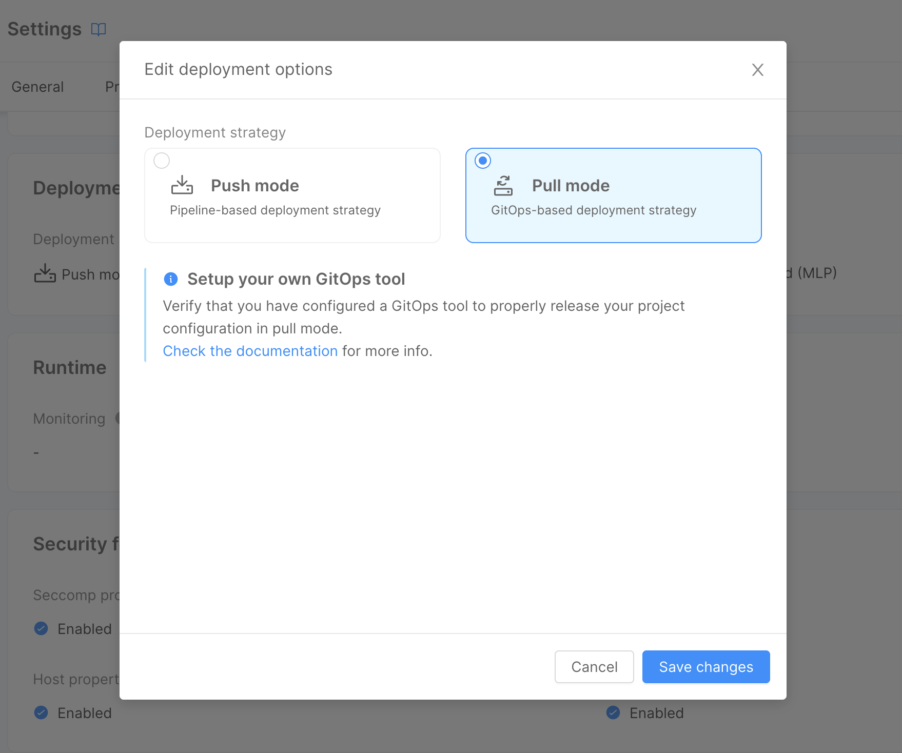

import Tabs from "@theme/Tabs"
import TabItem from "@theme/TabItem"

:::info
This is a **BETA** feature and, as such, is currently under active development.

It can be safely used but there may still be some missing features: check the [roadmap section](#roadmap-and-future-improvements) below to find out more.
:::

The **Enhanced Project Workflow** feature aims at providing a better developer experience when working with Mia-Platform Console, as well as pave the way for the adoption of previously unavailable opportunities, such as the [GitOps deployment strategy](/development_suite/deploy/gitops-based/index.md).

## Benefits of the Enhanced Workflow

The technological changes underlying this new workflow provide improvements in both *user experience* and *development of future functionalities*; as such, there are several benefits of adopting the **Enhanced Project Workflow**:

### Tailored orchestrator configurations

By generating the orchestrator objects (e.g. *Kubernetes Deployment files*) at deploy time, the **generated configuration files can now be tailored for the selected environment**. 

Generated configurations are still saved on your Git provider repository in different directories, based on the deployed environment.  
You can review the configuration prior the commit by leveraging the [review feature](#kubernetes-configuration-review-and-export).

### GitOps Support

As mentioned, one of the most relevant features of the **Enhanced Project Workflow** is the [GitOps deployment strategy](/development_suite/deploy/gitops-based/index.md) support.

This means you can leverage Mia-Platform Console and **run deployments with your favorite GitOps tool** (e.g. [ArgoCD](/development_suite/deploy/gitops-based/configure-argocd.md))

### Faster Design and general performance improvements

A great bottleneck in the Standard Project Workflow is the frequent interaction with the Git Provider during configuration management activities. **Moving away from such an architecture** and limiting the interactions only when they are truly needed (e.g. saving orchestrator configurations on git) **allowed us to provide a faster user experience**. 

The Console Area that benefits the most from such performance improvements is the Design Area where, for example, **the average time** for loading a Project configuration has moved **from ~4s to ~200ms**.

### Design advanced section featured in Merge

The [Advanced section](/development_suite/api-console/advanced-section/index.md) in Design Area is featured in all stages of the workflow, and no longer needs a separate configuration management strategy. This means that you can safely use this section without worrying about duplicate commits or the inability to manage extensions during merge of configurations.

### New features

As if the previous benefits were not enough, there is already a set of **new features available only for Enhanced Project Workflow**:

-  [GitOps deployment support](/development_suite/deploy/gitops-based/index.md)
-  [External Orchestrator Generator](/console/company-configuration/providers/extensions/orchestrator-generator.mdx)
-  [Configurations review and export](#kubernetes-configuration-review-and-export)

And more features to come, such as:

- Saving history with comparison of saved configurations within Design Area
- Project configuration import from a runtime
- Compare generated configuration files with last deployed configuration
- ...and more, check out the [roadmap section](#roadmap-and-future-improvements) for further information

## Changes to the Console workflow

The following sections will highlight the changes made to the established Console workflow, regarding in particular the new management of the Project logical state, and the new deployment workflow.

### New configuration management strategy

The most relevant change in the Console behavior is that the Project logical state will not be saved on your Git repository anymore. This results in significant **performance improvement** during the main Console workflows (especially in the [Design Area](/development_suite/api-console/api-design/overview.md)), since contacting the Git provider implied a considerable overhead that has now been completely removed.

This change also means that the Console will not rely on the typical Git-based instruments anymore and will instead adopt a **new configuration management system**, while still maintaining consistency with the established workflows; to emphasize this, the following features have been renamed:
- `Branches` and `Tags` become **`Revisions`** and **`Versions`**
- the `Commit history` becomes **`Revision history`**

Developers can manage *revisions* and *versions* from the dedicated sections inside the Overview area. Revisions can be accessed and deleted from the Revisions management page:


Versions with their description and release note can be viewed and deleted through the versions management page:

:::info
Versions can only be deleted by Project Administrators.
:::


### Revision history

To keep track of the Project evolution, the user can create `versions` (similar to Git tags) that act as immutable snapshots of the configuration in a particular moment. To keep track of how a revision has changed over time, the user can access its [revision history](#revision-history), which contains past snapshots of the Project configuration.


The revision history, accessible by clicking the related icon inside the branch selection area, contains a list of snapshots of the Project configuration, created each time it has been saved, on a certain revision or version. It also includes useful information such as the snapshot date, author, associated message, and any tags created with it. Moreover, the right-side button will show the differences between the selected snapshot and the previous one, in order to have a better understanding of the changes applied to the revision.

### New deployment workflow

Another significant change is the way Console configurations are saved and deployed: Kubernetes **configurations will be generated and committed** to the Git repository only **during the deployment process**.

:::caution
When deploying your configurations to the cluster, keep in mind that only the changes pushed to the repository default branch will be considered.

If you want configuration to be committed on a different branch you can change the `repository.configurationBranch` property in your Project configuration (currently available only from CMS).
:::

When Kubernetes configurations are generated, they get tailored for the specific environment you are deploying to. For this reason, [Public Variables](/development_suite/api-console/api-design/public_variables.md) interpolation is now performed during configuration generation and, as such, can be skipped during the deployment pipeline. Therefore, the Public Variables feature is now available even to Projects that are not using [`mlp`](/runtime_suite_tools/mlp/10_overview.md) or have a pipeline that does not support running custom code to execute variable interpolation.

The new deployment workflow also unlocks the possibility to adopt a **pull-based deployment strategy**, in which a GitOps tool can be set up to automatically align the cluster state to the latest changes pushed to the Git repository. To find out more about pull-based deployment and its advantages, visit the [GitOps deployment strategy documentation page](/development_suite/deploy/gitops-based/index.md).

### Kubernetes configuration review and export

This workflow enables users to review and export generated configurations before these are even deployed to the cluster.  
This feature is available from the [Deploy Page](/development_suite/deploy/overview.md#export-and-review-configuration-files) after selecting the revision to deploy.

## Best Practices

With the **Enhanced Project Workflow** paradigm shift, working with the Console may require some habit changes; this section presents some best practices that may help with such change.

### Revision management

Working with revisions in the Enhanced Workflow is not that different from working with branches in the Standard Workflow; revisions have their own history and can be deployed on different environments, therefore patterns such as **Git Flow** or **Trunk-based development** can be applied to the **Enhanced Project Workflow** as well.

#### Trunk-based

If you are **working in a small team**, in general, we advise using **trunk-based development**, with a single revision that represents your Project's state-of-the-art that gets versioned every time a release is needed.

Create new revisions whenever you need to experiment or are unsure of the changes to be made, but [*remember to merge*](/development_suite/api-console/api-design/merge_collaboration.md#how-to-perform-a-merge-of-configurations) them in the main trunk as soon as possible to prevent headaches in reconciling diverging revisions.

:::tip
When a version is deployed a tag is created on Git. Such tag has a different name based on the target environment making it possible to verify configuration changes between different deployments of the same version!
:::

#### Git Flow

If you are working in **larger teams** or need to make more **structured change reviews**, use **Git Flow** instead and create a revision for each environment your project has. The daily work will be done in the revision associated with the "lower" environment;
whenever changes can be promoted to a "higher" environment, use the [merge](/development_suite/api-console/api-design/merge_collaboration.md#how-to-perform-a-merge-of-configurations) feature to bring those changes to the revision associated with it.

:::tip
In a project with two environments (e.g. development and production), make sure to have at least two revisions.

Developers will make changes in the `development` revision and deploy such revision in the development environment; to promote changes to the production environment, use the [merge](/development_suite/api-console/api-design/merge_collaboration.md#how-to-perform-a-merge-of-configurations) feature to incorporate them into the correct revision and finally deploy it to the production environment.
:::

## Roadmap and future improvements

:::note
The following features are still in development and will be available in future releases.
:::

### Improvements to Project Settings

As of today, some **Project customizations** can be performed only through the backoffice:

- The repository default branch can be changed by updating the `repository.configurationBranch` property.
- The setting of environment-specific deployment strategies can be configured by patching the `environments[_].deploy.strategy` property of the Project. At Project level (inherited by all Project environments), it can already be configured in the Project Settings page.

In the future, these properties will be managed in the Console, inside the [Project Settings](/console/project-configuration/project-settings.md) page.

### Compare Kubernetes configurations with those running in the cluster

With this feature Users will be able to not only review the configurations but also compare the differences with what is currently running in the cluster and understand the impacts the deploy will have before performing it.

### Migration support with automatic tools

With the first release of this new Workflow, existing Projects will require a migration operation to be performed. With this improvement we ought to provide further assistance in the migration process to make it as easy and smooth as possible.

## Activating the feature

:::note
The **Enhanced Project Workflow** can be activated by any user with administrative privileges on a Project.
:::

### New Projects

Newly created Projects can start using the **Enhanced Project Workflow** from the very first moment of their life, simply by switching the Workflow selection during the [Project creation process](/console/project-configuration/create-a-project.mdx#creation-process).


  

When making this choice, also make sure the *Project Template* you wish to start from is already supporting the new folder structure required by the **Enhanced Project Workflow**.
If not, you can still start from any template and after the Project creation you may have to follow the [migration guide](#migrating-your-projects) in order to adapt the created Project repository to [the new folder structure](#git-repository-adjustments).

:::info
After the Project creation is completed, in the Project Settings, you will be able to select the *deployment strategy* between **Push** (for [Pipeline-based deployments](/development_suite/deploy/pipeline-based/index.md)) and **Pull** (for [GitOps-based deployments](/development_suite/deploy/gitops-based/index.md)).

  

:::

### Existing Projects

To enable the **Enhanced Project Workflow** on an existing Project, head to the **Advanced** tab in the [**Project Settings**](/console/project-configuration/project-settings.md) page and press the *Convert to Enhanced Workflow* button.

  

:::caution
Enabling the Workflow on an existing Project will not make any changes to the Project repository, so make sure to follow the [migration guide](#migrating-your-projects) below before converting the Project to the new workflow.
:::

<details>
<summary>Enable the Workflow on a whole Company</summary>

If you want to ensure that all Projects in your Company adopt the **Enhanced Project Workflow**, you can open a service request and ask for the support of a Mia-Platform referent in order to activate the `ENABLE_CONF_GENERATION_ON_DEPLOY` feature toggle at Company level. The activation of this feature at the Company level also disallows the creation of new Projects with the standard Workflow.

</details>

## Migrating your Projects

In order for the migration to succeed, though, there are some manual adjustments that need to be performed, which can be summarized with the following steps:

 - Git repository structure clean-up
 - Feature activation
 - Default revision setup and adjustment of a few Project Settings

### Git Repository adjustments

With the new Workflow we changed the way Console organizes the Git repository.  
Previously Console supported two different folder structures based on whether the Project used [`kustomize`](/console/project-configuration/kustomize-your-configurations/migrate-to-kustomize.md) or not.  
With the new workflow Console uses a single common structure for both the cases. This structure contains the following directories:

- `environments`: this one is automatically generated by the Console and contains one directory for each environment. Here are stored all the configurations files generated at each deploy.
- `configuration`: contains your global customization files to be applied to all environments. If the Project uses [`kustomize`](/console/project-configuration/kustomize-your-configurations/manage-a-kustomize-project.md) there will be also a `kustomization.yaml` manifest file.
- `overlays`: containing one directory for each environment. Here all your environment-specific patch files are stored, as well as a `kustomization.yaml` manifest if you are using [`Kustomize`](/console/project-configuration/kustomize-your-configurations/manage-a-kustomize-project.md).

The final repository structure should be similar to the following: 

```
├── overlays
│ ├── dev
│ │ └─── <dev custom file>
│ ├── production
│ │ └─── <prod custom file>
│ ├── other_env_id
│ │ └─── <env_id custom file>
│ └── ....
│
├── configuration
│ └─── <global custom files>
│
├── environments
│ ├── dev
│ │ └── <k8s config files>
│ ├── production
│ │ └── <k8s config files>
│ ├── other_env_id
│ │ └── <k8s config files>
│ └ .....
```

:::info
All the contents of the `environments` directory are generated from scratch each time, any additional file that is not managed by the Console will be overwritten!
:::

<br />
The migration process for the git repository differs depending on whether the Project is using kustomize or not.  
Follow the right section for your Project to correctly update the git repository:

<Tabs
  defaultValue="plain"
  groupId="git-repo-migration"
  values={[
      { label: 'Plain', value: 'plain', },
      { label: 'Kustomize', value: 'kustomize', },
  ]}
>
<TabItem value="kustomize">

Edit `overlays/:environmentId/kustomization.yml` file and replace the path `../../configuration` with `../../environments/:environmentId`.  
When generating the `environments/:env/kustomization.yml`, the Console will automatically import the `configuration/kustomization.yml` if present.

Your `kustomization.yml` file should look like this:

```yaml
apiVersion: kustomize.config.k8s.io/v1beta1
kind: Kustomization
resources:
- ../../environments/dev
```

Within the `configuration` folder you have to delete all the k8s configuration files previously handled by the Console. Leaving only the `kustomization.yml` and your custom files (if any).


</TabItem>
<TabItem value="plain">

Create a folder named `overlay` and one subfolder for each environment of the Project. These subfolders should be named using the environment Id.
To do this, you can refer to the example structure just above.

Move every k8s configuration file from the `configuration/:envId` to the relative directory just created inside the `overlays` folder.
The `configuration` folder should then contain only global customization files (if any).

</TabItem>
</Tabs>


#### Other common cleanup for git repository

- If you have a pipeline file (e.g. `gitlab-ci.yml`) it may contain deployment scripts that may work based on the previous directory structure. For this reason, custom pipelines have to be updated according to the new directory structure; if your Project is using a pipeline provided by Mia-Platform templates, a new template can be used: please ask your Mia-Platform referent to know which one.

- All the Console configuration state files and directories that were previously saved on Git can now be safely removed.  
Here is a list of the files and directories that can be  deleted:
  - `api-console-config.json`
  - `fastdata-config.json`
  - `mia-craft-config.json`
  - `rbacManagerConfig.json`
  - `backofficeConfigurations.json`
  - `config-maps`
  - `config-extension`
  - `variables`
  - `overlays/:env/variables.env`

### Default revision configuration

After activating the Feature, ensure to configure the new **default revision** field from the [Project Settings](/console/project-configuration/project-settings.md) selecting one of the already existing branches (namely Revisions).

:::info
If no default revision is specified, the Console will use `main` as the default revision.
This revision will be an empty configuration if no other `main` branch was previously created on the Project.
:::
