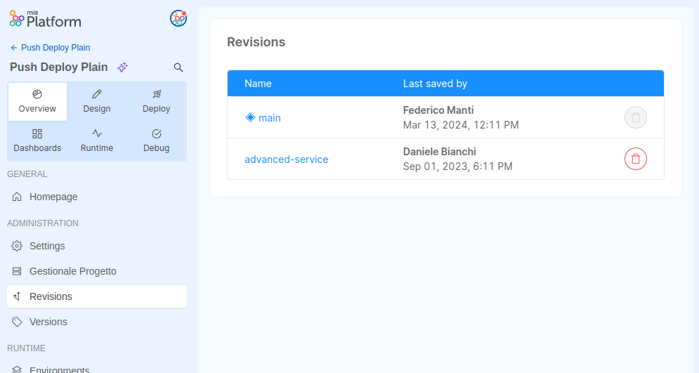
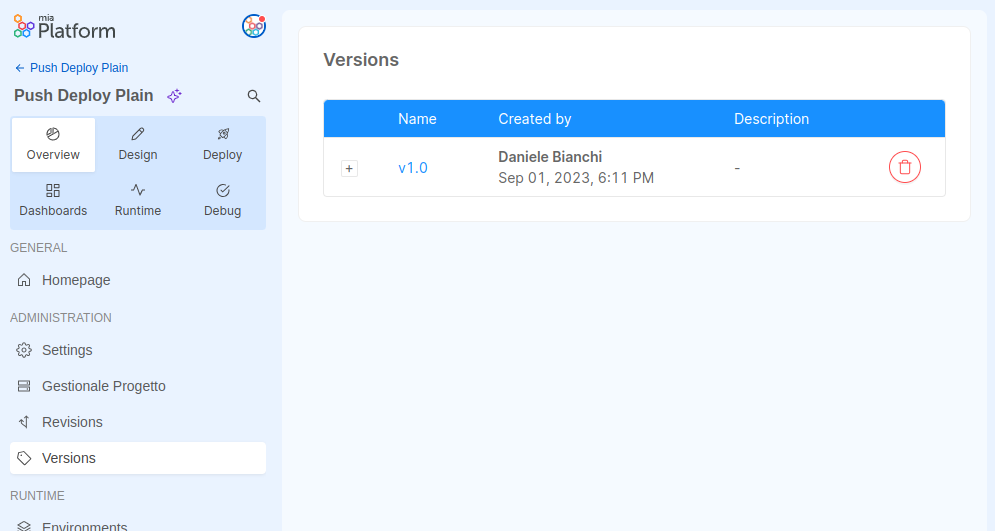

:::caution
This is a **BETA** feature and, as such, is currently under active development. Pay attention using it.
:::

The **Enhanced Project Workflow** feature aims to improve the developer experience when working with the Console, as well as pave the way for the adoption of previously unavailable opportunities, such as the [GitOps deployment strategy](/development_suite/deploy/gitops-based/index.md).

## Changes to the Console workflow

The following sections will highlight the changes made to the established Console workflow, regarding in particular the new management of the project logical state, and the new deployment workflow.

### New configuration management strategy

The most relevant change in the Console’s behavior is that the project’s logical state will not be saved on a Git provider anymore. This will result in significant **performance improvement** during the main Console workflows, since contacting the Git provider implied a considerable overhead that will now be reduced.

This change also means that the Console will not rely on the typical Git-based instruments anymore and will instead adopt a **new configuration management system**, while still maintaining consistency with the Console’s established workflows.

To emphasize that the new workflow configuration is no longer stored in a Git repository:
- `branches` and `tags` are now **`revisions`** and **`versions`**
- `commit history` is now **`version history`**
To keep track of the project’s evolution, user can create `versions` (similar to Git tags) that act as fixed snapshots of the configuration in a particular moment.

Project administrators can manage revisions and versions from the dedicated sections inside the Project Settings area. Revisions can be accessed and deleted from the revisions management page:



Versions with their description and release note can be managed through the versions management page:



### New deployment workflow
Another significant change is the way Console configurations are saved and deployed: Kubernetes **configurations will be generated and committed** to the Git repository only **during the deployment process**.

:::caution
When deploying your configurations to the cluster, keep in mind that only the changes pushed to the repository’s default branch will be considered.
:::

The new deployment workflow also unlocks the possibility to adopt a **pull-based deployment strategy**, in which a GitOps tool can be set up to automatically align the cluster’s state to the latest changes pushed to the Git repository. To find out more about pull-based deployment and its advantages, visit the [GitOps deployment strategy documentation page](/development_suite/deploy/gitops-based/index.md).

#### Roadmap

:::note  
The following features are still in development and will be available in future releases.
:::

Before deploying the configurations to the cluster, users will be able to **review** which workload changes are going to be deployed by opening the review modal. This operation gives the developer a clear view of what is going to be released on the runtime environment, and it is especially important if the user is deploying on a production environment. 

Moreover, in the new workflow the user will be able to **export Kubernetes configurations** by clicking on a download button.

As of today, some **project customizations** can be performed only through the backoffice:

- The repository default branch can be changed by updating the `project.repository.configurationBranch` property.
- The project deploy strategy can be found in the `project.deploy.strategy` field for the global configuration that is inherited by all environments; to add environment specific settings you can patch the `project.environments[_].deploy.strategy`.

In the future, these properties will be managed in the Console, inside the Project Settings page.

## Activating the feature

:::info
In order to activate the feature on a project or Company, please open a service request and ask for the support of a Mia-Platform referent.
:::

The Enhanced Project Workflow can be activated by enabling two different feature toggles. This operation can ba performed by your Mia-Platform referent, who will choose the option that most fits your needs. 

The `ENABLE_CONF_GENERATION_ON_DEPLOY` feature toggle can be activated on a new project or Company to enable the enhanced project workflow. The feature toggle activates the new versioning system and the generation of Kubernetes configurations at the time of deployment. It can be enabled for a single project or for an entire Company, which means all projects in the Company, old and new ones, will adopt the new workflow.

If you already have a Company with some projects, and you do not wish to migrate them to the new approach just yet, you can choose the `ENABLE_CREATE_PROJECT_WITH_SAVE_CONFIG_ON_DEPLOY` feature toggle, to be activated on the Company. This feature toggle makes sure that all new projects in the Company will be created with the new workflow, while leaving the existing ones untouched. 

:::note
If both feature toggles are enabled, `ENABLE_CONF_GENERATION_ON_DEPLOY` will prevail.
:::

## Migrating your projects

Some essential manual adjustments are necessary to make sure your existing projects work correctly with the new workflow.

### General adjustments

First of all, go to the [Project Settings page](/console/project-configuration/project-settings.md) and ensure that the **default revision field** is not empty. You can choose a custom name for your default revision, e.g. `main`.

If you want the project to use a [**pull-based deployment strategy**](/development_suite/deploy/gitops-based/index.md#advantages-of-pull-based-deployment) its configuration must contain the `strategy` property set to `pull` (the value for push-based deployments is `push`). Based on the selected strategy, the `runnerTool` may take different values.

Next, the project **Git repository structure** should contain:

- A `configuration` directory, with all your global customizations to be applied to all environments, and a `kustomization.yaml` manifest if you are using Kustomize.
- An `overlays` directory, containing one directory for each environment, inside which all your environment-specific patch files are stored, as well as a `kustomization.yaml` manifest if you are using Kustomize.
- An `environments` directory, automatically generated by the Console, containing one directory for each environment, inside which all the necessary configurations are generated and stored after each push.

There are some **points of attention** and possible modifications needed to make sure everything works properly on the Git repository:

- If there are any configuration files in the repository root (e.g. `api-console-config.json`), you can delete them, since they refer to the old management strategy of configuration files.
<!-- TODO: add complete list of files -->
- The `gitlab-ci.yml` file contains a deploy script, which assumes the repository’s directory structure based on outdated information. The path of the deploy job file needs to be updated with the path of the correct script <!-- (TBD) -->
- The new `environments` directory is automatically created by the Console. Inside it, the generated configurations for each environment are stored in separate directories.
:::warning
It is important to note that these are auto-generated directories, so all their contents are regenerated each time a push operation is performed. If you add custom files to the environments directory or its child directories, they will be deleted. 
:::

- If you are **deploying without Kustomize**, you will find a `configuration` directory containing one directory for each environment, and possibly some custom files.
You need to create the overlays directory, where you have to move environment directories previously stored inside `configuration`. No actions are required for the custom files in the `configuration` directory. 
- If you are **using Kustomize**, the `configuration` directory contains a `kustomization.yaml` manifest and possibly your custom files, which are already in the right spot. You can delete every other file inside the directory.

    Also, make sure that: 
    - Inside each `environments/<environment>` directory, the `kustomization.yaml` manifest imports the `kustomization.yaml` manifest from the `configuration` directory. <!-- This should be automatically handled by the Console. -->
    - Inside each `overlays/<environment>` directory, the `kustomization.yaml` manifest imports the corresponding manifest from the `environments/<environment>` directory.

### Further adjustments

In order to adopt the enhanced workflow on existing projects, a migration process is required.

<!-- here we are talking about moving files to a database. Is it ok? -->
All branches and tags need to be migrated to a database in the form of revisions and versions. For each revision and version, the Console configuration files must be moved to specific documents on the database, each one associated with its `configType` property. These files are: 

- `api-console-config.json` (merged with all ConfigMaps content) - `configType: base`
- `fast-data-config.json` - `configType: fast-data`
- `rbacManagerConfig.json` - `configType: rbacManagerConfig`
- `backofficeConfiguration.json` - `configType: backofficeConfigurations`
- `mia-craft-config.json` - `configType: ` <!-- TBD -->
- All config extension files - `configType: extensions`

The project data model has to be updated by ensuring that the `defaultBranch` property corresponds to the repository’s default branch, or to a fallback value.

Moreover, the Git repository structure has to be re-shaped to complete the migration process.

The final repository structure will be the following: 

```
├── overlays
│ ├── dev
│ │ └─── <dev custom file>
│ ├── production
│ │ └─── <prod custom file>
│ ├── other_env_id
│ │ └─── <env_id custom file>
│ └── ....
│
├── configuration
│ └─── <global custom files>
│
├── environments
│ ├── dev
│ │ └── <k8s config files>
│ ├── production
│ │ └── <k8s config files>
│ ├── other_env_id
│ │ └── <k8s config files>
│ └ .....
```

:::note
In case the project uses Kustomize, each directory will contain a properly configured `kustomization.yaml` manifest.
:::
