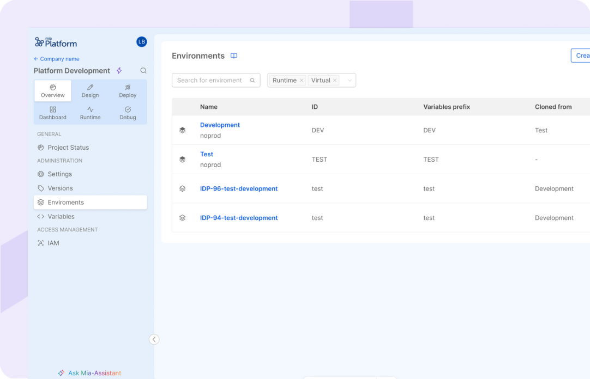
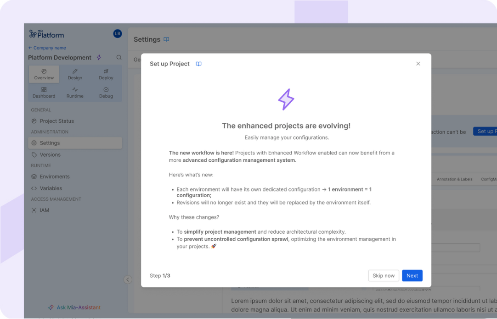
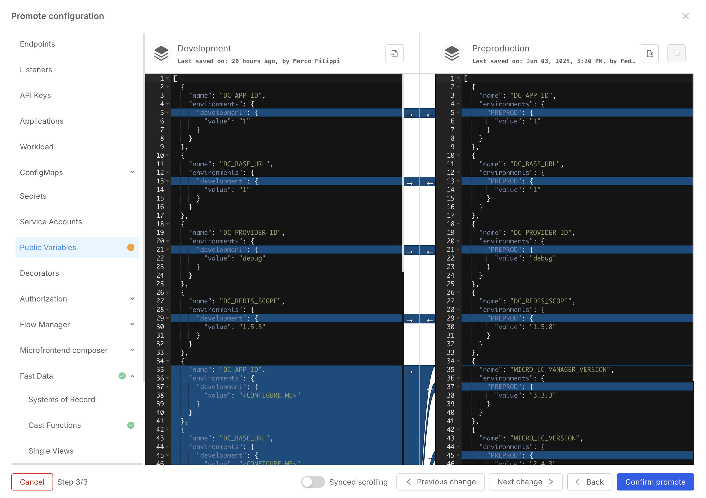

:::info
This feature is currently available exclusively as a **Closed Preview** and is not yet generally available. For more information and to request its activation for your Company, please contact your Mia-Platform referent.
:::

Environment Based Configuration Management represents a significant evolution in project management, introducing a unified approach that seamlessly integrates Project Revisions with Project Environments. This thoughtful integration transforms Project Environments into a comprehensive solution for managing both Project Configuration and Runtime operations, streamlining the entire development workflow.

## Key Concepts and Overview

- Each Environment has its own dedicated configuration, replacing the previous revision-based system.
- Environments are categorized into two types: Virtual Environments and Runtime Environments.
- Deployment capabilities are exclusive to Runtime Environments, which can be versioned and deployed to clusters.
- All new Projects, using the Enhanced Workflow, automatically utilize this enhanced environment-based management system.
- Configuration changes can be promoted between environments using the Environment promotion feature.
- Version control is managed at the individual environment level rather than project-wide.
- The Environment variables section displays only the variables specific to the currently selected environment configuration.
- Runtime Environments can be deployed using either the latest configuration or a specific versioned configuration.

## Environment Types

Environment Based Management introduces two distinct environment categories that work together to provide a comprehensive project management solution:

- **Virtual Environments** serve as dedicated spaces for managing and iterating on your Project configurations. These environments allow teams to experiment with different configuration setups, test changes, and maintain multiple configuration versions without affecting live systems.
  
- **Runtime Environments** take configuration management a step further by connecting virtual environments to actual clusters. This enables teams to not only manage configurations but also deploy and execute them in selected runtime environments. Runtime environments bridge the gap between configuration management and actual system deployment, providing a seamless path from development to production.

## Configuration Management

### Configuration Snapshots

Both environment types maintain configuration snapshots that preserve project design elements, including: microservices, endpoints and so on.

These snapshots form a sequential chain, with each snapshot referencing its predecessor. The most recent snapshot represents the current environment configuration.

### Version Control

Users can designate specific configuration snapshots by creating named environment configuration versions. For Runtime environments, versioned configuration snapshots can be deployed to the runtime environment.

## Migration Process

When you're ready to embrace Environment Based Management for your existing projects, the transition process is straightforward and accessible through the Console UI. As a Company Owner, you'll notice a helpful migration prompt the first time you access your Project after this feature becomes available.

If you're not ready to proceed with the migration immediately, don't worry - you can either click 'Skip' or simply close the migration dialog. The system will remind you about the pending migration by showing the prompt again the next day, ensuring you won't forget about this important transition.

To ensure a smooth transition while maintaining the integrity of your existing revision versions, we offer two flexible migration methods that you can choose from based on your specific needs and preferences:

### Automatic Migration

Before proceeding with the automatic migration, there are several important prerequisites that must be met:

First, ensure that all project environments have been deployed at least once. This is essential for maintaining configuration history and ensuring a smooth transition.

Second, when migrating, runtime environments will automatically inherit the configuration from their most recently deployed revision. This preserves your current operational state.

Finally, during the migration process, all existing revisions will be converted into virtual environments, maintaining your complete configuration history and development workflow.

### Manual Migration

The manual migration process provides users with more control and flexibility over how their project configurations are transferred. Here's how it works:

During the manual migration, you'll have the opportunity to carefully select and configure various aspects of your environments. First, you'll be able to choose specific configuration snapshots for each of your Project Environments, allowing you to precisely define the starting point for each environment. Next, you'll have control over which existing revisions should be converted into virtual environments, enabling you to maintain only the most relevant historical configurations.

## Environment Configuration Promotion

The Environment Configuration Promotion feature enables you to efficiently synchronize configurations across your environments. Whether you're working with virtual or runtime environments, you can seamlessly propagate configuration changes to maintain consistency throughout your project.

Key capabilities:

- Promote configurations between any environment types
- Select specific environment variables to transfer
- Review and merge design configurations using an interactive diff editor
- Maintain granular control over which settings to keep or update in target environments

This streamlined process helps ensure configuration consistency while giving you full control over the promotion workflow.

### Simplified mode

It is possible to promote an Environment using the simplified mode.
This mode is useful for speeding up the promotion of changes.
When this mode is selected, once the Public variables have been chosen, the changes of the chosen Environment will be directly applied in the target Environment.

:::note
This mode will overwrite any manual changes made on the target environment.
:::

### Manual mode

Alternatively to the Simplified mode, it is possible to promote an Environment also using the Manual mode.
This mode allows you to granularly control, once the Public variables have been chosen, what is brought to the target environment, allowing you to manage any conflicts before promoting the configuration.

