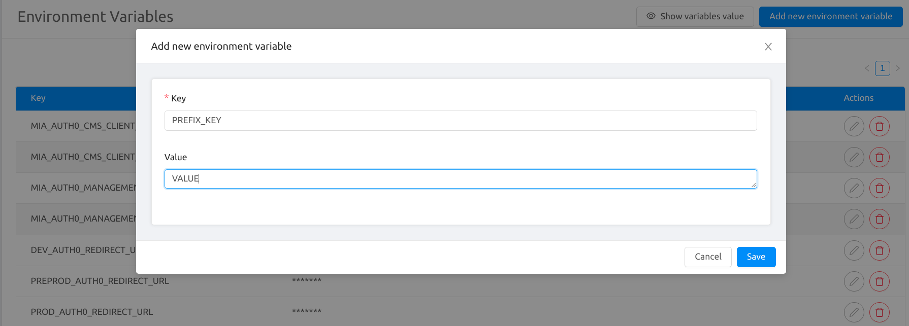

An environment variable is a variable whose value is set outside the program, typically through a functionality built into the operating system or microservice.
An environment variable is made up of a name/value pair, and any number may be created and available for reference at a point in time.

Environment variables are excellent for decoupling application configurations. Typically, our applications require many variables to be set in order for them to work. By relying on external configurations, your app can easily be deployed on different environments. These changes are independent of code changes, so they do not require your application to be rebuilt to change.

They externalize all environment specific aspects of your app and keep your app encapsulated. Now you can run your app anywhere by modifying the environment variables without changing your code and without rebuilding it!

Some specific examples of common scenarios when you should consider using environment variables.

* Which HTTP port to listen on  
* What path and folder your files are located in, that you want to serve  
* Pointing to a development, staging, test, or production database  

# Manage your Variables

Thanks to our Console in the Envs area it is possible to manage your Environment Variables.

## How to differentiate your variable from one environment to another

Mia-Platform uses the **prefix** concept to manage the differentiation between variables.

Each variable can be associated with a prefix indicating the environment in which the variable is to be interpolated.

How do prefixes work?

Prefixes can be of two types:

* **Global prefix**: Mia Platform uses `​​MIA_` as global prefix. However, it is possible to avoid the prefix and by default, the environment variable will be treated as global.

* **Differentiated**: according to the environment

When a project is created it is associated to a specific Tenant.
As described in the [Tenant section](create-project#create-a-tenant) a project associated to a specific tenant will inherit the environment information. For this reason, a differentiated environment variable must have the prefix associated to the `ID` of the specific environment. 
It is possible to find it in the table of the Envs area.

:::warning
Remember! It is fundamental to define a prefix if you want to associate a variable to a particular environment, otherwise the variable will be considered global.
:::

## Create a Variable

When you start a new project you will find variables already configured.
To add a new variable press the **"Add new environment variable"** button at the top-right of the table and fill in the form:

* the **key** is mandatory and identifies your variable. Remember **to use the prefix** to manage the differentiation between environment.
* the **value** is the value you want to attribute to your variable, the one that will be interpolated.

:::info
When a **value** contains some `$` characters it is required to escape it by adding another `$` just before the original ones, otherwise the variable will be truncated just before the dollar sign.

#### Example

* **Desired value** to interpolate: `var$var$var`.  

* **Actual value** to write: `var$$var$$var`.
:::

## Edit a Variable

Changing the value of an existing variable is very simple. Click on the **edit** button in the same row as the variable you want to edit.
Once you press the vsi button a modal will open.
The key is an unchangeable value.
Once the value has been changed, you just have to press the save button.

## Delete a Variable

To delete a variable, press the **delete** button corresponding to the desired variable. A modal will open.
To cancel the variable you will be asked to enter the name of the key. The **name of the key must be identical** otherwise you will not be able to delete it.

