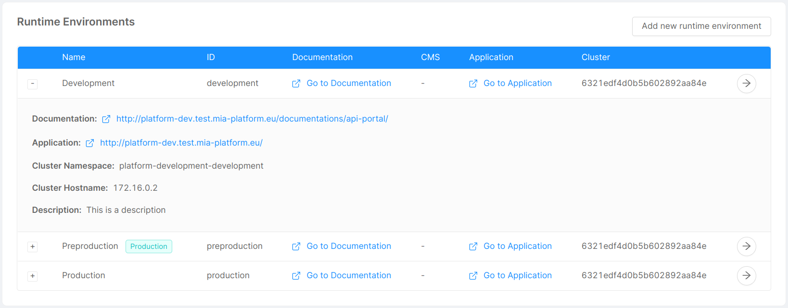

Runtime environments are the computer systems in which your applications are deployed and executed. Nowadays, it is common to have multiple runtime environments, for example a test environment and a production one. The Console is built with this concept in mind, and thus provides support and tools for you to easily manage multiple runtime environments.

You can deploy the same codebase to different runtime environments, obtaining different behaviors based on some environment configuration, like [environment variables](./env-var). Another notable change is the actual hardware of which the runtime environment comprises of, which is usually more performant for production environments.

The Console handles environments in a project-specific manner. When creating a new project, it inherits the runtime environments from the company it belongs to. After creating the project, it is possible to edit those for the specific project. Each runtime environment runs on its kubernetes cluster namespace, and its properties can be modified by means of the CMS only.

It is possible to have an overview of the project runtime environments in the Settings area, which contains a Runtime Environments card displaying a table with a row for each environment, as shown in the picture below.



The table displays information in the following columns:

* **ID**: the human-readable ID of the runtime environment;
* **Documentation**: a link to the main documentation deployed in this environment;
* **CMS**: a link to the main CMS deployed in this environment;
* **Application**: a link to the main application deployed in this environment.

If you want to have more information about a specific environment, you can expand its row by clicking on the `+` button at the left of the row, which provides the following additional information:

* **Documentation**: a group of links to all the documentations available in this environment;
* **CMS**: a group of links to all of the CMSs available in this environment;
* **Application**: a group of links to all of the applications available in this environment;
* **Cluster namespace**: the namespace of the kubernetes cluster the runtime environment runs on;
* **Cluster hostname**: the hostname of the kubernetes cluster the runtime environment runs on;
* **Description**: a textual description of the runtime environment.

Additionally, one could define custom links to be displayed among the additional information provided in the expanded row.

## Managing runtime environments

In this section you will learn how to manage your runtime environments using the CMS. In case you don't have access to it, please contact your Mia Platform referent.

Using the CMS, it is possible to create, update, and delete runtime environments. More about the creation process can be found [here](./create-project.mdx#step-3-environments), while information about editing from the CMS can be found [here](./create-project.mdx#step-6-customize-the-project-with-additional-information-optional).

In order to edit the information available in the Runtime Environments table (you can edit environment properties, add new links or change the present ones), you need to access your `Project` properties. There, you will find the objects `Environments` and `links`, whose schema is described below. You just need to edit them trough the dedicated drawer or modal and save your changes.

### Environments configuration

```js
   [
    {
      label: 'Your Environment Name',
      envId: 'your-env-id',
      hosts: [{
        host: 'your.env.test.host',
        isBackoffice: false
      }, {
        host: 'your.env.prod.host',
        isBackoffice: false
      }],
      cluster: {
        hostname: '123.456.789',
        namespace: 'your.cluster.namespace'
      },
      description: 'your cluster description'
    },
    {
      label: 'Your Second Environment Name',
      envId: 'your-second-env-id',
      hosts: [{
        host: 'your.second.env.test.host',
        isBackoffice: false
      }],
      cluster: {
        hostname: '123.456.789',
        namespace: 'your.second.cluster.namespace'
      },
    }
  ]
```

### Environment Links configuration

```js
{
  cms: {
    path: 'my/cms/path',
    isBackoffice: true
  },
  application: {
    path: 'my/application/path',
    isBackoffice: false
  },
  documentation: {
    path: 'my/documentation/path',
    isBackoffice: false
  },
  custom: {
    path: 'my/custom/path',
    isBackoffice: false
  }
}
```

Every link specifies a path that is going to be concatenated to a base url defined in the environment host if their `isBackoffice` properties match. This means that you only specify the path of these links once, and the system is going to automatically generate the correct links based on the environments, which will be shown in the table. In case you have multiple hosts for the same environment, the links you will have one link for each host of each environment.

In case your link has an `isBackoffice` property set to a value which doesn't match any of the hosts `isBackoffice` property, then a default value will be displayed.
:::info
If `isBackoffice` is not set in host property, it is considered to be falsy in this case.
:::
More specifically, the defaults based on the link types are:

* **Documentation**: the host with `isBackoffice` property set to `false` concatenated with `/documentations/api-portal`
* **CMS**: the host with `isBackoffice` property set to `true`
* **Application**: no default value is present

The `custom` element can be named as you wish, and you can have any number of custom links. The name you write in the configuration will be the label of the link in the table.
