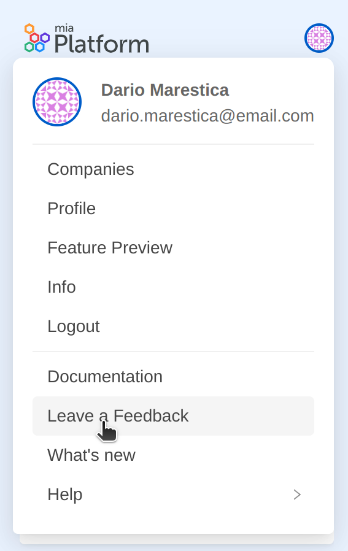
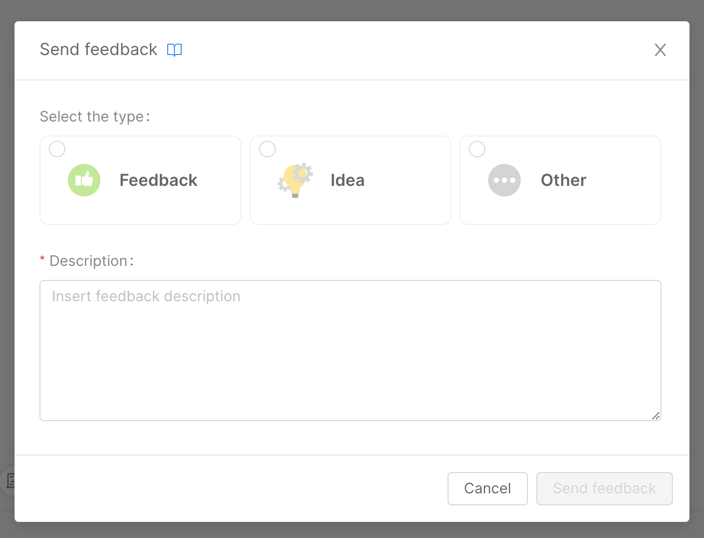

Mia-Platform users can actively contribute to the product through a feature that allows them to submit feedback on any area of the Console. This feature is accessible through a dedicated button located on the right side of the Console top bar.

Every feedback will be addressed to the Console Managers who will be able to conveniently manage and moderate them through a new section of the CMS, in order to constantly improve the product experience.

For PaaS type customer every feedback will be collected directly from the Product R&D department, while for On-Premise type installations they will be collected and managed by the respective Console Managers.

## How to leave feedback from the console

In any section or area of the Console by clicking on the respective feedback button on the main topbar you can access to the feedback modal, through which the user can choose the type of feedback to give:
* **Issue**: feedback inherent to a bug or technical problem related to a feature of the Console. For example:
  - By making changes A and B to the configuration, I get error C when saving.
  - Page X does not scroll properly and thus has display problems on screens with a*b resolution.
  - I followed the instructions in the documentation but nevertheless could not configure feature Y correctly.
* **Idea**: feedback of improvement of a feature of the Console, or proposed addition of new feature. For example:
  - In section A, it would be helpful if information B was also shown.
  - In section X, it would be useful to make information Y editable.
  - It would be useful for entity Z to be managed through a specific section in Console.
* **Other**: feedback of improvement of existing flows/processes, or suggestions that do not fall into the previous two categories. For example:
  - In the creation flow of resource A, it would be more convenient to close the modal directly after loading instead of having to click the button at the end of the process.
  - I noticed inconsistencies in the names used for resources within section B, it would be useful to adjust for more clarity.
  - The X button to perform the Y action within the Z section is inconspicuous and in an unintuitive location, it would be helpful to enlarge and move it.

Once the type is selected, the user is required to enter a description for feedback. After that, simply click the "Send feedback" button to submit the feedback.

:::caution
When filling out the feedback description, be sure to give as much context information as possible (e.g., the reference section, the actions that caused a particular behavior, and so on). This will make it much more immediate for us to identify the problem or area for improvement.
:::

## Configuration for Feedback Management in On-Premise Installations

Go the Users section under "User Management", and add the new group to each user you want to be able to see the feedback page on the CMS.

By logging out and logging in, to refresh system data, that user will now be able to see in the CMS the section called "User Feedback" containing all the feedback from the collaborators.
