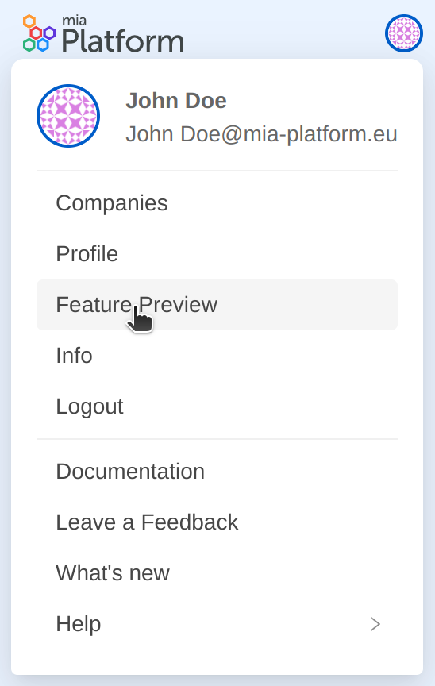

From the dropdown menu that appears when hovering on the profile picture, Mia-Platform SaaS users can have visibility of the “Feature Preview” section.

  

  

  

Within this section, users can manage all the Mia-Platform Console features that are still in preview and decide to try them out and send their feedback to us. 

When entering the section, a modal shows the list of all the available features ready to be tested. Each feature is presented with an illustration and a brief description. 
By enabling the toggle for a specific feature, users can activate it and try it out.

To give feedback on the feature you have been trying out, all you have to do is to click on "Give feedback" at the end of the feature description and send us a feedback through our [Mia-Platform Git-Hub community](https://github.com/mia-platform/community/discussions).

